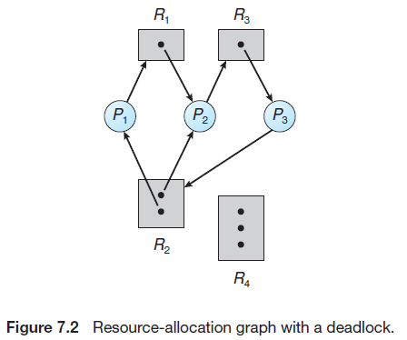
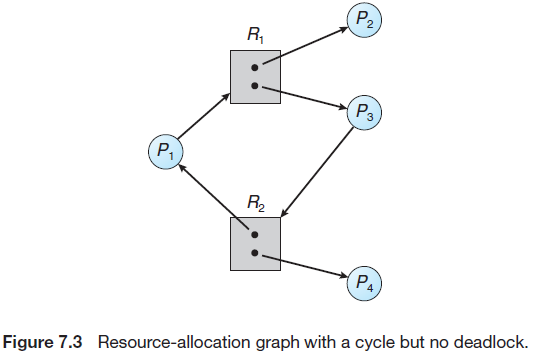

# Chapter 07. Deadlocks

## 1. 系统模型 System Model

一组进程中的每个进程都在等待一个事件，而这一事件只能由这组进程中的某一进程引起，那么这组进程就处于死锁，注意其他类型的事件也可能导致死锁，这里主要关注共享

## 2. 死锁特征 Deadlock Characterization

- 必要条件
  - **互斥 Mutual exclusion**
  - **持有并等待 Hold and wait**
  - **非抢占 No preemption**
  - **循环等待 Circular wait**
- 资源分配图
  **无环一定没有死锁，有环可能存在死锁**
  
  

## 3. 死锁处理方法 Methods for Handling Deadlocks

原理上有三种处理死锁的方法：

- 使用协议来**预防或避免**死锁，使系统不会进入死锁状态：死锁避免、死锁预防
- 允许系统进入死锁状态，**检测并恢复**死锁状态：死锁检测、死锁恢复
- **忽视**死锁，假定系统不可能发生死锁

处理死锁本身也存在开销，与死锁会造成的后果需要平衡后再决定如何处理

## 4. 死锁预防 Deadlock Prevention

**死锁预防是通过打破死锁必要条件来使系统不会进入死锁**，根据死锁的四个必要条件：

- 互斥：由于一些资源本身要求互斥访问，因此**一般无法通过解决互斥**来处理死锁
- 持有并等待：可以使进程在**申请一个资源时不能已经占有其他资源**，例如进程申请资源之前必须先释放拥有的所有资源这种协议，或是每个进程在执行前就获得所有所需的资源，缺点是**资源利用率低**且可能因为一次需要过多资源得不到而**饥饿**
- 非抢占：若某个进程申请一个不能马上得到的资源，则其原有的资源都变成可抢占，即**隐式释放**，一般可以用于状态可以保存或恢复的资源
- 循环等待：将所有**资源排序并要求每个进程按递增顺序申请**资源，则就不会出现进程有1申请2，而另一个进程有2申请1这样的死锁，后者不允许申请比2小的资源

两种经典的死锁预防模式为[wait-die scheme & wound-wait scheme](https://stackoverflow.com/questions/32794142/what-is-the-difference-between-wait-die-and-wound-wait-deadlock-prevention-a)：

- **Wait-Die**：非抢占式non-preempti的方式，当`Tn`申请当前被`Tk`持有的资源时，若`Tn`的时间戳更小（即`Tk`晚于`Tn`开始）则等待资源，否则`Tn`被终止
- **Wound-Wait**：抢占式preemptive的方式，当`Tn`申请当前被`Tk`持有的资源时，若`Tn`的时间戳更小（即`Tk`晚于`Tn`开始）则`Tk`被终止并将资源给予`Tn`，否则`Tn`等待

## 5. 死锁避免 Deadlock Avoidance

死锁避免算法动态检测资源分配状态以确保循环等待条件不可能成立，使系统不会进入不安全状态

- **安全状态 Safe State**
  存在一个安全进程资源分配序列，**进程可以申请数量小于剩余资源加上在这个进程之前所有进程拥有资源之和**，那么即使这个进程资源得不到满足，只要在其之前的进程结束释放足够资源，这个进程就能继续运行；若不存在这样的安全序列，则处于不安全状态，可能出现死锁
- **资源分配图算法 Resource-Allocation-Graph Algorithm**
  **每个资源只有一个实例时**，基于资源分配图，引入需求边（需要进程事先声明要占用的资源），只有在需求边将变为分配边时，**检测环**的算法确定不会成环才允许申请，保证系统处于安全状态
- **银行家算法 Banker’s Algorithm**
  - 数据结构，每个资源拥有多个实例，进程声明要占用的最大资源，`n`为进程数，`m`为资源种类数
    - `Available[m]`：表明可供使用的资源数量，`Avaliable[j]=k`表示`j`类型的资源剩`k`个
    - `Max[n][m]`：表示每个进程对每类资源的最大需求，`Max[i][j]=k`表示`i`进程对`j`类型的资源最大需求是`k`个
    - `Allocation[n][m]`：表示每个进程已获得各类资源的数量，`Allocation[i][j]=k`表示`i`进程现在拥有`k`个`j`类型的资源
    - `Need[n][m]`：表示每个进程对各类资源的需求，`Need[i][j]=k`表示`i`进程需要`k`个`j`类型的资源，并且满足`Need[i][j] = Max[i][j] - Allocation[i][j]`
  - **安全性算法**流程，判断系统是否处于安全状态
    1. 初始所有进程都未完成，设`Finish[]=false`表示`1~n`进程都未结束，设`Work=Available`表示每个进程都有当前资源剩余量
    2. 查找满足`Finish[i]=false`且`Need[i]<=Work`的，即未完成且所需资源当前可以满足
    3. 若找到则使其完成，即设`Finish[i]=true`表示进程完成且`Work+=Allocation[i]`表示进程归还占有的资源，并回到2继续查找能够完成的进程
    4. 若未找到则判断是否所有进程已完成，即判断`Finish[]=true`，若都能完成，则系统安全
  - **资源请求算法**流程，判断某次请求是否安全
    1. 设`Request[i]`为某进程的资源请求，若`Request[i]<=Need[i]`，即请求不违背其声明的最大需求，否则报错
    2. 若`Request[i]<=Available`，即当前已有资源可以满足，否则需等待
    3. 假设系统分配资源，以此修改系统状态（数据结构中的矩阵修改为分配后的状态）后，运行安全性算法，若**通过申请后系统是安全的，则允许**，否则需等待

## 6. 死锁检测 Deadlock Detection

- **每种资源只有单个实例的类型**
  根据资源分配图可以生成描述进程等待关系的**等待图 waiting graph**，然后运行**环检测算法**，当且仅当等待图中有环，则认为存在死锁
- **每种资源有多个实例的类型**
  - 数据结构
    - `Available`：表明可供使用的资源数量
    - `Allocation`：表明当前各进程的资源分配情况
    - `Request`：表明各进程的资源请求情况，`Request[i][j]=k`表示`i`进程正在申请`k`个`j`类型的资源
  - 检测算法流程
    1. 设`Work=Available`，若`Allocation[i]=0`则`Finish[i]=true`即不占用资源视为结束，否则设`Finish[i]=false`即需要资源运行
    2. 查找满足`Finish[i]=false`且`Request[i]<=Work`的，即**未完成且请求可以满足**的
    3. 若找到则假定满足并完成，即`Finish[i]=true`并且`Work+=Allocation[i]`，并返回2继续找
    4. 若没有，则检测是否存在`Finish[i]=false`，若存在，则进程`i`陷入死锁
  
  注意：**检测算法本身存在开销**，同时还需要考虑检测算法与进程本身的关系，并发进行还是stop-the-world，对于每个请求都调用检测算法可能开销过大

## 7. 死锁恢复 Recovery from Deadlock

- **进程终止 Process Termination**
  - 终止所有死锁进程
  - 一次只终止一个进程，直到没有死锁：算法确定下一个终止的进程，基于代价等
- **资源抢占 Resource Preemption**
  - 选择被抢占的对象：算法确定牺牲品，基于代价等
  - 回滚：被抢占的进程完全回滚或部分回滚至安全状态
  - 饥饿：算法确保不会总是抢占同一个进程导致饥饿
