# Chapter 08. Main Memory

## 1. 背景 Background

- **地址绑定 Address Binding**
  指令和数据与内存地址之间的绑定可以通过以下方式实现：
  - 编译期 compile time
    若内存地址分配提前已知，则在程序**编译时就可以指定具体地址**，**静态链接**，但是一旦有任何变化，程序可能需要重新编译以适配新的地址
  - 加载期 load time
    由于不知道具体地址，编译器生成**可重定位**的代码，**动态链接**，相应的gcc再编译地址无关代码的共享库时需要传入`-fPIC`代表着生成Position Independent Code，以相对位置描述各个指令数据，在加载时再根据情况放置指令数据，若有任何变化，则需要重新加载
  - 运行期 execution time
    若程序在**运行时也可以被移动到另一段内存**，则需要特殊硬件来支持运行时的内存绑定，绝大多数通用OS采用这种方式
  
  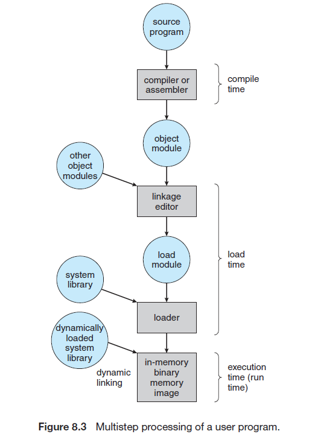
- **逻辑地址空间和物理地址空间 Logical Versus Physical Address Space**
  **CPU生成的地址称为逻辑地址logic address**（也可称为虚拟地址virtual address），而**内存单元看到的地址（即加载到内存地址寄存器中的地址）称为物理地址**，编译期/加载期地址绑定是逻辑地址与物理地址相等的，而运行期地址绑定使得逻辑地址与物理地址不同，**后者通过内存管理单元（memory-management unit，MMU）实现**
  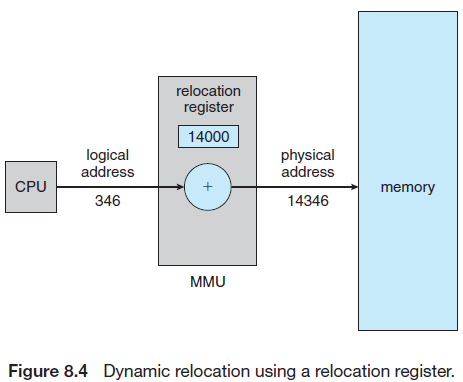
- **动态加载 Dynamic Loading**
  采用动态加载可以使得内存空间使用率更高，一个子程序只有在被调用时才加载进内存，将加载延迟到运行时
- **动态链接和共享库 Dynamic Linking and Shared Libraries**
  动态链接将链接延迟到运行时，使得程序可以共同使用（动态链接）库提供的代码而不用每个程序保留一份拷贝使得进一步节约开销，同时也有利于更新不同的库而不需要重新链接程序

## 2. 交换 Swapping

- **标准交换 Standard Swapping**
  标准交换就是操作系统将某个进程整块存储进磁盘中，并且维护一个任务队列，当要执行下一个任务时首先确定进程是否在内存中，若不在则从后备存储中交换进这个进程，若内存不够则必须执行牺牲选择算法，交换出一个正在内存中的进程，这会带来一系列问题：
  - 交换需要磁盘传输数据，效率低耗时长
  - 一个进程要在空闲时才能被换出，否则会带来一些问题，例如异步IO时对应的进程已经被换出，而IO影响的内存此时已属于另一个进程
  
  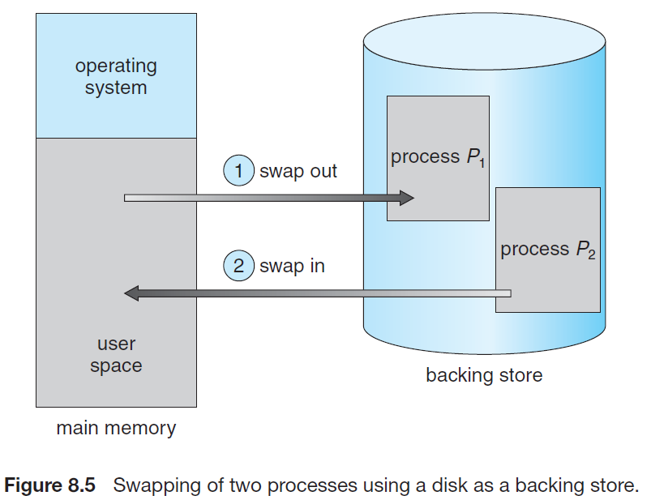
- 移动操作系统的交换 Swapping on Mobile Systems
  移动操作系统往往由于使用有限大小的闪存，不会支持标准交换，不同的移动操作系统支持不同的策略来控制内存使用

## 3. 连续内存分配 Contiguous Memory Allocation

内存被分为**操作系统**和**用户进程**两部分，用户进程在内存中连续分配

- **内存保护 Memory Protection**
  采用**重定位寄存器 relocation register**和**限制寄存器 limit register**来约束进程只能访问自己的内存空间，从而**将进程之间分离**，达到内存保护的目的，当进程上下文切换时，同样切换这两个寄存器的值

  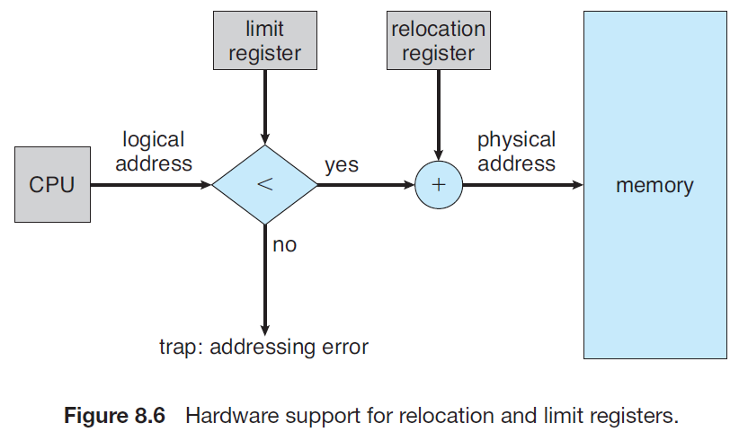
- **内存分配 Memory Allocation**
  可变式分区 variable-partition内存分配策略要求操作系统维护一张映射表指出分区的哪些部分可用，哪些部分已被占用，可以有以下情况：
  - 当可供使用的内存太大时将其分割为两部分，一部分给所要求的进程，一部分标记为可用
  - 当进程归还内存时，将归还的内存标记为可用
  - 当有多个可用的分区连续时，将这些可用内存合并成一块大的可用分区
  - 为一个进程寻找合适的分区可以有以下算法（类似[装箱问题](https://github.com/JasonYuchen/notes/blob/master/ds/10.Algorithm_Design_Techniques.md#1-%E8%B4%AA%E5%BF%83%E7%AE%97%E6%B3%95-greedy-algorithms)）：
    - **最先匹配 first-fit**：从映射表开头找起，一旦发现满足进程要求的可用分区就分配
    - **最佳匹配 best-fit**：扫描一遍映射表，将最优的即超出要求最小的可用分区分配给进程
    - **最差匹配 worst-fit**：扫描一遍映射表，将最大的可用分区分配给进程
- **碎片 Fragmentation**
  不同的内存分配算法都会导致最终产生一系列不连续的小可用空间，难以满足新进程的需求，或者是分配给进程的空间略大于实际需要的，一小部分空间虽然分配了但是未被使用，这些都**暂时无法使用的小可用内存空间就是碎片**，可分为以下两类：
  - **外部碎片**：不同被占用内存之间散落的较小且不连续的可用内存碎片，可以通过**分段segmentation或分页paging**的方式来处理
  - **内部碎片**：分配给一个进程但略大于实际需求的空间中未被进程使用到的一小部分内存碎片
  
## 4. 分段 Segmentation

- 基本方法 Basic Method
  逻辑地址空间是一系列段的组合，程序寻址通过**段+偏移**的方式完成，即采用`<segment-number, offset>`这样的二维地址结构，如此一来程序占用的内存分布在多个段中，而不同的段无需在物理上连续，但是如同连续内存分配的问题，物理内存中对多个段的排布会导致出现外部碎片，因此分段需要整理内存以将外部碎片整合成大的未占用内存
- 硬件 Segmentation Hardware
  二维地址到一维线性物理地址的映射通过**段表segment table**实现，表中每个条目包含段的物理**基地址segment base**和**界限segment limit**
  
  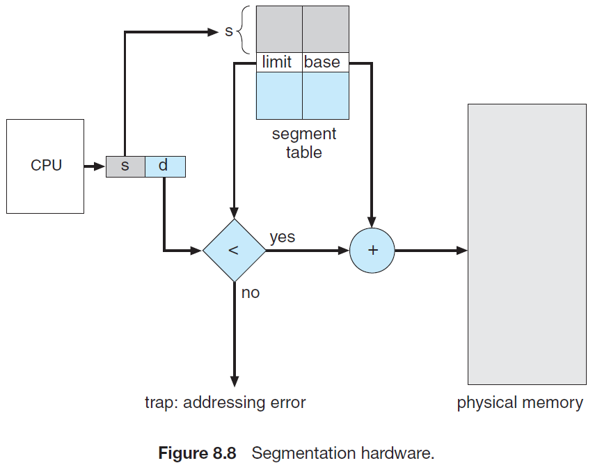

## 5. 分页 Paging

- 基本方法 Basic Method
  将**物理内存空间分割成固定大小的帧frames**，将**逻辑内存空间分割成相同大小的页pages**，备份存储分割成一帧或多帧集合的大小用于交换页，CPU寻址时产生的逻辑地址由**页号+页内偏移**组成，页号在**页表page table**（相应的还需要维护一个**帧表frame table**）内查找到具体的页，分页可以解决外部碎片问题但是依然有内部碎片问题同时能够分隔开不同的程序，程序无权访问不属于它的页，操作系统为**每个进程都维护了一个页表**
  
  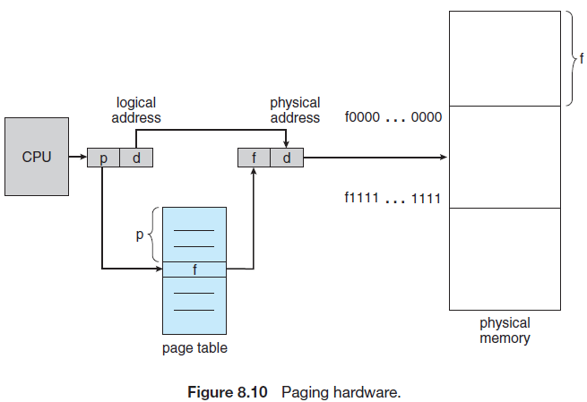
  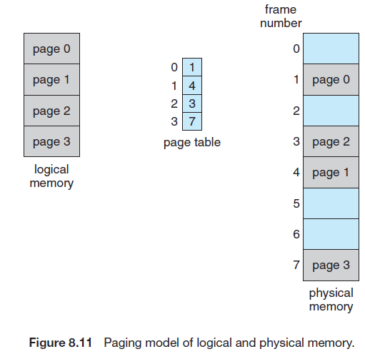
- 硬件 Hardware Support
  - **页表基寄存器page-table base register, PTBR**
    现代操作系统页表往往较大并且放置在内存中，通过维护PTBR来快速访问内存中的页表和切换不同的页表，但是这**需要两次访存**才能获得所需数据（一次页表，一次根据页表获得页）
  - **快表translation look-aside buffer, TLB**
    **缓存`<page number，frame number>`快速定位物理帧**进一步减小开销，快表若已存满，则需要一定的缓存替换算法，这与进程调度类似，通常有LRU, RR等方式

    有时TLB中还会保存其他信息例如ASID来保护程序之间的隔离，不符合ASID的进程即使TLB命中也会被作为不命中处理，并且每次**若修改PTBR选择了新的页表，TLB也需要被完全刷新**

    注意：现代计算机往往有多级缓存、多级TLB、多级页表等，复杂性更高
  
  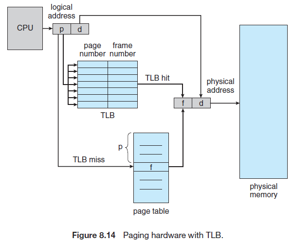
- **保护 Protection**
  通过页表中多余的位选取一位作为**有效位**来表示内存访问是否有效，避免非法访存，同时由于操作系统为每个进程维护一个页表副本，而大多数进程不会用到整个页表所有条目，因此一些系统硬件还会提供**页表长度寄存器page-table length register，PTLR 配合PTBR**使用
- **共享页 Shared Pages**
  分页机制可以使得不同的进程**共享一部分页**，当代码是可重入的reentrant code则可以被共享使用，另外通过**共享内存**进行通信的进程或多线程地址空间的共享就可以通过共享页来实现

## 6. 页表结构 Structure of the Page Table

- **层级页表 Hierarchical Paging**
  CPU产生的逻辑地址分为三部分，第一部分是**外层页表索引**，第二部分是**内层页表索引**，第三部分是**页内偏移**，这种**由外向内**的地址翻译也称为**向前映射页表forward-mapped page table**
  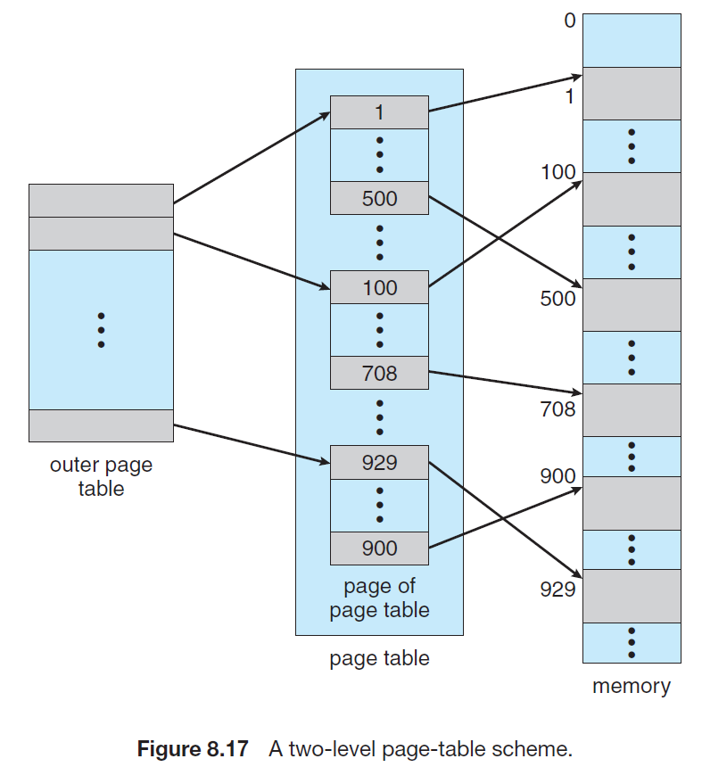
  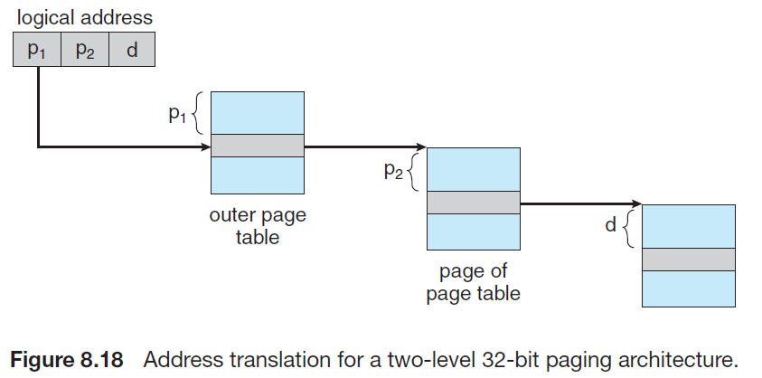

  注意：对于64位系统，即使多层页表结构也可能导致最外部的页表过大，因此**层次页表在64位不适用**
- **散列页表 Hashed Page Tables**
  64位系统往往使用散列页表，以**虚拟页号作为散列值**，每一个页表条目包含一个**链表来处理散列冲突**，每个链表元素包括：虚拟页号、映射的帧号、链表下一个元素的指针
  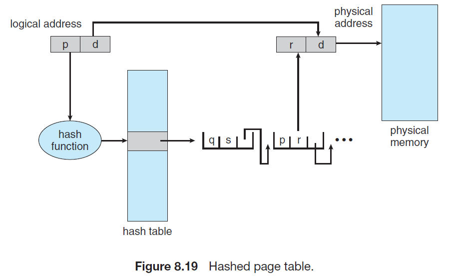
- **倒排页表 Inverted Page Tables**
  前述的页表在每个进程都有一个副本，用来根据进程所用的页来引用物理帧`page->frame`，而进程一多就可能会导致内存空间浪费，**倒排页表是通过实际物理帧来映射逻辑页`frame->page`**，每个条目包含页的虚拟地址以及**拥有这一页的进程**的信息，因此**整个系统只有一张倒排页表**
  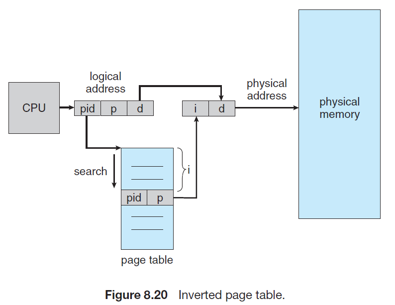

  CPU产生的虚拟地址包括：地址空间标识符PID、页号、页内偏移，然后根据标识符和页号在唯一的倒排页表中找到内存页的位置，根据在倒排页表中的位置`i`来作为物理地址的一部分

  注意：反向页表**每个物理帧只有一个虚拟页条目**，不利于进行内存共享，同时查找的性能可能下降

## 7. 操作系统实例（x86_64）

|63-48|47-39|38-30|29-21|20-12|11-0|
|:-:|:-:|:-:|:-:|:-:|:-:|
|unused|page map level 4|page directory pointer table|page directory|page table|offset|

IA32中的页表机制如下，上侧是**4-KB常规页**，下侧是**4-MB大页**，而x86_64内结合上表也类似：

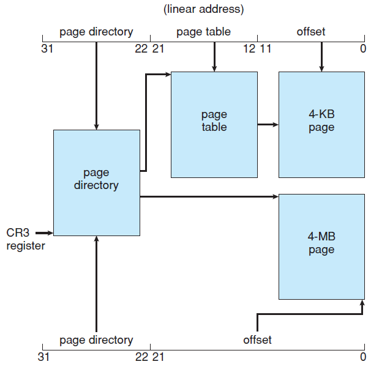

`TODO: 补充说明大页`
