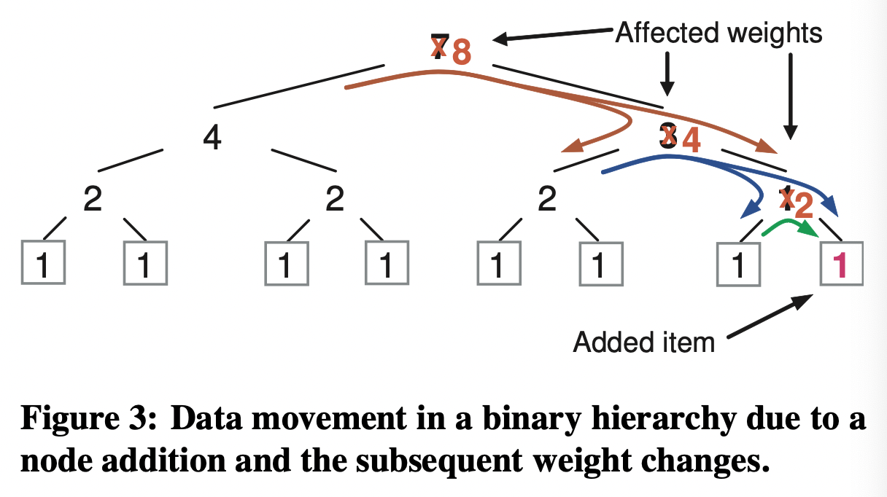
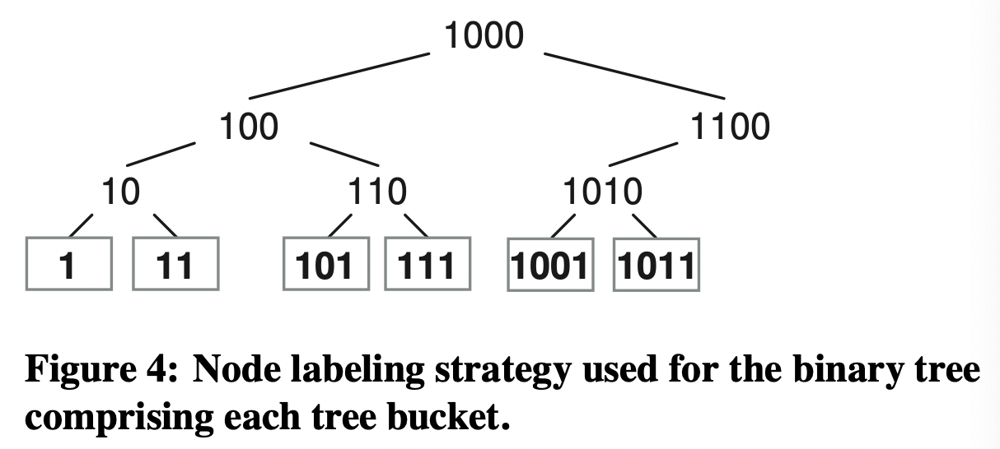

# [SC 2006] CRUSH: Controlled, Scalable, Decentralized Placement of Replicated Data

## 1 Introduction

CRUSH算法是一种伪随机数据分布算法，目标在于高效、稳健的将海量对象数据均匀可靠的复制到同构的存储集群中

通常只需要提供给CRUSH算法一个对象号，就可以生成一组需要存储该对象副本的存储设备列表，CRUSH算法是确定性的deterministic，并且不依赖中心目录节点，其仅需要一个所有存储设备的**层级描述hierarchical description**，以及相应的副本**放置策略replica placement policy**

这种设计使得CRUSH算法有两个显著的优点：

1. CRUSH算法是完全分布式的，集群中的任意节点都可以独立求出一个对象的副本位置
2. 仅需要极少数的元数据，这些数据仅在存储设备被添加/删除时才需要更新

另一方面，当存储设备有增减时，CRUSH算法也会高效的进行**重平衡rebalance**优化存储结构，尽可能充分利用每个存储节点的资源，避免少数节点过载

## 2 Related Work

`TODO`

## 3 The CRUSH algorithm

CRUSH算法将数据基于存储设备权重值（每个设备都有一个权重）进行均匀分布，分布过程受**层级化的集群图cluster map**，并且数据**放置策略placement rules**也会参与计算放置副本的设备，例如要求存储3个副本且这3个副本所在的机架不能共享电源

### 3.1 Hierarchical Cluster Map

集群图由**设备devices**和**桶buckets**组成，这两者都有相应的权重值，**桶作为集群图的中间节点**可以包含任意数量的设备或其他桶，而**设备总是叶节点**，每个设备都由集群管理员分配权重值，代表着该设备将会负责的数据量，而桶的权重值就是所包含的所有子节点的权重值之和

传统的散列算法来分配数据，会出现存储节点的增减导致大量数据需要被重新分配到其他节点上（其中一种解决方案是采用**一致性散列consistent hashing**），而CRUSH算法基于四种不同的桶类型，尽可能的减少因节点增减导致的数据移动

### 3.2 Replica Placement

CRUSH算法对底层物理设备的建模使得CRUSH能够**感知到底层存储设备的故障相关性**，例如共享电源或共享网络的设备，从而在执行数据分配时就会选择不在相同**故障域failure domain**的存储设备来存储多个副本

- CRUSH的输出参数`x`往往是一个对象名，或者是一组对象的识别号，从而这一组对象都会从CRUSH计算出相同的存储位置
- `TAKE(a)`将会从存储层次种选择一个节点（通常是桶节点bucket）并赋给向量`i`作为后续过程的输入
- `SELECT(n, t)`迭代每一个属于向量`i`的节点，并选择`n`个独立且类型为`t`的节点
- `SELECT(n, t)`在迭代时将会递归下降进入所有中间节点，采用伪随机的方式`b.c(r, x)`选择一个类型符合`t`的节点（`b.c = bucket.choose`），不同的桶类型都有不同的选择函数`c(r, x)`，见3.4节
- `EMIT`将结果输出
- 每个存储设备都有一个已知且固定的类型，每个桶也有一个类型字段用来区分不同类型的桶

例如以下过程：

1. 从`root`开始，`TAKE(root)`返回根节点`root`自身并作为`SELECT`的输入
2. 选择单个桶节点且类型为`row`，伪随机选出`row2`，递归进一步选择`row2`下的三个桶节点
3. 从`row2`桶下伪随机选出`cab21 cab23 cab24`三个桶节点且类型为`cabinet`，递归进一步选择每个`cabinet`下的一个节点
4. 从`cab21`下选出`disk2107`，同理获得三个存储设备节点且类型为`disk`
5. 结束，输出结果`disk2107 disk2313 disk2437`，显然这三个位置属于同一个`row`但分属于三个`cabinet`，类似的做法就可以确保副本不属于相同的故障域

|Action|Resulting Vector `i`|
|:-|:-|
|`TAKE(root)`|root|
|`SELECT(1, row)`|row2|
|`SELECT(3, cabinet)`|cab21 cab23 cab24|
|`SELECT(1, disk)`|disk2107 disk2313 disk2437|
|`EMIT`||

#### 3.2.1 Collisions, Failure, and Overload

`SELECT(n, t)`操作需要遍历存储层次的多个节点来确定`n`个独立的`t`类型节点，而在过程中CRUSH算法会处于以下三个理由拒绝并基于修改后的范围重新选择：

1. **冲突 collision**：当前节点已经被选择
2. **故障 failure**：当前节点被标记为故障
3. **过载 overload**：当前节点被标记为过载

故障和过载节点都不会从集群图中移除，而只是被标记了相应的状态，从而避免不必要的数据迁移，并且**CRUSH会选择性的挑选过载节点的一部分数据，基于伪随机拒绝来进行负载均衡**

对于故障和过载设备，CRUSH会通过重新执行算法第11行`SELECT(n, t)`（在第29行设置`retry_descent = true`）并被伪随机拒绝来均匀的重新分布相应的数据，对于冲突节点，CRUSH会通过算法第14行采用新的`r'`重新执行`b.c(r', x)`尝试本地搜索（在第27行设置`retry_bucket = true`）

#### 3.2.2 Replica Ranks

平等备份和纠删码备份有不同的副本放置策略，在主备模式下，通常一个主副本失效后就应该选择一个备份成为新的主副本，此时CRUSH就可以采用**前n个适用目标"first n"策略**，通过`r' = r + f`来修正，其中`f`代表了当前一次`SELECT(n, t)`失败的数量，选择出的结果`[0, 1, 2]`还是`[0, 2, 1]`没有差别，三个设备上存储完全一样的数据

而纠删码模式下每个存储设备都存储了数据的一部分因此不能简单的直接选择其他副本，不同的副本并不是完全对等的（有**级别rank**的概念），需要**通过`r' = r + f_r * n`来选择副本**（实际上是确定了一个副本候选序列），其中`f_r`代表了在`r`这一副本上失败的次数，选择的结果`[0, 1, 2]`还是`[0, 2, 1]`有很大不同，因为不同块上数据不同，顺序不一致会导致数据出错

### 3.3 Map Changes and Data Movement

大型分布式系统下的关键点就在于节点增减时的处理，CRUSH希望尽可能均分数据（从而均摊工作负载）并且当节点增减时只会发生少量的数据重分布

### 3.4 Bucket Types

CRUSH定义了4种不同的桶类型，每个类型都基于自身独特的数据结构，并且拥有不同的伪随机函数`c(r, x)`，Uniform Buckets必须包含拥有完全相同权重的子节点（类似散列）而其他类型的桶没有这个限制

|Action|Uniform|List|Tree|Straw|
|:-:|:-:|:-:|:-:|:-:|
|Mapping Speed|O(1)|O(n)|O(log n)|O(n)|
|Additions|poor|optimal|good|optimal|
|Removals|poor|poor|good|optimal|

#### 3.4.1 Uniform Buckets

通常大型系统中设备往往不会单独增加，而是以一批一批相同设备的形式批量部署，例如增加一组服务器机架，或者是增加一整个机房，并且这些设备抵达寿命终点时也会以一整批的形式报废

CRUSH算法的Uniform Buckets就用来代表上述这种情况下的一组完全相同的设备，**给定CRUSH算法的输入值`x`和相应的副本号`r`，则对一个包含`m`子节点的Uniform Buckets来说`c(r, x) = (hash(x) + rp) % m`，其中`p`必须是`p > m`的确定性伪随机素数**

当`r <= m`时总是能获取到唯一的子节点，而`r > m`时就有可能会出现不同的副本`r`带有相同的`x`有可能会获得相同的子节点，即[冲突](#321-collisions-failure-and-overload)

由于本质上采用了散列算法，因此当`m`改变，即**Uniform Buckets的子节点数改变时，所有数据都需要重新分配complete reshuffling**

#### 3.4.2 List Buckets

List Buckets将子节点以链表的形式组织起来，可以包含任意权重的子节点，当需要放置一个副本时从链表头节点开始遍历（链表头节点就是最近加入的子节点，尾节点是最早加入的子节点），并且对比当前子节点的权重和剩余其他子节点的权重，基于`hash(x, r, item)`来决定是否选择当前子节点加入

从最近加入的子节点开始搜寻，从而更大概率**将新数据放入新加入的节点中**，对一个正处于扩大规模/很少缩减规模的集群来说是非常自然的，因此其对于Additions操作表现为optimal，而对于Removals操作表现为poor

#### 3.4.3 Tree Buckets

显然List Buckets能够存放的节点数相对有限（如果存放过多数据则遍历的复杂度O(n)对性能不友好），因此更多数量的节点可以存放在Tree Buckets中，后者被**构造为一个带权重的二叉搜索树，所有Tree Buckets的子节点都是树的叶节点**，中间节点仅存放子树权重和

当需要放置一个副本时，从根节点开始遍历树，在每个非叶节点都基于输入参数的散列值`hash(x)`、副本号`r`、桶编号`bucket identifier`以及当前非叶节点的标识`label`计算出一个参考权重值，并与左右子树的权重比较来决定迭代进入哪个子树直到抵达叶节点

每个非叶节点的标识`label`如下设计，：

- 最左侧叶节点标为1
- 每当树的增长带来新的根节点时，旧的根节点就作为新根节点的左子树，新的根节点标识就是旧根节点标识后缀增加`0`
- 右子树的标识就是左子树镜像之后每个标识并前缀增加`1`，例如100下的左子树为`01-10-11`，则其右子树就是`101-110-111`

这种标识的设计使得即使当树的结构因节点增减发生变化时，**寻找某一个子节点的路径依然不变**（如果根节点改变了，路径仅需要增减根节点）

#### 3.4.4 Straw Buckets

Straw Buckets允许**所有子节点“公平”竞争一个副本的放置**，其过程如下：

- 每个子节点`i`会基于输入参数的散列值`hash(x)`、副本号`r`、子节点号`i`生成一个一定范围内的值`v`
- 生成的值`v`通过因子`f(w_i)`进行放大，其中`w_i`就是第`i`个子节点的权重，从而权重更大的节点有更高的概率计算出更大的值
- 最终值最大的子节点获得副本的放置权，即`c(r, x) = max_i(f(w_i) * hash(x, r, i))`

#### 3.4.5 Bucket Types Guide

显然四种类型的buckets各有千秋，则通常根据集群的增长规模可以选择更为合适的桶类型：

- 当集群稳定不变、buckets可能是固定不变时（例如一组同构的磁盘存储设备）则可以选择uniform buckets
- 当集群持续增长、buckets大概率持续增长时，list buckets可以提供最优的性能，新数据会增加到头部的新节点上
- 有可能发生节点移除时，则straw buckets可以提供更好的数据迁移效率
- Tree buckets则在大多数场景下都能提供相对较好的效果

**实际在Ceph的实现中，Uniform/List/Tree Buckets由于固有缺陷均已经不再使用，当前的Straw2算法是对Straw的改进**

`TODO: Straw2`

### 4 Evaluation

`TODO`

### 5 Future Work

`TODO`

### 6 Conclusions

`TODO`
