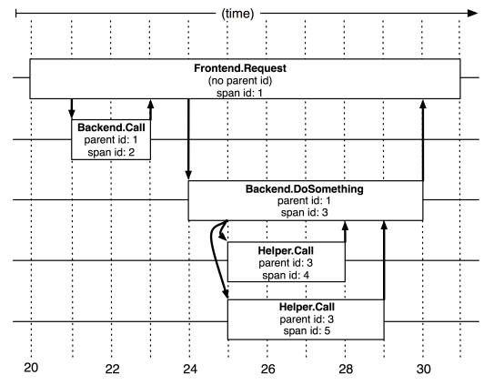
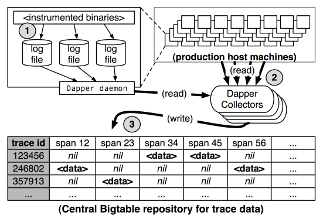
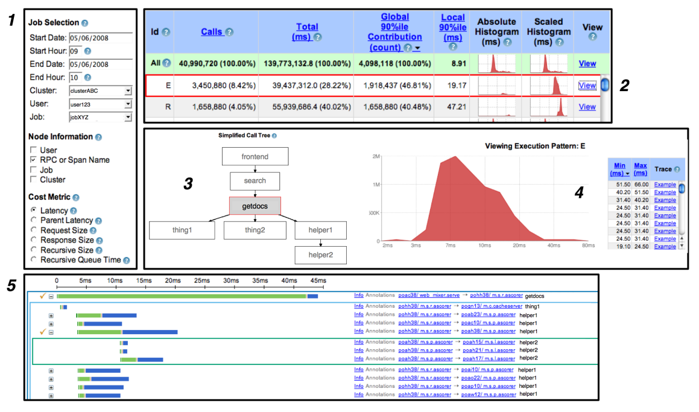

# [Google Tech Report 2010] Dapper, a Large-Scale Distributed Systems Tracing Infrastructure

## 2 Distributed Tracing in Dapper

- **Trace trees and spans**
  - trace id
  - parent id
  - span id
  - human readable span name, e.g. function name
  - be mindful of **clock skew**

  

- **Instrumentation points**
  - attaches a *trace context* to **thread local** storage
  - asynchronous **callbacks** store the trace context
  - inter-process communication should **transimit span/trace**
- **Annotations**
  - key-value pair to provide more application level information
  - configurable **upper-bound** on annotation volume
- **Sampling**
- **Trace collection**
  - **out-of-band** trace collection

  

- **Security and privacy considerations**
  - **topological monitoring**, monitor interactions between systems and components, e.g. sensitive data are not interacting with unauthorized systems

## 3 Dapper Deployment Status

- Dapper runtime library
  - as small and stable as possible
- Production coverage
- Use of trace annotations

## 4 Managing Tracing Overhead

- **Trace generation overhead**
  - root span creation/destruction ~204ns, need to allocate **globally unique trace id**
  - non-root span creation/destruction ~176ns
  - write to local disk asynchronously
- **Trace collection overhead**
  - very low cpu/ram usage for Dapper daemon process
- Effect on production workloads
  
  |Sampling|Avg. Latency|Avg. Throughput|
  |     -: |         -: |            -: |
  |    1/1 |     +16.3% |        -1.48% |
  |    1/2 |      +9.4% |        -0.73% |
  |    1/4 |      +6.4% |        -0.30% |
  |    1/8 |      +4.1% |        -0.23% |
  |   1/16 |      +2.1% |        -0.08% |
  | 1/1024 |      -0.2% |        -0.06% |

- **Adaptive samplint**
  - desired rate of sampled traces per unit time
- **Coping with aggressive sampling**
  - aggressive (low) sampling does not hinder most important analyse

  > If a notable execution pattern surfaces once in such systems, **it will surface thousands of times**

- **Additional sampling during collection**
  - `hash(trace_id) >= z` then discard all spans of this trace to reduce collection load
  - tuning `z` to adjust the global write rate
  - **2-level sampling**: upstream runtime sampling rate (hard to change) + downstream secondary sampling coefficient in collection (easy to control)

## 5 General-Purpose Dapper Tools

- **The Dapper Depot API**
  - point lookup trace id
  - bulk access
  - indexed access
- **The Dapper user interface**

  
