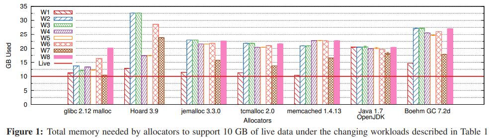
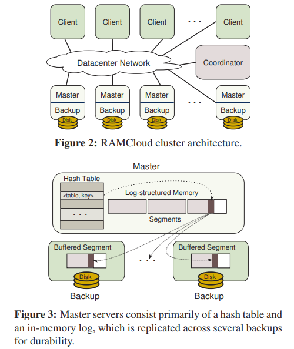
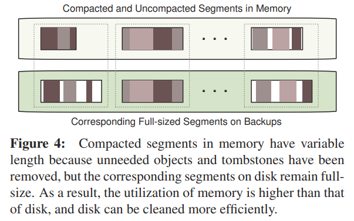
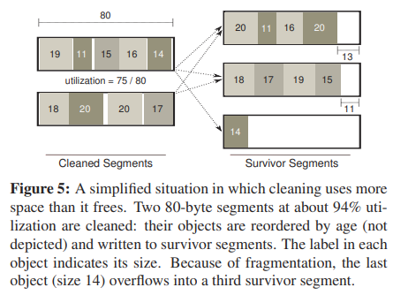

# [FAST 2014] Log-structured Memory for DRAM-based Storage

## 简介

随着内存存储系统的逐渐流行（例如RAMCloud，memcached，Redis，Spark等），对DRAM的高效使用变得越来越重要，采用本文提出的**基于日志的方式管理内存log-structured approach**可以在内存占用80-90%时依然提供高性能的服务，同时提供**增量式的垃圾回收incremental garbage collector**

## 为什么不用malloc

核心原因就是常见的内存分配器例如libc的malloc并**不能很好的应对存储系统的工作负载access patterns**，例如下图不同的工作负载下各种内存分配器的表现差异较大：

内存分配器通常可以分为两类：

- **非复制的 Non-copying**：例如libc的malloc，一旦分配了对象在内存的某一位置，这个对象的位置就不可移动，不能被复制到其他位置以更高效的利用内存空间，整体性能更易受到碎片的影响
- **复制的 Copying**：例如各种语言的GC，可以通过移走对象合并空闲空间提供更好的性能，但是往往需要扫描整个内存空间，更新数据和引用，引发Stop-The-World, STW（虽然当下各种语言最新的GC已经可以做到亚毫秒级的STW时间）

类似RAMCloud的存储系统对内存分配器的要求是能够复制对象从而提高内存利用率和减少碎片，同时支持增量式的垃圾回收而不影响应用运行

## RAMCloud架构

RAMCloud提供简单的键值存储，为了容灾和数据备份，每个对象都会以log的形式存储在其他服务器上的二级存储（磁盘）中

**每个master都有独立的log存储在内存和磁盘上，并且划分为8MB大小的段segments**，每个segment都会备份到2-3个服务器上，一次写入流程如下：

1. 当master收到一个写请求时，首先在内存中分配新的对象，并将信息推给backups
2. 随后backups就会将新对象append到**非易失缓存中nonvolatile buffers，并立即回复master而不会发起磁盘IO**（backup需要确保在buffer中的数据不会丢失）
3. backup在**nonvolatile buffered segment充满时就会一次性写入二级存储**

这种模式有两个优点：

- master只需要等待所有backups写入buffered segments就能返回，不需要等待磁盘IO
- backup每次将完整的segment一次性写入磁盘，相当于合并了磁盘IO次数

从架构图中可以看出，RAMCloud**采用Log-structured Allocator可以使得内存DRAM中的结构与磁盘上的log结构完全一致**，这有三个优点：

- 内存分配更加高效
- 对内存和磁盘的数据可以采用相同的机制处理
- 内存更紧凑，使用率更高

RAMCloud采用**日志清理者log cleaner**进行内存资源的回收，基本流程与LFS类似，如下：

1. cleaner基于**cost-benefit原则**（free space, the age of the data）选择一些需要清理的segments
2. 扫描选择的segment，**复制所有存活的数据到survivor segments**，存活通过**检查散列表中保存的对对象的引用**来完成
3. cleaner标记清理完的内存作为new segment，并且**通知backups**也可以回收对应的replicas空间

## Log元数据

RAMCloud使用单独的**散列表来提供内存log中数据的快速随机访问**，而磁盘log仅在故障恢复时才会访问，正常操作时不会访问

在RAMCloud中log仅需要以下三种meta data：

- 每个object是**自身可识别的self-identifying**，在value以外还包含了**table identifier, key, version number**，从而在故障恢复中被扫描时RAMCloud可以确认一个object的最新版本并重建散列表
- 每个new segment含有**log digest**来描述整个log，每个segment都有UID，而log digest有UID列表包含了所有属于该log的segments，在故障恢复时RAMCloud定位到最新的log digest后加载包含的所有segments
- 被删除的object有对应的**墓碑tombstones**，当一个对象被修改或删除时，RAMCloud并不会真的修改删除原对象，而是在log中增加一条tombstone record包含了table identifier, key, version number，当log cleaner遇到一条tombstone record时，必须检查**该对象对应的segment（通过segment identifier）是否已经被清理，若是才能安全删除该对象**，否则就必须保留从而在故障恢复时重建该segment时不会重建被删除的对象

## 两层清理 Two-level Cleaning

对于**Log-Structured Allocator, LSA**来说，分配内存非常简单只需要直接追加到log末尾，而日志的清理才是昂贵的操作（对应LSM树的compaction）

**当内存使用率上升时，清理回收的开销会显著上升**，例如segment的80%对象都存活，则回收一个segment时每回收2个字节，都需要拷贝8个字节，即使采用了cost-benefit策略优先清理低存活率的segment，也无法完全避免在整体高存活率情况下的清理开销较大的问题

通过内存和磁盘的日志清理解耦的两层清理方式**two-level cleaning**，即各自单独执行清理，内存的log变化不必立即在磁盘上更新，从而允许**内存保持较高占用率**（此时内存清理代价依然较高）而**磁盘带宽不会被内存清理占用过多**（磁盘清理不再和内存清理同步，更少执行磁盘清理，磁盘log比内存log更大）

- 第一层称为**segment compaction**
  仅在master内存segments上执行，因此不占用网络/磁盘IO，每次compact单个segment，将存活对象拷贝到较小的内存区域中并且回收内存，在这个过程中内存和磁盘依然有相同的逻辑日志，即**内存中的segment依然对应磁盘的segment**，只是内存的segment经过compaction占用更小的空间，如下图

  

- 第二层称为**combined cleaning**
  在内存和磁盘上一起执行清理，由于经过segment compaction，此时的内存segment占用空间更小，较多的删除和过时对象已经被删除因此内存占用率更低，从而此时在执行磁盘清理时所需的带宽更少

这种两层清理方式充分考虑了内存空间受限而磁盘带宽受限这两个不同的瓶颈，从而**允许内存空间利用率更高（时间换空间）而磁盘带宽利用率更高（空间换时间）**

## 并行清理 Parallel Cleaning

由于采用两层清理（尤其是segment compaction这一层）会显著增加清理回收的开销，通过**多个log cleaner并发进行清理**来提高清理效率

**所有对象的访问都通过散列表存储的引用进行，并且segment是不可变对象**，从而大大简化了清理的过程，在复制对象时不需要考虑对象正在被并发修改（immutable），更新引用时只需要原子更新全局的散列表中对应对象的引用即可，随后就可以回收对应的内存，仅有以下情况下有潜在的竞争，需要特别处理：

1. **并发日志更新 Concurrent Log Updates**
   若在清理时直接将存活对象的数据复制到日志的head，清理线程就有可能与服务线程出现竞争写入日志的head，RAMCloud通过cleaner将存活对象的数据写入另一个segments而不是日志head来避免冲突，每个cleaner会单独分配一组**survivor segments**用于保存存活对象的数据，因此**仅在分配时需要同步**，一旦分配完成就可以无冲突写入survivor segments，当清理写入完成时，就会将该segments加入到下一个log digest，后者会将segments加入到log上

   将存活对象复制到单独的survivor segments还有额外的好处，不同segments会replicate到不同的backups上，与head segment不同则可以**并发replication**

2. **散列表竞争 Hash Table Contention**
   RAMCloud使用细粒度的锁来保证服务线程访问到的对象引用始终有效，清理线程可以原子的更新存活的对象引用

3. **释放内存空间 Freeing Segments in Memory**
   由于在清理后（存活对象已经被复制到新的segments中）未来的请求和服务通过散列表都会访问复制后的对象，但是依然有可能有**清理前就运行的服务持有引用指向该segment**，因此直到该segment不被任何服务指涉时，才可以真正回收对应的内存用于新的segments——**wait-for-readers原则**

4. **释放磁盘空间 Freeing Segments on Disk**
   当一个segment被清理后，其backups上的replicas也必须被释放，但是必须**等待直到原segment对应的survivor segment已经被添加到磁盘上的日志**才可以（确保故障恢复能够重建）

## 避免清理者死锁 Avoiding Cleaner Deadlock

由于清理过程中需要首先拷贝数据，因此**cleaner必须有足够的空余内存来放置数据**，否则就会出现旧数据无法释放而没有足够的空余内存来存放数据陷入死锁（而RAMCloud倾向于将内存使用率保持在较高的水平，加大了死锁的概率）

1. **总是为cleaner预留内存空间**，当seglets被释放（每个segment进一步划分为seglets）回收时总是预留一部分seglets给cleaner使用
   由于RAMCloud不允许对象跨segment存在，因此在**回收segments后是有可能会（临时）出现更大的碎片**，如下图：
   
   在这种情况下内存空间也会被碎片占用，因此cleaner也必须能够**产生足够的内存空间来补偿在碎片中丢失的内存空间**
2. 保留2个特别的**emergency head segments**只允许包含log digests而不允许存储其他数据
   当cleaner清理后（真正free前）需要**分配新的log digest来处理survivor segments已经没有内存空间**了（survivor segment不包含log digest，新的log digest需要新的log head segment），则emergency head segment就会被用来存储新的log digest

   因为不允许存储其他数据，这个emergency head segment不需要清理，而是在有内存空间后**下一个head segment被写入时就立即被free**（显然emergency head segment不会被包含在下一个head segment的log digest内）
