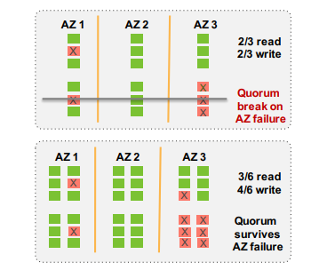
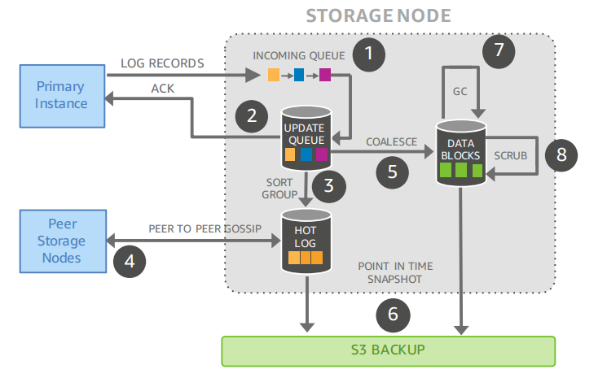
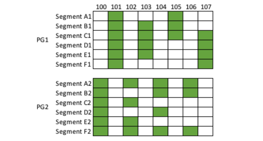
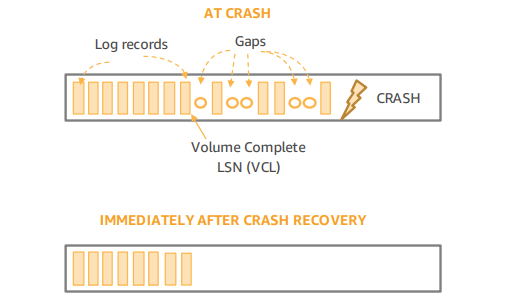

# [SIGMOD 2018] Amazon Aurora: On Avoiding Distributed Consensus for I/Os, Commits, and Membership Changes

[相关笔记mit6.824: Aurora](https://github.com/JasonYuchen/notes/blob/master/mit6.824/10.Aurora.md)

## 简介 Introduction

Aurora在设计上考虑的**最大故障域就是整个AZ (Availability Zone)宕机**，一个AZ是Region的子集，与其他AZ通过高速网络连接，并且相互隔绝了绝大多数故障源（电源、网络、软件部署、自然灾害等）

Aurora支持**AZ+1**的故障策略，通过六份数据拷贝分布在三个AZ中，write quorum为4/6，read quorum为3/6，采用六份数据就可以在单个AZ整体宕机以及另一个AZ中存在一个节点宕机的情况下继续提供读服务，如下图倒数两行分别是AZ+1故障可以提供读和AZ故障可以提供写的情况：

Quorum系统在高性能的关系型数据库中往往不被使用，虽然quorum可以带来高可用性，但是分布式系统中所使用的quorum算法例如2PC、Paxos commit、Paxos membership change等往往会带来极高的额外代价，**基于这些算法的系统通常会有优良的可用性和可扩展性，但是性能不佳**，往往比单节点的关系型数据库延迟要高数量级以上

Aurora通过**quorum I/O、本地状态locally observable state、单调递增的日志monotonically increasing log ordering**来提供高性能的非阻塞容错I/O、提交和成员变更操作：

- 采用异步的任务流来完成write，建立本地一致性点local consistency points，并采用一致性点来完成commit以及crash recovery
- 避免quorum read以及将read操作扩展到所有副本
- 采用quorum sets和epochs来实现非阻塞的可逆成员变更，从而进行故障容错、存储扩容等

## 高效写入 Making Writes Efficient

### Aurora系统架构 Aurora System Architecture

Aurora采用了存储和计算分离的架构，数据库实例与存储服务相分离，每个数据库实例作为一个SQL endpoint，包含了绝大多数传统数据的组件，例如查询处理、事务、锁、缓存、undo日志等，而**redo日志、数据块与垃圾回收、备份与恢复**则被分离由存储服务提供

存储服务节点实际完成的工作如下：

1. （前端）接受redo记录
2. （前端）将redo记录写入一个update队列并响应ACK给相应的数据库实例
3. （后端）对redo记录进行排序和分组
4. （后端）通过gossip协议与其他存储服务节点通信，从而补全redo记录的缺失部分
5. （后端）将完整的redo记录合并处理成数据块
6. （后端）将数据块存储到AWS S3中
7. （后端）不会再被使用到的过旧数据块会被垃圾回收
8. （后端）周期性的校验数据来确保校验和与磁盘上的数据一致

Aurora的最小错误单元就是一个段文件segment，一个segment代表了数据库卷中不超过10GB的可寻址数据块，**每个segment都会复制到6个节点上（称为protection group）**，采用`V = 6, V_w = 4, V_r = 3`的quorum规则来访问这些副本，并且有**10秒的窗口期来检测和恢复segment的错误**，因此当出现10秒内有一个AZ+2个节点的4份数据都出错时才会导致整个系统不可用，否则的话就会及时进行成员变更和容错来保持quorum可用

每个protection group对应一个segment，从而多个protection groups（每个segment对应的protection group的6个节点未必是相同的一批存储节点）能够构成完整的一份数据库卷，并对应一个数据库实例，**数据库实例的redo log就通过这种segment的方式分割并被备份在多个存储节点上的protection groups**，而数据库卷通过一个单调递增的日志顺序号**Log Sequence Number, LSN来访问redo log**，这也是Aurora避免分布式共识的核心

### 写入 Writes in Aurora

在Aurora的设计中，数据库实例与存储服务之间唯一通信的内容就是redo log，而**存储服务节点上通过不断的应用redo log进行数据库数据页的构建以及按需提供读服务**

当数据库实例中对数据页缓存进行了修改时，就会发送响应的redo记录到日志缓存，数据库实例会周期性的将日志缓存shuffle为将要发送给针对不同存储服务节点的write buffer，并异步的将这些write buffer发送给存储服务节点以及**根据所有存储服务节点返回ACK的情况来构建一致性点consistency point**

每个redo log记录会记录：

- **volume**中前一条redo log的LSN
- **segment**中前一条redo log的LSN：这条segment LSN chain用于**判断是否存在日志空洞log hole**，从而可以基于gossip协议进行日志补全
- **block**中前一条redo log的LSN：这条block LSN chain用于**存储服务节点可以针对某一块数据块单独进行构建materialize**以满足读需求

Aurora中所有日志的写入操作（包括commit日志）都是**完全异步化**的：异步发送给存储节点、由存储节点异步处理、数据库实例异步接收存储服务节点的ACK的

### 存储的一致性和提交 Storage Consistency Points and Commits

传统的关系型数据库在提交时需要在本地磁盘上写入commit redo log record，通常也可以通过批量多个commit一起写入磁盘来提高吞吐量，而分布式的关系型数据库则会选择2PC、Paxos commit等方式来进行commit，这是一种非常昂贵的操作且可能导致可用性等各种问题

在Aurora中，随着存储服务节点不断收到新的redo日志，本地可以维护一个**Segment Complete LSN, SCL代表该节点收到的连续日志的最大LSN**（inclusive upper bound on log records continuously linked through the segment chain without gaps），通过SCL，存储节点就可以使用gossip协议与其他同属一个protection group的存储节点通信来获取缺失的记录并推进SCL的值

每次收到redo日志时存储节点需要**以ACK来响应数据库实例，ACK响应中就包含了SCL值**，一旦数据库实例收到了protection group上报的SCLs，就可以将自身维护的**Protection Group Complete LSN, PGCL前进到4/6节点上报的最小SCL**，数据库实例可以认为PGCL代表着此LSN及之前的redo log均已经持久化且可靠，例如下图：

- 一个数据库实例包含两个protection group，每个组包含了一个segments的六个副本A-F
- 奇数的redo log走向PG1，偶数的redo log走向PG2
- 绿色代表该PG下对应segment的对应副本所在存储节点已经收到了该LSN对应的redo记录
- PG1的PGCL就是103，因为105只有3个存储节点收到
- PG2的PGCL就是104，因为102和104都达到了4个节点而106只有3个节点

由于数据库还需要可恢复性，单独的写已经被持久化不足以满足这一点，这还需要数据库实例维护**Volume Complete LSN, VCL代表着一个数据库卷包含的所有segments已经持久化的连续LSN的最大值**，例如上图中的PG1的`PGCL=103`，而PG2的`PGCL=104`，从而此数据库实例的redo日志在`LSN<=104`可靠，即`VCL=104`

在上述维护各类LSN的过程中，数据库实例能够确定一个一致性的点，且**维护每个特殊的LSN值本身不需要任何分布式共识算法**，每个存储服务节点不需要投票决定有效的写入，而是必须接受所有数据库实例的写入并通过gossip协议来补全缺失值，数据库实例只需要确认**某个事务commit log record相应的`LSN<=VCL`或是系统提交点System Commit Number, `SCN<=VCL`就可以确定该事务成功提交**，此过程中不再需要批量多个commit请求，也不需要2PC等分布式提交协议

实际实现中，每个请求的worker也并不会被等待`SCN`而阻塞，而是**将等待提交成功的请求放入等待队列**，自身继续执行其他任务，而一旦检测到VCL的增大使得`SCN<=VCL`，就会分配任务给worker来处理此前等待提交成功的请求并响应客户端

### 故障恢复 Crash Recovery in Aurora

在宕机等故障中，Aurora仍需要在多个存储服务节点上达成共识来维护一致的全局状态，**数据库实例需要通过protection groups的SCLs来重建自身的PGCLs和VCL**，并且可能有一些segments上存在着并没有完成且没有响应客户端的partial write

**数据库实例在启动时（宕机重启或是正常启动）会首先构建read quorum**，通过read quorum的PGCLs来构建VCL，并且在新的VCL被重建之后，所有此VCL后的日志会被全部清除，如下图：

**当Aurora无法构建write quorum时，就会启动修复过程，通过read quorum的节点来重建错误的segments**，当修复完成构建write quorum成功时，Aurora就会递增**volume epoch值**并存储到存储元信息的节点，且epoch值也会被写入write quorum的protection groups，**epoch值用于区分宕机并会被每一个读写请求携带，所有存储服务节点都会拒绝来自过期epoch的请求**（类似分布式锁的[令牌token](https://github.com/JasonYuchen/notes/blob/master/ddia/08.The_Trouble_with_Distributed_Systems.md#%E7%9C%9F%E7%9B%B8%E7%94%B1%E5%A4%9A%E6%95%B0%E5%86%B3%E5%AE%9Athe-truth-is-defined-by-the-majority)）

由于数据块的生成materialization已经由存储服务节点来完成，因此在宕机恢复过程中，**数据库实例不需要replay redo log来重建数据，只需要通过undo log来回滚未完成的事务**，显然事务回滚是可以与接受用户新的请求并行完成的，就像正常运行过程中的事务终止回滚一样
