# [SOSP 2019] File Systems Unfit as Distributed Storage Backends: Lessions from 10 Years of Ceph Evolution

## 1 Introduction

分布式文件系统中的存储服务器storage server通常是分布式系统整体性能的关键，其采用的**存储后端storage backend**可以有多种实现，传统实现就是基于本地文件系统local file systems例如ext4或XFS

基于本地文件系统的方案主要好处有：

- 性能尚可、数据持久性以及文件块分配等复杂工作可以直接利用成熟的本地文件系统
- 易用的POSIX接口及相应的抽象（文件、目录等）
- 允许直接使用一些标准工具来操作磁盘（`ls`，`find`等）

Ceph作为广泛被使用的开源分布式存储系统已经演尽了十年以上，采用过多种不同的本地文件系统作为存储后端，最终得出的结论是**本地文件系统并不适合作为存储后端**，除了文件系统自身高昂的额外开销导致的**性能瓶颈**以外，文件系统非常成熟以至于难以及时吸纳并支持**最新存储技术**，例如NVMe协议的SSD等设备，并且文件系统上额外支持事务等操作会带来极大的**实现复杂性**和性能惩罚

> operating systems offer all things to all people at much higher overhead

Ceph团队从2015年开始设计并实现新的存储后端**BlueStore**（2020年已经在开发基于seastar的新一代后端**SeaStore**），这种全新的后端完全处于用户态，且直接与**磁盘设备raw device**进行数据交互，**完全控制I/O栈**，支持高效的操作例如：

- 全数据校验和 full data checksums
- 内联压缩 inline compression
- 高效覆盖纠删码数据 fast overwrite of erasure-coded data

## 2 Background

### 2.1 Essentials of Distributed Storage Backends

分布式文件系统运行在多个物理机器上并对外表现为单个统一的存储，拥有高带宽、并行I/O、水平扩容、容错、强一致等特性，而其通常在每个物理节点上会运行**存储后端storage backend**程序来直接管理物理设备，存储后端要求：

- **高效事务 efficient transactions**
  通过事务可以轻易的支持强一致性，但是基于本地文件系统（POSIX标准并没有事务概念）的传统存储后端需要更高的代价来支持事务，例如实现WAL机制等
- **高效元数据操作 fast metadata operations**
  传统文件系统往往对大目录（海量目录项）及小文件的支持不佳，元数据管理性能劣化严重，导致存储后端需要是用诸如元数据缓存、深目录层级、数据库等方式管理元数据
- **对新硬件设备的支持 support for novel, backward-incompatible storage hardware**
  一些新的硬件设备引入了不兼容的修改，导致传统的文件系统难以及时这些新的设备，从而无法充分发挥出设备应有的性能，例如HDD的SMR技术、SSD的ZNS技术都可以显著提高硬件性能，但尚未被传统本地文件系统充分支持

### 2.2 Ceph Distributed Storage System Architecture

Ceph分布式存储系统的架构如下图所示：

- Ceph的核心是**Reliable Autonomic Distributed Object Store, RADOS服务**，RADOS可以支持扩容到数千个**Object Storage Devices, OSDs**，并支持自动修复、自动管理、多副本强一致访问特性，在此之上的librados提供了对象操作的事务接口
- 基于RADOS及librados，Ceph实现了三种存储服务，分别为：
  - **对象存储 RADOS Gateway, RGW**，类似AWS S3
  - **块存储 RADOS Block Device, RBD**，类似AWS EBS
  - **文件存储 CephFS**，支持POSIX的分布式文件系统
- 对象被存储在RADOS的Pool中，**pools是可以提供数据冗余（基于副本replication或纠删码erasure coding）的逻辑分区**，在一个pool中对象被分片存储到一组**聚集单元placement groups, PGs**内，基于配置的副本数，PGs再**基于[CRUSH](https://access.redhat.com/documentation/en-us/red_hat_ceph_storage/1.2.3/html/storage_strategies/introduction_to_crush)算法**被映射到相应数量的OSDs上（访问数据的客户端同样采用CRUSH算法来确定OSDs的位置，从而避免了中心化的元数据服务），PGs以及CRUSH算法组成了客户端和OSDs的中间层，从而允许OSDs可以在客户无感知的情况下进行迁移、负载均衡等操作
- 每个RADOS集群节点的每个存储设备都会有一个独立的**Ceph OSD daemon**进程，而每个OSD与其他peer OSDs节点一起完成客户端的I/O请求、数据复制、纠删码更新、数据迁移、故障恢复等任务
- OSD节点通过实现了**ObjectStore接口**的后端存储在本地管理所有数据，该接口提供了对象的抽象、对象集合、操作指令、事务操作（一个事务操作可以包括任意对象和操作指令，并保证了事务操作的原子性），Ceph集群中每个OSD可以使用不同的后端存储实现，只要实现了ObjectStore接口即可

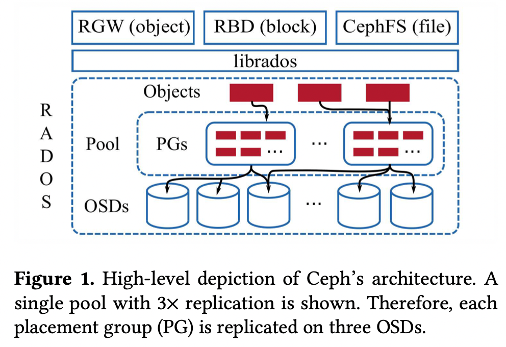

### 2.3 Evolution of Ceph's Storage Backend

Ceph的存储后端有过多年演变：

1. **EBOFS**: Extent and B-Tree-based Object File System
   EBOFS实际上是用户态文件系统
2. **FileStore/Btrfs**
   基于本地文件系统Btrfs的FileStore，Btrfs支持事务、去重、校验和、透明的压缩，极大的拓展了EBOFS的功能

   在FileStore下，一个对象集合被映射为一个目录，对象的数据就存储在文件中，初始实现中对象的属性保存在POSIX extended file attributes, xattrs中，随后改用了LevelDB来存储（属性数量和大小超出xattrs的限制）

   采用Brtfs期间，Brtfs始终不稳定且易出现数据和元数据的碎片化，并且ObjectStore接口本身也在大量修改到不再兼容EBOFS，随后FileStore就开始采用XFS、ext4、ZFS等其他文件系统，其中主流做法就是基于XFS
3. **FileStore/XFS**
   基于本地文件系统XFS的FileStore表现出了更好的可扩展性以及元数据处理性能，但是XFS也没有完全避免元数据碎片化，同时XFS并不支持事务，且不能及时跟上硬件设备的发展，无法充分挖掘硬件设备本身的性能

   缺乏对事务的支持导致FileStore在用户层实现了WAL机制来记录全数据的日志，使得Ceph中常见的read-modify-write任务的速度受限于WAL写入文件的速度，另一方面XFS并不是copy-on-write的文件系统，使得Ceph中的快照操作（会进行clone）显著变慢
4. **NewStore**
   首次尝试解决元数据的问题，NewStore将对象元数据储存在RocksDB中，而对象数据依然存储在文件中，并且WAL也采用RocksDB来实现，从而使得read-modify-write的操作性能更好（得益于RocksDB合并管理数据和元数据日志）

   这种实现引入高昂的一致性代价（？），并催生了BlueStore，直接管理底层存储设备raw disks
5. **BlueStore**
   见后续详细分析
6. **SeaStore**
   在本文（2019）中并没有体现，实际上是从2020年开始基于Seastar开发的下一代存储后端，`TODO: 分析SeaStore希望解决的问题`

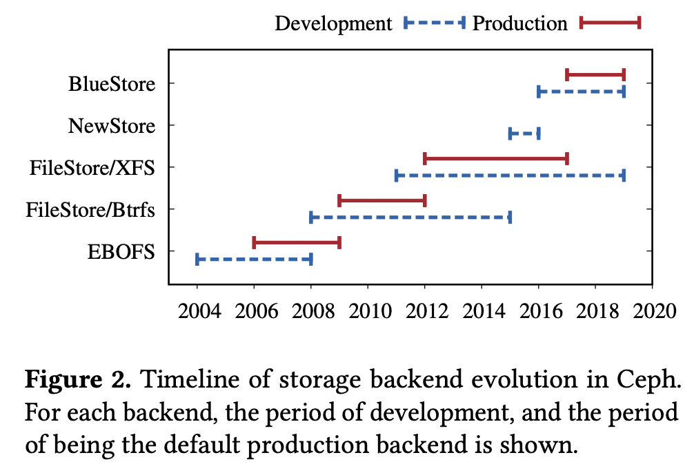

## 3 Building Storage Backends on Local File Systems is Hard

### 3.1 Chanllenge 1: Efficient Transactions

事务操作可以极大的简化上层应用的逻辑，从而有非常多的研究性工作尝试在文件系统中引入事物，但由于接口复杂性、性能开销高、实现复杂，导致无一能够被生产环境采纳

注：从文中来看，文件系统（或是这里指的事务transaction）与数据库中所指的事务有所区别，这里的事务似乎不保证部分事务被回滚

对Ceph一类的分布式存储系统来说，假如其存储后端基于本地文件系统并且需要支持事务，那么通常会有三个选择：

1. 侵入文件系统的内部实现
2. 用户态实现WAL
3. 采用key-value数据库作为WAL

#### 3.1.1 Leveraging File System Internal Transactions

大多数文件系统实现了内核中的事务框架 in-kernel transaction framework，这些事务框架是为了确保文件系统内部一致性的，因此通常功能有限（**没有回滚功能**）且没有对用户层开放，而Btrfs则通过一对系统调用开放了事务机制

最初版本的FileStore基于Btrfs的事务，但由于其事务并不支持回滚，当存储后端（或者说Ceph OSD）在一次事务中突触发严重错误或被中止，其文件系统的事务操作就没有完成且无法回滚，导致数据处于不一致的状态

为了解决这种问题，Ceph减少了事务所需的系统调用（采用单次系统调用包含所有文件系统操作）以及引入了**快照**来支持回滚，但性能代价极其高昂

**试图利用文件系统的内部事务机制并在用户层实现存储后端，是困难的。**

#### 3.1.2 Implementing the WAL in User Space

在用户层实现逻辑预写式日志logical WAL这种方式可行，即将对象和操作完整的写入WAL，但同样会带来一些问题：

1. **读后写操作缓慢 Slow Read-Modify-Write**
   Ceph的工作负载往往包含大量的read-modify-write操作，而这种操作的新事务往往需要得知当前事务的操作结果（操作间依赖）

   用户层WAL实现事务，通常每个事务包含三个步骤（实际上也是其他采用WAL来记录操作的通常实现方式）：
   1. 事务操作序列化后写入WAL
   2. 对WAL调用`fsync`确保落盘
   3. 事务中的操作实际应用到系统中

   在这种标准流程下，一个新的事务必须要等到前一个事务的第三步结束，获知执行结果，才能开启新事务的流程，从而**RMW操作难以有效的流水线化**，必须串行之行，延迟较高
2. **非幂等操作 Non-Idempotent Operations**
   在FileStore中，对象被表达为文件和集合，并且被映射到具体目录下，这样的设计导致WAL在宕机重启回放恢复的过程中难以应对非幂等操作，例如一个事务包括`clone a->b, update a, update c`三步，并在执行到`update a`之后系统宕机，则在恢复过程中就会出现`clone (updated) a->b`这种不一致的结果（应该也是因为无法回滚导致的？）

   当FileStore放弃Btrfs改用XFS时，后者缺乏高效snapshot的支持也产生了新的问题，XFS的`sync`操作是唯一可以确保数据落盘的操作，但其会强制同步所有硬件设备（多个磁盘）以及所有文件系统导致代价高昂（进一步引入了`syncfs`系统调用允许只同步单一文件系统）
3. **双写 Double Writes**
   几乎所有采用WAL的设计都存在相同的问题，即数据在WAL中写入了一份，在应用到系统中时相当于又写入了一份，导致磁盘的实际可用带宽只有一半，因此几乎所有系统在使用WAL时往往只记录一些元数据，并且允许一定程度的宕机数据丢失

   常见的避免双写的措施就是首先使用实际数据，完成后再记录一些元信息到WAL上，但是FileStore使用文件系统的文件状态来推测出对象的namespace和states信息，导致很难通过这种只记录元信息的方式来避免双写

   FileStore的这种方式有技术原因，在于希望能够利用**内核的页缓存和文件inode缓存**，而不是自己维护一份包含所有数据、元数据、等待中的更新操作的内存缓存（后续采用RocksDB相当于**利用RocksDB来存储并缓存这些数据**）

#### 3.1.3 Using a Key-Value Store as the WAL

采用NewStore之后所有元数据存入了RocksDB，而对象依然由文件系统（XFS）中的文件来代表，从而基于RocksDB就可以对元数据实现事务操作，而对对象的覆盖等写入则是首先记录操作到RocksDB中随后再应用到对象上

1. **解决RMW操作慢**
   基于RocksDB，很容易获取当前对象的最新值而不用等到上一条事务提交，因此RMW操作可以高效执行（数据库的NO-FORCE和STEALING策略？）
2. **解决非幂等操作（写时复制）**
   在读取一个对象时会确保操作的幂等（数据库可重复读？），例如当执行`clone a->b`时若`a`足够小就会直接嵌入到事务中，若`a`较大就会采用写时复制COW并将`a,b`都指向原来的`a`且只读，后续修改`b`时就会进行复制
3. **解决双写（元数据和数据分离）**
   数据库中只记录元数据，从而写入对象数据时首先写入文件，当完成后才在数据库中原子的加上对该数据对象的引用

但这种基于RocksDB的设计带来了**较高的同步开销**，在NewStore中创建一个对象包括以下两步：

1. 将数据对象写入文件，并在结束时调用`fsync`
2. 将相关的对象元数据**同步**写入RocksDB，实际上也会调用`fsync`

对于**日志型文件系统journaling file system**，一次`fsync`会触发两次`FLUSH CACHE`（一次在写入数据结束时，一次在文件系统元数据修改结束时，日志型文件系统也有类似WAL的机制），因此创建一个对象涉及到了四次代价高昂的`FLUSH CACHE`

下图对比了不同设计下的两种对象创建（每个对象创建写入0.5MiB数据以及500byte元数据）情况：

- **蓝色**：对象写入在XFS上的文件，同时RocksDB也建立在XFS上
- **红色**：对象直接写入裸磁盘，同时RocksDB也直接建立在裸磁盘上

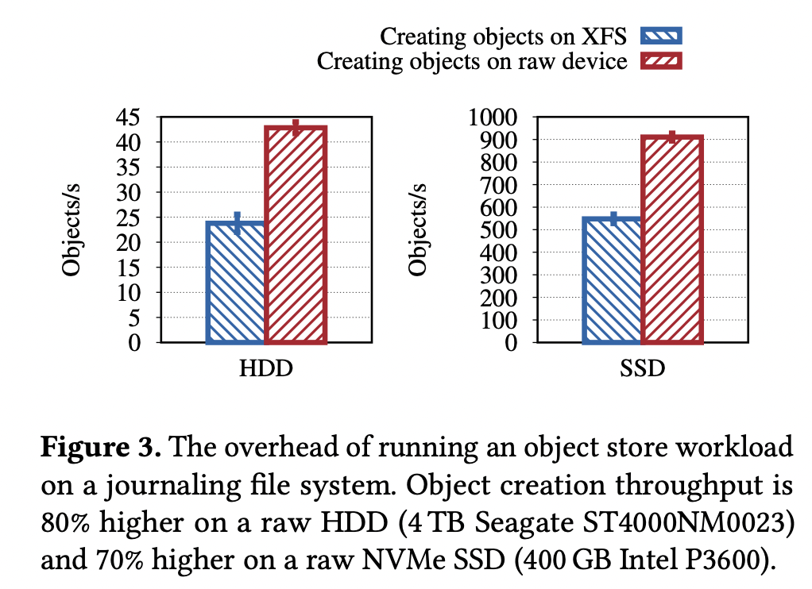

### 3.2 Challenge 2: Fast Metadata Operations

本地文件系统中**元数据操作的低效**是所有分布式文件系统的主要问题之一，在Ceph的FileStore中列出目录所有目录项的操作`readdir`是最主要的问题（大目录下延迟高、返回的结果无序）

RADOS中的对象通过`hash(name)`的方式映射到一组PG上，并且在枚举时会依照散列的顺序排序，FileStore采用了通常的方法来解决枚举目录项较慢的问题：**采用有较大扇出系数fan-out的目录层次结构，参考B树**，而对象就分布在多个目录中，读取了选中的目录内容后再进行目录项排序，当某个目录下的目录项数量增长较多（正常时只有数百个）时就会分裂为多个子目录

目录的分裂操作非常耗时（尤其当Ceph OSDs几乎同时开始分裂目录时会显著影响性能），主要由于以下两点：

1. 分裂时实际上会涉及到数百万`inode`修改并且使`dentry`的缓存失效，导致需要向磁盘发出大量的小I/O请求
2. FileStore所基于的XFS将子目录subdirectories放置在不同的分配组allocation groups中来确保未来的目录项能够与子目录放置在一起即位置上更为接近，而当对象数量增加时目录内容扩增并占用更多空间，使得分裂操作发生时就需要更长的寻址时间

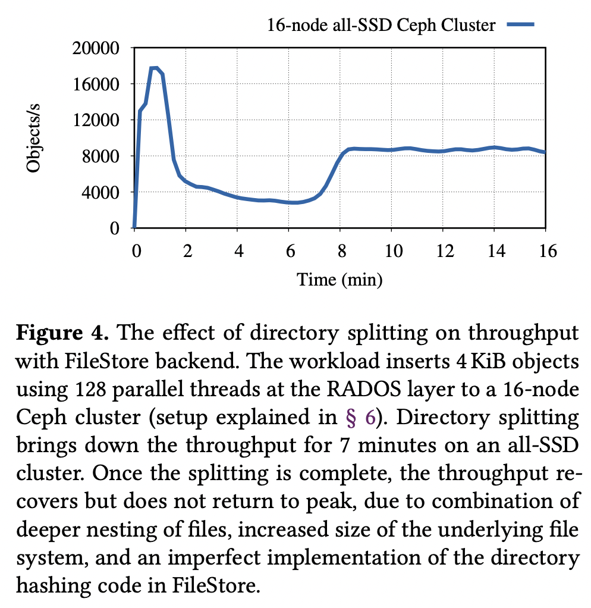

### 3.3 Challenge 3: Support For New Storage Hardware

新的硬件设备，例如基于SMR技术的磁盘，可以采用两种驱动方式运行：drive-managed SMR驱动拥有兼容性但性能不稳定，而host-managed SMR驱动不具有兼容性但性能更为稳定和出色
**host-managed SMR**驱动将磁盘分为256MiB的regions进行管理，一个region必须顺序写入，这种接口非常适合log-structured, copy-on-write的设计方案，但与传统的成熟本地文件系统的in-place overwrite设计完全违背
数据中心采用的SSDs也有类似的变革，例如OpenChannel SSDs移除了FTL，从而可以直接操作裸闪存块，并相应的有一个全新的NVMe标准**Zoned Namespaces, ZNS SSDs**

host-managed SMR驱动和ZNS SSDs都能显著提升性能但都无法兼容传统的接口，因此成熟的本地文件系统需要做出大量的修改才能支持这些新的硬件设备，这也会拖累基于本地文件系统的分布式文件系统

### 3.4 Other Challenges

非常多云服务厂商依赖分布式存储系统例如Ceph来提供存储服务，而如果分布式存储系统无法完全控制整个I/O栈，就难以满足**存储的延迟目标Service-Level Objectives, SLOs**

其中一个原因就在于基于本地文件系统的存储后端无法控制**OS页缓存**继而无法预测延迟，通常OS页缓存采用了回写策略，即脏页会在空闲系统下周期性写入磁盘并同步数据，但在忙碌系统下则会有**复杂的回写触发机制，导致延迟非常不可控**

## 4 BlueStore: A Clean-Slate Approach

BlueStore是全新设计的存储后端，用来解决采用本地文件系统面临的问题，其主要目标包括：

1. Fast metadata operations
2. No consistency overhead for object writes
3. Copy-on-write clone operation
4. No journaling double-writes
5. Optimized I/O patterns for HDD and SSD

BlueStore的目标并不是通用的文件存储系统（即**不支持POSIX I/O标准**），而是轻量化小型的特定目标的用户态存储后端，并且充分利用了高性能的第三方开源组件以及对I/O栈的完全控制，从而可以提供额外的特性

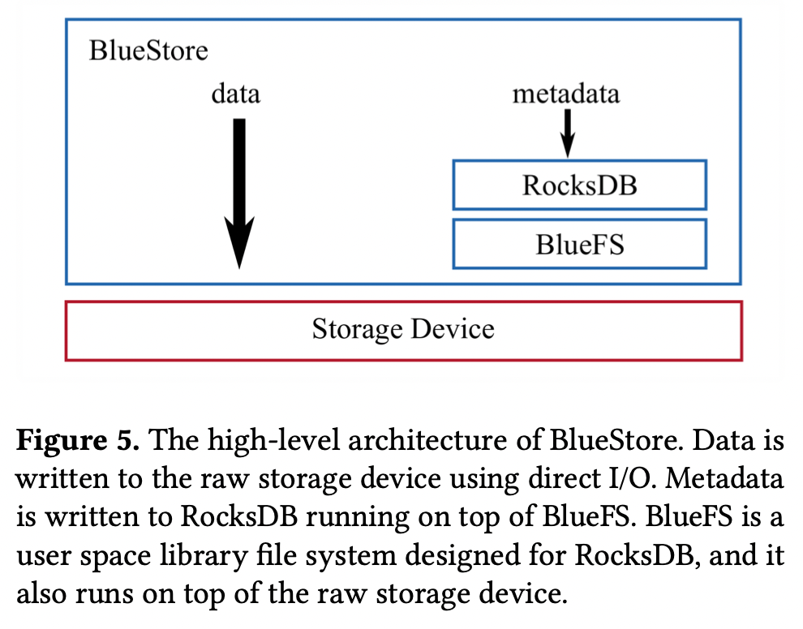

### 4.1 BlueFS and RocksDB

BlueStore通过将**metadata存储在RocksDB**来实现高效元数据操作，同时通过将数据直接写入裸磁盘（一次缓存刷写raw data）以及让RocksDB重用WAL文件作为环形缓冲（一次缓存刷写metadata）来减少数据一致性的开销（NewStore中一次数据写入需要[四次缓存刷写](#313-using-a-key-value-store-as-the-wal)）

**RocksDB本身运行在专门设计的最小化文件系统BlueFS上**，BlueFS实现了RocksDB所需要的文件系统接口，相当于是RocksDB的`Env`接口的用户态实现，BlueFS的基本架构如下图：

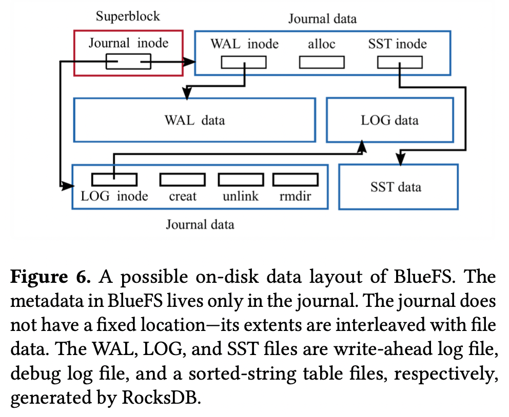

BlueStore在RocksDB中管理多个namespaces，每一个namespace存储一种元数据类型，例如对象信息object information存储在`O` namespace中，块分配信息block allocation metadata存储在`B` namespace中，集合元信息collection metadata存储在`C` namespace中

为了平衡OSDs的数据，通常对对象集合需要进行重平衡，原先是通过[对目录重命名](#32-challenge-2-fast-metadata-operations)来实现，代价高且低效

采用RocksDB后每个集合collection（映射到一个PG并且代表了一个pool shard的namespace）的名字包含了pool标识符和该组对象共有的前缀，例如`C12.e4-6`代表该集合位于pool 12并且对象散列值前缀是`e4 = 11100100`的前`6`位`111001`，`O12.e532`（`e532 = 111001 0100110010`）就是该集合中的一个对象，而`O12.e832`（`e832 = 111010 0000110010`）就不属于该集合

BlueStore采用这种命名方式就可以通过简单**修改前缀匹配的位数来直接进行对象重新平衡**而不需要修改每个对象的命名，性能远高于FileStore需要重命名目录实现目录分割

### 4.2 Data Path and Space Allocation

BlueStore采用写时复制Copy-On-Write策略

对**大小超过最小分配尺寸**minimum allocation size（HDD-64Kib, SSD-16KiB）的写入请求，数据首先写入新分配的extent，持久化后相应的元数据再写入RocksDB，这种方式允许BlueStore实现**高效的clone操作**：当clone时只需要增加新数据依赖的extent的引用计数，新数据直接写入到新的extent，同时避免了journal的double-writes

对**大小小于最小分配尺寸**的写入请求，数据本身和相应的元数据都首先直接写入到RocksDB，随后当事务提交时数据再被异步写入到磁盘上（**延迟写入defered write**），这种策略可以将多次小数据写入合并成一次批量写入磁盘提高吞吐量降低延迟，并且可以根据底层设备差异SSD/HDD进一步优化写入方式

- **空间分配 Space Allocation**
  BlueStore采用FreeList manager和Allocator来实现空间分配，前者负责代表当前在使用的磁盘的空闲部分，并且也会被保存在RocksDB中持久化，后者负责为新数据分配空间并在内存中持有一份free list的副本
- **缓存 Cache**
  BlueStore是在用户态实现的存储后端，并且通过direct I/O直接与磁盘交互，因此无法使用操作系统的页缓存，从而需要自身实现一个**直写式write-through**（直写式即数据写入在缓存和存储中同步生效，回写式即数据写入仅在缓存生效并且缓存被替换时才写入存储）缓存，缓存采用了scan resistant 2Q算法并且于Ceph OSDs一样分区来提升并发性能

## 5 Features Enabled by BlueStore

### 5.1 Space-Efficient Checksums

硬件设备并不可靠，因此对于支持PB级别存储的分布式存储系统例如Ceph需要频繁校验元数据和数据的一致性确保数据都被准确完整的存储在磁盘上，因此引入了**校验和checksum**

BlueStore对每一次写入都会计算校验和，并且每一次读取都会通过校验和来验证，默认采用`crc32c`算法，由于能够完全控制I/O栈，BlueStore可以**基于I/O模式来选择校验和数据块的大小，从而避免为了存储校验和本身就占用了太多空间资源**，例如如果写入操作来自于兼容S3的RGW服务，则对象就是只读的read-only，可以采用较大的128KiB数据块计算校验和，如果对象会被压缩后存储，则校验和可以在压缩后再进行计算，显著降低了校验和的数据量

### 5.2 Overwrite of Erasure-Coded Data

Ceph早在FileStore中就支持了纠删码，即**erasure-coded pools**来进行容错，但是仅在append/deletion中支持，overwrite的纠删码计算非常缓慢以至于引起系统的不稳定，因此对于需要支持overwrite的RBD和CephFS就只能使用**replicated pools**进行容错

Ceph基于BlueStore通过**2PC协议**来支持overwrite的纠删码支持，所有存储了EC对象的OSDs首先复制一份需要overwrite的chunk数据（原始chunk保存用于宕机时恢复状态），随后每个OSDs都完成了数据更新后，原始chunk就会被丢弃（即2PC完成commit）

在基于XFS的FileStore上，复制一份需要overwrite的chunk数据非常昂贵，因为XFS不支持高效的Copy-On-Write机制而需要物理复制数据，而**BlueStore则避免了物理复制数据**

### 5.3 Transparent Compression

通常存储PB级别数据的分布式数据都必须采用压缩格式，原始数据的数据量尤其结合了多副本容错会带来高昂的存储空间成本，BlueStore在存储数据时会直接进行压缩，透明化压缩的过程

对于部分chunk更新的情况（类似纠删码的overwrite支持）BlueStore将chunk数据更新并压缩后存储到新的位置，而元数据也会相应更新指向新的chunk数据，当更新次数过多导致对象**碎片化严重时就会进行对象compaction**，重新读出所有数据并一次性存储并压缩完成对象压实compact

实践中BlueStore额外引入了启发式的算法来基于访问模式对不太可能经历多次overwrite的对象进行compaction

### 5.4 Exploring New Interfaces

BlueStore不再受限于本地文件系统的接口限制，可以充分挖掘最新硬件的特性，例如原生支持SMR HDDs、ZNS SSDs或是NVMe设备，Ceph也正在探索下一代存储后端（基于Seastar的[SeaStore](https://docs.ceph.com/en/latest/dev/seastore/#seastore)？）

## 6 Evaluation

所有测试都在16节点的Ceph集群中执行，集群间通过40GbE交换机连接，每个节点配置如下：

- CPU: 16-core Intel E5 Xeon @ 2GHz
- RAM: 64GiB
- SSD: 400GB Intel P3600 NVMe SSD
- HDD: 4TB 7200RPM Seagate HDD
- NET: Mellanox 40GbE NIC

### 6.1 Bare RADOS Benchmarks

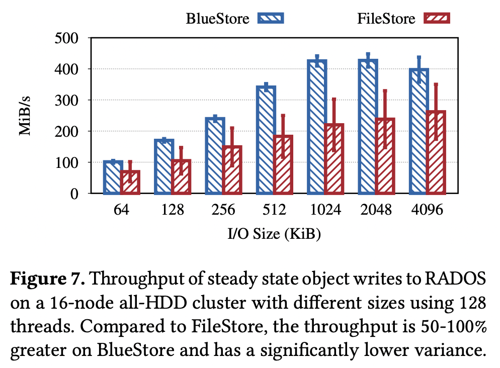

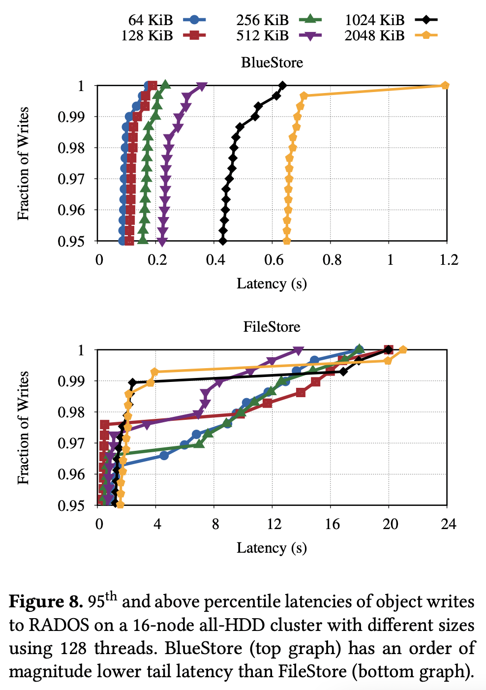

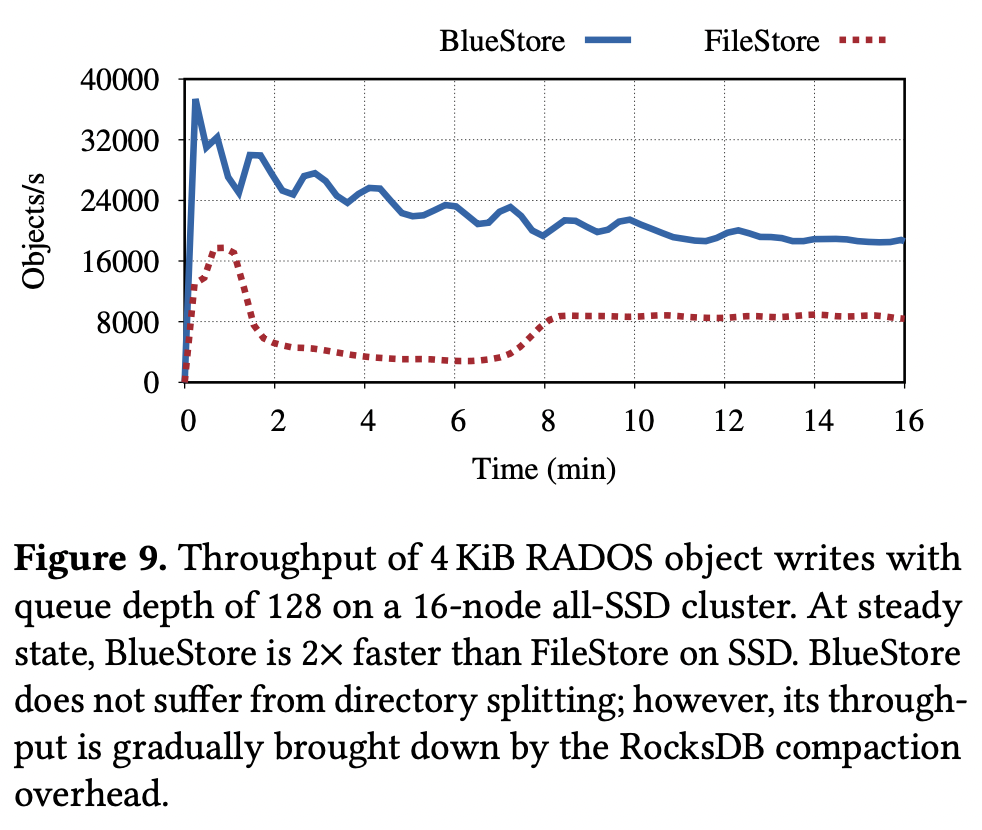

### 6.2 RADOS Block Device Benchmarks

RADOS Block Device, RBD是基于RADOS的虚拟化块设备，写入RBD的数据都会被分割为4 MiB的RADOS对象并并行写入多个OSDs

测试时创建1TB的虚拟块设备，基于XFS格式化后采用`fio`来测试I/O性能：

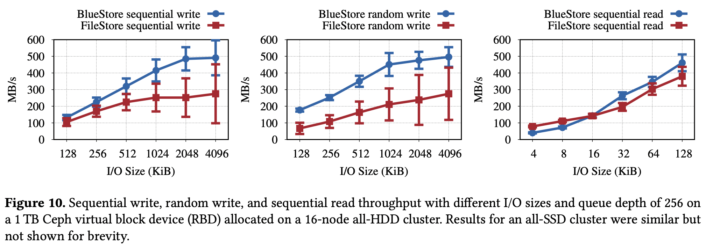

可以看出由于FileStore随时可能触发的写回writeback，导致性能波动非常大

### 6.3 Overwriting Erasure-Coded Data

k代表原始数据副本数，也可以代表恢复数据所需要的副本数；m代表校验数据副本数，也可以代表容错允许出错的副本数；即k+m副本可以容纳m个副本出错

- **Rep**: replicated pools
- **EC 4-2**: erasure-coded pool with k=4, m=2
- **EC 5-1**: erasure-coded pool with k=5, m=1

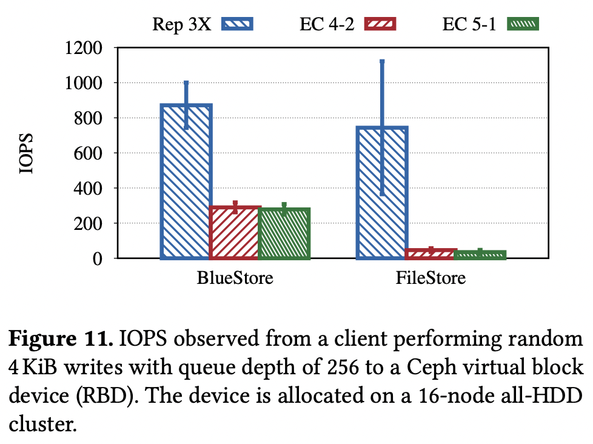

## 7 Challenges of Building Efficient Storage Backends on Raw Storage

### 7.1 Cache Sizing and Writeback

操作系统会根据内存情况动态增减页缓存的空间，并且采用写回的策略处理脏页，而基于本地文件系统的存储后端也自然可以享受到操作系统缓存的优点

用户态实现并直接操作裸磁盘的存储后端就必须实现类似的缓存策略，而BlueStore通过配置文件固定了缓存的大小，不允许动态修改缓存空间

**用户空间动态自适应的缓存系统**至今依然是一个开放问题，PostgreSQL、RocksDB等数据库系统也同样面临这个问题

### 7.2 Key-value Store Efficiency

将所有元数据操作都移入键值存储系统例如RocksDB显著提升了操作性能，但是同样面临了诸多问题：

1. RocksDB的**compaction**和超高的写放大**wirte amplification**成为了在NVMe SSDs上制约OSDs性能的主要瓶颈
2. RocksDB本身作为**黑箱**使用，内部有着大量Ceph也许并不需要的机制在消耗性能
3. RocksDB本身的**线程模型**限制了任意sharding的能力

这些问题促使着Ceph继续寻找其他更好的存储后端解决方案

### 7.3 CPU and Memory Efficiency

现代处理器为了优化性能，都会进行**数据类型和数据结构的对齐及padding**，而对于复杂结构体可能会出现显著的内存浪费

常规应用程序的数据结构往往生命周期较短，而Ceph完全控制内存、绕过操作系统缓存、长时间运行使得这种内存浪费非常致命，因此Ceph团队耗费了大量精力在手动设计、打包数据结构，例如delta and variable-integer encoding

另一方面观测到随着存储设备的发展，**NVMe SSDs下CPU越来越成为了性能的瓶颈**，设备的读写IOPS和带宽往往不会被充分利用，可以参考[KVell的结论](2019_SOSP_KVell.md)，因此Ceph也希望下一代存储后端能够降低CPU的开销，例如采用[Seastar框架以及shared-nothing设计思路](https://github.com/JasonYuchen/notes/blob/master/seastar/Introduction.md)

## 8 SeaStore

从此处开始不再是原论文中的内容，而是对Ceph下一代存储后端SeaStore的额外补充

`TODO: 了解SeaStore和Seastar`
