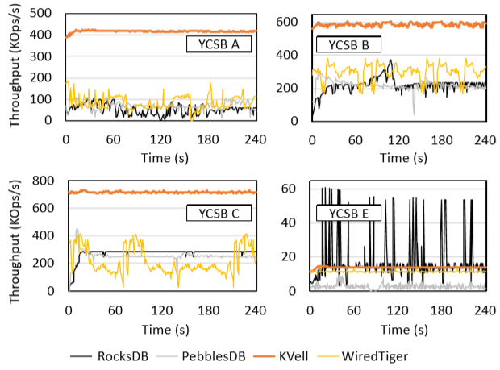

# [SOSP 2019] KVell: the Design and Implementation of a Fast Persistent Key-Value Store

## SSD性能的演进 Evolution of SSD Performance

- 硬件 hardware
    KVell的测试中使用了三类硬件：
  - SSD (Intel DC S3500, 2013)
  - Amazon-8NVMe (Unknown, 2016)
  - Optane (Intel Optane 905P, 2018)

- IOPS

|Disk|Read IOPS(1,000s)|Writes IOPS(1,000s)|Mix50%r-50%w IOPS(1,000s)|Seq. Read(GB/s)|Rand. Read(GB/s)|Seq. Write(GB/s)|Rand. Write(GB/s)|Mix rand. rw(GB/s)
|:-:|:-:|:-:|:-:|:-:|:-:|:-:|:-:|:-:|
|SSD| 75| 11| 63| 0.5| 0.3| 0.4| 0.04| 0.2|
|Amazon-8NVMe| 412| 180| 175| 1.9| 1.6| 0.8| 0.7| 0.7|
|Optane| 575| 550| 560| 2.6| 2.3| 2.0| 2.0| 2.0|

可见新设备上**随机访问和顺序访问的差距越来越小，IOPS的提升非常显著**

- 延迟和带宽 Latency and bandwidth

|Queuedepth|SSD lat. (us)|SSD bw. (MB/s)|Amazon-8NVMe lat. (us)|Amazon-8NVMe bw. (MB/s)|Optane lat. (us)|Optane bw. (MB/s)|
|:-:|:-:|:-:|:-:|:-:|:-:|:-:|
|1 |65 |59| 33| 102 |11 |370 |
|16| 380| 180| 80| 453| 34| 1099|
|32| 760| 195| 192| 618| 68| 1230|
|64| 1500| 204| 385| 671| 137| 1507|
|256| 6000| 210 |770| 672| 550| 1585|
|512| 12000| 211| 1500| 642| 1100| 1622|

合理的队列深度需要综合考虑延迟和吞吐量，在延迟可以接受的情况下尽可能达到更大的吞吐量

- 吞吐量劣化 Throughput degradation

早期SSD的IOPS随时间逐渐劣化，而现代设备的IOPS非常稳定，基本不随运行时间而变化，且IOPS远高于以往设备

- 延迟毛刺 Latency spikes

新设备的延迟更加稳定，且毛刺更少

## 当下KV在NVMe SSD上的问题

### 1. CPU成为了瓶颈

当前有两种主流的KV设计：

- LSM-Tree：主要是为了写为主write-dominated的负载
- B-Tree：主要是为了读为主read-intensive的负载

如下图的测试结果，当采用了YCSB A(50%write-50%read, uniform, 1KB)测试时，LSM和B树的设计下，CPU均成为了系统吞吐量的瓶颈

1. 在LSM-Tree中，CPU成为了瓶颈
   - 为了优化写入，所有的写入会首先写入WAL（sequential写入）以及内存中的buffer，每当buffer充满时，就会直接持久化到磁盘上成为第一层；
   - 磁盘上的第二层及以上每层包含多个有序的文件包含不重叠范围的key及对应的value，后台线程通过compaction操作从第一层向上进行逐层合并（sequential读取，CPU合并去重，sequential写回），保持文件有序和合并重复key的value；
   - **旧存储设备sequential read/write远快于random read/write，因此设计上充分sequential，在内存中做sort，merge，index转换random为sequential**
   - 在旧存储设备上，由于带宽有限，compaction操作更有可能成为瓶颈，而在新存储设备上由于sequential和random差距较小，反而由于sorting，merging，indexing等操作使得CPU更容易成为系统吞吐的瓶颈
2. 在B-Tree中，CPU成为了瓶颈
   - SOTA B+树例如WiredTiger充分利用caching来提升性能，updates会首先写入per-thread的commit logs中和cache中，最终tree中的实际数据会在数据被缓存汰换evicted时进行更新；
   - updates需要使用单调递增的sequence number来确保顺序，从而可以用于扫描
   - WiredTiger通过**checkpoint**和**eviction**对数据进行持久化，每当commit logs达到一定大小就进行checkpoint，而eviction则是在数据汰换时进行，即cache容量不足
   - B树从设计上就可能会导致同步开销synchronization overheads过大，例如updates负载重时多个线程争抢sequence number导致性能大幅下降

在现代NVMe设备上，避免共享避免同步开销从而**充分利用CPU的每一个cycle**可以显著提升系统性能，例如[Seastar](https://github.com/scylladb/seastar)

### 2. LSM和B-Tree KV中性能波动明显

从性能表现中可以看出，LSM和B-Tree都会出现周期性的性能波动，在LSM中定期出现的compaction导致write stall，在B-Tree中也会由于cache不足需要eviction导致stall

## KVell设计原则

1. **无共享 Share nothing**
    每个thread都负责key的一部分，互不重叠，从而所有用户请求完全不共享数据结构，不需要与任何线程进行同步，这需要维护：
    - **内存B树作为索引**，维护每个key的值直接对应持久设备上的位置
    - **I/O队列**，高效和持久化设备进行交互
    - **free链表**，部分在内存中的链表，保存着需要释放的spots
    - **页缓存**，KVell自己维护缓存，绕过OS级的页缓存

    整个设计中**只有扫描需要引入对B树索引的锁同步**（由于各个thread只负责一部分key，因此单key读写并不会锁定整个B树）

2. **不在磁盘上排序，在内存中保存索引 Do not sort on disk, but keep indexes in memory**
    通过在内存中维护索引，直接保存持久化设备上数据的最终位置，避免了引入排序等操作耗费CPU资源，而顺序扫描在内存中通过B树获取每个数据的磁盘位置（由于未排序，所扫描的一批数据位置并不连续）会引入随机读写（而在新设备上随机读写与顺序读写差距极小）

3. **减少系统调用，不为了顺序I/O Aim for fewer syscalls, not for sequential I/O**
    由于meltdown/spectre漏洞的修复，syscall的成本非常高，因此与LSM/B-Tree一样，KVell也通过批量化I/O请求来减少syscall的次数（但batching会导致latency升高，需要权衡），同时即使在少数key上访问激烈（即热点hot spot），每个worker在处理时也通过page cache充分减少了冗余的I/O

4. **没有提交日志 No commit log**
    KVell的update只依赖直接写入存储设备最终位置，而不依赖一个提交日志的确认（如果需要引入跨key的事务，是否还是需要log？）

## KVell实现

[KVell in git](https://github.com/BLepers/KVell)

1. client操作接口 Client operations interface
2. 磁盘数据结构 On-disk data structures
3. 内存数据结构 In-memory data structures
4. 高效I/O Efficiently performing I/O
5. client操作实现 Client operation implementation
6. 故障模型和恢复 Failure model and recovery

## 评估

使用YCSB测试基于Optane的KVell以及其他常见的KV数据库：

以及在Optane上测试YCSB A时，KVell充分使用了IO带宽，且CPU的占用率较低：

| Latency | KVell | RocksDB | PebblesDB | WiredTiger |
|:--:|:--:|:--:|:--:|:--:|
|99p|2.4ms|5.4ms|2.8ms|4.7ms|
|Max|3.9ms|9.6s|9.4s|3s|
