# [VLDB 2019] LSM-based Storage Techniques: A Survey

## 1 Introduction

Log-Structured Merge-tree, LSM-tree已经在绝大多数现代NoSQL系统中作为底层存储引擎所使用，例如BigTable、Dynamo、HBase、Cassandra、LevelDB、RocksDB等，并且在实时数据处理、图数据处理、流数据处理、OLTP等领域被广泛使用

这篇论文作为一篇综述，主要是总结了LSM-tree本身的特性、学术界和工业界基于LSM-tree的各种修改和提升，以及这些修改本身的权衡与利弊

## 2 LSM-tree Basics

### 2.1 History of LSM-trees

索引通常有两种更新策略，**原地更新 in-place updates**或者是**非原地更新 out-of-place updates**

- **in-place**：典型结构就是B+树，在更新时直接覆盖原先的数据，这种设计往往**对读请求更为友好**，读到的数据一定是最近更新的新数据，而**对写请求就不友好**，写数据时需要寻找到修改的数据点，这个过程引入了**随机I/O**，并且在更新和删除的过程中会导致碎片化，降低了空间利用率
- **out-of-place**：典型结构就是LSM树，所有更新都会被暂存在新的位置而不是直接覆盖旧的数据，从而写数据的过程是**顺序I/O**，**对写请求更为友好**，并且过程中并不会直接覆盖旧的数据因此也有利于简化故障恢复recovery的过程，但是**对读请求就不友好**，读到最新数据的过程更为冗长不像in-place可以直接读到最新数据，另一方面由于写入的数据可能存储在多个位置造成空间浪费，因此往往需要有后台清理服务持续**压紧数据compaction**

在LSM树之前的log-structured storage面临一个严重的问题：所有数据都追加到日志的末尾导致了查询性能低下，因为相关的记录互相分散存储在日志的不同位置不利于快速查询最新结果，同时这也导致了空间浪费

LSM树通过设计了一个**合并过程merge process**来解决上述问题，其特点与发展如下：

- 原始LSM树包含了一系列组成部分`C0, C1, ... Ck`，每一个部分都是B+树，`C0`存储中内存中并服务写请求，其余所有`C1, ... Ck`均存放在磁盘上
- 当任意`Ci`满时就会触发滚动合并过程，将`Ci`的一部分叶节点移动合并给`Ci+1`，也被称为**leveling merge policy**（由于实现的复杂性，这种合并设计并未被广泛使用）
- 在稳定的工作负载下，当level的数量固定时，**写性能在所有相邻的组成部分其大小比例相等时`Ti=|Ci+1|/|Ci|`达到最佳**（这影响了所有后续LSM树的设计与实现）
- 与原始LSM树同时期有另一种合并策略**stepped-merge policy**，其设计为一个LSM树由多个层构成，每一层`L`都由`T`个组成部分，当该层`L`充满时，相应的所有`T`个组成部分一起被合并为单个组成部分并作为`L+1`层的一个组成部分，也被称为**tiering merge policy**（被广泛使用在现在的LSM树实现中）

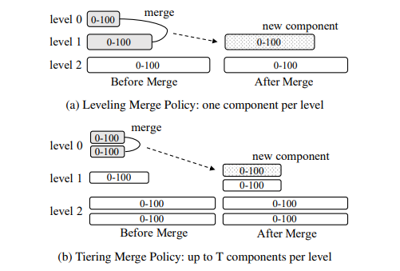

### 2.2 Today's LSM-trees

#### 2.2.1 Basic Structure

现在的LSM树设计基本上沿袭了原始LSM树的核心设计，并且所有磁盘上的**组成部分都是不可变的immutability**，当需要合并时直接读取被合并的组成部分并生成新的组成部分，从而并发控制和故障恢复更为简单

一个LSM树的组成部分可以采用任何索引结构，现在的LSM树通常会采用利于并发的数据结构例如**跳表skip-list或是B+树作为内存中的组成部分**，而采用**B+树或有sorted-string table, SSTables作为磁盘上的组成部分**，一个SSTable包含一系列数据块以及一个索引块，数据块存储根据key排序后的key-value对，而索引块存储所有数据块的key范围，[具体见此](https://github.com/JasonYuchen/notes/blob/master/ddia/03.Storage_and_Retrieval.md#2-sorted-string-table-sstable%E5%92%8Clog-structured-merge-trees-lsm-trees)

一个点查询请求需要依次搜索多个LSM树的组成部分来**确定数据的最新值即reconciliation**，通常从内存的组成部分开始逐个遍历，**一旦找到key就是最新的值**，但是没有找到就需要一直遍历直到所有组成部分才能最终确定这个key是否存在以及对应的value的最新值，对于**范围查询则是同时遍历所有组成部分**并且将满足范围的结果加入到结果集中

随着正常运行，磁盘上的组成部分会越来越多，此时需要通过前文描述的合并过程进行合并组成部分、仅保留key的较新值、剔除被标记删除的值，如上图所示，最优的情况就是每一层之间的尺寸比例为`T`，因此在**leveling merge policy下每一层只有单个组成部分**，并且这个组成部分的尺寸是上一层的`T`倍大小，当尺寸达到上一层的`T`倍时该层才会被放入下一层；而在**tiering merge policy下每一层都有至多`T`个组成部分**，当任意层达到`T`时就会全部被合并为一个组成部分并放在下一层中

对于leveling merge policy而言，由于每一层只有一个组成部分，因此**对读请求相对友好，每一层只需查询一个组成部分**，例如LevelDB和RocksDB；对于tiering merge policy而言，由于每一层可以有更多的组成部分，因此**对写请求更加友好，多个组成部分减少了合并的频率**，例如Cassandra

#### 2.2.2 Well-Known Optimizations

在现在大多数LSM树实现中都采用了以下两大优化措施：

- **布隆过滤器 Bloom Filter**
  当插入新key时，key被散列多次映射到位向量的多个不同位置，这些位置被置1；当判断一个key是否存在时就通过相同的方式判断位向量的多个不同位置是否为1，只要有1个位置是0就说明不存在，如果所有位置都是1就说明**可能存在**，需要考虑到散列冲突的情况，因此布隆过滤器是一个概率查询结构，可能存在假阳性，但一定不存在假阴性

  **对磁盘上的LSM树组成部分构建内存中的布隆过滤器**，从而当一定不存在时就可以避免读取磁盘数据，显著提升查询速度，当可能存在时才读取磁盘上的B+树索引进而精确判定组成部分中是否有这个key

  另一种措施是**只对组成部分的B+树索引叶结点构建布隆过滤器**，此时依然需要首先通过B+树索引非叶节点部分（通常这种方式往往认为非叶节点部分足够小完全可以放置在内存中）来确定叶节点，随后先读取布隆过滤器来确定叶节点中是否有可能存在需要的数据而不是真正去读取叶节点数据

  布隆过滤器的假阳性概率为 $(1-e^{-kn/m})^k$，其中 $k$ 为散列函数的数量， $n$ 为key的数量， $m$ 为位向量的长度，假阳性率最低时 $k=(m/n)ln2$ ，**实践中通常直接采用`10 bits/key`从而获得约1%的假阳性率**
- **分区 Partitioning**
  单个磁盘组成部分较大时会有诸多性能劣化的可能性，采用**范围分区**的方式将组成部分分割为多个较小的分区，为了便于理解**每个分区称为一个SSTable**，将一个较大的组成部分分为多个小的SSTable后，**有利于合并操作时粒度更细**，即单次处理较小的数据量、产生较小的中间结果、处理时间较短，另一方面也**有利于分割处理数据的范围减少重叠**，只需要合并key范围存在重叠的SSTable

  **分区的优化手段可以与合并策略组合使用**，例如leveling + partitioning或tiering + partitioning如下图，实际实现中例如LevelDB和RocksDB完全实现了leveling + partitioning

  图4中可以看出**level 0的组成部分并没有分区**，这些内存组成部分是直接刷写到磁盘上的，当需要将SSTable从`L`层合并到`L+1`层时所有`L+1`层中与该SSTable存在key范围重叠的SSTables一起参与合并，如图中的`0-15`和`16-32`需要与`0-30`合并，并且合并后原先的`0-30`就会被垃圾回收，**由于触发合并时任意一个`L`层的SSTable都可以被选择，因此可以有不同的选择算法**，LevelDB采用简单的round-robin策略来减小总的写入成本

  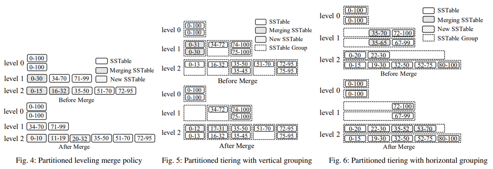

  tiering merge policy同样可以使用分区，但是问题在于**tiering下一层可以有多个组成部分并且其key范围存在重叠**，从而当分区后可能导致多个存在重叠范围的SSTables，而leveling merge polcy中每一层只有一个组成部分可以简单分区成互不重叠的SSTables，此时如上图中的设计可以引入**垂直分组vertical grouping**或**水平分组horizontal grouping**对SSTables进行管理以确保正确的合并

  **分区情况下的合并可能产生多个新的SSTables**，这是因为**合并后需要适配下一层已有组的key范围**，具体过程如下：
  - **垂直分组**中每个组内的SSTables都存在重叠，而组之间则不存在重叠，从而**触发合并时以组为单位**，合并某一组内的所有SSTables来产生下一层新的SSTable并插入对应的组中，例如上图中垂直分组情况下`0-31`和`0-30`合并后（根据下一层的分组情况`0-13`和`17-31`）实际产生了`0-12`和`17-31`两个子SSTables，分别加入下一层key范围不重叠的组
  - **水平分组**内每个SSTables之间都不存在重叠，因此一个组成部分进行逻辑分区后就可以直接作为一个组，每一层的多个组成部分作为多个组，只有一个作为**活跃组**并接收上一层合并产生的新SSTables，当合并时需要选择所有组的key重叠部分进行合并，产生的新SSTables就加入下一层的活跃组，例如上图中水平分组情况下`35-70`和`35-65`合并后（适配下一层已有分组中的`32-50`和`52-75`）实际产生了`35-52`和`53-70`两个子SSTables，但水平分组的情况下两者一起加入下一层活跃组

#### 2.2.3 Concurrency Control and Recovery

LSM树的并发支持通常采用**锁机制locking scheme**或是**多版本机制multi-version scheme**来实现，由于LSM树本身会保存key的多个版本并且其合并操作会丢弃过时的数据，因此很自然的可以支持多版本并发控制，但是LSM树特有的**合并操作会对元数据做出修改**，因此必须被同步，通常可以对**每个组成部分维护一个引用计数**，在访问LSM树前，首先获得**当前所有活跃组成部分的快照**，并增加其引用计数从而保证使用中的组成部分不会因为合并而被垃圾回收

由于所有写入首先都追加到内存中，使用WAL就可以保证写入数据的持久可靠，**通常的LSM树会采用[no-steal](https://github.com/JasonYuchen/notes/blob/master/cmu15.445/20.Logging.md#%E7%BC%93%E5%AD%98%E6%B1%A0%E7%AD%96%E7%95%A5-buffer-pool-policies)的缓存管理策略**，内存中的组成部分只有在所有活跃的写入事务结束时才会被刷写到磁盘上，在**恢复时因为no-steal的策略从而只需要redo所有成功的事务即可，不需要undo未完成的事务**，因为这些事务并没有刷写到磁盘上；另外需要确保活跃组成部分的列表也能够被恢复，在LevelDB和RocksDB中这通过**额外维护一个元数据日志metadata log来记录所有结构上的修改**，例如SSTables的增减

### 2.3 Cost Analysis

采用一次操作会引入的磁盘I/O数量作为代价分析非分区形式LSM树的基本操作如写入、点查询、范围查询以及空间放大，给定如下参数：

- LSM树拥有层数 $L$
- 层间size比例为 $T$，并且插入操作和删除操作的数据量相同即层数 $L$ 稳定
- 数据页能存放的entries数量为 $B$
- 内存中组成部分的数据页数量为 $P$，从而内存中的组成部分至多存放记录数量为 $B \times P$
- 任意 $i$ 层的组成部分最多存放记录数量 $T^{i+1} \cdot B \cdot P$
- 假定总共有 $N$ 条记录则最大的层持有记录约 $N \cdot \frac{T}{T+1})$，并且总共的层数约为 $L = \lceil \log_T(\frac{N}{B \cdot P} \cdot \frac{T}{T+1}) \rceil$

不同操作的（最坏情况）代价分析如下：

- **写入代价**
  也称为**写入放大write amplification**，指平均每次插入一条记录最终需要的I/O次数（这条记录被**最终合并到最大的level时的I/O次数**），对leveling策略来说，每一层需要合并 $T-1$ 次直到该层达到最大体积才能被移动至下一层，从而其最终代价为 $O(T \cdot \frac{L}{B})$ （注意$B$是每一个数据页能存放的记录数量，而磁盘一次I/O操作一个数据页，从而平均每次I/O操作$B$条记录）；对tiering策略来说，每一层可以有多个组成部分并且仅需一次合并就被移动至下一层，从而其最终代价为 $O(\frac{L}{B})$
- **点读取代价**
  在没有bloom filter的情况下，一次点查询就需要遍历所有组成部分，因此其代价对leveling策略为 $O(L)$，而对tiering策略为 $O(T \cdot L)$

  在有bloom filter的情况下，读取的性能被大大改善，因为当key不存在时只有bloom filter假阳性才会触发磁盘I/O，假定bloom filter有M位向量，且所有组成部分的假阳性率相等均为 $O(e^{- \frac{M}{N}})$ ，则对于不存在key的查询代价对leveling策略为 $O(L \cdot e^{- \frac{M}{N}})$，对tiering策略为 $O(T \cdot L \cdot e^{- \frac{M}{N}})$，另外对于存在的key的查询至少需要一次I/O读取数据，由于假阳性率远小于1，因此综合来看对key存在的查询两种策略下查询代价均为 $O(1)$
- **范围读取代价**
  范围查询的I/O代价取决于查询本身的**选择性selectivity**，假定一次范围查询最终会获得 $s$ 条记录，则称 $\frac{s}{B} > 2$ 的查询为**长查询long query**，反之为**短查询short query**，显然长查询会涉及更多的记录，往往需要查询到最大的层，则其查询代价就由最大的层确定，而短查询通常只需要涉及到单个磁盘数据页，则对每个组成部分都发起一次磁盘I/O，从而长查询在leveling策略下的代价为 $O(\frac{s}{B})$ 而在tiering策略下的代价为 $O(T \cdot \frac{s}{B})$；短查询在leveling策略下的代价为 $O(L)$ 而在tiering策略下的代价为 $O(T \cdot L)$
- **空间放大**
  空间放大主要是由于多次合并中同一个key可能保存有不同时期的数据，从而占用了额外的空间，假定空间放大定义为总记录数除以unique记录数
  
  对leveling策略来说，最坏情况就是前 $L-1$ 层（包含接近总体数据量的 $\frac{1}{T}$）均是对第 $L$ 层的数据更新，即第 $L$ 层完全是过时数据，此时空间放大率为 $O(\frac{T+1}{T})$；对tiering策略来说，最坏情况是最大的第 $L$ 层所有 $T$ 个组成部分均包含完全相同的keys，此时空间放大率就是 $O(T)$

|Operation|Leveling|Tiering|
|:-:|:-:|:-:|
|write|$O(T \cdot \frac{L}{B})$|$O(\frac{L}{B})$|
|point query|$O(L \cdot e^{- \frac{M}{N}})$ or $O(1)$ ($O(L)$ without bloom)|$O(T \cdot L \cdot e^{- \frac{M}{N}})$ or $O(1)$ ($O(T \cdot L)$ without bloom)|
|range query/long|$O(\frac{s}{B})$|$O(T \cdot \frac{s}{B})$|
|range query/short|$O(L)$|$O(T \cdot L)$|
|space|$O(\frac{T+1}{T})$|$O(T)$|

**体积比 $T$ 会对LSM树的性能产生显著影响**，并且对leveling和tiering的策略影响不同：

- leveling策略下每层只有一个组成部分
  - 查询性能更高
  - 空间利用率更高
  - 会导致频繁的合并操作，写入代价需要乘上 $T$
- tiering策略下每一层可以有 $T$ 个组成部分
  - 显著减少了合并操作的频率
  - 提升了写入的性能（**合并操作会导致写入暂停write stall**）
  - 牺牲了读取的性能，读取代价需要乘上 $T$
  - 空间利用率低，写入放大严重，空间代价额外乘上 $T$

可见有诸多方式来设计并调整LSM树的性能，这也服从**RUM猜想**，即数据结构的访问方式需要**在Read cost，Update cost，Memory/storage cost中权衡**

## 3 LSM-tree Improvements

### 3.1 A Taxonomy of LSM-tree Improvements

LSM树有诸多缺点，也是诸多研究希望改善的方面：

- **写放大 Write Amplification**：写放大导致了一条记录可能被反复多次写入实际设备，过度使用现代SSD存储设备，同时也限制了写入性能
- **合并操作 Merge Operations**：合并会导致缓存失效以及写暂停write stall
- **硬件 Hardware**：原始LSM树是针对HDD设计的，使用顺序写入代替随机写入，因为HDD顺序I/O性能远高于随机I/O性能，而现代更为广泛使用的SSD/NVM则拥有不同的I/O表现，通过针对不同的底层存储设备的特性可以修改LSM树的实现来充分挖掘硬件的性能
- **特殊负载 Special Workloads**：在特殊的工作负载下，LSM树的表现未必是最优的，通过利用特殊负载的性质来修改LSM树可以获得独特的更高性能
- **自动调优 Auto-Tuning**：由RUM猜想可知，不可能存在同时read-optimal、write-optimal、space-optimal的做法，因此LSM树应该根据需求调整参数以适应相应的访问方式，同时由于可调节的参数非常多，自适应调优是一种更好的方式
- **二级索引 Secondary Indexing**：LSM树只提供了针对key（索引）的操作，通常业务往往也需要能够高效处理non-key的属性，即需要二级索引

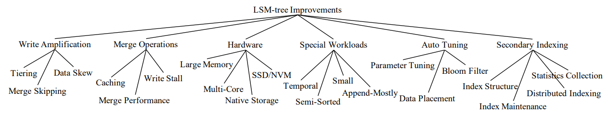

### 3.2 Reducing Write Amplification

#### 3.2.1 Tiering

由于leveling策略需要频繁的merge，从而拥有更高的写放大，因此简单直白的优化方式就是直接采用tiering策略，但也会引入查询性能劣化、空间利用率下降的问题，在采用tiering策略的基础上，很多研究进一步探索了一系列**基于partitioned tiering**的LSM树变种

- **WriteBuffer Tree, WB-tree**
  - **partitioned tiering with vertical grouping**
  - **hash-partitioning对工作负载进行负载均衡**：从而每个SSTable组持有相近的数据量，但同时由于hash失去了对范围查询的有效支持
  - **SSTable组被组织成B+树**：利用B+树实现自平衡self-balancing**来减少总共的LSM树层数，每个SSTable组都作为B+树中的一个节点，当非叶节点的组满时（达到 $T$ 个SSTables）该组发生合并并加入到子节点对应的SSTable组中；当叶节点的组满时，该组发生合并但合并成2个组，即一半数据（ $T/2$ 个SSTables）占一个新组，作为两个新的叶节点
- **Light-weight compaction tree, LWC-tree**
  - **partitioned tiering with vertical grouping**
  - **自平衡**：由于垂直分组中的SSTables不再是固定大小的，而是在发生合并时根据下一层的分组重叠的key范围进行重新确定的大小，因此LWC树中如果一个组包含了过多的记录数（数据倾斜），就会在**合并发生后主动缩小该组（合并结束后以及为空）的key范围并扩大相邻组的key范围**，从而后续的数据持续加入该组时分流到相邻组实现自平衡，减轻数据倾斜程度
- **PebblesDB**
  - **partitioned tiering with vertical grouping**
  - **基于guards来确定key范围**：在确定组的key范围时引入了skip-list中的guard概念，即通过**对插入数据采样分析分布的概率**，从而确定key的范围实现更为均衡的分区，一旦选定了一个guard就会在下一次合并时生效，即懒惰自平衡
  - **对SSTables并行访问提升范围查询性能**
- **dCompaction**
  - **virtual SSTables和virtual merge**：一次virtual merge产生的新SSTables实际上只是包含指向多个原SSTables位置的virtual SSTables，从而**减少/推迟物理合并**的发生来提升写入性能，但会降低读取性能
  - **virtual SSTable threshold**：由于virtual SSTable指向了多个原SSTables导致了查询性能的下降，因此引入threshold要求当合并所需的真实SSTables超过该值时必须触发物理合并，相当于限制virtual SSTable指涉的真实SSTables数量，当超过时就会触发真实的物理合并
  - **read triggered merge**：当查询过程中遇到了超过一定数量的虚拟SSTabels指涉真实SSTables，也可以触发物理合并
- **SifrDB**
  - **partitioned tiering with horizontal grouping**
  - **early-cleaning during merges**：合并发生时SifrDB增量激活新创建的SSTables并且停用旧的SSTables
  - **对SSTables并行访问提升查询性能**

#### 3.2.2 Merge Skipping

**skip-tree**中提出了一种合并策略来提升写入性能：通常一个记录从level 0逐级合并到level L中，如果中途可以**跳过某些level的合并**就可以减少写入次数/写入放大，从而实现更高的性能

如下图，当需要合并level L的SSTables并一直合并到level L+K时，**跳过中间的逐层合并，直接加入到level L+K的缓冲区中**，并在后续合并时参与到合并过程

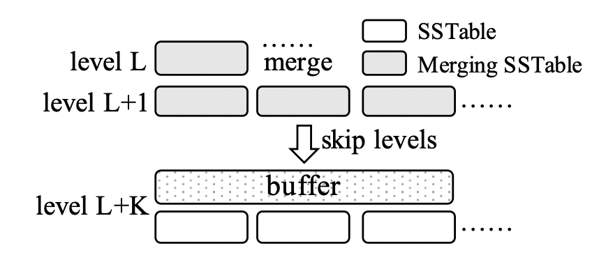

为了确保正确性，**能够被直接从level L下推到level L+K的keys不能出现在level L+1到level L+K-1中，这可以通过中间层的bloom filter快速判断**，并且写入level L+K缓冲区时会通过WAL来确保可靠

跳过部分合并过程来减小写放大虽然有效，但引入了复杂的缓冲区设计以及缓冲区的WAL，综合来看skip-tree未必能够显著超过调优后的LSM树

#### 3.2.3 Exploiting Data Skew

**TRIAD**提出了**冷热数据分离**的方式来减少写入放大：在有数据倾斜、部分key经常被更新的情况下，将冷热数据分离，热数据放置在内存组成部分中，只刷写冷数据到磁盘组成部分上，从而相当于内存缓存热数据

同时热数据虽然不会被刷写到磁盘上，但是TRIAD依然会周期性拷贝热数据的事务日志到新的日志中，从而允许旧日志可以被回收

另一方面TRIAD会延迟内存中level 0的合并直到有多个level 0 SSTables，从而一次性能够合并多个SSTables写入磁盘，**延迟合并提升合并数据量减少合并频率和写入放大**

TRIAD还会直接利用被废弃的旧事务日志文件作为一个磁盘组成部分，从而减少构建新的磁盘文件，通过对旧事务日志创建一个索引来加快访问

### 3.3 Optimizing Merge Operations

#### 3.3.1 Improving Merge Performance

**VT-tree**提出了一种合并时的**缝合stitching**操作来提升合并性能，具体来说当某个SSTable参与合并时，若相应的数据页所包含的key范围与其他需要合并的SSTables的所有数据页包含的key都不重合时，就直接在产生的新SSTables对应的位置指向此数据页而不发生读取和拷贝，这种方式在特定的工作负载下可以提升性能，但是缺点明显，主要是：

- 可能导致**碎片化fragmentation**，不同的数据页分散在磁盘上，VT-tree进一步引入了缝合阈值stitching threshold来避免碎片化过于严重
- 合并时跳过了读取这些页的数据，从而对于合并后新产生的SSTables就**无法构建bloom filter**，VT-tree进一步引入了quotient filters来避免访问原始keys

另外也有研究者提出了采用**流水线式的合并操作充分利用CPI和I/O的并行性**来提升合并性能，主要来自于合并操作的以下三个阶段：

1. 读阶段需要从输入的SSTables中读取数据页，此时是I/O密集的
2. 合并排序阶段需要将所有读取的数据页合并并排序产生新的数据页，此时是CPU密集的
3. 写阶段需要将新数据页写入到磁盘中，此时是I/O密集的

因此当page 1第一阶段完成进入第二阶段时，就可以开始page 2的第一阶段，而不必等到page 1完全结束，从而构建处理流水线如下图（实际的系统中如RocksDB已经**通过read-ahead和write-behind实现了某种形式的流水线**）：

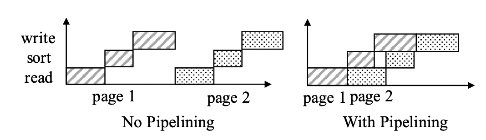

#### 3.3.2 Reducing Buffer Cache Misses

LSM树正常运行过程中，频繁被访问的SSTables数据会被缓存，而在一次合并后，旧SSTable被回收，新生成的SSTables尚未被缓存，从而导致大量缓存失效，影响系统的查询性能

有研究者提出**增量式的缓存新数据**，当需要完成较大的合并时，将输入的组成部分发送给远程服务器进行合并，原服务器继续正常响应，当合并完成时再增量式的预热新的数据，从而避免一次性直接启用新的SSTables导致大量缓存失效，这种方式也存在一些问题：

- 组成部分需要发送给远程服务器，带来了较大的**资源开销以及延迟**
- 增量式的预热也由于**数据竞争**等问题实际效果不佳

Log-Structured buffered Merge tree, **LSbM-tree**提出了暂缓删除被合并的旧SSTables的方式来减轻缓存未命中的问题，具体来说如下图，就是在level L的SSTables合并到level L+1时，**不立即删除旧的SSTables而是加入level L+1的缓冲区**，注意参与合并并且原先已经在level L+1的SSTables不需要加入缓冲区，因为这些SSTables也同样是由level L合并生成的，数据已经在此前就加入了缓冲区，所有**缓冲区的旧SSTables基于访问频率被逐渐删除回收**，这种方式的局限在于：

- 仅对工作负载倾斜的情况比较有效，此时少量key被高频访问，假如缓冲区可以有效避免缓存未命中
- 对于冷数据而言反而引入了查询负担

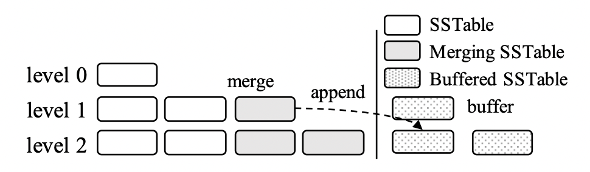

#### 3.3.3 Minimizing Write Stalls

相比于写入延迟稳定可控的B+树而言，LSM树的写入性能更高，但由于后台的flush和compaction服务而有**难以预见的延迟毛刺**

**bLSM**提出了一种**spring-and-gear合并调度器**来最小化写入暂停（仅针对unpartitioned leveling策略），其基本原理在于**容忍每一层存在一个额外的组成部分从而允许多个层进行并行合并**，并且合并调度器会确保只有在level L+1完成了合并操作后，level L才会合并产生level L+1的新组成部分，这种方式会级联向上（back pressure）最终反馈到内存组成部分的写入速度，这种方式的缺点有：

- 仅用于**unpartitioned leveling**策略的LSM数
- 只是限制了内存组成部分的最大写入延迟，而通常更影响性能的**排队延迟queuing latency却被忽略了**，因此最终用户侧的延迟依然有较大的不可控成分

### 3.4 Hardware Opportunities

#### 3.4.1 Large Memory

大内存允许更大的内存组成部分，减少整体层数，提升读写性能，但是管理大内存组成部分本身有一定挑战会带来新的问题，假如采用**堆内on-heap**数据结构，则可能导致运行中产生大量的小对象给垃圾回收带来显著的压力，假如采用**堆外off-heap**数据结构例如并发B+树，则依然会有较高的搜索成本以及写入数据时的CPU缓存未命中（[on-heap/off-heap见此](https://stackoverflow.com/questions/6091615/difference-between-on-heap-and-off-heap)）

**FloDB**提出了一种两层设计来管理大的内存组成部分，**顶层为较小的并发散列表**来支持快速卸乳，**底层是较大的跳表**来支持高效的范围查询，当顶层散列表填满时就会被批量合并入底层的跳表

通过这种限定写入到较小较集中的散列表的做法，FloDB显著提升了写入性能，而为了正确进行范围查询，每个范围查询请求必须等待散列表被全部合并入跳表从而可以查询跳表，由于这种**读写需要同步**的设计，对于同时包含读写请求的工作负载不友好，并且较大的跳表有额外的内存开销（跳表每个节点需要维护额外的信息）降低了内存利用率

基于FloDB的缺陷，**Accordion**采用了多层设计来管理大的内存组成部分，顶层是一个内存中的较小可变组成部分来处理写入，当此部分充满时就会直接与同样处于内存中的下一层合并（而不是刷写到磁盘上），并且其下还会有一层内存中的组成部分，从而实现**内存中的高效合并**，整体来说类似于将磁盘上的前几层移入内存

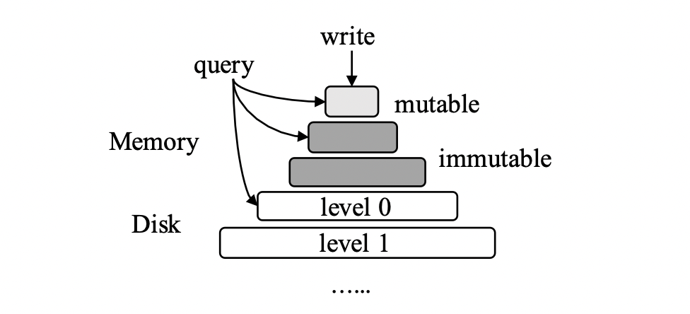

#### 3.4.2 Multi-Core

**cLSM**针对多核系统特别优化，并且设计了新的并发控制算法，其将组**成部分组织在一个并发链表中**来减小并发操作的同步代价，刷写flush和合并merge操作都被设计成对此并发链表的原子操作atomic operation从而不会阻塞读写请求

当一个内存组成部分充满时，新的内存组成部分会在旧组成部分刷写进磁盘的同时创建，写数据会需要先获得**共享锁shared lock**，而刷写操作需要先获得**独占锁exclusive lock**，从而避免在刷写时旧组成部分被写入数据，另外cLSM还支持快照扫描（**多版本multi-versioning**）以及原子的read-modify-write操作（**乐观并发控制optimistic concurrency control**）

#### 3.4.3 SSD/NVM

传统磁盘HDD的顺序I/O性能通常远高于随机I/O性能，而现代新存储设备例如**固态磁盘solid state drives, SSDs**和**非易失内存non-volatile memories, NVMs**往往能够提供相当高效的字节级别的随机访问性能byte-addressable random accesses

- **FD-tree**
  采用了类似LSM树的策略来减少随机I/O，但有一个显著区别在于FD-tree利用了**fractional cascading**来提升查询性能而非常见的bloom filter

  在每一层的组成部分上，FD-tree额外存储了**屏障指针fence pointer**来指向下一层的每个数据页，当在level 0完成二分搜索定位后就可以通过屏障指针直接访问磁盘上level 1的数据页（这个过程利用了随机I/O），并可以继续访问所有层的数据

  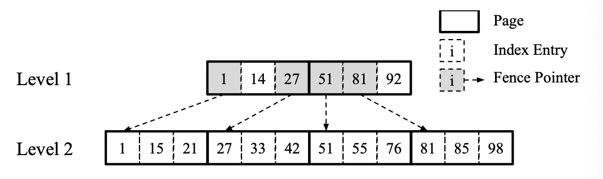

  屏障指针的设计使**合并操作更为复杂**，当level L合并入level L+1时所有level 0到level L-1也必须合并来重建所有的屏障指针，即**fractional cascading**，确保指向下一层正确的数据页，另一方面由于bloom filter的缺失，**查询不存在的key时需要访问磁盘**上的数据，因此实际工程中的LSM树依然更偏爱bloom filter
- **FD+tree**
  FD-tree的fractional cascading导致了需要合并level L时从level 0到level L-1都必须合并出新的组成部分，导致了近一倍的额外临时磁盘占用，FD+tree通过**增量式的激活新的组成部分并同时回收未被使用的旧组成部分的数据页来减轻合并时的磁盘占用情况**
- **materialized sort-merge, MaSM**
  MaSM主要针对数据仓库类型的工作负载进行优化（即**update-intensive负载**），所有写入数据都会被直接写入到SSD上的缓冲区构成中间组成部分intermediate components，采用tiering merge策略在低写放大的情况下管理这些中间组成部分，随后这些数据会被再一次合并到底层的HDD基础存储设备中，相当于**SSD充当了高性能的写入缓冲区，而合并操作被延后从而降低了写入放大**

  同时数据仓库的查询请求往往都是[长范围查询long range query](#23-cost-analysis)，SSD中的中间组成部分引入的额外开销往往可以忽略不计（被查询底层基于HDD的大量数据所掩盖）
- **WiscKey**
  由于**SSD对写入放大非常敏感**（以块可擦写次数计的SSD寿命显著短于HDD寿命）而同时又拥有较高的随机I/O性能，**WiscKey**首先提出了**key和value分离**的设计，从而显著减小了写入放大

  WiscKey直接将key-value存入仅追加的日志文件，而**LSM树就相当于在日志文件上构建的索引，存储key-location**，但缺点在于**范围查询的代价显著提高，所有的value不再排序**，因此范围查询通常需要扫描全部数据

  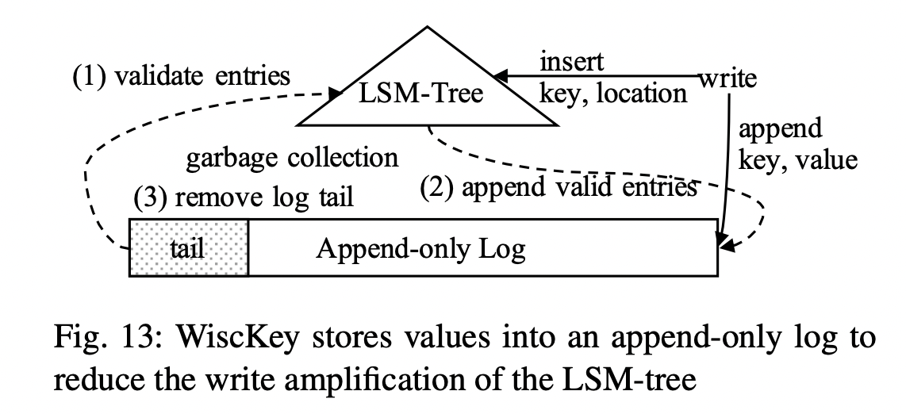

  为了避免日志无限增长，WiscKey中采用**三阶段的垃圾回收**进行控制日志体积：
  1. 从头扫描日志到将要被截断的位置（上图中的tail部分）并校验此中包含的所有key-value，每个key通过LSM树查询到相应的location（被证明这个**随机点查询是垃圾回收的瓶颈**）确定是否与扫描的位置匹配，匹配说明未被修改过，属于有效记录
  2. 对于有效记录，需要重新添加到日志末尾并更新其在LSM树中的location，对于无效记录直接忽略
  3. tail部分被回收
- **HashKV**
  在WiscKey的基础上，HashKV主要**改进了WiscKey垃圾回收过程**，将**value日志根据key进行分区**，从而垃圾回收每个分区可以独立并发进行
  
  具体回收一个分区时HashKV首先通过group-by的操作获得每个key的最新值，有效的key-value就被添加到**新的日志文件分区**中并更新LSM树中的位置，HashKV还会将冷数据单独存放从而可以额外减少冷数据被垃圾回收的频率
- **Keron**
  Keron利用了**内存映射方式memory-mapped I/O**来减少数据拷贝导致的CPU开销，其在Linux内核中实现了一个自定义的memory-mapped I/O manager来控制缓存替换策略并且启用了盲写blind writes

  为了提高范围查询的性能，Keron会在处理查询请求时直接将被一起访问到的数据共同存储到新的位置
- **NoveLSM**
  NoveLSM是**针对NVMs设计**的LSM树，当基于DRAM的内存组成部分充满时就会创建基于NVM的内存组成部分来提供写入**避免出现写入暂停write stall**

  由于NVM本身提供了持久性，**写入基于NVM的组成部分时就不再写入日志**，从而进一步优化了写入性能

#### 3.4.4 Native Storage

部分研究者试图直接管理底层存储设备（HDDs和SSDs）来进一步优化LSM树的性能

- **LSM-tree-based Direct Storage, LDS**
  绕过操作系统的文件子系统，充分挖掘LSM树的顺序I/O特性，LDS的磁盘布局包含三个部分：块chunks，版本日志version log，备份日志backup log
  
  块存储了LSM树的磁盘组成部分，版本日志存储了LSM树元数据在每次flush和merge时发生的修改（例如记录过期的块，合并后新生成的块等），并且版本日志会定期执行快照操作避免随着元数据修改而不断增长过长，而备份日志则作为WAL记录内存中的写操作来保证可靠性
- **LOCS**
  LOCS是在open-channel SSDs上实现的LSM树，通过充分挖掘open-channel SSDs上的I/O并行性来提升LSM树的性能，这种SSD上每个channel都可以看作是一个逻辑磁盘，从而应用程序可以通过不同的channel来实现并发

  LOCS采用**最小权重队列长least-weighted-queue-length策略**将所有flush和merge产生的磁盘写入分配给每个channel，由于磁盘读请求必须由保存了数据的channel来服务，LOCS进一步将partitioned LSM树中不同层的SSTables分配（基于key范围）给不同的channels，从而在后续合并或查询时就可以并行从多个channels中读取
- **NoFTL-KV**
  传统SSD中的flash translation layer, FTL层将逻辑磁盘地址映射到物理磁盘地址，从而可以实现擦写均衡wear leveling提升SSD的使用寿命（定义为每个块的可擦写次数）

  NoFTL-KV将FTL抽取出来，直接管理底层的SSD数据块，来实现更高效的数据存放、垃圾回收以及合并操作，并降低写入放大

### 3.5 Handling Special Workloads

- **时序数据 temporal data**
  **log-structed history access method, LHAM**针对时序数据额外优化，**核心在于对每个组成部分都附加上一个时间戳的范围**，从而在查询数据时通过时间戳剪枝迅速过滤掉不符合要求的组成部分，并且LHAM还通过合并时总是合并最旧的组成部分（相当于**基于时序合并**）来保证每个组成部分的时间戳互不重叠
- **小数据 small data**
  **LSM-trie**是一种基于LSM的散列索引，支持管理大量key-value对很小的数据，其基本结构采用了partitioned tiering设计，`TODO`

  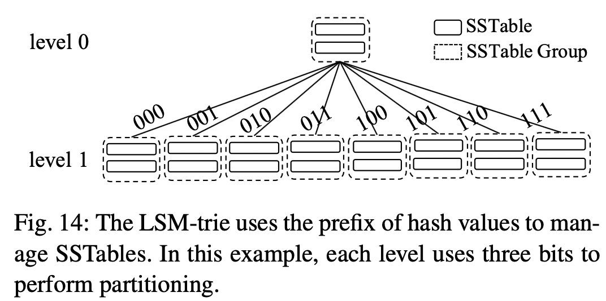

  其主要的设计场景为管理**海量key-value对**（如果采用常规的LSM树则即使是元数据、索引或bloom filter的数据都无法充分缓存）并只需要使用点查询（大量使用散列）

- **半有序数据 semi-sorted data**
  **SlimDB**主要针对了半有序数据，其key的设计包括一个前缀`x`和一个后缀`y`，因此支持同时指定`x y`的点查询或是只指定`x`的范围查询，SlimDB采用了混合结构，其较低层是tiering而较高层是leveling，`TODO`
- **追加为主数据 append-mostly data**
  由于tiering和leveling策略的层数L都依赖于总的记录数，因此对于持续追加的数据而言，层数L不断上升会显著提高所有操作的代价

  Mathieu等研究者提出了两种新的合并策略**MinLatency**和**Binomial**来实现追加为主负载的写入代价下界

### 3.6 Auto-Tuning

#### 3.6.1 Parameter Tuning

Lim等人提出了一个考虑了key分布情况的分析模型，来描述LSM树的操作代价，核心原因在于**引入了key分布情况后[前文](#23-cost-analysis)的最坏情况代价分析就不再准确**，例如一个key如果在很早阶段就已经被删除或者更新，则后续的合并就不会涉及到多次写入同一个key，从而写入代价就会减少

假定对key的操作有先验知识，每个写请求修改某个key的概率为 $f_K(k)$，给定 $p$ 次写请求，则唯一的key数量可以估计为 $Unique(p)=N-\sum_{k \in K}(1-f_K(k))^p$，其中 $N$ 为总共的唯一key数量，通过引入这个key分布模型就可以修正LSM树的操作代价估计，Lim等人通过此模型来调优leveling策略下的最大level尺寸进行LSM树优化

**Monkey**将merge policy、size ratio、memory allocation一起考虑参与LSM树的多参数调优，发现了常规的bloom filter设计策略（对所有层的过滤器都采用相同的位向量长度）是次优的结果：对于含有数据最多的最底层（level大）组成部分，消耗了最多的bloom filter空间但是至多只能节约T次磁盘I/O操作（T个组成部分）

为了降低整体bloom filters的假阳性误报，Monkey提出应该**给顶层（level小）的数据量较少的SSTables分配更多的bloom filters位向量来降低误报率**，能够更有效的节约磁盘操作并且减少消耗在底层（level大）bloom filters的内存（给底层分配更多位向量节约的I/O次数有限，至多为T），从而在这种不同层bloom filter误报率不同的设计之下可以认为**点查询的代价主要由最底层决定**，对leveling策略是 $O(e^{-M/N})$ ，对tiering策略是 $O(T \cdot e^{-M/N})$

#### 3.6.2 Tuning Merge Policies

**Dostoevsky**表明主流的leveling或tiering策略对某些工作负载来说都是次优的，对于leveling来说其点查询、长范围查询、空间放大都取决于最大的一层，而其写入代价则是每一层均摊的

Dostoevsky引入了**lazy-leveling merge策略**，在level小的层采用tiering策略，而在level最大层采用leveling策略，从而**lazy-leveling策略相比于leveling策略拥有更好的写入代价**，并有相似的点查询代价、长范围查询代价和空间放大，唯一弱点在于相对更差的短范围查询代价（因为level小的层中tiering策略产生了更多组成部分）

Dostoevsky进一步泛化了**混合策略hybrid policy**的模式来分别约束最大层和其余层，分别对最大层引入了参数 $Z$ 代表最大层允许的组成部分数量以及参数 $K$ 代表其余层允许的组成部分数量，并采用类似Monkey的做法来分析不同工作负载下的最优参数配置

Thonangi和Yang进一步研究了分区partitioning对LSM树写入操作的影响，提出了**ChooseBest策略在合并时总是选择下一层中拥有最少重叠key的SSTables来参与合并**，来约束最坏情况下的合并代价，但这种合并策略并不是在所有情况下都比常规的非分区合并策略更好

#### 3.6.3 Dynamic Bloom Filter Memory Allocation

现有的LSM实现中（包括对bloom filter提出优化的[Monkey](#361-parameter-tuning)）均采用了静态的bloom filter分配方式，即当一个组成部分的bloom filter被创建后，其假阳性率也就不会再改变，而**ElasticBF**提出了动态调整bloom filter的方式，从而可以**根据热点和访问模式调整bloom filter**改变假阳性率并提升读性能

当给定一个key的bloom filter位向量长度为 $k$ 时，ElasticBF会**构建一系列更小位向量长度的bloom filters**从而满足 $k_1 + k_2 + ... + k_n = k$ ，当所有bloom filters均启用时就和原先的假阳性率相等，而在运行过程中ElasticBF会**根据访问频率等统计数据动态激活/停用这些小的bloom filters**，这种优化在bloom filter内存受限的情况下较为明显，当内存较大且bloom filter的位向量较长时其假阳性率本身足够低，这种优化效果有限

#### 3.6.4 Optimizing Data Placement

**Mutant**针对云存储上的LSM树进行了优化，因为云存储不同的设备拥有不同的性能和价格，因此Mutant根据每个SSTables的访问频率来控制存储位置，对于较小的热点数据SSTables就会存储在高速的SSDs上

这种优化问题（给定预算最大化系统的性能）等价于0/1背包问题，通常采用贪心算法来获取次优解，本身是NP hard问题

### 3.7 Secondary Indexing

LSM树本身相当于只有一个主键索引，而现实系统中的查询往往更加复杂，需要二级索引的支持，典型的**基于LSM树的二级索引**如下图：

- 一个主键索引primary index及多个二级索引secondary indexes
- 主键索引直接记录数据，**二级索引记录主键索引的key**

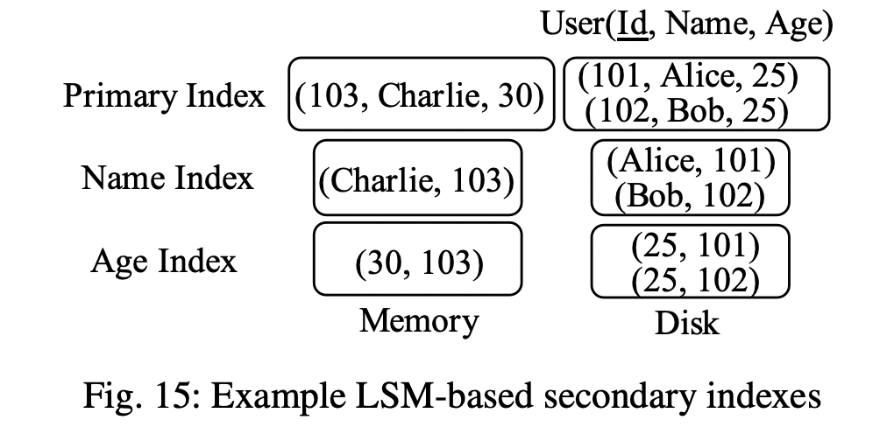

#### 3.7.1 Index Structures

这一节可以参考comp7801继续补充

- **Log-Structured Inverted Index, LSII**，`TODO`
- **LSM-based spatial index structures for geo-tagged data**，`TODO`
- **Filters**，`TODO`

#### 3.7.2 Index Maintenance

维护LSM树的二级索引最大的难点就在于处理**更新updates**，对于LSM树本身来说，更新就是简单的直接追加到内存组成部分，key不变且旧的值自动失效，但是**二级索引需要更新并且需要清除过期的数据**

- **Diff-Index**
  提出了四种维护二级索引的方式，分别是：
  - **sync-full**：同步执行加入新数据和删除旧数据，此时二级索引总是最新的，查询请求的处理性能更优，但是由于**删除旧数据需要点查询到旧的数据再从二级索引中删除**，代价较高
  - **sync-insert**：仅同步执行加入新数据，由查询进行过时数据的懒惰删除，例如查询发现二级索引的某个值并不在LSM树中存在则进行删除
  - **async-simple**：异步维护索引但保证**最终一致性**，通过将更新加入到异步队列来实现
  - **async-session**：异步维护索引但保证**会话一致性**，即在客户端侧缓存更新的数据，会话内首先读取缓存的新数据，其余与async-simple一样
- **Deferred Lightweight Indexing, DELI**
  基于Diff-Index的sync-insert模式，采用**扫描主键索引组成部分替代查询触发的懒惰删除**，当多个拥有相同key的记录被扫描到时，就会相应的根据过时的值去删除二级索引中对应的索引，且这个**扫描清理过程可以在merge时一起完成**
  
  由于这个清理与sync-insert一样是异步的，查询语句在**查询二级索引时依然需要再查询主键索引来校验数据是否有效**，因此DELI不支持只需要扫描索引的查询，因为索引不一定有效

Luo等研究人员还提出了其他优化基于LSM树的各种数据结构的方法，核心在于设计和维护主键索引，**在主键索引上存储key以及timestamp**，从而点查询可以**通过timestamp验证**减少磁盘I/O操作

- **查询时**：从二级索引中获取到主键索引的key时，必须通过直接获取记录或是根据主键索引上的时间戳来判断是否是最新的记录来完成验证
- **清理时**：异步扫描二级索引，并查询相应的主键索引判断该二级索引是否失效，类似DELI在查询时的校验过程，这里采用了时间戳来避免查询时的校验，提升查询性能
- **主键索引设计**：采用**可变的位图mutable-bitmap**来作为磁盘组成部分的索引，从而可以高效的在内存中完成主键索引的查询

#### 3.7.3 Statistics Collection

Absalyamov等人提出了针对LSM树的轻量级统计框架，基本思想就是将统计操作融入到flush和merge的操作中，从而摊平统计的额外开销

#### 3.7.4 Distributed Indexing

需要注意的是这里涉及到的分布式索引构建方式在大多数分布式数据库系统中都有所应用而不是只用于基于LSM树的系统

Joseph等提出了HBase上采用了两种分布式二级索引的实现：

- **全局二级索引global secondary indexes**
  单独作为一个表记录了二级索引的key与主键索引的key，并采用**协处理器co-processors**进行维护（类似于传统数据库的触发器trigger），其维护代价很高，因为主键索引分区和二级索引分区可能位于不同的物理节点
- **本地二级索引local secondary indexes**
  与全局二级索引不同，本地二级索引将二级索引分区部署在相应的主键索引分区的物理节点，即**co-lcoating**从而避免跨界点通信，缺点是这种二级索引需要手动实现和维护，并且由于**二级索引根据主键索引的key（而不是二级索引的key）进行分区**（这样才能部署在同一个节点），在一次查询时所有节点上的二级索引分区都必须被查询

Zhu等提出了一种**高效加载全局二级索引**的方式，包含三个步骤：

1. 每个主键索引分区都被扫描并构建一个本地的二级索引，期间与二级索引key相关的统计信息被采集
2. 基于第一步采集到的统计信息，二级索引会基于范围进行分区range partition，这些分区就会被部署到物理节点上
3. 每个物理节点基于给定的二级索引分区范围，结合第一步中构建的本地二级索引，从其他节点获取属于自己的二级索引keys和主键索引keys（二级索引的value就是主键索引的key）

Duan等提住了**懒惰维护物化视图**的方式，基本思想是将相关的更新追加到一个与物化视图绑定的delta列表中，从而避免更新的同时需要维护物化视图，而后续在查询处理时再将delta列表中的更新应用到物化视图上，相当于减轻了写入的负担，但增加了查询的负担

### 3.8 Discussion of Overall Trade-offs

基于**RUM猜想**，read-optimal、write-optimal、space-optimal不可能在同时达到，从前文的分析可以看出，不同的LSM树变种侧重不同的操作，总结如下表，以最基本的leveling merge policy作为基准，除了Space以外其他类别的`+`代表更优：

- `+`: increase
- `-`: decrease (`-` is better for space)
- `o`: unaffected
- `x`: unsupported

|Publication|Write|Point Lookup|Short Range|Long Range|Space|Remark|
|:-|:-:|:-:|:-:|:-:|:-:|:-|
|[WB-tree](#321-tiering)|++|-|--|--|--|Tiering|
|[LWC-tree](#321-tiering)|++|-|--|--|--|Tiering|
|[PebblesDB](#321-tiering)|++|-|--|--|--|Tiering|
|[dCompaction](#321-tiering)|++|-|--|--|--|Tiering|
|[Zhang et al.](#321-tiering)|++|-|--|--|--|Tiering|
|[SifrDB](#321-tiering)|++|-|--|--|--|Tiering|
|[Skip-tree](#322-merge-skipping)|+|-|-|-|o|Mutable skip buffers, cold/hot data separation, delay merges at level 0, logs as components|
|[TRIAD](#323-exploiting-data-skew)|+|-|-|-|o|Mutable skip buffers, cold/hot data separation, delay merges at level 0, logs as components|
|[VT-tree](#331-improving-merge-performance)|+|o|-|-|-|Stitching merge|
|[MaSM](#343-ssdnvm)|++|-|--|-|-|Lazy leveling|
|[WiscKey](#343-ssdnvm)|+++|-|---|---|---|KV separation|
|[HashKey](#343-ssdnvm)|+++|-|---|---|---|KV separation|
|[Kreon](#343-ssdnvm)|+++|-|---|---|---|KV separation|
|[LSM-trie](#35-handling-special-workloads)|++|+|x|x|--|Tiering + hashing|
|[SlimDB](#35-handling-special-workloads)|++|+|--/x|-/x|-|Range queries for each key prefix group|
|[Lim et al.](#361-parameter-tuning)|+|o|o|o|o|Exploit data redundancy|
|[Monkey](#361-parameter-tuning)|o|+|o|o|o|Better Bloom filter memory allocation|
|[Dostoevsky](#362-tuning-merge-policies)|++|-|--|-|-|Lazy leveling|

## 4 Representative LSM-based Systems

### 4.1 LevelDB

[LevelDB](https://github.com/google/leveldb)由Google在2011年开源，作为一个嵌入式存储引擎其支持简单的KV操作，采用了[partitioned leveling merge policy](#222-well-known-optimizations)

### 4.2 RocksDB

[RocksDB](http://rocksdb.org)由Facebook在2012年fork了LevelDB并继续发展，加入了大量的新特性且在工业界广泛流行，由于其依然在持续演进，本节仅代表本文所写时（VLDB 2019）的特征

RocksDB与LevelDB相同采用**partitioned leveling merge policy并且默认size ratio为10**，从而约90%的数据都在最大层，确保了至多10%的存储空间用于存储过时的数据（相比之下典型的B+树往往由于碎片化只有2/3充满）

RocksDB有非常多的新特性和优化如下：

- **level 0 merge optimization**
  level 0的SSTables并没有分区，因此从level 0到level 1的合并通常需要重写level 1的所有SSTables从而成为可能的瓶颈，RocksDB则可以**选择性的在level 0采用tiering merge policy**从而允许在负载尖峰时性能表现更为稳定
- **dynamic level size scheme**
  leveling空间放大的理想值 $O(\frac{T+1}{T})$ 只有在最大层达到最大体积时才能达到，而实践中这并不总是能达到，因此RocksDB可以**根据当前最大层的大小动态调整其余level的允许大小**，从而尽可能满足最优的空间放大值
- **SSTables selection policy**
  在触发合并时，一层的多个SSTables都可以被选择，RocksDB支持多种选择算法：
  - **round robin**：LevelDB采用的方法，也是默认的方法，见[前文分析](#222-well-known-optimizations)，综合写入代价较小
  - **cold first**：优先选择访问不频繁的SSTables，数据倾斜情况下更优，确保了较热的数据总是在较高的level而不会被向下合并到较低层，从而降低了访问开销
  - **delete first**：优先选择包含更多已经删除数据的SSTables，从而能够在一次合并中释放出更多空间
- **merge filter**
  允许用户自定义一些KV的过滤逻辑，在合并过程中对KV调用用户逻辑，由用户来过滤掉过期数据，剩余的数据才会被加入新生成的SSTables
- **merge policy**
  RocksDB提供的合并策略有：
  - **leveling**：默认方式且分区，见[前文分析](#222-well-known-optimizations)
  - **tiering**：与前文描述的tiering策略有所不同，RocksDB的tiering策略由两个参数控制，分别为the number of components to merge, `K`和the size ratio, `T`，合并时从最旧的组成部分到最新的组成部分依次检查，对每个组成部分 $C_i$ 会进一步检查比其年轻的`K-1`个组成部分的大小是否满足 $sum(C_{i-1}, C_{i-2}, ..., C_{i-K}) > T \times C_i$，若满足则合并这`K`个组成部分，否则继续检查下一个更年轻的组成部分；另外RocksDB有限支持tiering下的分区，类似水平分组的模式
  - **FIFO**：在这种模式下所有组成部分从来不会被合并，而是基于生命周期的控制删除过旧的组成部分
- **rate limiting**
  由于合并操作会显著消耗CPU和磁盘资源，从而影响其他操作的性能，并且合并的时间点难以预测而往往依赖于写入数据的速率，因此RocksDB支持基于l**eaky bucket mechanism的流量限制**来控制合并发生时的磁盘写入速率，即flush和merge操作需要从一个**配额桶**中获取相应的额度才能继续执行，并且会周期性的给配额桶补充配额，从而用**配额补充速度来控制磁盘写入速度**
- **read-modify-write**
  非常多的应用程序会使用read-modify-write的访问模式（即读取后在数据基础上修改再写回，例如`i = i + 1`），RocksDB通过允许直接向内存写入**delta records**来高效支持这种操作，避免读取原始记录而是直接更新，后续在查询处理或是合并时就会将delta记录和原始记录合并处理

### 4.3 HBase

[HBase](http://hbase.apache.org)是构建在Hadoop生态上的分布式数据存储系统，模型参照了Google Bigtable的设计，**基于master-slave的架构，将所有数据分区（hash或range）到regions，每个region基于LSM树**，并且支持动态的region分割和合并来进行水平扩展与缩容

HBase的LSM树合并策略**基于tiering merge policy**并有少量修改，衍生出：

- **exploring merge policy**：默认策略，触发合并时，检查所有可合并的组成部分，并且选择**拥有最小写代价**的组成部分进行合并，这种策略比基本的tiering策略更稳健（尤其是当组成部分因为频繁的删除而拥有不常规的大小时）
- **date-tiered merge policy**：主要针对时序数据设计，**基于组成部分的时间范围进行合并**，因此所有组成部分相当于是**时间范围分区**的，可以有效提高时序查询的性能

HBase近期引入了新特性**stripping**允许将大的region进行分区来提升合并效率，分区方法基于key的空间从而子分区独立的持有一组组成部分，并且子分区就可以独立的进行合并，这种分区与前文描述的partitioned tiering merge policy不同

HBase不支持原生的二级索引，但是可以通过手动**定义一个新表作为二级索引来使用**，并采用协处理器co-processors来维护，[见此](#374-distributed-indexing)

### 4.4 Cassandra

[Cassandra](https://cassandra.apache.org/_/index.html)是参照了Amazon Dynamo和Google BigTable构建的开源分布式数据存储系统，采用**去中心化的架构**来应对单点故障SPOF，**每个分区都基于LSM树**

Cassandra支持与RocksDB和HBase类似的合并策略，包括：

- (unpartitioned) tiering merge policy
- partitioned leveling merge policy
- date-tiered merge policy

并且Cassandra还支持[本地二级索引](#374-distributed-indexing)来加速查询的处理，为了避免点查询延迟过高，本地二级索引的维护是懒惰进行的（类似[DELI](#372-index-maintenance)）：一次update操作后如果数据正好还在内存组成部分中，则直接用于更新二级索引，否则就会等到合并时才会更新二级索引

### 4.5 AsterixDB

[AsterixDB](http://asterixdb.apache.org)是开源的**大数据管理系统BDMS**，主要用于**高效支持半结构化数据**例如JSON

AsterixDB采用了**shared-nothing parallel database**架构，每个数据集的数据都会基于主键散列分区到多个节点上，每个分区基于LSM树，管理一个primary index，一个primary key index，多个本地二级索引，采用**record-level事务模型来保证所有索引的一致性**

显然primary index即LSM树核心采用primary key来管理所有数据，而primary key index仅仅只有primary key用来高效支持聚合类的查询，例如`COUNT(*)`

二级索引采用secondary key和primary key的组合来作为索引的key，AsterixDB通过一个泛用的LSM-ification框架来支持基于LSM树的B+树、R树和倒排索引，更多索引细节`TODO`

## 5 Future Research Directions

- **Thorough Performance Evaluation**：大多数改进方案等设计仅基于未调优的默认配置LevelDB或RocksDB进行对比测试，而一个良好调优的RocksDB也许未必比所谓的改进方案要好
- **Partitioned Tiering Structure**：分区式的tiering策略（水平分组和垂直分组）的特征和代价并没有被仔细考察过
- **Hybrid Merge Policy**：大多数LSM的改进都采用leveling或tiering策略，对一些工作负载下所有层都采用相同的策略是次优的，不同改进下的混合策略并没有被充分考察
- **Minimizing Performance Variance**：存储系统的稳定性非常重要，而LSM树由于合并的存在，其稳定性并不佳，经常可能出现写入暂停、延迟抖动和毛刺等现象，针对这一方面的研究非常少，文中只提到了[bLSM](#333-minimizing-write-stalls)
- **Towards Database Storage Engines**：大多数现有的LSM树提升仅考虑了LSM树本身作为一个简单的key-value存储的应用，而现在随着LSM树越来越多的被应用到了复杂数据库系统当中，针对LSM树的查询处理、数据处理技术、索引尚显欠缺，例如可以考虑辅助数据结构来高效支持查询处理（auxiliary structures）、对LSM树针对性优化的查询优化器（LSM-aware）、充分利用LSM树本身的维护过程来执行查询处理（co-planning）
