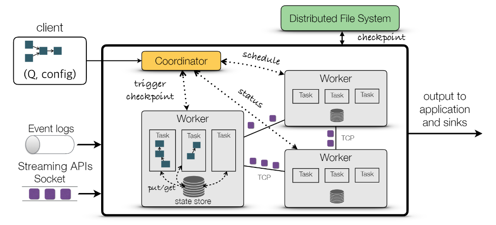
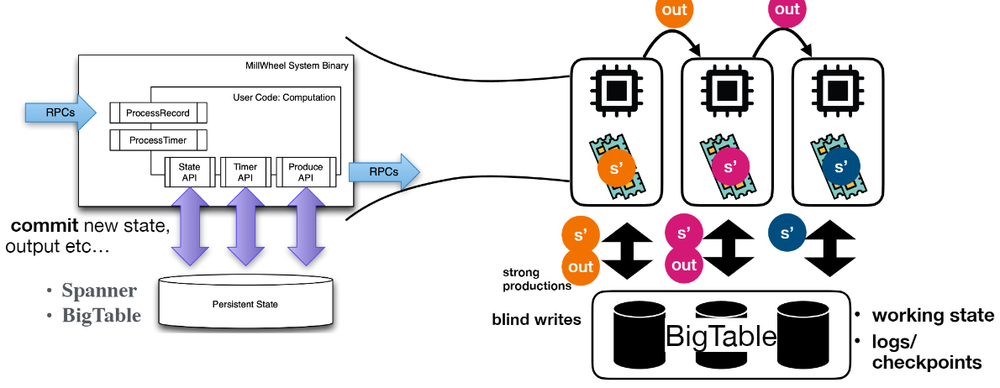
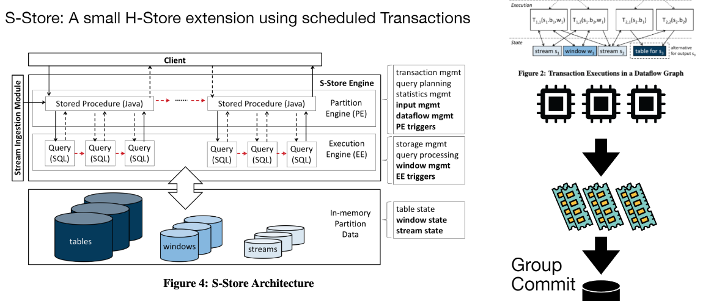
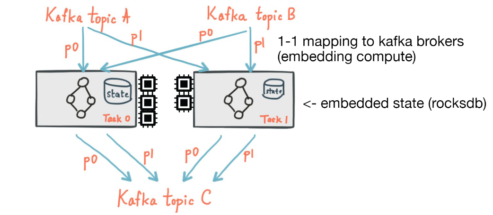

# [SIGMOD 2020] Beyond Analytics: the Evolution of Stream Processing Systems

## 1 Introduction

> What is a stream ?
> A data set that is produced **incrementally** over time, rather than being available in full before its processing begins.
>
> - Data streams have **unknown**, possibly **unbounded length**
> - They bear an arrival and/or a generation **timestamp**
> They are produced by external sources, i.e. **no control over arrival order and rate**

**第一阶段**的流数据管理系统Data Stream Management System, DSMS与数据库管理系统DBMS拥有非常类似的架构：

- Load Shedder**动态丢弃数据**以防系统过载
- 系统目标在于快速高效的给出**大约准确**的结果

**第二阶段**以[MapReduce](https://github.com/JasonYuchen/notes/blob/master/mit6.824/MapReduce.md)的出现为开端，经典架构就是双写数据的lambda架构

- 一侧写入低延迟的流处理系统获得快速但不精确的结果
- 另一侧写入高延迟的批处理系统获得准确但不及时的结果

- 这一阶段开始的系统不再将流处理系统视作不准确的系统，而是开始**通过流处理系统来高效获得精确的结果**，即使出现故障节点
- 数据的处理就是在流处理系统的有向图上流动，每个节点都是一个算子节点，通过对有向图的分析可以进行并行化等各种调度优化

**第三阶段**开始就是云上大规模分布式数据流系统：

- input: **out-of-order**
- resutls: **exact**
- query plans: **independent with custom operators**
- execution: **distributed**
- parallelism: **data/pipeline/task**
- time&progress: **low watermarks, frontiers**
- state: **per-query, partitioned, persistent**
- fault-tolerance: **distributed snapshots, exactly-once**
- load management: **backpressure, elasticity**

## 2 Review of Foundations

### 2.1 Languages and Semantics

> Till today, various communities are working on establishing a language for expressing computations which combine streams and relational tables, without a clear consensus.

可以参考[Streaming Systems](https://github.com/JasonYuchen/notes/tree/master/streamingsystems)中的[Streaming SQL](https://github.com/JasonYuchen/notes/blob/master/streamingsystems/08.Streaming_SQL.md#chapter-8-streaming-sql)

### 2.2 Time and Order

由于网络波动、传输乱序等等，流数据通常不一定按照顺序抵达处理系统，此时就引入了**乱序处理、重排序**等过程，可以参考Streaming System中关于[处理时间的描述](https://github.com/JasonYuchen/notes/blob/master/streamingsystems/02.What_Where_When_How.md#chapter-2-the-what-where-when-and-how-of-data-processing)以及更深入的[Advanced Windowing](https://github.com/JasonYuchen/notes/blob/master/streamingsystems/04.Advanced_Windowing.md#chapter-4-advanced-windowing)

时间的三种标记：

- **event time**：数据产生的时间，也称为application time，通常这个时间**最具有数据本身的意义**
- **processing time**：数据被系统处理的时间
- **ingestion time**：数据抵达系统的时间

导致乱序的原因：

- 外部不可控因素，例如网络路由、多个输入源交替产生数据等
- 系统处理因素，例如多个并行join产生shuffled的流数据等
  
    

**In-order架构**：

- 缓存入流数据
- 重排序入流数据
- 施加一个上限时间延迟，延迟超过此值的数据就会被丢弃

**Out-of-order架构**：

- 由算子或中心节点生成全局的进度信息progress information扩散给整个系统
- 产生进度信息例如**watermark**，参考[此](https://github.com/JasonYuchen/notes/blob/master/streamingsystems/03.Watermarks.md)，忽略晚于此的数据
- 与In-order架构最大的不同在于**数据按照抵达顺序被处理而不会有重排序过程**，注意这并不是指产生乱序数据，而是指[处理乱序数据](https://github.com/JasonYuchen/notes/blob/master/streamingsystems/04.Advanced_Windowing.md#%E4%BA%8B%E4%BB%B6%E6%97%B6%E9%97%B4%E7%AA%97%E5%8F%A3-event-time-windowing)

### 2.3 Tracking Processing Progress

追踪流处理系统的处理进度：

- **punctuation**：元数据标记（？）
- **watermarks**: [Watermark](https://github.com/JasonYuchen/notes/blob/master/streamingsystems/03.Watermarks.md#chapter-3-watermarks)，更加**泛化的代表流数据在系统中处理的进度**，不仅仅是类似heartbeats的流数据时间上的节点，watermark是最为常见的一种方式
- **heartbeats**：由外部数据源周期性产生的心跳数据，每个心跳数据带有时间戳，代表着在**此时间之前的数据已经全部产生**，类似于数据源端产生的时间watermark
- **slack**：由用户**query指定允许额外等待**迟到的数据不超过slack条数或时间
- **frontiers**：类似于watermark

## 3 Evolution of System Aspects

### 3.1 State Management

> The need for **explicit state management** originates from the need to keep and automate the maintenance of persistent state for event-driven applications in a reliable manner.

#### 3.1.1 Scope

- **State as a Synopsis**
  早期使用的策略，通常**state作为DSMS内置的状态**，用户无法直接访问，往往是瞬态维护在内存中的

  - 优点在于完全由系统来维护，性能较好，可以被系统充分重用、共享等
  - 缺点也在于此，紧耦合并完全由系统维护导致了灵活性受限（只能使用系统支持的算子）无法使用用户自定义的状态
- **Application-Managed State**
  系统完全不提供状态管理，而是将状态管理留给了应用程序，通常可以是**应用程序内的状态process-local state**或是由程序员定义并保存到**外部状态external state**

  - 优点在于高度灵活，可以使用任意复杂的状态和数据结构
  - 缺点则是完全手动管理状态带来的高应用程序复杂度，并且当依赖外部状态时往往引入了第三方依赖，同时完全依赖应用层的状态失去了系统优化的可能性
- **System-Managed State**
  与State as a Synopsis有所不同，这里同样是由系统来管理状态，但是用户可以**通过API控制状态**，状态是一等公民

  - 优点是由系统来管理状态减轻了用户的负担，同时提供API给用户来灵活的控制系统
  - 缺点就是灵活性带来的有限优化和有限状态类型

#### 3.1.2 Scalability

可扩展即意味着分区扩容，状态本身可以分为两种粒度的状态：

- **Task-Level State**
  task级别的状态，通常可以映射到计算任务的物理分区physical partitioning，并且也**难以在此基础上进一步分区**（task已经是最小粒度）
- **Key-Level State**
  key级别的状态（`keyby, groupBy`），通常可以映射到计算任务的逻辑分区logical partitioning，显然很**容易在此基础上进一步分区**

#### 3.1.3 Persistency

- **Embedded State**
  目前最为流行的可扩展状态设计，每个算子在处理task时采用**无共享shared-nothing**的模式，都维护自己私有的状态存储，完全不依赖外部节点，例如Flink、Spark Structured Streaming等系统

  - 此类状态**性能优越**，不需要依赖外部系统
  - 但由于状态与节点自身强耦合导致**配置变更、事务支持（分布式事务）、可扩展性上表现不佳**

  以Flink with RocksDB为例，Flink节点持有本地的RocksDB，所有状态相关的读写、快照均通过RocksDB完成：

  

  采用LSM结构例如RocksDB的状态存储是最常见的方式，但依然有更多可以考虑的方面：
  - 流访问数据时确保了非并发，因此存在**多余的low-level latching**
  - **index-based的后端**更适用于高效的流读取（研究热点，针对流数据的读取模式设计新的存储系统），例如较为热点的两种后端：
    - **RocksDB**是基于LSM的有序存储
    - **FASTER**是基于Hash的无序存储（`TODO: SIGMOD 2018 Microsoft`）
  - **新型硬件**的特化支持，NVMe，RDMA等

- **External State**
  算子通过与外部状态存储交互来完成计算，所有节点**共享外部状态存储**，例如Google Dataflow、RisingWave等系统

  - 这种设计**分离了存储和计算层**，并且可以各自单独针对存储节点、计算节点做扩容，对云更友好，也因此更易于支持配置变更、容灾恢复等，因为**计算节点是无状态的**
  - 相应的缺点在**于对存储层的性能要求较高**，并且**处理延迟**相较内置状态存储的系统会更大

  以Google Dataflow (Millwheel) with Spanner/BigTable为例，Dataflow通过外部的Spanner/BigTable数据库来管理状态的读写和快照，自身的Task是无状态的，所有更新都通过单条事务完整的写入外部数据库：

  

- **Embeded Compute**
  与其他服务于计算的状态不同，这一类是服务于状态的计算，即**基于存储系统的内置流计算引擎**，例如Kafka-Streams on Kafka、S-Store on H-Store等系统

  - 由于是在存储系统中内置了计算模块，因此可以充分利用系统内的优化手段，但同样也依赖存储系统本身的性能
  - 缺点就是高度耦合了存储模块和计算模块，通常计算性能无法与精细调整的其他流数据系统相媲美

  以S-Store on H-Store为例，通过在H-Store上的插件S-Store，实现了**将无限的流数据计算过程转换成了一系列事务，每个事务可以包括数个task的计算**，并且在H-Store上调度执行并group commit从而完成计算：

  

  以Kafka-Streams on Kafka为例，Kafka本身是log as a database，通过额外引入RocksDB来保存状态并在每个Kafka Brokers上完成计算task：

  

关于状态存储，另外还可以参考：

[流处理的状态存储在设计时有哪些考虑](https://zhuanlan.zhihu.com/p/506869449)

- **Ordered Store vs. Hash-based Store**
  例如RocksDB和FASTER，没有明确的胜出者，但FASTER的优缺点过于明显且更不稳定
- **Single Store vs. Multi Store**
  单个存储后端难以在所有场景下表现优秀（**one size cannot fit all**）；对于内置算子，根据算子特点来**选择合适的存储后端**（RocksDB或FASTER），而对于用户自定义算子UDF，则根据**代码分析、在线学习来推测**合适的存储后端
- **General Store vs. Dedicated Store**
  RocksDB作为一个通用存储，优化目标主要是durability、atomicity等，从未包括流处理真正希望的：
  - **状态存储后端不需要容错**：流处理系统本身有快照和恢复机制，存储后端不需要WAL等容错机制
  - **状态存储后端不需要并发读写支持**：每个算子都有自己独立的状态需要维护，因此只有一个writer，存储后端的并发支持是多余的
  - **状态存储后端不需要状态分区**：入流数据本身已经shuffle分区，在存储后端中不需要再进行一次分区

  另一方面RocksDB本身的内置**compaction**会更加影响到流数据的处理性能（`TODO: 补充细节`），流数据系统中的**compaction更应该作为一个算子存在**，由上层精细控制其运行

  流数据处理**更应该使用一个针对流数据优化的专用存储后端**`TODO: 研究RisingWave的存储后端实现`
- **Embedded Store vs. External Store**
  内置状态存储和外部状态存储主要影响以下几个方面：
  - **延迟**
  - **配置变更**
  - **性能优化空间**
  - **可扩展性**

[什么是流计算的状态](https://www.zhihu.com/question/62221304/answer/2312737176)

[RisingWave: Rethinking State Management in Cloud-native Streaming Systems](https://github.com/JasonYuchen/notes/blob/master/talks/current/Rethinking_State_Management.md)

#### 3.1.4 Consistency

- **Action-Level** Transactional Stream Processing
  - commit每个操作到状态存储中

- **Epoch-Level** Transactional Stream Processing
  - commit每个epoch到状态存储中，做法有两个方式：
  - Variant 1 - **Synchronous Epoch Commits**：即采用类似[两阶段提交](https://github.com/JasonYuchen/notes/blob/master/cmu15.445/23.Distributed_OLTP.md#%E4%B8%A4%E9%98%B6%E6%AE%B5%E6%8F%90%E4%BA%A4-two-phase-commit-2pc)的方式，coordinator向所有处理ep1的task发出准备提交的消息，随后再发出提交并保存系统此时的状态，**显著的缺点在于必须等待所有ep1的task处理完成**
  - Variant 2 - **Distributed Snapshotting**：即采用[分布式一致性快照](https://github.com/JasonYuchen/notes/blob/master/dsaaa/08.Distributed_Snapshot.md#chapter-8-distributed-snapshot)协议，从而一个一致性快照就包含**系统的状态**和相应的**在途消息**，非常像数据库的物化视图（系统状态）再加上尚未应用的redo日志项（在途消息）
    - Variant 2.1 - **Stop-The-World**：类似二阶段提交的方式，第一阶段要求所有节点停止运行，并准备快照，第二阶段生成并保存快照，与Variant 1比较接近
    - Variant 2.2 - **Unaligned Epoch Snapshots**：一个起始进程向流系统注入一个特殊的marker，**收到第一个marker的节点就开始进行快照**而不必等待所有上游节点的marker，一旦收到某个上游的marker后系统必须**将所有该上游后续消息记录到redo log**里直到收到所有上游的markers，从而系统的状态加增量的消息一起构成了快照，例如Flink采用的**Chandy-Lamport修改版算法**
    - Variant 2.3 - **Aligned Epoch Snapshots**：同样注入特殊的marker，一旦收到某个上游的marker后就阻止处理该上游的后续消息，直到收到所有上游的markers才会开始执行快照，因此**快照仅包含系统状态**而没有在途的消息（类似于半同步的做法），从而认为每个节点是对齐的aligned，相较于unaligned算法性能略微差一些，aligned算法能够反映一个完整的epoch事务，同时由于**没有redo log及消息回放**因此配置修改、容灾恢复时非常高效

`TODO: Chi: A Scalable and Programmable Control Plane for Distributed Stream Processing Systems`

### 3.2 Fault Recovery and High Availability

通常流处理的目标往往在于低延迟，而高可用和容错则是大规模分布式系统所必备的属性，如何**让故障转移，容灾恢复尽可能小的影响到正在进行的流数据处理**是难点

### 3.3 Elasticity and Load Management

早期的流数据系统通过动态**负载限制load shedding**的方式来避免系统过载，这种方式通过算法决定丢弃一部分入流数据（where，when，how many，which）来实现在**结果质量有限下降**的情况下系统**高效稳定运行**

现代流数据系统通常充分利用充足的云计算资源，通过**分区partition**和**弹性elasticity**扩容缩容来适应工作负载的变化，流数据系统会持续检测性能并在需要时扩容和缩容相应的算子，来确保分区和处理的准确性、时效性，另一方面在数据源支持的情况下，流数据系统也可以采用**背压backpressure**的方式来实现主动限流

TODO

## 4 Prospects

### 4.1 Emerging Applications

- **Cloud Applications**
- **Maching Learning**
- **Streaming Graphs**

### 4.2 The Road Ahead

- **Programming Models**
- **Transactions**
- **Advanced State Backends**
- **Loops & Cycles**
- **Elasticity & Reconfiguration**
- **Dynamic Topologies**
- **Shared Mutable State**
- **Queryable State**
- **State Versioning**
- **Hardware Acceleration**
