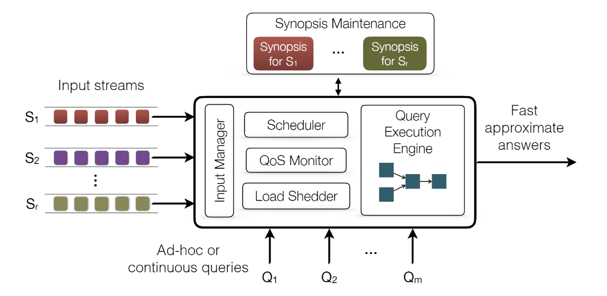
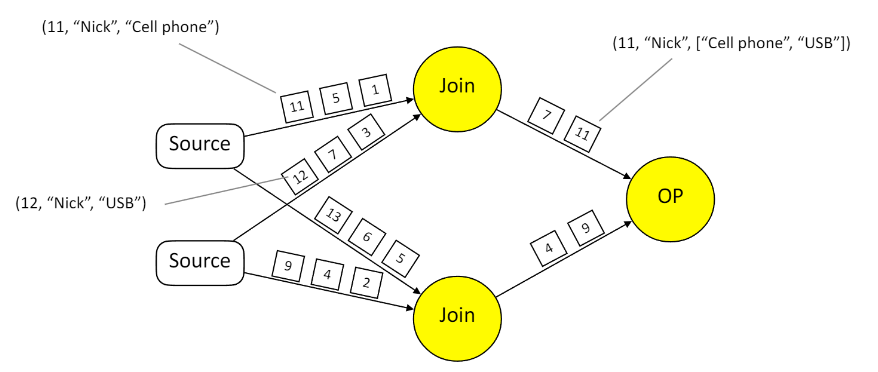
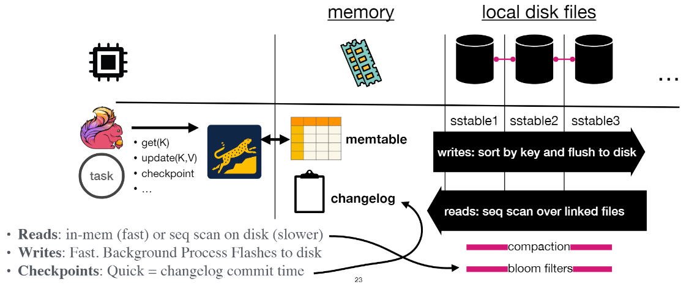
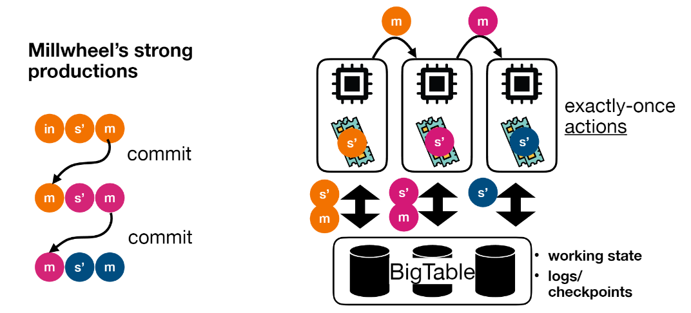
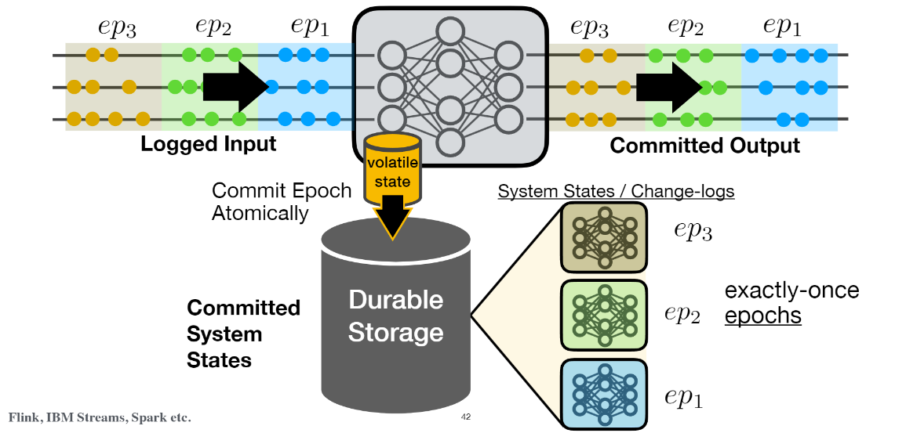

# [SIGMOD 2020] Beyond Analytics: the Evolution of Stream Processing Systems

## 1 Introduction

> What is a stream ?
> A data set that is produced **incrementally** over time, rather than being available in full before its processing begins.
>
> - Data streams have **unknown**, possibly **unbounded length**
> - They bear an arrival and/or a generation **timestamp**
> They are produced by external sources, i.e. **no control over arrival order and rate**

**第一阶段**的流数据管理系统Data Stream Management System, DSMS与数据库管理系统DBMS拥有非常类似的架构：

- Load Shedder**动态丢弃数据**以防系统过载
- 系统目标在于快速高效的给出**大约准确**的结果

**第二阶段**以[MapReduce](https://github.com/JasonYuchen/notes/blob/master/mit6.824/MapReduce.md)的出现为开端，经典架构就是双写数据的lambda架构

- 一侧写入低延迟的流处理系统获得快速但不精确的结果
- 另一侧写入高延迟的批处理系统获得准确但不及时的结果

- 这一阶段开始的系统不再将流处理系统视作不准确的系统，而是开始**通过流处理系统来高效获得精确的结果**，即使出现故障节点
- 数据的处理就是在流处理系统的有向图上流动，每个节点都是一个算子节点，通过对有向图的分析可以进行并行化等各种调度优化

**第三阶段**开始就是云上大规模分布式数据流系统：

- input: **out-of-order**
- resutls: **exact**
- query plans: **independent with custom operators**
- execution: **distributed**
- parallelism: **data/pipeline/task**
- time&progress: **low watermarks, frontiers**
- state: **per-query, partitioned, persistent**
- fault-tolerance: **distributed snapshots, exactly-once**
- load management: **backpressure, elasticity**

## 2 Review of Foundations

### 2.1 Languages and Semantics

> Till today, various communities are working on establishing a language for expressing computations which combine streams and relational tables, without a clear consensus.

可以参考[Streaming Systems](https://github.com/JasonYuchen/notes/tree/master/streamingsystems)中的[Streaming SQL](https://github.com/JasonYuchen/notes/blob/master/streamingsystems/08.Streaming_SQL.md#chapter-8-streaming-sql)

### 2.2 Time and Order

由于网络波动、传输乱序等等，流数据通常不一定按照顺序抵达处理系统，此时就引入了**乱序处理、重排序**等过程，可以参考Streaming System中关于[处理时间的描述](https://github.com/JasonYuchen/notes/blob/master/streamingsystems/02.What_Where_When_How.md#chapter-2-the-what-where-when-and-how-of-data-processing)以及更深入的[Advanced Windowing](https://github.com/JasonYuchen/notes/blob/master/streamingsystems/04.Advanced_Windowing.md#chapter-4-advanced-windowing)

时间的三种标记：

- **event time**：数据产生的时间，也称为application time，通常这个时间**最具有数据本身的意义**
- **processing time**：数据被系统处理的时间
- **ingestion time**：数据抵达系统的时间

导致乱序的原因：

- 外部不可控因素，例如网络路由、多个输入源交替产生数据等
- 系统处理因素，例如多个并行join产生shuffled的流数据等
  
    

**In-order架构**：

- 缓存入流数据
- 重排序入流数据
- 施加一个上限时间延迟，延迟超过此值的数据就会被丢弃

**Out-of-order架构**：

- 由算子或中心节点生成全局的进度信息progress information扩散给整个系统
- 产生进度信息例如**watermark**，参考[此](https://github.com/JasonYuchen/notes/blob/master/streamingsystems/03.Watermarks.md)，忽略晚于此的数据
- 与In-order架构最大的不同在于**数据按照抵达顺序被处理而不会有重排序过程**，注意这并不是指产生乱序数据，而是指[处理乱序数据](https://github.com/JasonYuchen/notes/blob/master/streamingsystems/04.Advanced_Windowing.md#%E4%BA%8B%E4%BB%B6%E6%97%B6%E9%97%B4%E7%AA%97%E5%8F%A3-event-time-windowing)

### 2.3 Tracking Processing Progress

追踪流处理系统的处理进度：

- **punctuation**：元数据标记（？）
- **watermarks**: [Watermark](https://github.com/JasonYuchen/notes/blob/master/streamingsystems/03.Watermarks.md#chapter-3-watermarks)，更加**泛化的代表流数据在系统中处理的进度**，不仅仅是类似heartbeats的流数据时间上的节点，watermark是最为常见的一种方式
- **heartbeats**：由外部数据源周期性产生的心跳数据，每个心跳数据带有时间戳，代表着在**此时间之前的数据已经全部产生**，类似于数据源端产生的时间watermark
- **slack**：由用户**query指定允许额外等待**迟到的数据不超过slack条数或时间
- **frontiers**：类似于watermark

## 3 Evolution of System Aspects

### 3.1 State Management

> The need for **explicit state management** originates from the need to keep and automate the maintenance of persistent state for event-driven applications in a reliable manner.

#### 3.1.1 Scope

- **State as a Synopsis**
  早期使用的策略，通常**state作为DSMS内置的状态**，用户无法直接访问，往往是瞬态维护在内存中的

  - 优点在于完全由系统来维护，性能较好，可以被系统充分重用、共享等
  - 缺点也在于此，紧耦合并完全由系统维护导致了灵活性受限（只能使用系统支持的算子）无法使用用户自定义的状态
- **Application-Managed State**
  系统完全不提供状态管理，而是将状态管理留给了应用程序，通常可以是**应用程序内的状态process-local state**或是由程序员定义并保存到**外部状态external state**

  - 优点在于高度灵活，可以使用任意复杂的状态和数据结构
  - 缺点则是完全手动管理状态带来的高应用程序复杂度，并且当依赖外部状态时往往引入了第三方依赖，同时完全依赖应用层的状态失去了系统优化的可能性
- **System-Managed State**
  与State as a Synopsis有所不同，这里同样是由系统来管理状态，但是用户可以**通过API控制状态**，状态是一等公民

  - 优点是由系统来管理状态减轻了用户的负担，同时提供API给用户来灵活的控制系统
  - 缺点就是灵活性带来的有限优化和有限状态类型

#### 3.1.2 Scalability

可扩展即意味着分区扩容，状态本身可以分为两种粒度的状态：

- **Task-Level State**
  task级别的状态，通常可以映射到计算任务的物理分区physical partitioning，并且也**难以在此基础上进一步分区**（task已经是最小粒度）
- **Key-Level State**
  key级别的状态（`keyby, groupBy`），通常可以映射到计算任务的逻辑分区logical partitioning，显然很**容易在此基础上进一步分区**

#### 3.1.3 Persistency

- **Embedded State**
  目前最为流行的可扩展状态设计，每个算子在处理task时采用**无共享shared-nothing**的模式，都维护自己私有的状态存储，完全不依赖外部节点，例如Flink、Spark Structured Streaming等系统

  - 此类状态**性能优越**，不需要依赖外部系统
  - 但由于状态与节点自身强耦合导致**配置变更、事务支持（分布式事务）、可扩展性上表现不佳**

  以Flink with RocksDB为例，Flink节点持有本地的RocksDB，所有状态相关的读写、快照均通过RocksDB完成：

  

  采用LSM结构例如RocksDB的状态存储是最常见的方式，但依然有更多可以考虑的方面：
  - 流访问数据时确保了非并发，因此存在**多余的low-level latching**
  - **index-based的后端**更适用于高效的流读取（研究热点，针对流数据的读取模式设计新的存储系统），例如较为热点的两种后端：
    - **RocksDB**是基于LSM的有序存储
    - **FASTER**是基于Hash的无序存储（`TODO: SIGMOD 2018 Microsoft`）
  - **新型硬件**的特化支持，NVMe，RDMA等

- **External State**
  算子通过与外部状态存储交互来完成计算，所有节点**共享外部状态存储**，例如Google Dataflow、RisingWave等系统

  - 这种设计**分离了存储和计算层**，并且可以各自单独针对存储节点、计算节点做扩容，对云更友好，也因此更易于支持配置变更、容灾恢复等，因为**计算节点是无状态的**
  - 相应的缺点在**于对存储层的性能要求较高**，并且**处理延迟**相较内置状态存储的系统会更大

  以Google Dataflow (Millwheel) with Spanner/BigTable为例，Dataflow通过外部的Spanner/BigTable数据库来管理状态的读写和快照，自身的Task是无状态的，所有更新都通过单条事务完整的写入外部数据库：

  

- **Embeded Compute**
  与其他服务于计算的状态不同，这一类是服务于状态的计算，即**基于存储系统的内置流计算引擎**，例如Kafka-Streams on Kafka、S-Store on H-Store等系统

  - 由于是在存储系统中内置了计算模块，因此可以充分利用系统内的优化手段，但同样也依赖存储系统本身的性能
  - 缺点就是高度耦合了存储模块和计算模块，通常计算性能无法与精细调整的其他流数据系统相媲美

  以S-Store on H-Store为例，通过在H-Store上的插件S-Store，实现了**将无限的流数据计算过程转换成了一系列事务，每个事务可以包括数个task的计算**，并且在H-Store上调度执行并group commit从而完成计算：

  

  以Kafka-Streams on Kafka为例，Kafka本身是log as a database，通过额外引入RocksDB来保存状态并在每个Kafka Brokers上完成计算task：

  

关于状态存储，另外还可以参考：

[流处理的状态存储在设计时有哪些考虑](https://zhuanlan.zhihu.com/p/506869449)

- **Ordered Store vs. Hash-based Store**
  例如RocksDB和FASTER，没有明确的胜出者，但FASTER的优缺点过于明显且更不稳定
- **Single Store vs. Multi Store**
  单个存储后端难以在所有场景下表现优秀（**one size cannot fit all**）；对于内置算子，根据算子特点来**选择合适的存储后端**（RocksDB或FASTER），而对于用户自定义算子UDF，则根据**代码分析、在线学习来推测**合适的存储后端
- **General Store vs. Dedicated Store**
  RocksDB作为一个通用存储，优化目标主要是durability、atomicity等，从未包括流处理真正希望的：
  - **状态存储后端不需要容错**：流处理系统本身有快照和恢复机制，存储后端不需要WAL等容错机制
  - **状态存储后端不需要并发读写支持**：每个算子都有自己独立的状态需要维护，因此只有一个writer，存储后端的并发支持是多余的
  - **状态存储后端不需要状态分区**：入流数据本身已经shuffle分区，在存储后端中不需要再进行一次分区

  另一方面RocksDB本身的内置**compaction**会更加影响到流数据的处理性能（`TODO: 补充细节`），流数据系统中的**compaction更应该作为一个算子存在**，由上层精细控制其运行

  流数据处理**更应该使用一个针对流数据优化的专用存储后端**`TODO: 研究RisingWave的存储后端实现`
- **Embedded Store vs. External Store**
  内置状态存储和外部状态存储主要影响以下几个方面：
  - **延迟**
  - **配置变更**
  - **性能优化空间**
  - **可扩展性**

[什么是流计算的状态](https://www.zhihu.com/question/62221304/answer/2312737176)

[RisingWave: Rethinking State Management in Cloud-native Streaming Systems](https://github.com/JasonYuchen/notes/blob/master/talks/current/Rethinking_State_Management.md)

#### 3.1.4 Consistency

- **Action-Level** Transactional Stream Processing
  - commit每个操作到状态存储中

- **Epoch-Level** Transactional Stream Processing
  - commit每个epoch到状态存储中，做法有两个方式：
  - Variant 1 - **Synchronous Epoch Commits**：即采用类似[两阶段提交](https://github.com/JasonYuchen/notes/blob/master/cmu15.445/23.Distributed_OLTP.md#%E4%B8%A4%E9%98%B6%E6%AE%B5%E6%8F%90%E4%BA%A4-two-phase-commit-2pc)的方式，coordinator向所有处理ep1的task发出准备提交的消息，随后再发出提交并保存系统此时的状态，**显著的缺点在于必须等待所有ep1的task处理完成**
  - Variant 2 - **Distributed Snapshotting**：即采用[分布式一致性快照](https://github.com/JasonYuchen/notes/blob/master/dsaaa/08.Distributed_Snapshot.md#chapter-8-distributed-snapshot)协议，从而一个一致性快照就包含**系统的状态**和相应的**在途消息**，非常像数据库的物化视图（系统状态）再加上尚未应用的redo日志项（在途消息）
    - Variant 2.1 - **Stop-The-World**：类似二阶段提交的方式，第一阶段要求所有节点停止运行，并准备快照，第二阶段生成并保存快照，与Variant 1比较接近
    - Variant 2.2 - **Unaligned Epoch Snapshots**：一个起始进程向流系统注入一个特殊的marker，**收到第一个marker的节点就开始进行快照**而不必等待所有上游节点的marker，一旦收到某个上游的marker后系统必须**将所有该上游后续消息记录到redo log**里直到收到所有上游的markers，从而系统的状态加增量的消息一起构成了快照，例如Flink采用的**Chandy-Lamport修改版算法**
    - Variant 2.3 - **Aligned Epoch Snapshots**：同样注入特殊的marker，一旦收到某个上游的marker后就阻止处理该上游的后续消息，直到收到所有上游的markers才会开始执行快照，因此**快照仅包含系统状态**而没有在途的消息（类似于半同步的做法），从而认为每个节点是对齐的aligned，相较于unaligned算法性能略微差一些，aligned算法能够反映一个完整的epoch事务，同时由于**没有redo log及消息回放**因此配置修改、容灾恢复时非常高效

`TODO: Chi: A Scalable and Programmable Control Plane for Distributed Stream Processing Systems`

### 3.2 Fault Recovery and High Availability

通常流处理的目标往往在于低延迟，而高可用和容错则是大规模分布式系统所必备的属性，如何**让故障转移，容灾恢复尽可能小的影响到正在进行的流数据处理**是难点

#### Fault Recovery

常见的恢复方式包括两大类：

- **Checkpoint-based recovery**: Accumulated state
  - 算子持续接收数据并更新本地状态，同时算子之间会周期性的生成一个**分布式一致性快照**保存到持久化存储上
  - 当某个算子故障时重启，就会从持久化存储上读取保存的快照，并重建所有算子的状态确保**全局恢复到一致点**
  
  

  

- **Lineage-based recovery**: State updates
  - 算子持续接收数据并更新本地状态，同时算子会将更新**批量写入持久化存储并提交commit**
  - 当某个算子故障时重启，就会从持久化存储上**重放数据来重建状态**，并且其前序算子也需要读取部分数据并**重新计算后，再输出给新启动的算子**

  

流数据系统可以提供的**processing guarantees**：

- **At-most once**
- **At-least once**
- **Exactly-once**

#### The output commit problem

> A system should only publish output to the outside world when it is certain that the system can recover the state from where the output was published so that **every output is only published once**

该要求在不同的系统中有不同的名字，包括Exactly-once processing on output，Precise recovery，Strong productions，在系统**故障恢复时可能出现重复发送**数据给外部系统：

达到**端到端恰好一致性end-to-end**的方式包括：

- **Transaction**-based techniques
  采用**tuple identity**的方式，对每一条tuple都用uid来标识，从而**下游系统主动忽略uid重复的数据**

  

- **Time**-based techniques
  采用**progress**的方式，系统中使用一个逻辑时钟，将单调递增的逻辑号赋给每个tuple，同时每个算子的checkpoints也包含最新的逻辑时钟值，恢复时算子也会采用checkpoints中的逻辑时钟值，并**忽略上游输出的所有小于该时钟的数据**

  

- **Lineage**-based techniques
  采用**input-output dependencies**的方式，每一条数据的产生都有其依赖的上游数据，这些上游数据也都有各自依赖的上游，因此当需要宕机恢复时，算子会**cascading形式递归向上游获取数据来重建自身的状态**，参考[Spark中lineage的做法](https://github.com/JasonYuchen/notes/blob/master/mit6.824/15.Big_Data_Spark.md#fault-tolerant)，另外也同样存储了tuple的uid用于下游去重

  

- **Special sink**
  例如sink是数据库，并且支持两阶段提交，即可以**撤回输出retract output**，那么显然就可以通过这种**transactional sink**来支持恰好一致，包括两种具体的做法：
  - **Optimistic** output techniques, **MVCC, Versioned/truncatable** output destinations
  - **Pessimistic** output techniques, **WAL, Transactional** sinks

#### High Availability

- **Active-standby (replicate computations)**
  运行两个以上的计算实例，双写所有数据，从而当一个计算实例宕机时直接切换到备份计算实例上，随后当宕机实例恢复时，就会自动作为备份实例预备切换，包括：

  - **数据流副本 dataflow replicas**

    

  - **节点副本 node replicas**

    

  这种容灾方式的主要难点在于需要**协调副本replicas来做到exactly-once**语义输出，并且恢复后的实例需要能够快速追赶上当前的进度

  - **双向确认**：primary处理完数据后向standby发送ACK确认序列号，随后standby才能从缓冲队列中删除该数据，相应地standby也需要向primary发送ACK

    
  
  - **单向恢复**：恢复的节点直接从运行中的节点获取状态信息，快速追赶上运行中节点的状态
  - **AAA恢复**：除了primary和standby两个replicas以外，专门有**第三个replica做checkpointing**，当需要宕机恢复状态时，从checkpointing节点获取状态并快速恢复（像是错开snapshoting的Raft架构？）

- **Passive-standby (replicate state)**
  运行单个计算实例，但是会将primary的状态更新发送给standby节点，包括：

  - **针对云优化 optimized for the cloud, resource utilization**

    

    

  - **针对可用性优化 optimized for aailability, recovery time**

    

    

  这种容灾方式适合**动态调整策略**，根据资源、可用性的需求可以随时setup/teardown节点，符合云上的环境

- **Upstream backup (replicate streams)**

  不需要采用checkpointing和state update，每个节点维护一个**输出队列output queue log**，但显然无法保存所有的输出数据，因此会**丢弃过早或已被ACK的数据**，采用**逐级确认**的方式，OP3向OP2发送已处理数据的ACK，OP2删除数据后再向OP1发送ACK（类似链式复制chain replication），显然缺点之一就是一旦流数据处理链过长，ACK延迟会导致处理效率极其低下，同时输出队列会增长到难以承受的长度

  

  

- **Measure availability**
  在流数据处理系统中，只要系统能够接收输入数据并输出结果，就视为可用，另外也可以根据**处理进度**，例如event time和processing time的差距，来描述可用性

### 3.3 Elasticity and Load Management

早期的流数据系统通过动态**负载限制load shedding**的方式来避免系统过载，这种方式通过算法决定丢弃一部分入流数据（where，when，how many，which）来实现在**结果质量有限下降**的情况下系统**高效稳定运行**

现代流数据系统通常充分利用充足的云计算资源，通过**分区partition**和**弹性elasticity**扩容缩容来适应工作负载的变化，流数据系统会持续检测性能并在需要时扩容和缩容相应的算子，来确保分区和处理的准确性、时效性，另一方面在数据源支持的情况下，流数据系统也可以采用**背压backpressure**的方式来实现主动限流

由于外部数据源的生产速度无法控制，因此一个稳健的流数据系统应该能够**应对数据流速率的变化**

#### 3.3.1 Load Shedding - Selectively drop tuples

当系统无法及时处理传入的数据时，采用一定的策略来主动丢弃数据，这需要**尽可能的减少对数据准确度的影响**，往往是早期流数据系统会采用的方案

- **When**：Load Schedder会持续观测入流数据的量，以及系统的当前处理能力，**基于统计值statistics**来决定何时启动shedding，通常也会引入**反馈控制feedback control loop**
- **Where**：可以是在数据源执行丢弃（下图第二种），或者是在瓶颈算子前丢弃（下图第一种），在数据源丢弃可能会影响到多个算子的结果，而在算子前丢弃可能会导致重复执行，即多个算子前都要执行一次丢弃，本质上就是**丢弃的粒度**问题
- **How many**：通常只要丢弃到系统能够处理即可，过度丢弃会影响精确度且没必要
- **Which**
  - **Random**：随机丢弃
  - **Window-aware**：在丢弃时直接整个窗口数据丢弃，从而其他窗口数据依然是准确的，保证了**窗口完整性window integrity**
  - **Concept-driven**：需要对业务有感知，检查数据内容**计算连续窗口数据的相似度similarity metric across consecutive windows**再执行丢弃

#### 3.3.2 Load-aware Scheduling - Adapt resouce allocation

根据负载**动态调度算子的执行顺序**，从而尽可能将整个系统的缓冲区大小控制在尽可能小，如下图**链式调度chain scheduling**的方法：

- 这个方法假定源数据产生速度一定能够被系统完全消耗，关键在于**减少资源占用**
- 每个算子有一个**优先级priority**，越高优先级的排在调度的越前面
- 算子的优先级取决去其在调用链的位置，以及该算子的**选择性selectivity**，每单位时间内能够减少多少数据量
- 下图中的lower envelope越低，则系统整体额外的资源占用越少

#### 3.3.3 Back-presure - Slow down the data flow

背压机制实际上就是通过堆积数据最终达到**所有环节的处理速度都等于最慢的节点的处理速度**，这种设计通常需要有一个持久化存储层来保证数据不会丢失

- **Local Exchange**：单机内的producer和consumer共享缓冲区实现背压

  

- **Remote Exchange**：多机的producer和consumer实现背压，例如TCP缓冲区，当读取速度变慢后，上游写入也会变慢，但仅依赖TCP的机制过于简单粗糙，若一条连接是多路复用承载不同类型数据的，一种数据过多会直接导致本能处理的其他数据也发送不过去

  

- **Credit System**：通过一个令牌系统来维护全局的credits，从而控制所有节点的处理速度，并且每个算子都可以根据自身的一个或多个下游的credits来决定数据发送速度，从而更精细的控制流量，代价是可能会略微提升端到端的处理延迟

  

#### 3.3.4 Elasticity - Scale the number of resources

在云上的系统，通常可以随时动态启动节点和资源，**弹性扩容/缩容**以应对流量的变化

- **Control**: When and how much to adapt?
  - 监测环境、流量、系统性能的变化
  - 检测出瓶颈算子、缓慢异常节点
  - 根据扩容/缩容的措施，预估影响范围和大小，决定策略以及实施的时机
- **Mechanism**: How to apply the re-configuration?
  - 分配资源、启动新实例、剔除问题节点等
  - 调整数据流和网络拓扑关系
  - 数据流重新分区，并将状态迁移到新实例上
  - 采用一些措施来确保扩容/缩容后计算结果的准确和一致

Dhalion (VLDB 2017)提出了一种**启发式heuristic**算法来执行动态扩容缩容如下图：

DS2 (OSDI 2018)提出了一种**预测式predictive**算法来执行动态扩容缩容，其通过采集节点的状态统计信息（忙碌时间占比等）并假定理想工作状态来执行预测算法，例如如下：

1. 原始配置中显然`o1`是瓶颈，只能处理10qps，从而`src`和`o2`都有更多的时间处于等待状态，而我们的目标是整个系统能够处理40qps并且不浪费资源
2. `o2`目前的处理量是100qps，同时`o2`的空闲时间占比是50%，因此其理想处理能力是200qps，同理计算出`o1`的处理能力
3. 基于目标40qps，那么就会执行`o1`扩容到4倍节点，`o2`扩容到2倍节点

在执行动态扩容、缩容时，**变更reconfiguration**的执行策略也可以分为三大类：

- **Stop-and-restart**：**暂停所有计算**，并且对全局执行快照，随后重启所有节点并采用新的配置
- **Partial pause and restart**：在流计算网络节点图中，仅**暂时停止受变更影响的子图**，其他节点正常运行，这些受影响节点相当于执行stop-and-restart，例如FUGU, Seep系统的做法（迁移部分或全部partitions或state）：
  
  1. 暂停`a`的上游节点，并且在上游节点前的输入缓冲开始暂存数据
  2. 由`a`处理完目前自身暂存的数据，随后开始保存自身的状态
  3. 将`a`的状态传递给`b`
  4. `b`加载`a`的状态后可以发送`restart`给上游节点继续消费

  

- **Pro-active replication**：在多个节点上维护**状态副本replicas**，从而在变更过程中不需要暂停/重启任何节点，例如ChronoStream, Rhino系统的做法：

  1. 状态一共分成8个partitions，并且共有2个replicas即`Nsrc/Ndest`，将partition 1从节点`Nsrc`移动到节点`Ndest`上处理
  2. leader通知原先作为backup的`Ndest`加载p1，期间`Nsrc`依然继续正常处理上游`Nup`发送给`Nsrc`关于p1的数据
  3. leader在收到`Ndest`关于p1的确认（包含所加载的p1的进度信息）后，将p1迁移以及进度通知上游`Nup`
  4. 上游`Nup`将p1数据的路由修改至`Ndest`，并从所提供的进度信息重新发送该进度后的数据，即重放replay
  5. leader通知`Nsrc`关于p1已经迁移结束
  6. 显然`Ndest`提供的进度信息一定不可能比`Nsrc`更新鲜，因此由于replay的机制，这里`Nsrc`可以直接将p1下放到backup，并继续处理数据

  

除了执行策略，另一个描述变更reconfiguration的维度就是**状态转移方式state transfer strategies**：

- **All-at-once**：一次性转移所有数据，代价就是当状态庞大时会引入高延迟
- **Progressive**：增量式转移数据，例如逐分区、逐key等，代价就是状态转移的总时间会延长 `TODO: Megaphone VLDB 2019`

#### Self-managed and re-configurable system

## 4 Prospects

### 4.1 Emerging Applications

- **Cloud Applications**
  
  

- **Maching Learning**

  

- **Streaming Graphs**
  - state management
  - partitioning (of unbounded graphs)
  - algorithms
  - languages and operator semantics

  > *Practice of Streaming and Dynamic Graphs: Concepts, Models, Systems, and Parallelism*

  

### 4.2 The Road Ahead

- **Programming Models**
  - Actor-like APIs
  - Streaming ML APIs
  - Streaming graph abstractions
- **Transactions**
  - Distributed transactions, coordiation, automated management
- **Advanced State Backends**
  - **Workload-Aware State Backends**
    - Databases: optimal plans using different indexes
    - Stream Processors: LSM for every operator
  - **Queryable State**
    - materialized views
    - exploratory data analysis
  - **State Versioning**
    - schema evolution
    - time-travel stream state access
    - MVCC on stream state
  - **Inter-Query/Task State Sharing**
    - mutable shared state for ML applications
    - inter-query optimization
- **Loops & Cycles for Iterative Computation**
  - Asynchronous Loops
  - Synchronous Loops
- **Elasticity & Reconfiguration**
  - Spawn instances on demand
  - Change resource allocation
  - Update operator logic
- **Hardware Acceleration**
  - GPUs: hetergeneous architectures
  - Multicore
  - FPGAs
  - NVMe
  - RDMA
  
  > *Hardware-conscious stream processing: A survey SIGMOD Record 2020*
