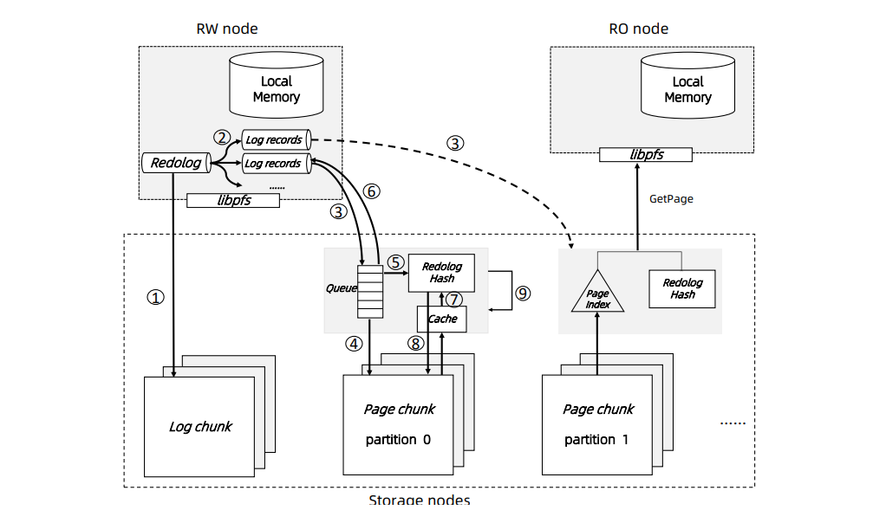

# [SIGMOD 2021] PolarDB Serverless: A Cloud Native Database for Disaggregated Data Centers

## 1 Introduction

云数据库的架构通常可以分为三大类：

- **单机一体式 monolithic machine**
  所有资源（计算、内存、存储等）高度耦合，一个物理机上应该分配的一体式数据库数量难以调整，整体资源利用率较低，且存在**伪共享false sharing**的问题，即一个实例的故障、运行异常会影响到同物理机上的其他实例，且数据库实例的容灾、恢复更为复杂
- **存储计算分离 separation of compute and storage**
  - 远端存储 virtual machine with remote disk
  - 共享存储 shared storage
  
  可以根据需求，动态扩容缩容计算资源和存储资源，整体资源利用率更高，但是由于CPU和RAM依然强耦合，不能更灵活的调整资源
- **分离式 disaggregation**
  进一步解耦计算和内存资源，使得处于通过高速网络连接的多个数据中心上的节点能够更加高效的利用资源，实现动态扩容缩容，不同的资源节点可以更高效的实现容灾恢复，避免资源耦合带来的伪共享问题


## 2 Background

### 2.1 PolarDB

(TODO: Cloud-native database systems at alibaba: Opportunities and challenges)

PolarDB是一个采用共享存储架构的云原生数据库，从MySQL的基础上发展出来，底层存储层采用了PolarFS，包含一个**读写节点RW node**和多个**只读节点RO nodes**，每个节点都包含一个SQL处理器、事务引擎（例如InnoDB或是X-Engine）、缓存池来提供数据库服务

PolarFS是一个持久化、原子、可扩展的分布式存储服务，存储的数据会分片成10GB的数据块chunk，每个卷volume支持动态扩容至最多10000块数据，即100TB数据，每个数据块采用**Parallel Raft**（TODO: ）算法达成三副本共识，RW节点和RO节点通过redo logs和LSN来协调一致性，一个事务的流程如下：


1. 事务准备提交
2. RW节点刷写所有redo log记录到PolarFS中
3. 事务此时可以提交
4. RW节点广播给所有RO节点此时的redo log已经更新，且最新的LSN位置
5. RO节点收到广播后，从PolarFS获取redo log的更新
6. RO节点将redo log的更新应用到自身的缓存页中
7. RO节点将自身应用的LSN位置回复给RW节点
8. RW节点后台会周期性的根据当前所有RO节点返回的LSN位置，将redo log中位置小于`min{LSN_RO_i}`的日志项清除，并且将比该位置更旧的脏页刷写进PolarFS
9. 期间，RO节点持续可以给携带有早于`LSN_RO_i`版本号（快照隔离）的读事务提供服务

- 当系统监测到某个RO节点的负载过重，导致`LSN_RO_i`更新较慢，与`LSN_RW`产生巨大滞后时，阻塞了上述RW节点依赖`min{LSN_RO_i}`刷写脏页的过程，就会被剔除出集群，避免影响整个系统的响应
- 前端的代理层提供了负载均衡服务，将写流量导入RW节点，将读流量分配到RO节点上

### 2.2 Disaggregated Data Centers

在分离式的数据中心，计算节点、内存节点、存储节点相互通过高速网络连接，并且采用了RDMA技术


### 2.3 Serverless Databases

- auto-scaling
- auto-pause

## 3 Design

### 3.1 Disaggregated Memory

#### Remote Memory Access Interface

数据库通过librmem提供的接口来访问远端内存池，核心API主要有：

- `int page_register(PageID page_id, const Address local_addr, Address& remote_addr, Address& pl_addr, bool& exists);`
  管理页的生命周期，分配页（若不存在）并增加引用计数
- `int page_unregister(PageID page_id);`
  管理页的生命周期，减少引用计数并回收页（若引用计数归零）
- `int page_read(const Address local_addr, const Address remote_addr);`
  采用one-sided RDMA读取页
- `int page_write(const Address local_addr, const Address remote_addr);`
  采用one-sided RDMA写入页
- `int page_invalidate(PageID page_id);`
  **由RW节点使用，用于将所有RO节点上缓存的页全部失效化**

#### Remote Memory Management

一个数据库实例所占用的远端内存资源可能是由多个不同的内存结点所提供的，内存分配单元是1GB大小的slab，slab实际上由Page Array来实现：

- **Page Array, PA**：对应一个slab，由连续的16KiB大小的页构成，当一个内存结点启动时，所有PA所在的内存都会被注册给RDMA NIC，从而其中的page可以被远端节点通过one-sided RDMA操作

持有slabs的内存结点也称为slab node，当数据库实例启动时，其预先定义的slab需求（predefined buffer pool）就会从多个内存结点上预备slabs，其中第一个预备slab所在的slab node又称为home node，会包含额外的元信息：

- **Page Address Table, PAT**：包含有每个页的位置（slab node id & physical memory address）和引用计数信息
- **Page Invalidation Bitmap, PIB**：与PAT中的项对应，位图索引记录页是否失效，`0`代表页数据是最新的，`1`代表页数据已经被RW节点更新过并且尚未写回远端内存池；同时每个RO节点有个本地PIB用于记录该RO节点本地缓存的页是否失效
- **Page Reference Directory, PRD**：与PAT中的项对应，记录了每个页被引用的数据库实例，即对每个页调用`page_register`的数据库实例列表
- **Page Latch Table, PLT**：与PAT中的项对应，记录了页级别的锁page latch，用于保护页数据，同步多个数据库实例对同一个页的并发读写，主要用于保护B+树索引

**一次页的分配流程**如下：

1. 数据库实例调用`page_register`给home node，若page不存在则会由home node扫描所有slabs来找到最为空闲的slab并分配page
2. 若所有slab都被填满，则会寻找引用计数为0的页进行汰换（LRU策略），由于存储层支持page materialization offloading，因此即使是脏页也并不需要写回，可以直接汰换
3. home node根据找到的page，将地址更新进PAT，并返回page和PL给调用的数据库，显然**整个过程中home node仅依赖自身的元信息，不会与任何其他slab node交互**，从而提高性能
4. 若数据库实例的buffer pool**弹性扩容**，则会由DBaaS分配新的slabs给实例，并且更新上述元信息，而**弹性缩容**时就会根据LRU策略汰换掉一些页，**后台会进行迁移聚合**形成完整未被使用的slab再释放

#### Local Cache

远端内存即使采用的RDMA，其访问代价依然显著高于访问本地内存，因此数据库实例依然会持有本地缓存

当一个访问的页并不存在于本地和远端内存中时，数据库实例会采用libpfs从PolarFS中读取到本地缓存，根据需要（例如执行**全表扫描时，访问的页通常短时间内不会再访问，写入远端内存反而会降低资源利用率，污染缓存**）再采用librmem写入到远端内存中，内存节点和存储节点之间并不会有直接交互

当本地缓存满时，page同样采用LRU策略进行汰换，脏页被汰换时还需要写回远端内存，并且需要调用`page_unregister`进行引用计数的更新

本地缓存的命中率对系统整体性能有重大影响，因此引入了**预读取prefetching**等手段进行优化

#### Cache Coherency

PolarDB Serverless与[PolarDB的事务流程](#21-polardb)不同，后者的RO节点必须通过重放redo logs来重建pages而不能直接访问RW节点的缓存，在PolarDB Serverless中RW节点写回远端内存的页数据可以直接被RO节点访问，但是由于节点私有了本地缓存以及共享远端内存，**缓存一致性必须保证**


PolarDB Serverless通过**缓存失效cache invalidation**策略来保证缓存一致性：

1. RW节点更新页数据
2. RW节点调用`page_invalidate`发起缓存失效
3. home node会在该页对应的PIB中设置页失效标记，即位图置`1`
4. 根据PRD找到所有引用该页的RO节点，这些RO节点的本地缓存中存有该页的缓存数据
5. home node向这些RO节点发起缓存失效
6. RO节点会在本地PIB中设置页失效标记，即位图置`1`
7. `page_invalidate`是一个同步操作，当所有RO节点返回时才成功，期间若某个RO节点超时未响应，则DBaaS会介入将该节点剔除
8. 回复RW节点缓存失效成功

每个事务会被分为多个微事务mini-transactions MTR，**每个MTR是一组连续的redo log records**，在一个MTR对应的redo logs都被刷写进PolarFS之前，所有该MTR中修改的页都必须采用`page_invalidate`进行标记，保证在远端内存中不存在一个状态是有效但数据是落后的页，故障恢复依赖该保证

### 3.2 B+Tree's Structural Consistency

并发控制包含两个部分，第一部分就是**物理上的并发安全**，避免多个线程同时修改索引导致出现空悬链接等不一致情况，第二部分就是**逻辑上的并发安全**，保证多个并发事务的不同隔离级别

在PolarDB Serverless中只有RW节点能够修改页，因此对于B+树不需要预防多个节点的冲突修改，关键在于RW节点对B+树进行结构修改时**Structure Modification Operations SMO**（例如B+树节点分裂）要确保RO节点不会看到不一致的节点，通过采用PLT上的**全局物理锁global physical latch**来确保这一点，同样有**共享锁S-PL**和**独占锁X-PL**两种模式，并发访问B+树的加锁流程基本与[单节点访问](https://github.com/JasonYuchen/notes/blob/master/cmu15.445/09.Index_Concurrency_Control.md#b%E6%A0%91-b-tree-latching)类似

当RW节点需要插入、删除数据时，流程如下：

1. 首先进行乐观操作，即只在本地进行加锁操作并尝试更新节点，假如不会引入B+树结构变化时，**即没有SMO时，就不需要PLT的协助**，此时只需要RW节点内的锁操作即可完成
2. 当发现需要SMO时，重新从根节点开始并且对相应的路径上都逐个采用X-PL加锁（当然也需要同样加上本地的独占锁X），直到插入、删除数据结束，节点分裂、合并结束时才会释放所有X锁和X-PL锁

当RO节点需要读取数据时，就会从根节点开始采用X-PL加锁，从而确保了RW节点和RO节点的安全

另外由于PLT由中心节点完成服务，因此另外两种优化措施引入以提升锁的性能：

- **stickness**，当SMO操作完成时，**PL并不会马上被释放，而是一直持有直到遇到RO节点的请求**为止，这样可以确保RW节点后续的操作可能继续持有锁而不需要频繁与PLT节点交互反复加解锁
- **RDMA CAS**

### 3.3 Snapshot Isolation

PolarDB Serverless**基于MVCC提供快照隔离Snapshot Isolation SI**，与InnoDB的实现一致，一条记录的前序版本由undo logs创建

事务基于快照时间戳来控制所能看到记录的版本，RW节点会维护一个中央时间戳/序列号Centralized Timestamp Sequence CTS来分配单调递增的时间戳给所有数据库节点：

- **读写事务需要从CTS获取两次时间戳**，事务开始时`ctx_read`和事务结束时`ctx_commit`，每条数据记录和undo log都有单独的列记录`ctx_commit`以及相应的`trx_id`，而读取操作只会返回携带的`ctx_commit`不大于该事务`ctx_read`的记录
- **只读事务只需要从CTX获取一次时间戳**，事务开始时`ctx_read`

但是一个较大的读写事务下，可能修改了非常多的数据记录，从而若在提交时同步写入所有行`ctx_commit`会带来较大的延迟（写入`ctx_read`则是随着事务进行发起的，因此代价平滑？），因此对于**大事务的`ctx_commit`写入是异步完成的**，这种情况下会导致并发的事务无法得知该已提交事务所影响的记录的版本，需要通过**查询RW节点上CTS的日志记录**来解决

CTS日志是一个环形数组，循环记录了最近的一批读写事务的`ctx_commit`，若该事务尚未提交则相应的`ctx_commit`为空，因此当任意数据库节点发现记录或undo log的`ctx_commit`为空时就可以查询CTS日志来确定该事务是否已经提交，是否可见

上述这种优化方式**类似于chat消息扩散写和扩散读的模型**，对于修改数据多的事务，写入每条数据的`ctx_commit`相当于"扩散写"，代价较大，此时选择其他并发事务主动来查询CTS日志，相当于"扩散读"，则不比等到所有`ctx_commit`写入完成，性能较高

由于获取时间戳的操作极为高频，PolarDB Serverless采用了one-sided RDMA CAS来原子获取并递增CTS计数器，并且CTS日志数组被放置在注册到RDMA NIC的连续内存中，从而RO节点能够极高效的查询CTS日志而不影响RW节点的CPU资源，避免RW节点称为瓶颈

### 3.4 Page Materialization Offloading

传统的单机数据库会周期性的将脏页刷写进存储中，而在PolarDB Serverless中这会引入巨大的网络通信开销，Aurora中将redo log视作page增量修改的记录，从而通过[不断的应用redo log就可以获得最新的page](https://github.com/JasonYuchen/notes/blob/master/papers/2018_SIGMOD_Aurora.md#%E5%86%99%E5%85%A5-writes-in-aurora)

PolarFS将数据库的log和pages分别存储（**log chunk和page chunk**），前端数据库实例的redo log首先追加到log chunks，随后再**异步发送给page chunks并持续更新pages**（发送给page chunk leader并通过ParallelRaft广播给所有page chunk replicas，由于**ParallelRaft可以确保page chunks的一致性**，因此不再需要Aurora中的gossip协议来保证一致）



1. 在RW节点提交事务前，首先需要刷写redo log到log chunks，当同步**写入三个log chunk replicas之后就可以提交事务**
2. RW节点根据涉及到的page不同，将redo log进行分区
3. 分区后的redo log记录被发送给相应的page chunk leader节点
4. 收到redo log记录后的page chunk节点会立即持久化保存
5. 随后将记录插入内存散列表，由page id作为key
6. 回复RW节点，在此刻，RW节点的脏页就可以被安全汰换
7. 后台中，**旧的page会从cache或disk中读取，并且与内存中该page的记录进行合并应用**从而生成新的page
8. 新的page会被再次写入page chunk中的新位置
9. **底层存储系统会记录一个page最近多个版本的数据**，用于响应数据库节点的按版本读取page需求，当page chunk leader节点收到`GetPage`请求时，会将cache或disk中的page数据与内存中更新的记录合并再返回最新的page给数据库节点

### 3.5 Auto-Scaling

作为一个Serverless的服务，为了避免前端应用感知到数据库服务的扩容和缩容、版本升级、重启等等事件，通过一个代理proxy来隐藏后端细节，当一个RW节点出现变动时，**proxy会等待一小段时间**，以确保旧RW节点完成工作、刷写脏页、停止服务，以及新RW节点启动上线、完成初始化、重建活跃事务列表，随后proxy节点**连接到新的RW节点来继续执行pending statements**，对于进行中的statement（数据库语句即statement，一次事务可以包括一条或多条statements）：

- **long-running statements**：会在新RW节点**回滚之后，由proxy重新提交**给新RW节点从头执行，这会带来一定的额外开销
- **long-running multi-statement transactions**，例如批量插入：proxy会对**每个statement记录一个savepoint，从而在新RW节点上继续执行**而不需要完全回滚，避免回滚再重做的额外开销

由于在切换时应尽可能快（期间需要暂停活跃事务的执行），PolarDB Serverless将**事务状态（脏页、回滚数据等）通过共享内存而不是远端存储来高效传递**，其他可能的优化还包括将事务锁放置在共享内存中来实现multiple RW节点、缓存中间结果加速分析型语句等

## 4 Performance Optimization

由于架构上的分离，计算节点、内存节点、存储服务，势必会导致数据库的性能恶化，因此引入了以下优化措施

### 4.1 Optimistic Locking

前述提到[RO节点需要获取S-PL来避免与RW节点的SMO冲突](#32-btrees-structural-consistency)，虽然在大部分情况下获取S-PL锁都可以通过RDMA CAS的乐观路径下完成，但是**依然有可能劣化到需要数次negotiation**

通常可以假定RO节点在从根节点到叶节点的扫描中依次获取S-PL锁的过程不会遇到RW节点的SMO，那么也可以认为**在这个过程中实际上不需要获取S-PL**，此时只需要**检测是否发生了SMO**即可，当检测到SMO时则重新开始扫描，做法如下：

- 在RW节点上维护SMO计数器`SMO_RW`，每次当SMO发生时RW节点就讲`SMO_RW`递增，并且SMO涉及到的所有pages都会记录该值作为`SMO_PAGE`一起存储
- 查询语句在开始时首先获得RW节点上的`SMO_RW`并作为`SMO_query`缓存，当RO节点执行从根到叶节点扫描B+树时，会对比获取到的每个page所携带的`SMO_PAGE`，一旦发现某个page存在`SMO_PAGE > SMO_query`，说明发生了SMO，此时需要重新执行查询流程

核心原理即乐观并发，假定不会有冲突，记录操作前的版本号，并在过程中检测是否发生了冲突，若未发生则将**原本的每个page读取都要获取S-PL优化到了只有一次开头获取`SMO_query`的操作**（SMO时则需要额外写入`SMO_PAGE`到pages，但本身这些pages就要修改，因此并没有引入额外的开销）

### 4.2 Index-Awared Prefetching

由于内存结点、存储节点的网络开销不可忽视，因此基于数据**局部性locality**的原理，预读取是一种普遍的优化方式，PolarDB Serverless提出**Batched Key Prepare BKP**优化

例如常见的访问二级索引的查询，如下，需要从二级索引中获取`age`，而其他域`name`等则从主索引中获取：

```SQL
SELECT name, address, mail FROM employee WHERE age > 17
```

MySQL等系统执行这种操作时，通常首先顺序（**预读取一系列B+树的叶节点pages**）扫描二级索引来获取符合`age > 17`的一系列主索引结果，随后根据结果的多个key来访问（大概率是随机IO）主索引获取其他字段的数据，而**存储引擎中的BKP**就在于优化上述的第二个过程，存储引擎会通过后台**预读取任务将这批key所涉及的页都从远端内存（BKP on Memory）/存储节点（BKP on Storage）读取过来**（类似于pipeline的模式？从二级索引连续获得符合条件的keys并不断将相应的pages从远端节点读取过来？另一个join的优化例子可能更能体现BKP的优势？）

## 5 Reliability and Failure Recovery

PolarDB Serverless完全分离式的架构允许每个类型的节点单独故障转移failover而不影响整体系统的平稳运行，所有前端的**proxy节点是无状态节点**可以随意重启、替换，用户可以选择任意一个可用的proxy获得服务；而底层存储系统PolarFS中的**存储节点会维护至少3个replicas，通过Parallel Raft算法实现容灾和高可用**

### 5.1 Database Node Recovery

PolarDB Serverless采用[ARIES](https://github.com/JasonYuchen/notes/blob/master/cmu15.445/21.Recovery.md#%E6%81%A2%E5%A4%8D%E7%AE%97%E6%B3%95aries-recovery-algorithm)类型的恢复算法，RW节点和RO节点有不同的恢复流程，**RO节点可以很轻易的被替换，继续采用共享内存中的page数据**，而RW节点的恢复则根据宕机情况有所不同：

- **非计划中的故障 Unplanned Node Failure**
  **集群管理节点Cluster Manager CM**会通过心跳检测到节点的宕机，并且启动一个RO节点升级流程，步骤如下：
  1. CM通知所有内存结点和存储节点拒绝旧RW节点的后续写请求
  2. CM选择一个RO节点并且通知其升级到新RW节点
  3. 新RW节点从PolarFS中收集每个page chunk的最近版本号`LSN_chunk`，并选择其中最小的值`min{LSN_chunk}`作为检查点版本号`LSN_cp`
  4. 新RW节点开始读取PolarFS log chunk上的redo log数据，从`LSN_cp`开始直到末尾`LSN_tail`，并且**将这些redo log数据分发广播到所有page chunks**上，等待所有page chunk节点应用这些redo log记录来更新page数据
  5. 新RW节点扫描远端内存池中的所有page，并且将**无效page（PIB中`invalidation=1`）全部汰换**，也将**旧page（携带的`LSN_page > LSN_tail`）全部汰换**
  6. 新RW节点将释放旧RW节点获取的所有PL锁
  7. 新RW节点扫描undo headers来**重建旧RW节点宕机时刻的所有活跃事务**
  8. 新RW节点此刻已经完成恢复，通知CM升级完成
  9. 新RW节点**在后台持续应用undo log来回滚**尚未提交的事务

  在上述过程中，步骤3和4实际上就是ARIES算法的**REDO阶段**，区别在于不再是单机执行而是多个page chunks并发执行；步骤5中，根据[缓存一致性的设计](#cache-coherency)，`invalidate=0`的page不可能比存储节点的page更新，另一方面RW节点有可能在redo log刷写进PolarFS之前已经将一些脏页刷写进远端内存，远端内存的page此时比持久化的存储节点page更新，这些page就有`LSN_page > LSN_tail`需要被清理；在**步骤5之后PolarFS中的redo logs、PolarFS中的pages，远端内存里的pages都保证了相互一致**

  步骤5过后所有数据保证了一致，此时也就**不存在处于进展中的SMO操作**，因此可以直接释放所有旧RW节点获得的PL锁，并且在宕机前的热数据基本都保存在远端内存中，因此这种设计同时也回避了传统数据库**冷启动cold cache**的问题
- **计划中的关闭 Planned Node Down**
  对于计划中的RW节点切换，旧RW节点会执行一系列清理工作，从而减轻新RW节点上线时的负担，包括同步redo logs到page chunks中、主动释放所有PL锁、将脏页数据写入远端内存、刷写redo logs到PolarFS中，这种准备之下就可以避免新RW节点上的步骤4-6，同时新RW节点还可以主动等待活跃事务数量较少时再真正升级上线，从而减轻步骤7和9的负担

### 5.2 Memory Node Recovery

由于logs总是比脏页写入内存节点要先写入存储节点（在上一节中提到了*RW may already write back dirty pages to the remote memory before the redo logs are flushed to PolarFS*，这里似乎**说法不一致**？但是由于前述的旧pages清理策略，因此这里通过存储节点重建并不会引入不一致），因此当内存节点宕机时可以**从存储节点完全恢复出所缓存的pages**

对于持有[关键元数据](#remote-memory-management)的home node来说，会通过**额外的同步复制机制**来进行容灾，并且home node会负责检测slab node的宕机，当slab node宕机发生时，会检查PAT并处理所有注册在该宕机节点的pages（从RW节点本地缓存中读取并重新注册，或直接`page_unregister`移除）

### 5.3 Cluster Recovery

极端情况下出现整个集群宕机，所有**数据库节点和内存结点都会从完全干净的状态重启，所有内存状态都会从存储节点上重建**，此时RW节点会执行[相同的并行REDO恢复](#51-database-node-recovery)，唯一的缺陷就是这种状态下会不可避免的出现冷启动问题

## 6 Evaluation

### 6.1 Experiment Setup

略过

### 6.2 Elasticity of the Disaggregated Memory


### 6.3 Fast Failover


不同的优化级别下的容灾：

- **Planned switch**：按计划切换RW节点
- **With remote memory**：启用远端内存以及所有优化措施
- **With page mat. only**：仅启用[page materialization](#34-page-materialization-offloading)，此时远端内存并不提供缓存的热数据，即会遇到冷启动问题，需要重新加载所有page数据
- **W/o page mat.**：不启用远端内存缓存和page materialization，此时RW节点需要完成redo log到page的重建过程，因此需要更多的恢复时间

### 6.4 Performance Evaluation

- 整体性能与PolarDB对比

  

- Effect of local memory size

  

  

- Effect of remote memory size

  

- Effect of [optimistic locking](#41-optimistic-locking)

  

- Effect of [prefetching](#42-index-awared-prefetching)

  

## 7 Related Work

- **Databases with decoupled compute and storage**
- **Databases with remote memory**
- **Databases in disaggregated data centers**
- **Computation pushdown**: near-data processing, data should be processed at the place close to where it is stored to eliminate unnecessary data access and movement.
