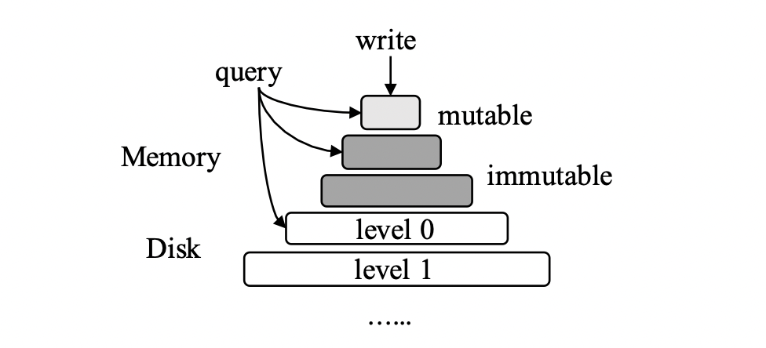

# [VLDB 2021] Constructing and Analyzing the LSM Compaction Design Space

## 1 Introduction

> **Compactions** fundamentally influence the performance of an LSM-engine in terms of **write amplification, write throughput, point and range lookup performance, space amplification, and delete performance.**

周期性的compaction用于把sorted runs合并，从而能够减少read/space amplification，但代价就是重复写入数据增加了write amplification，定义四个LSM-tree compaction的设计点：

- **compaction trigger**: 进行compaction的时机
- **data layout**: 数据compaction后的组织形式
- **compaction granularity**: 单次compaction的粒度
- **data movement policy**: 选择执行compaction的数据

Key Takeaways:

- There is **no perfect** compaction strategy
- It is important to look into the compaction **black-box**
- The **right compaction strategy** can significantly boost performance

## 2 Background

- **LSM-Basics**
  
  

- **LSM-Compactions**
  - full compaction
  - partial compactions

  

- **Querying LSM-Trees**
  - point lookups (bloom filters, fence pointers)
  - range scans (across all levels of the tree)
- **Deletes in LSM-Trees**
  - lazy deletion (tombstone)

## 3 The Compaction Design Space

- **Compaction Trigger**
  - **level saturation**: level size > nominal threshold
  - **\# of sorted runs**: sorted run count for a level > threshold
  - **file staleness**: a file lives in a level too long
  - **space amplification**, SA: overall SA > threshold
  - **tombstone-TTL**: files have expired TTL
- **Data Layout**
  - **leveling**: one sorted run per level
  - **tiering**: multiple sorted runs per level
  - **1-leveling**: tiering for L1, leveling otherwise (***default data layout for RocksDB***)
  - **L-leveling**: leveling for the last level, tiering otherwise
  - **hybrid**: a level can be tiering or leveling independently

  

- **Compaction Granularity**

  > partial compaction **does not radically change the total amount of data movement** due to compactions, but **amortizes** this data movement uniformly over time, thereby preventing undesired latency spikes

  - **level**: all data in two consecutive levels
  - **sorted runs**: all sorted runs in a level
  - **file**: one sorted file at a time
  - **multiple files**: several sorted files at a time

- **Data Movement Policy** a.k.a. *file picking policy*
  - **round-robin**: chooses files in a RR manner
  - **least overlapping parent**: file with least overlap with "parent" (optimize for write amplification)
  - **least overlapping grandparent**
  - **coldest**: the least recently accessed file (optimize for read IOPS)
  - **oldest**: the oldest file in a level
  - **tombstone density**: file with \# of tombstones > threshold (optimize for space amlification)
  - **tombstone-TTL**: file with expired TTLs (timely persist logical deletes for legal requirements)

## 4 Benchmarking Compactions

### Standardization of Compaction Strategies

### Performance Metrics

- **Compaction Latency** `rocksdb.compaction.times.micros`
  1. identify the files to compact
  2. read the participating files to memory
  3. sort-merge
  4. write back to disk
  5. invalidate older files
  6. update metadata in manifest
- **Write Amplification, WA** `rocksdb.compact.write.bytes / actual_data_size`
- **Write Latency** `rocksdb.db.write.micros`
  - write stalls
  - sustained device bandwidth
- **Read Amplification, RA** `rocksdb.bytes.read / actual_data_size`
- **Point Lookup Latency** `rocksdb.db.get.micros`
- **Range Lookup Latency** `rocksdb.db.get.micros`
- **Space Amplification, SA** `invalidated_entries_size / unique_entries_size`
- **Delete Performance**

## 5 Experimental Evaluation

- Compactions Cause High Data Movement
- Partial Compaction Reduces Data Movement at the Expense of Increased Compaction Count
- Full Leveling has the Highest Mean Compaction Latency
- The Tail Write Latency is Highest for Tiering
- The Point Lookup Latency is Highest for Tiering and Lowest for Full-Level Compaction
- Read Amplification is Influenced by the Block Cache Size and File Structure, and is Highest for Tiering
- The Effect of Compactions on Range Scans is Marginal

- Mixed Workloads have Higher Tail Write Latency
- Interleaving Compactions and Point Queries Helps Keeping
the Cache Warm, which helps lookups

- Ingestion Performance is Agnostic to Insert Distribution
- Insert Distribution Influences Point Queries

- The Distribution of Point Lookups Significantly Affects Performance as a result of block cache and file metadata

- The Point Lookup Latency Stabilizes with the Level Count.
- TSD and TSA Offer Superior Delete Performance
- Optimizing for Deletes Comes at a (Write) Cost
- Tier Scales Poorly Compared to Leveled and Hybrid Strategies
- For Smaller Entry Size, Leveling Compactions are More Expensive
- Compactions with Tiering Scale Better with Buffer Size
- All Compaction Strategies React Similarly to Varying the Page Size

## 6 Discussion

- Know Your LSM Compaction
- Avoiding the Worst Choices
- Adapting with Workloads
- Exploring New Compaction Strategies
