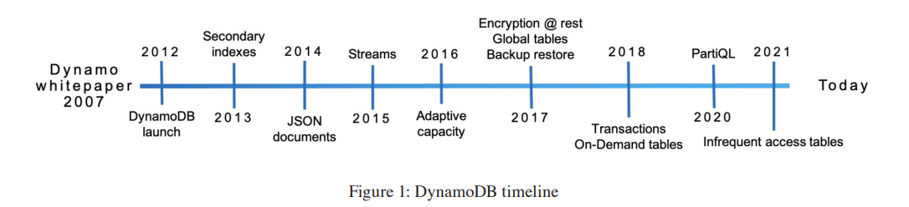
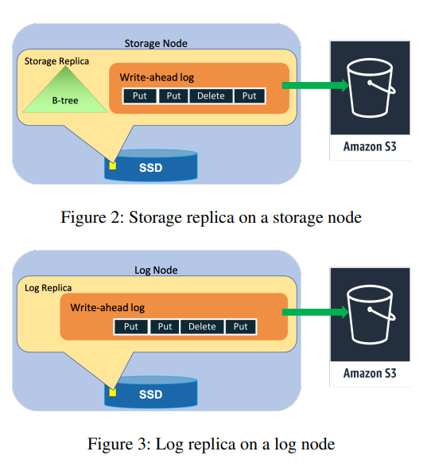
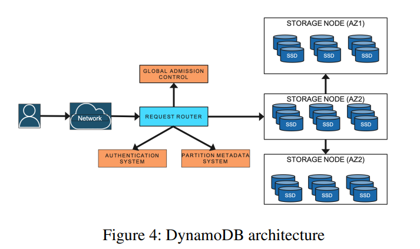
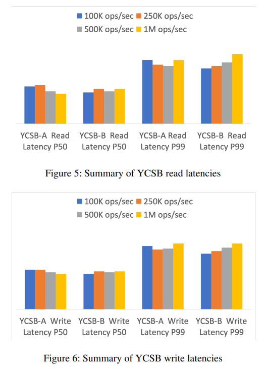

# [ATC 2022] Amazon DynamoDB: A Scalable, Predictably Performant, and Fully Managed NoSQL Database Service

## 1 Introduction

DynamoDB拥有以下特性：

- **fully managed cloud service**: resouce provisioning, automatically recovery, data encryption, backup, etc
- **multi-tenant architecture**: resource reservation, tight provisioning, monitored usage
- **boundless scale for tables**: tables grow elastically on demand
- **predictable performance**: horizontal scaling and automatically partitions/re-partitions to achieve consistent low latencies
- **high availability**: automatically replication across availability zones for regular tables, geo-replication across regions for global tables
- **flexible use cases**: key-value or document data model with strong or eventual consistency



## 2 History

```test
Dynamo
   |    S3 and SimpleDB
   |          |
    \        /
     \      /
     DynamoDB
```

|Operation|Descripition
|:-:|:-:|
|`PutIterm`|Inserts a new item, or replaces an old item with a new item|
|`UpdateIterm`|Updates an existing item, or adds a new item to the table if it doesn’t already exist|
|`DeleteItem`|The DeleteItem operation deletes a single item from the table by the primary key|
|`GetItem`|The GetItem operation returns a set of attributes for the item with the given primary key|

## 3 Architecture

DynamoDB的表由item组成，每个item由一组attributes，每个item由一个primary key唯一确定，peimary key的模式在表创建时就必须确定，可以是**单个partition key**，或者是**partition key和sort key的组合**，而partition key总是被用来散列进行分区，当采用组合key时多个items的partition key就可以相同（此时sort key必须不同）；DynamoDB支持二级索引secondary indexes，一个表可以有一个或多个二级索引，并且**支持跨多个items的事务ACID**

每个表在items分区后，**多个分区副本会被存储在不同的可用区availability zones**，从而实现容错和高可用，**多副本共识算法采用Multi-Paxos**，副本leader接受写请求，并产生WAL分发给所有副本followers，当达到quorum时就会响应客户端写入完成，同时支持强一致读（走一遍共识流程）和最终一致读（直接读本地副本数据）

一个复制组replication group的节点包含WAL日志和B树，称为storage replicas，但也可以**仅包含WAL日志用于提升整体的可用性availability和可靠性durability**，称为log replicas（类似PAXOS中的eacceptors）





## 4 Journey from provisioned to on-demand

DynamoDB初始时用户需要显式指定期望的吞吐量，单位是**读容量read capacity units RCUs**和**写容量write capacity units WCUs**，一个单位的读取代表一秒内一个不超过4KB的item执行一次强一致性读取，而一个单位的写入代表一秒内一个标准写入；当用户指定了读写吞吐量时，表会在实际过程中**动态分区分裂/分区合并以实现水平扩容/缩容**，从而满足所指定的读写吞吐量

DynamoDB中采用**流量控制admission control**来限制表/分区的读写请求数量，从而避免超出storage节点的能力并影响到其他一同部署的表，一个表每个分区的流量控制共同构成了整个表的流量控制，同时每个分区的流量控制存在上限（每个分区分配流量可以基本参考[Seastar Disk IO Scheduler](https://github.com/JasonYuchen/notes/blob/master/seastar/Disk_IO_Scheduler.md#designing-a-userspace-disk-io-scheduler-for-modern-datastores)中初始均分带宽的设计，这种设计可能会导致**热点数据的访问受限throttling而总流量反而没有达到整个表的限定额度**）

- **热点 hot partitions**
- **吞吐量稀释 throughput dilution**

### 4.1 Initial improvements to admission control

1. **Bursting**
   对于热点数据的访问，DynamoDB引入了bursting的概念，会**暂存分区未使用到的部分流量限额，从而允许短暂的超额流量**（超出部分即为此前保留的未使用部分，称为**burst capacity**），同时为了避免该分区所在storage节点的过载，一个storage节点有一个整体的流量限制

   在storage节点上通过多个**令牌桶token buckets**来完成限流，每个partition分为allocated和burst两个，整个storage节点一个，当请求抵达时就会使用partition中的allocated流量，出现峰值时必须partition的burst和storage整体的流量存有多余才可以允许分区超载
2. **Adaptive capacity**
   当热点数据的持续时间较长，即不属于短期bursting，DynamoDB引入了自适应容量的概念，当出现热点partition被限流而整个table并没有达到额定的流量时，**容量自适应分配算法就会提升该partition的份额**，相反当整个table到达额定流量被限流时被扩容的partition就会相应缩容并将多余的容量分配给所需的partitions

这两种运行时优化算法很好的弥补了静态容量分配算法的缺陷，基本上能够满足热点数据和读写偏差的用户使用场景，但其缺点在于bursting只能应对**短期**的爆发流量，而adaptive capacity需要**观测到throttling才会介入**，意味着上层应用已经出现了高延迟、受限的情况

### 4.2 Global admission control

DynamoDB采用全局流量控制global admission control GAC机制替代了上述两种策略，采用**基于令牌桶的中心化GAC服务**来控制一个表的全局访问流量，每个请求的路由器都维护一个本地的令牌桶来执行限流策略，并周期性和全局GAC服务通信对令牌桶进行quota回充

**GAC服务通过多个节点构成一致性散列环来实现高可用**，因此任意一个GAC节点维护的几个表的限流状态都可以被其他GAC节点接管，当本地请求路由器耗尽quota时就会访问GAC服务进行回充，从而保持一个表的全局流量不超过配置值，并且每个storage节点的partition级别的限流依然存在，避免单个storage节点过载

### 4.3 Balancing consumed capacity

由于DynamoDB运行在多种不同规格的storage节点上，而全局流量控制意味着DynamoDB必须高效准确的分配quota，因为一个storage节点可能持有完全不同的表的partition replicas，这些数据的访问模式完全不同，**高效准确的分配storage节点上持有的partition以及相应的流量限制才能避免storage节点过载**

DynamoDB实现了一个**分配系统**来主动平衡多个storage节点所持有的partition以及相应的流量，避免热点partition被部署到同一个storage节点上，从而减少**tightly packed replicas**的可用性风险，并且在一个storage节点上多个partition replicas成为热点之前及时迁移到其他storage节点来进行重平衡

### 4.4 Splitting for consumption

即使采用GAC服务，一个partition中的热点数据items过多依然会导致这个partition出现throttling，此时DynamoDB就会进行**动态再分区**，将热点partition进一步分割成子partitions并迁移到多个storage节点上，实现负载均衡

动态再分区时会**基于访问模式和热点数据的分布情况选择割点**，而不是单纯的平均分，因此能够通过较少的分割次数更有效的抑制单个partition的热点流量（类似基于流量均分，而不是基于partition的items均分？）

另一方面，若是热点数据是单个item，或是访问模式在于一部分连续的items（应用程序的数据locality所导致），则分区并不能缓解，并且对于**数据局部性导致的连续items热点，分区反而可能导致应用程序需要访问多个分区而影响性能**

### 4.5 On-demand provisioning

通常对于客户来说，评估数据库的访问需求（RCUs和WCUs）非常困难，很容易导致**资源浪费under-utilization**或是分配过少**被限流throttling**，DynamoDB提供了on-demand provisioning的方式，**自动根据访问流量选择合适的吞吐量配置**（通常是峰值流量的两倍），同时结合GAC服务，DynamoDB会自动进行分区和重平衡，避免部分分区过早触及到storage节点的流量限制

## 5 Durability and correctness

### 5.1 Hardware failures

与绝大多数DBMS相同，DynamoDB也采用了**WAL**作为可靠性保证和宕机恢复机制，一个partition的三个replicas都会保存有WALs，同时这些WALs还会周期性备份到AWS S3；当检测到storage节点宕机时，replication group leader会将所有涉及到的partition都立即：

- 新增一个**log replica**，只需要复制WAL到新replica上即可，耗时较短，目的在于确保durability
- 并且**开启恢复过程**，需要复制B树和WAL到storage节点上，耗时较长，目的在于提供健康的storage节点

### 5.2 Silent data errors

DynamoDB大量采用的**校验和checksum**的方式来避免数据错误出现，包括：

- 每个log entry
- 每个message
- 每个log file
- 每一块节点间传输的data

同时当WALs被归档到S3时，会通过manifest文件对WALs内容进行全面校验

### 5.3 Continuous verification

DynamoDB运行过程中进行**持续性验证data**（verify data at rest），例如通过一个scrub进程持续性的检查一个replication group内的所有replicas数据都完全一致

### 5.4 Software bugs

例如replication算法采用TLA+进行**形式化验证**和模型检查，以及充分的测试，包括**错误注入测试failure injection testing**和**压力测试stress testing**

### 5.5 Backups and restores

DynamoDB支持备份和恢复机制，并且**备份过程基于S3上的WALs**，因此完全不会影响线上运行的DynamoDB的性能，备份包含了所有表数据，并且每个表的每个分区都在最接近的一秒内一致

## 6 Availability

### 6.1 Write and consistent read availbility

一个partition的写入需要有一个健康的leader和健康的写入组**write quorum**（三个replicas中来自两个不同AZs的两个replicas可用）

- 当某个replica不可用时，leader就会**首先添加一个log replica**快速恢复健康写入组，**log replication采用multi-group PAXOS算法**
- 当leader不可用时，基于PAXOS算法会快速选出新的leader
- leader replica自身用于服务**强一致性读取consistent read**，而任意的replicas都可以用于服务**最终一致性读取evetually consistent reads**

### 6.2 Failure detection

新选出的leader需要等待旧leader过期才可以提供服务，因此会有一小段不可用时间，而检测到leader故障并发起选举的**错误检测机制**对系统的稳定性至关重要：

- 过于敏感，错误认为leader宕机而发起选举（**false-positive**）会导致系统无法稳定提供服务
- 过于迟钝，过晚才发现leader宕机（**false-negative**）会导致系统不可用的时间变长

DynamoDB中当一个follower认为可能需要failover时就会首先发送给其他replicas一个试探消息，若其他replicas回复leader存活则放弃failover，即**prevote+leader lease**机制，参考[Raft中的描述](https://github.com/JasonYuchen/notes/blob/master/raft/09.Leader_Election_Evaluation.md#%E9%98%B2%E6%AD%A2%E9%87%8D%E6%96%B0%E5%8A%A0%E5%85%A5%E9%9B%86%E7%BE%A4%E7%9A%84%E8%8A%82%E7%82%B9%E7%A0%B4%E5%9D%8F%E9%9B%86%E7%BE%A4-preventing-disruptions-when-a-server-rejoins-the-cluster)

### 6.3 Measuring availability

DynamoDB会持续的运行监测进程，监测访问情况和性能数据，用于分析**service level agreement SLA**

### 6.4 Deployments

部署分布式系统的软件并不像单节点部署一样是原子的atomic，**分布式系统下，可能会有一些时间窗口中运行着多个不同版本的程序**，因此不同版本的程序需要**确保双向兼容**，例如相互之间通信的消息可能引入了一些新的字段，需要确保新旧版本的服务都不会被这种新字段影响，可以采用**多阶段部署**的模式：

- 阶段一（**read stage**）：旧版本->新版本A：可以正确理解新消息，但不会发出新消息
- 阶段二（**write stage**）：新版本A->新版本B：可以正确理解新消息，也会发出新消息

显然更为复杂的情况都可以分割成多次上述的两阶段部署模式，从而确保系统平滑升级

当部署涉及到replication group leader节点时，会发生主动的failover，即**leadership transfer**，这种出动的failover不会对集群的可用性产生影响，参考[Raft的做法](https://github.com/JasonYuchen/notes/blob/master/raft/03.Basic_Raft_Algorithm.md#10-%E4%B8%BB%E8%8A%82%E7%82%B9%E8%BD%AC%E7%A7%BB-leadership-transfer-extension)

### 6.5 Dependencies on external services

DynamoDB所依赖的外部服务必须比DynamoDB本身更加高可用（例如AWS Identity and Access Management Services IAM和AWS Key Management Service KMS），但是也会通过DynamoDB内cache尽可能在外部服务不可用时依然正常提供服务，**高可用的系统除了自身的可用性，也必须考虑到所有外部系统的可用性**

### 6.6 Metadata availability

最核心的元数据就是表数据中**primary keys到storage nodes的映射**，每一条请求都涉及到这个映射的查询，且通常由于**表数据在storage节点的存储关系较为固定**（每个partition分为数个replicas存储在不同的storage节点上，且正常情况下存储关系较少改变）因此可以**将映射关系缓存在路由器节点本地**

这种做法的代价在于路由器节点第一次见到一个表的请求时，必须下载整个表的映射元数据，这种**冷启动**会带来较大的运行时开销和延迟峰值，导致系统不稳定，DynamoDB引入了**高可用分布式内存缓存MemDS**来缓存所有元数据，并且replicate到所有MemDS fleet上以**应对所有DynamoDB的请求流量**，MemDS通过**Perkle**结构（**Patricia tree和Merkle tree的组合**）来管理元数据

路由节点采用新的**partition map缓存**来取代原先的全表metadata缓存，缓存的粒度下降到partition从而避免一次请求引入整个表的metadata缓存，一次请求即使命中了缓存也还是会额外触发一个异步的更新通知MemDS从metadata服务获取数据刷新缓存（**MemDS实际承受所有DynamoDB的流量，但访问metadata服务更新缓存的流量则可以保持恒定**），从而虽然额外增加了缓存命中时metadata服务的负载，但是有效避免了缓存不命中时爆发的metadata服务流量

DynamoDB的**storage节点是partition replicas实际情况的single source of truth**，每当partition replicas有更新时，都会扩散到MemDS中，从而当MemDS所持有的数据处于短暂的不准确状态时，被请求的storage节点会选择返回最新的状态或是再次触发MemDS查询

[一些官方解释](https://brooker.co.za/blog/2022/07/12/dynamodb.html)

## 7 Micro benchmarks

系统的吞吐量范围内，吞吐量变化不会影响读写性能：


