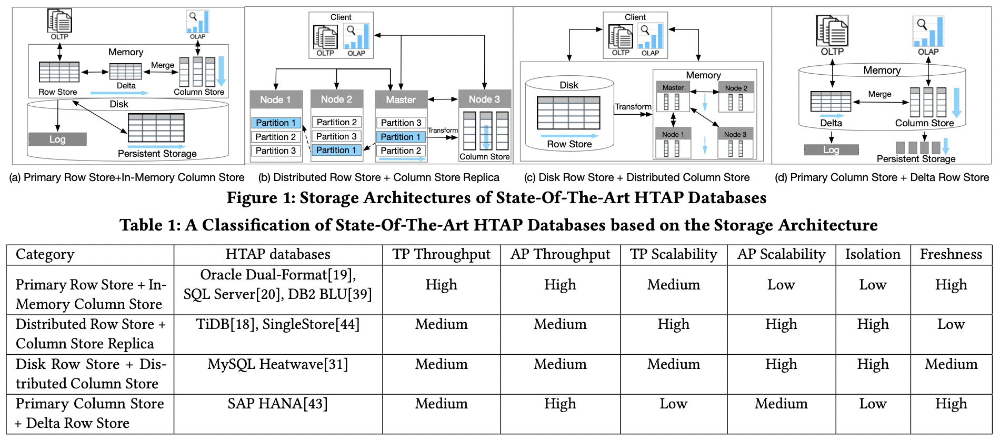
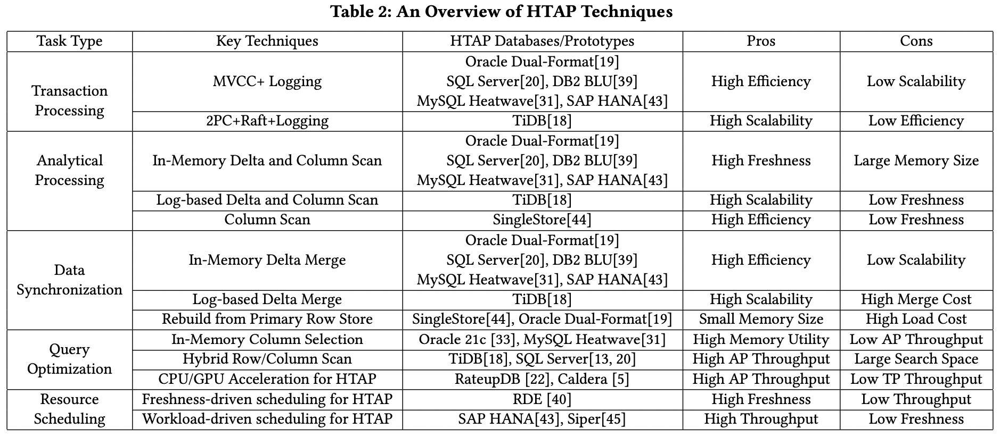

# [SIGMOD 2022] HTAP Databases: What is New and What is Next

## Introduction

- **History**
  - Phase I, 2010-2014: adopt primary column store, e.g. SAP HANA
  - Phase II, 2014-2020: extend primary row store, e.g. L-store
  - **Phase III, 2020-now: distributed architecture**, e.g. TiDB, Greenplum, PolarDB

- **Concepts**
  - **Workload Isolation 工作负载隔离**: OLAP和OLTP工作负载的处理是否隔离，相互不影响
  - **Data Freshness 数据新鲜度**: OLAP请求能够处理到的事务数据是否足够新（OLTP的结果是否能马上体现在OLAP中），本质上**HTAP数据库就是在workload isolation和data freshness中权衡**

- **Challenges**
  - **Data Organization**
  - **Data Synchronization**
  - **Query Optimization**
  - **Resource Scheduling**

## HTAP Databases

- **Primary Row Store + In-Memory Column Store**
  这种架构的设计，主要通过**primary row store来应对OLTP**的请求，并且在内存中维护一个**in-memory column store来应对OLAP**的请求，新写入的数据（所有内存中的更新都会针对内存进行优化来提高处理性能）会首先追加到一个中间层**delta store，随后再被合并应用到column store**中，这一类单节点HTAP数据库吞吐量非常高，因为所有数据都在内存中处理
  - Oracle in-memory dual-format database：整合了row-based buffer和column-based in-memory compression unit, IMCU（列存由于数据类型统一，很适合压缩优化）来一起处理OLTP和OLAP的数据
  - SQL Server：在Hekaton row engine的in-memory table基础上开发了column store index, CSI用于实时分析请求的处理
- **Distributed Row Store + Column Store Replica**
  这种架构的设计，主要通过分布式的方式来同时支持OLAP和OLTP请求，**主节点row store异步将日志复制给所有从节点来处理OLTP请求，而一 部分从节点会作为column store来构建column-based数据从而处理OLAP请求**，这种架构带来的优点就是**workload isolation非常高**，OLTP和OLAP由不同的节点来处理，完全隔离互不影响
  - F1 Lighting：采用Spanner（Paxos协议）作为分布式row-store数据库处理OLTP请求，并**采用CDC的方式捕获所有数据更新操作写入column store存储层**，采用**LSM**读取+算子下推的方式来处理OLAP请求（*F1 Lightning: HTAP as a Service*）
  - TiDB：通过Raft协议，leader和follower来处理OLTP请求，并且通过learner节点构建column store，采用**B树**+columnar delta树来处理OLAP请求，缺点主要是**OLAP数据的新鲜度有限，leader和follower提交的请求未必能够及时被leader所获得**，从而leader节点的column store数据存在一定的落后（*TiDB: a Raft-based HTAP database*）
- **Disk Row Store + Distributed Column Store**
  这种架构采用disk-based RDBMS以及distributed in-memory column-store IMCS来支持HTAP的请求，**RDBMS可以完全支持OLTP请求，而深度整合的IMCS部分则可以支持OLAP请求**，IMCS的数据从RDBMS中获取并构建，热数据停留在IMCS中提供服务，冷数据则会被汰换
  - MySQL Heatwave：采用单个MySQL数据库加上分布式内存列存Heatwave来实现HTAP数据库，所有OLTP请求都由MySQL来处理，频繁被OLAP访问到的列就会从MySQL中被提取到Heatwave来加速OLAP请求
  - Oracle RAC：采用单个Oracle RDBMS作为row store数据库加上Oracle RAC集群作为in-memory column store数据库来分别应对OLTP和OLAP请求
- **Primary Column Store + Delta Row Store**
  这种架构主存储就是列存储**primary column store来应对OLAP请求**，而通过一个**delta row store来处理OLTP请求**，数据的修改更新会追加到row-based delta store中，由于本身就是列存为主，因此OLAP请求的吞吐量极高，而OLTP由于依赖一个delta row store其可扩展性非常低
  - SAP HANA：其将内存数据分为三层，L1-delta，L2-delta和Main，L1-delta将数据更新保存为row-wise格式，当阈值达到时就会将L1-delta合并到L2-delta上，并且L2-delta就会将数据转换为columnar格式并合并进Main，最终columnar的数据被持久化保存到磁盘上
- **Other: Row-based HTAP systems**
  - Hyper: support HTAP with COW, high TP, high freshness, low AP, low isolation
  - BatchDB: row-based dual-store with batched workload scheduling, high TP, low freshness, low AP
- **Other: Column-based HTAP systems**
  - Caldera: COW column store and CPU/GPU architecture, high AP, high freshness, low TP, low isolation
  - RateupDB: column-based dual-store with CPU/GPU architecture, high AP, low TP, low freshness
- **Other: Spark-based HTAP system**
  - Splice Machine: loosely couple HBase (TP) + Spark (AP), high scalability, high isolation, low freshness
  - Wildfire: tightly couple OLAP engines with Spark, high scalability, low freshness

## HTAP Techniques

- **Transaction Processing (TP) Techniques**
  主要指**更新row store并写入delta store**，OLTP的负载由row store来处理，由于架构的不同，主要有两大类处理方式：
  - **MVCC + Logging**：当有insert数据时，首先写入row store和log，并且随后追加到in-memory delta store中；当有update数据时，会在相应的row上创建新版本，带有新的开始结束时间戳，旧版本就会被标记为delete；所有事务都在内存中执行因此非常高效
  - **2PC + Raft + Logging**：引入了分布式事务系统，leader节点收到请求时首先会追加到本地log中，并且会复制给所有follower节点，当quorum中majority成功时leader就会本地应用该数据并提交，显然分布式的引入提高了可扩展性但降低了处理性能
  
  常见的内存delta store的实现方式有**In-memory delta store implementation**：
  - Heap table: fast insertion, slow lookup
  - Index-organized table: fast lookup, slow insertion
  - L1 cache: fast insertion, slow lookup, low capacity
- **Analytical Processing (AP) Techniques**
  主要指**扫描columnstore并扫描delta store**，OLAP的负载由column store来处理，并且大量采用针对column-oriented优化的技术，例如聚合压缩、SIMD等，根据架构的不同OLAP处理方式整体可以分为三类：
  - **In-Memory Delta and Column Scan**：同时扫描内存delta数据（包含了最新的修改可能还未被合并进column）以及column数据，从而数据的及时性freshness很好
  - **Log-based Delta and Column Scan**：同时扫描log-based delta数据以及column数据，与前一种方式类似，但由于delta数据在日志文件中，扫描的代价非常高，并且delta文件可能正处于合并的过程，高延迟导致了这种方式的及时性较差
  - **Column Scan**：纯粹放弃delta数据，只扫描column数据，及时性最差的方式，但效率极高
- **Data Synchronization (DS) Techniques**
  主要指将**delta store的数据同步进column store**从而提高OLAP性能，分为三类：
  - **In-Memory Delta Merge**：在内存中周期性的将in-memory delta数据合并到column store中，常见的方式有two-phase transaction based data migration，dictionary-encoded sorting merge，threshold-based change propagation
  - **Log-based Delta Merge**：将磁盘上的delta数据文件合并到column store中，delta数据通常通过**LSM树或B+树**来索引，因此可以高效合并
  - **Rebuild from Primary Row Store**：从row store的数据直接重建in-memory column store，通常当delta更新超过一个阈值时就会触发重建（因为合并delta可能比重建开销更大）
- **Query Optimization Techniques**
  主要指**针对row store和column store的特点优化查询**
  - **In-Memory Column Selection**：基于统计数据推测频繁访问的数据列，并加载到内存中构建column store从而加速处理，因此当遇到较少访问的数据时就必须访问row store，从而性能就会劣化
  - **Hybrid Row/Column Scan**：利用混合行/列扫描来加速处理，一个复杂的查询会被分解为多个子操作，并基于策略（例如cost-based optimizer）采用row store或column store来处理，最后合并结果
  - **CPU/GPU Acceleration**：利用CPU的task-parallelism和GPU的data-parallelism来分别加速OLTP和OLAP请求
- **Resource Scheduling Techniques**
  主要指针对HTAP的工作负载，**合理调度资源来分别应对OLTP和OLAP的请求**，从而提升整体的资源利用率
  - **Freshness-driven Scheduling**：基于数据新鲜度的调度，OLAP和OLTP各自相对隔离得处理请求，周期性进行数据同步，双方吞吐都较高，但当OLAP的数据新鲜度较差时，就会切换到共享资源共同处理的模式
  - **Workload-driven Scheduling**：基于已经执行过的请求表现（feedback-based）来动态调整OLTP和OLAP的工作线程数，例如当CPU资源都被OLAP线程占用导致OLTP请求延迟升高时，调度器就会降低OLAP的线程数，同时提高OLTP的线程数
- **Other: Multi-Versioned Indexes for HTAP**
  - parallel binary tree, P-T
  - multi-version partitioned B-tree, MV-PBT
- **Other: Adaptive Data Organization for HTAP**
  - H2O
  - Casper
  - Peloton
  - Proteus (TODO: add figure 4)

## HTAP Benchmarks

- **HTAP Benchmarks**
- **HTAP Database Evaluation**

## Challenges and Open Problems

- **Automatic Column Selection for HTAP Workload**
  从row store中提取所需的数据到column store对性能影响至关重要，但目前的策略**重度依赖历史请求的统计数据**，一旦出现非常见的请求时性能就会下降的非常厉害

  目前较为活跃的方向是采用learning-based方法（例如knob tuning，join ordering，view selection等）来推测所需的数据，主要挑战在于方法本身需要足够轻量（开销较小，易于通过少量请求就能推测出整体的请求模式，不至于影响请求处理本身的耗时）而又足够高效能够较为准确的推测所需数据
- **Data Synchronization**
  - Synchronization Order
  - Time Interval Decision
  - New Data Structures and Merging Strategies
- **Learned HTAP Query Optimizer**
  对于同时从row store和column store读取数据的方式来说，选择策略（对哪些数据选择哪个存储引擎）往往依赖于cost functions来确定代价最低的读取方式，然而**cost functions通常并不能准确的评估row store和column store的读取代价，尤其是当数据存在相关性或倾斜时**，cost functions误差较大

  目前较为活跃的方向是采用learned query optimizers，通过学习请求和执行策略的映射关系，构建出一个query optimizer，难点在于需要同时考虑row-based和column-based operators
- **Adaptive HTAP Resource Scheduling**
  HTAP本质上是一个tradeoff，自适应的资源调度能够在OLAP和OLTP中切换，OLAP和OLTP相隔离的处理模式有利于提升两者的吞吐但不利于新鲜度（数据同步的开销减少），OLAP和OLTP协同的处理模式则有利于新鲜度但会影响吞吐量和处理性能（数据同步的开销增加）

  目前的freshness-driven scheduling依赖于rule-based策略来控制执行模式，忽略了工作负载的模式；而workload-driven scheduling则完全基于工作负载来调整OLAP和OLTP的比重，忽略了一些请求对新鲜度的要求，将两者有效结合成一个**同时考虑freshness和workload的调度器并且足够轻量**是目前的主要方向
- **HTAP Benchmark Suite**
  目前的TPC-H存在数据均一分布uniform distribution并且columns之间相关性很少的特点，这与实际情况并不相符，难以测出HTAP系统真实的处理能力，另外业界缺乏针对data synchronization、query optimization、resource scheduling等子模块的测试方法
