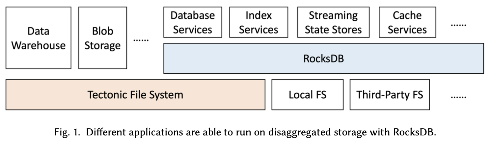
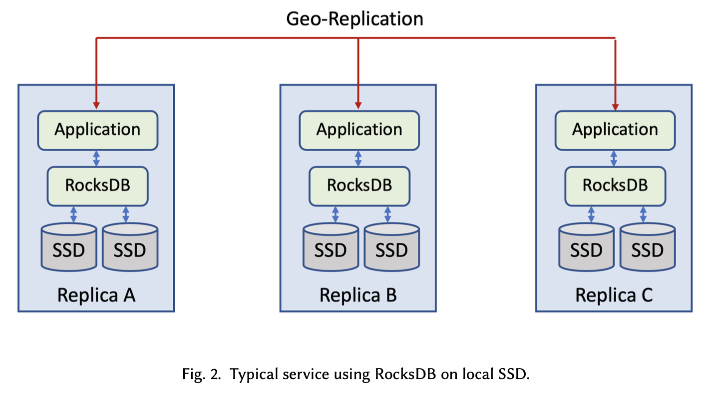
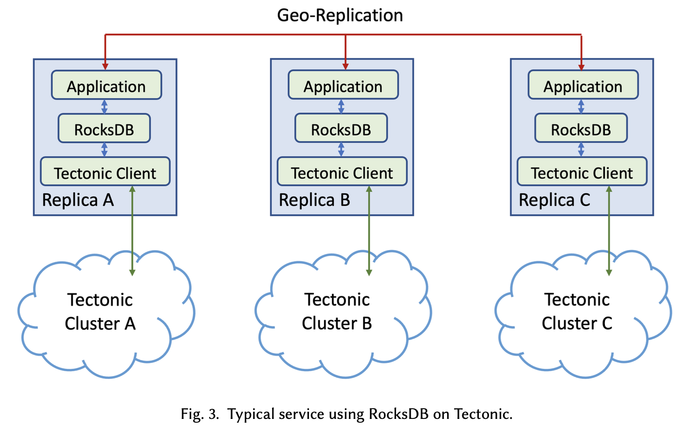
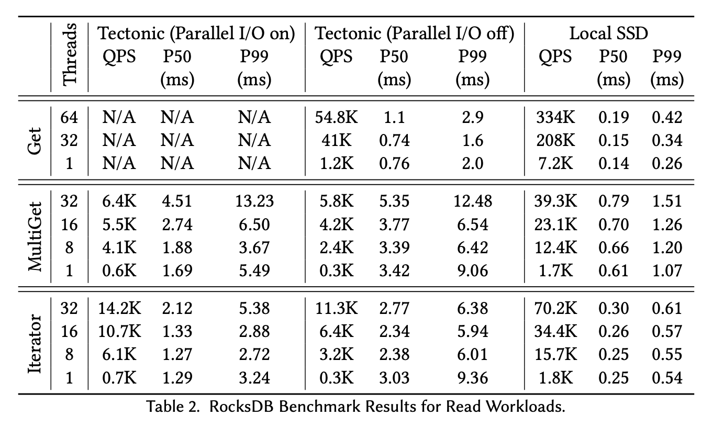

# [SIGMOD 2023] Disaggregating RocksDB: A Production Experience

## 1 Introduction

- 早期网络带宽有限，采用RocksDB的应用无法忍受remote storage
- 随着数据中心网络能力的建设，带宽已经达到25Gbps甚至50、100Gbps，而应用程序的带宽需求变化不大，但空间需求更大，从而使得采用remote storage成为可能
- 在Meta的经历来看，绝大多数应用能够容忍remote storage带来的额外延迟

## 2 Background and Motivation

- CPU and storage are **unbalanced** with local SSDs
- Disaggregated storage enables users to maximize CPU and storage utilization
- Same storage engine (RocksDB)
    - space efficiency of RocksDB
    - easy migration from old RocksDB-based date
    - one improvements for two modes (local/remote)
- RocksDB is layered on top of Tectonic File System, an **append-only distributed file systems** (similar to S3)
    - reduces the number of replicas
    - quick failover
    - simplicity of not managing storage
    - storage sharing allows **remote** backup/compaction/verification/etc

## 3 Architecture Overview and Main Challenges

- **Performance**
    Disaggregated storage introduces **network hops**, some applications can never be served by remote storage
- **Provide Redundancy with Low Overhead**
    Adding redundancy incurs extra overhead in terms of **storage space, SSD endurance and network**, Tectonic client may perform replication or erasure coding
- **Data Integrity with Multiple Writers**
    To enable fast failover, multiple compute nodes can access same file, but they should be coordinated, i.e. **exclusive data manipulation**, previous node can no longer modify the data
- **Preparing RocksDB for Remote Calls**
    RocksDB now needs to **handle errors appropriately**, e.g. local mode does not have transient I/O errors

## 4 Addressing the Challenges

### 4.1 Performance Optimizations

- **Optimizing I/O tail latency**
    - **dynamic eager reconstructions**, i.e. hedging request, and **continuously adjusting** the threshold for issuing the second read based on read latency percentiles
    - **dynamic append timeouts**, i.e. quorum write, only wait for acks from a quorum/subset of storage nodes together with hedging request (issuing the second write to another quorum/subset of nodes)
    - **hedged quorum full block writes**, i.e. quorum write, first phase the client will acquire write permits from nodes, second phase the client will issue write to a quorum of nodes that has responded the permits faster than others
- **RocksDB metadata cache**
    RocksDB directory (metadata) are **cached proactively by only one process**, this process is the only one that can access and modify the directory using the **I/O fencing**
- **RocksDB local flash cache**
    **Block cache on non-volatile media** to support read-heavy applications, i.e. secondary cache, primary cache is the RocksDB's volatile DRAM-based cache
- **RocksDB IO handling**
    tune the RocksDB for HDD-like Tectonic, e.g. compaction read size, compaction write buffer size, read ahead, etc
- **RocksDB parallel IO**
    parallel read for `MultiGet`
- **RocksDB compaction tuning**

### 4.2 Redundancy with Low Overhead

- **SST files**: highly durable encoding with low overhead, 4 parity blocks for 8 data blocks erasure encoding
- **WAL files**: low tail latency for small appends with persistence, 5-way replica encoding

### 4.3 Data Integrity with Multiple Writers

**IO fencing**, i.e. token fencing, which is similar to monotonically increasing token based distributed locks

Client will:
1. acquire the token
2. IO fence the RocksDB directory with the token
3. perform subsequent operations with the same token

Tectonic will:
1. **updates the token on the directory** in the metadata system, preventing any new file operations (create, rename, delete)
2. **iterates over the list of files** under the directory
    - **updates the token on the file metadata**
    - **seals the tail writable block** through requesting storage nodes to seal the corresponding chunks, which will notify the stale writers to coordinate with the metadata system

### 4.4 Preparing RocksDB for Remote Calls

- **Differential IO timeout**
    Waiting for seconds may be too long for IOs serving user requests, but waiting for minutes seems tolerable for IOs of database internal operations like compaction
- **Failure handling in RocksDB**
    Writing to and reading from TFS may incur **more frequent transient and recoverable IO errors**, by **classifying errors and enhancing the return status** from the file system API calls to include more error details (such as retry-ability, scope, transient-or-permanent error, etc), database availability and robustness can be greatly improved
- **IO instrumentation**
    Improving the visibility into the IO path helps troubleshooting
- **Utilities**
    Migrating existing RocksDB tools to support TFS
## 5 Performance Benchmark

RocksDB's microbenchmark tool `db_bench`, local SSD outperforms Tectonic greatly

## 6 Application Experiences: ZippyDB

> ZippyDB is a reliable, consistent, highly-available and scalable distributed key-value storage service.
> It uses multi-Paxos with geographic replication and RocksDB as the storage engine.

- **Handling non-RocksDB files**
    e.g. replication logs (Paxos protocol) are written to OS page cache (local mode) / shared memory buffer (remote mode) before ack (no `fsync`) under the assumption that **concurrent host failures in multiple replica is very low**
- **Building new replicas**
    with TFS, file copy operation for building new replica for a failed host is extremely fast, which updates the new file's metadata to point to the same physical data
- **Verifying correctness and performance**
    **double write**, a mirror storage system will be asynchronously updated to enable quick fallback (best effort based recovery mode)
    - forward mirroring: local flash as source of truth, asynchronously writing to TFS
    - reverse mirroring: TFS as source of truth, asynchronously writing to local flash
- **Files garbage collection**
    locally attached flash gets wiped immediately when failed host is recycled, but for TFS, data are kept until being garbage collected, TFS has a **background service to identify and cleanup dead DB instances and files**
- **Performance analysis**
    - in all cases, end-to-end write latency is similar since **geo-replication** dominates the latency, and is enabled for both Tectonic and local SSDs.
    - single Tectonic read latency is often several times higher than that of local SSDs, but **impacts are relatively small to end users** due to various optimizations such as requests batching, hedging, etc

| #   | read/QPS | write/QPS | read/MB | write/MB | description                                                           |
| --- | -------- | --------- | ------- | -------- | --------------------------------------------------------------------- |
| 1   | 14       | 548       | 0.4     | 0.37     | stores signals of audience, reads are done using iterators            |
| 2   | 33k      | 28        | 294     | 28.42    | stores statistics for targeted groups, reads are done using iterators |
| 3   | 54       | 12        | 0.77    | 5.55     | stores various metrics, reads are done by 6:1 iterators and multi-get |
| 4   | 3k       | 1.7k      | 0.17    | 0.27     | reads are done by multi-get                                           | 

*only show partial end-to-end P99 metrics in milliseconds of different use cases*

| use cases |    metrics    |  Tectonic | Local SSDs |
| ---------:|:-------------:| ---------:| ----------:|
|       N/A |     Space     |       75% |        35% |
|       N/A | availability  | 99.99999% |  99.99993% |
|       N/A | failover time |       49s |        51m |
|         1 |  multi-scan   |      49.6 |       40.0 |
|         1 |     write     |       876 |        766 |
|         2 |   iterator    |       6.5 |        7.4 |
|         2 |     write     |       180 |        145 |
|         3 |   iterator    |        74 |         50 |
|         3 |   multi-get   |        23 |         16 |
|         3 |     write     |        63 |         72 |
|         4 |   multi-get   |        60 |        132 |
|         4 |     write     |       235 |        265 |

## 7 Ongoing Works and Challenges

- **Secondary instances**
    users can **flexibly provision machines** with shared access to the underlying data to serve read-only requests, primary and secondary instances run in a **single-write multiple-readers** mode
- **Remote compaction**
    compaction consumes CPU/IO resources greatly, and can **be offloaded to a remote dedicated host to avoid competing resources** with online services
    - compaction service can also enable us to **schedule compactions** across different databases
    - customizable compaction logic enable users to provide **plug-in functions for scheduling** remote compactions
- **Tiered storage**
    serving hot data on fast storage (SSDs) and cold data on slow storage (HDDs) by **separating data to different SST files and placing them to different storage media** accordingly
