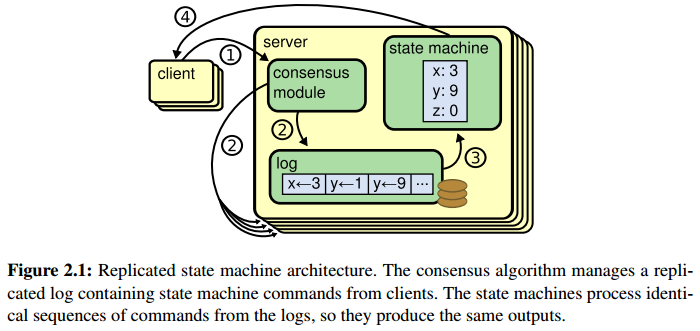
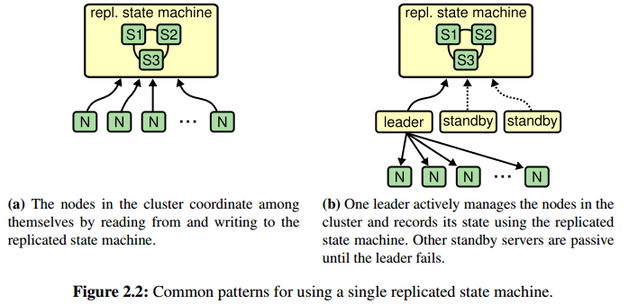
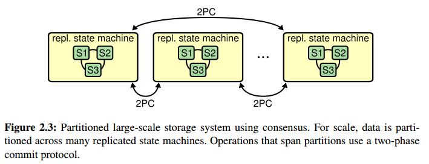

# Chapter 2. Motivation

## 1. 复制状态机实现容错 Achieving fault tolerance with replicated state machines

复制状态机往往通过一个一致性日志来达成相同的状态，而日志一致性就是通过共识算法来实现的，共识算法往往需要包含以下特征:

1. 在所有非拜占庭条件下[non-Byzantine conditions](https://en.wikipedia.org/wiki/Byzantine_fault)的安全safety（网络的延迟、分区、丢包、重复、乱序等）
1. 只要多数服务器可用且能互相通信，那么整个集群的功能是完好可用的available
1. 不依赖时间来保证日志一致性，即异步模型asynchronous model下的安全（数据传输和处理可以是任意速度）
1. 在多数服务器响应一次RPC后就可以执行命令而不会被少数慢速服务器拖累

## 2. 复制状态机的通常使用范例 Common use cases for replicated state machines

通常共识算法用3或5台服务器来控制复制状态机，会分为两种模式:

1. RSM本身就作为服务，由RSM自身协调与客户端的通信，即共识协议给服务提供一个全局有序totally ordered的消息队列
1. 服务分为leader和follower，背后通过RSM来达成共识，leader和follower之间相互协调与客户端的通信，即服务可以利用RSM来存储需要一致性的关键数据，当leader下线后follower可以根据RSM的一致性数据继续提供服务

对于大数据量涉及海量服务器的服务，更常见的做法是上述进行数据[分区partition/分片sharding](https://en.wikipedia.org/wiki/Shard_(database_architecture))，随后对每个分片的数据使用共识协议达成高可用性，同时在跨分区上使用[2PC](https://en.wikipedia.org/wiki/Two-phase_commit_protocol)等协议，达成一致性以及分布式事务

## 3. Paxos的问题是什么 What's wrong with Paxos

`TODO`
