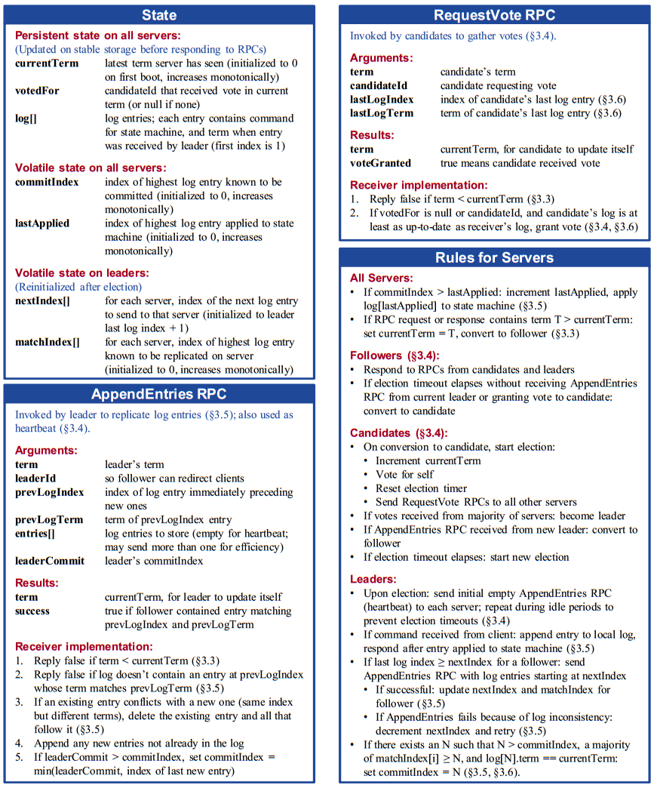
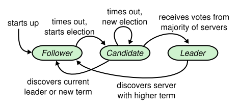
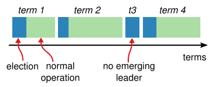
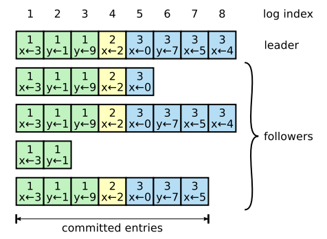
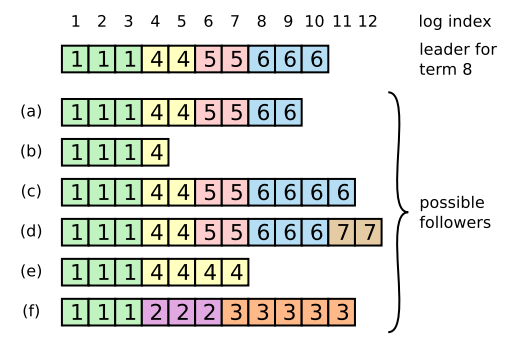
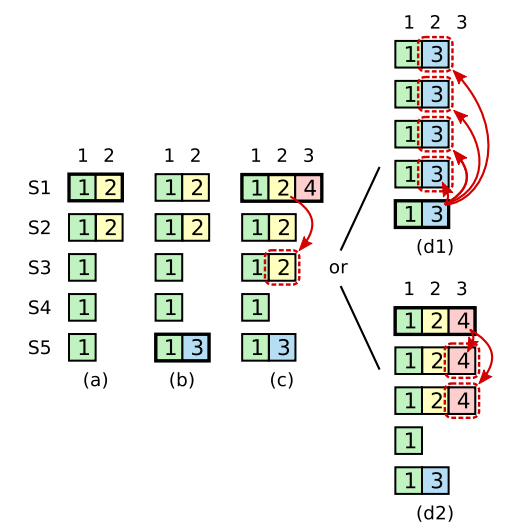

# Chapter 3. Basic Raft Algorithm

## 1. 为了可理解性 Designing for understandability

`TODO`

## 2. Raft概述 Raft overview

Raft的安全保证（任何时候这些状态都是确保的）：

1. 选举安全Election Safety：在给定的term中，至多只会选出一个leader
1. 只有Leader会追加日志Leader Append-Only：Leader不会覆盖或删除自己的日志，只会追加新日志
1. 日志匹配Log Matching：如果两个Log中有一条entry是相同的index和term，那么这一条entry及之前所有的entries都一定完全相同
1. Leader完整性Leader Completeness：如果一条entry在某个term被committed，那么任意高于这个term的leaders日志中都一定含有这条entry

状态机安全State Machine Safety：如果一个server已经apply了指定index的一条entry，那么任意其他server都不会在这个index时再apply一条不同的entry

## 3. Raft基础 Raft basics

1. Raft节点的身份状态机（Leader, Candidate, Follower）

    **实际实现中，往往还会有Observer/Learner、Witness等特殊功能的节点**

    

1. term递增过程，每一次term都从选举开始，若当前选举未成功，超时发起下一次选举

    

1. Raft通过RPC实现节点间通信，同时基于异步通信模型，Raft假设RPC请求可能丢失，可能乱序

## 4. 选举主节点 Leader election

所有节点启动时，都以Follower的身份启动，并且有一个超时时间election timeout，且每个节点在**一个term内最多投给一个Candidate**（哪个Candidate要求投票且log至少和自己一样新，就投给该Candidate，first-come-first-served先到先得）

- **Follower时的行为**
    1. 当前集群的Leader会周期性发送心跳Heartbeat给所有Follower，收到Heartbeat就可以重置election timeout
    2. 若持续一段时间未收到心跳（超过一个基于election timeout计算出来的随机时间，原理是避免多个Follower同时发起选举导致无法及时vote出有效的Leader），就会将term+1，状态改为Candidate，向所有节点发送选举请求并投票给自己
- **Candidate时的行为**
    1. 收到过半数vote（包括自己的，vote的term都和Candidate一致）就会转变为Leader
    2. 收到更高term的消息、或是相同term其他Leader的消息就会转变为Follower
    3. 上述两种情况都未发生直到超时，就再次term+1，发起新的选举
- **Leader时的行为**
    1. 一旦成为Leader会立即发送心跳（NoOP Entry）给所有节点，终止进行中的选举并宣告自己是Leader
    2. Leader收到更高term的消息来自其他节点时就会转变为Follower

## 5. 日志复制 Log replication

Leader接受请求，请求内容就是要求Replicated State Machine, RSM执行的命令，会以entry的形式（包括log index, log term信息）首先追加到Leader的Log，随后RPC复制给所有节点，当多数节点响应后，Leader就会apply这条entry给RSM。如果某些缓慢或宕机节点不响应，Leader会无限重试，Raft保证所有committed的日志是持久化并达成共识的，且最终会被RSM执行
**注意：一旦一条entry被commit，那么也隐式commit了此entry之前的所有entries，包括上一个Leader的日志，因此Leader一旦当选会立即replicate一条NoOP entry**

- **一致性检查 consistency check**
    在日志复制RPC时，leader会携带上一条日志的index和term，如果follower无法找到完全一致的上一条日志（根据index和term），就会拒绝这一条复制RPC，从而可以保证一条entry被commit之后所有在此之前的都被commit
- **强制覆盖forcing duplicate leader's log**
    如果因为宕机等其他原因，leader在复制日志给其他节点时宕机，重启以后可能会变成follower（新leader已诞生并接受请求）且有日志与现leader不一致，此时leader会强制所有节点的日志与自己同步，即leader会找出与节点一致的最新一条entry（leader为每个节点维护一个nextIndex变量记录将要发送的下一条entry的位置），并覆盖掉节点此共同日志后续的所有不一致日志。在leader启动初始化时所有nextIndex都是自身log的下一条，每次RPC被follower拒绝后都nextIndex-1重试RPC直到找到正确的位置

    

    针对每次被拒绝都`nextIndex-=1`再进行replicate的优化可以是如下方法：
    1. 每次follower拒绝时，回复中带上冲突的entry对应的term，以及该term内的第一条entry的index，从而将rejection per entry优化为rejection per term直到找到符合的term恢复正常的replication
    2. 不一致的entry对应的index可以通过多次rejection，二分查找的方式来定位

    考虑到实际情况中出现日志冲突的概率很低，这些优化本身带有一定的复杂性，因此其必要性并不大

    在实际的Raft实现中例如[etcd/raft](https://github.com/etcd-io/etcd/tree/master/raft)，follower在RPC响应replication时如果rejection就会带上rejectHint表明自身log里的lastIndex，在leader刚当选时如果收到rejection则会`nextIndex-=1`逐条entry进行探测，在正常过程中如果收到rejection（网络乱序重传等原因）则会直接从`next=match+1`重新开始，更为保守，[见此](https://github.com/etcd-io/etcd/blob/a1ff0d5373335665b3e5f4cb22a538ac63757cb6/raft/tracker/progress.go#L170)

## 6. 安全性 Safety

选举时需要额外增加限制来确保所有RSM都能执行完全一致的命令，例如一个leader宕机后，未包含所有committed entries的follower如果成为leader，又反过去强制覆盖了log，就出现了不一致

- **选举限制Election restriction**
    由于committed要求过半节点拥有数据，因此一旦发生选举，candidate在要求vote时，candidate的日志只有至少和follower一样新up-to-date才会获得该follower的vote，否则会被follower拒绝，从而确保成为leader后自己的日志也是最新的，不需要修改或覆盖
    所谓的最新up-to-date要求：**log中的最后一条entry的term越大越新，若term相同则index越大越新**
- **从之前的terms提交日志Committing entries from previoud terms**
    即使一条旧term的entry已经被大多数节点接收，但也不能被新term的leader直接commit，如图中：

    

  - S1是term2的leader，在复制了2条entry给S1,S2后crash
  - S5获得S3, S4的vote（S5和S3, S4一样up-to-date）成为term3的leader并且收到一条entry后crash
  - S1获得S2,S3的vote重新成为term4的leader并继续复制之前未完成的entry到S3，此时这条entry已经被大多数节点接收但还未commit，此时分为两种后续可能：
    1. d1中，如果S1此时crash，那么由于S5上term3的蓝色日志term3>黄色日志term2更加up-to-date，S2,S3,S4都会投票给S5，S5成为leader就会直接覆盖掉已经被多数接收的黄色日志，因此在S1成为term4的leader时不能直接commit term2的黄色日志，不安全
    1. d2中，如果S1继续复制term4的日志直到被多数接收，此时S1即使crash，由于红色日志term4>蓝色日志term3，此时S5不可能成为leader

  综上，Raft的新leader通过在自己一当选即广播一条新的空日志NoOP entry来隐式强制commit之前term的日志，而不是直接commit

## 7. 从节点和候选节点宕机 Follower and candidate crashes

Raft的leader会对RPC不响应的节点进行持续重试，而Raft内的所有RPC是幂等的，即使收到重复的RPC也不会影响

## 8. 持久化状态和重启 Persisted state and server restarts

所有节点必须持久化足够的信息来确保发生重启时，状态是安全的，这包括：

- **当前term**
  不会接受来自其他旧leader的数据（假如不持久化term，term重启变0而旧leader的RPC带有的term>0）
- **投票对象vote for**
  确保重启后当前term不会发生二次投票
- **所有日志entries**
  包括未committed的日志，确保commit时日志不会丢失

日志提交commit index不需要持久化保存，可以安全的初始化为0，因为leader会不断扩散自己的commit index给所有节点，但是如果持久化了commit index，即使不是fsync的，也可以利于重启后快速apply entries（否则需要等到commit index扩散之后才可以）

对于可变状态机volatile RSM，重启后所有日志/快照就会重放给RSM，从而让RSM快速恢复到最新状态

对于持久化状态机persistent RSM，由于最新apply的位置也需要记录，因此还需要持久化lastApplied以避免将相同的日志应用两次（如果apply操作时幂等的，也可以无视此条，但是考虑到**持久化lastApplied和apply RSM这两步操作必须是原子的**，否则依然有重复apply的可能性）

当一个节点丢失上述任意一个需要持久化的状态时，应该通过成员变更以一个空白新成员重新加入集群，而旧节点也应该通过成员变更被移除出复制组

## 9. 时间和可用性 Timing and availability

Raft需要保证消息传输的时间小于选举超时，并远远小于服务器平均宕机时间，才能正常提供服务，即：

`broadcastTime << electionTimeout << MTBF`

通常情况下，broadcastTime比electionTimeout小一个数量级而electionTimeout比MTBF小数个数量级

## 10. 主节点转移 Leadership transfer extension

主节点leader的转移往往在下述情况中有价值：

- leader需要维护重启、需要被移除出集群等业务情况导致
- leader所在节点负载过高，需要均匀负载到多个服务器上（multi-raft时尤甚）或是需要一个离client更近（例如同一个datacenter以减少响应延迟）的服务器作为leader等因素

假如简单断开原leader的服务或是停机，则整个集群需要等一个选举周期才能继续服务，且难以控制新的leader位于哪个服务器，因此通过对选举的控制，使得不停机进行leader的转移：

1. 旧leader停止接收client新的请求
1. 旧leader确认目标节点的log和旧leader一样up-to-date（若否则需等待常规的log replication）
1. 旧leader发送**TimeoutNow给目标节点直接触发选举超时**，从而目标节点发起选举并成为新leader

由于目标节点发起选举term+1，因此会直接让旧leader转变为follower

当发起leader转移后大约一次选举超时的时间仍未成功，旧leader就可以终止转移并继续接收client请求，假如旧leader误判而新leader已实际开始运行，那么代价至多是导致额外的一次选举