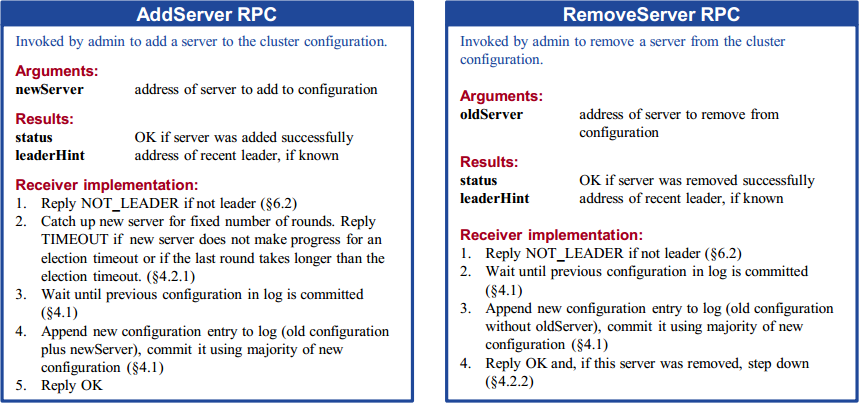
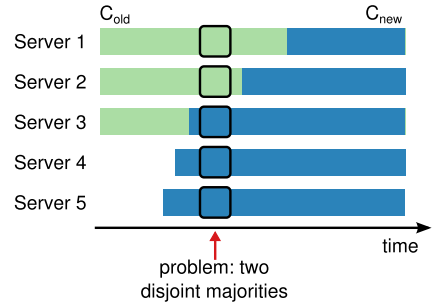
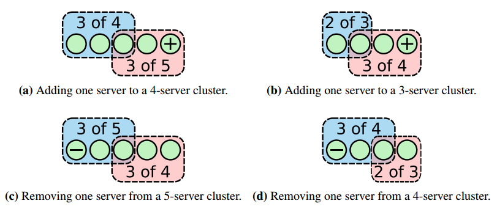
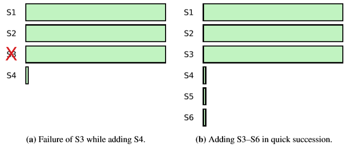
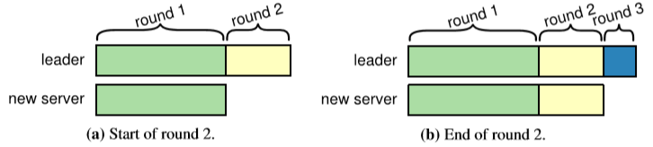

# Chapter 4. Cluster Membership Changes

## 安全性 Safety

成员变更仅需实现两个RPC即可，概述如下

假如允许直接批量添加新的节点，可能会导致安全问题，例如出现两个majority，如图中Server1和Server2构成旧集群的majority，而Server3、Server4和Server5构成新集群的majority，从而可能出现2个leader

增减节点可以有以下两种方式，重点分析第二种更为简单的方式：

- 批量增减节点，基于联合共识，[见此](#使用联合共识实现任意数量的成员变更-arbitrary-configuration-change-using-joint-consensus)
- 每次只允许添加/删除单个节点，通过多次增减来实现集群规模的改变，其安全性如下图所示：

    

    可见原集群是奇数或偶数节点时，任意添加或减少单个节点并不改变majority（途中蓝色部分代表旧集群的majority，红色部分代表新集群的majority，**可见任意情况下旧majority和新majority会有重叠**，因此不可能出现两个独立的majority）

    集群变化Cluster configuration可以作为特殊的entry存在于replicated log中，从而Raft可以在对cluster configuration entry持久化后（并不需要达成共识，所有节点在新集群配置持久化后即进行更新，随后新集群对这条entry执行commit，此时认为集群更新结束）实现安全的集群更新并且期间持续为client提供服务而不停机，参考流程如下

    1. Leader收到AddServer/RemoveServer请求带有新的configuration
    2. Leader将新的config加入log并进行replicate
    3. 所有收到这条config的节点**写入log并直接生效而不需要等到commit，即所有节点都采用最新看到的config**
    4. 当新的config对应的集群对这条config达成共识即commit时，认为当次config change结束，可以执行下一条AddServer/RemoveServer请求，此时如果是RemoveServer对应的节点则可以安全关闭此节点

    这样的设计会导致下述三种情况：

    1. Leader可能刚写入了config就宕机发生Leader改变，从而这条**entry可能会被覆写移除，那么已经看到新config的节点就需要回滚到旧config**
    2. **一个节点需要接收处理即使不在该节点当前config内的一个Leader发出的RPC**，否则的话在config change前的所有log都无法收到，自然也就不可能看到config change，无法完成集群更新
    3. **一个节点需要vote一个即使不在该节点当前config内的一个candidate**，否则的话比如向3节点集群加入新节点而1个节点宕机，如果加入的节点不投票那么原先的2个节点无法选出leader

    **注意：考虑到上述复杂情况，简单起见，以etcd为例的实际实现都采取commit了之后再应用新配置的方法**

## 可用性 Availability

1. **新服务器追赶 Catching up new servers**
    通常一个新节点在**不带有任何日志的情况下加入集群，可能会带来可用性问题**，如下图的两种情况：

    

    - 当加入一个新节点且一个旧节点宕机时，由于需要3个节点才能达成共识，此时的S4日志过于缺失导致整个集群在等待S4日志追赶上当前进度，这个期间无法进行新日志的追加，即出现不可用
    - 快速成功加入了三个节点，且S4, S5, S6日志都过于缺失，由于需要4个节点才能达成共识，此时整个集群都在等至少S4, S5, S6中的一个节点日志追赶上当前进度，这个期间无法进行新日志的追加，即出现不可用

    Raft引入了一个新的角色Learner/Observer来解决这种可用性问题，即在日志追赶上之前，新加入的节点**Learner只接收leader的日志执行log replication，不参与vote，不参与commit，**待等到日志足够新时，才真正加入集群成为Follower；同时，Learner也可以应用在一致性要求较低（如[最终一致性eventual consistency](https://en.wikipedia.org/wiki/Eventual_consistency)）的只读场合，Raft集群将log replicate到一大批Learner上作为内容分发，这些Learner不接收一致性读请求和写请求，不参与Raft集群的操作

    对于希望成为Follower的Learner，由Leader负责监控其replication进度，算法如下：

    

    1. 将log replication过程分割为多个round，每个round包含当前leader所有可以复制的日志，在复制的过程中接收到新的请求即构成了下一次round
    2. 由于目标是追赶上leader的日志，那么理论上如果proposal速度恒定，每一次round所包含的entries都应该比上一次要少，即收敛到0
    3. 设定固定的round次数，当Leader发现在达到这一个次数时的最后一次round耗时少于election timeout时（下一次round理论上entries更少，则耗时应少于election timeout，但不绝对），就进行配置变更将Learner加入集群成为Follower，Client此时可能发生一次election timeout时长的不可用是可以接受的
    4. 如果固定round次数后最后一次round耗时依然大于election timeout，此时Leader可以选择放弃成员变更，Learner依然继续接收日志，重试整个流程就可能成员变更成功

2. **移除当前主节点 Removing the current leader**
    存在更复杂的移除自身的方式，但推荐方式是首先进行Leadership transfer，将另一个节点指定为主节点后，再在新Leader上进行成员变更移除旧Leader

3. **破坏性的节点 Disruptive servers**
    当成员变更移除某个节点后，由于被移除节点不会收到新的config也不会收到heartbeat，因此超时后会发起选举冲击集群，从而导致Leader转为Follower，即使新的Leader已经完成选举，被移除节点依然无法发现自己不在新的config内，继续重复发起选举导致整个集群不可用，通过heartbeat流程如下：

    1. Leader通过能够向Follower发送heartbeat来确认自己的有效性
    2. 每个节点收到heartbeat时就会更新自己的election timeout计时器，如果在未超时时收到了vote请求，则可以直接丢弃这条请求或是拒绝vote，这并不影响正常选举，因为正常选举发生时一定已经超过了超时
    3. Leader能够正常收到来自集群的heartbeat响应，则不会被不在集群中的vote请求影响，可以直接丢弃这条请求

    **注意：由于leadership transfer会在超时内发起选举，与上述流程矛盾，因此对于leadership transfer导致的选举，可以通过在vote请求内额外加入一个标志位来确保Leader能正常转移**

4. **可用性讨论 Availability argument**
    假定在config change过程中，旧集群的majority在直到config change commit时都可用，新集群的majority一直可用，那么：
    - Leader可以在config change过程中被选举
      - 如果新集群中的一个节点有最新的日志，那么可以从新集群的majority中获得vote并成为Leader
      - 否则config change一定没有committed，那么一个节点有最新的日志就可以从旧集群的majority和新集群的majority中获得vote并成为Leader
    - Leader一旦被选上，就可以在config change过程中被保持，除非自身被移除
      - 只要Leader在过程中能够发送heartbeat，那么Leader和Follower都不会被其他高term的消息影响
    - Leader可以在config change过程中持续给client提供服务
      - Leader可以在config change过程中继续将client的请求append到log上等待commit
      - 由于Learner并不参与commit和vote，因此期间Leader可以正常commit请求并响应client
    - Leader可以完成config change

## 使用联合共识实现任意数量的成员变更 Arbitrary Configuration Change Using Joint Consensus

`TODO`

## 系统集成 System Integration

在实际系统集成使用Raft，通常需要集群成员管理来进行失效节点替换等工作，往往较好的方式是配置一个策略，每次先添加节点作为Learner/Observer，随后转换为Follower，再remove失效服务器，从而在全过程中平滑过渡

在启动一个新集群时，也可以考虑单节点作为集群启动，第一条日志就是集群的配置即自身，随后通过多次添加节点扩展到所需的集群规模
