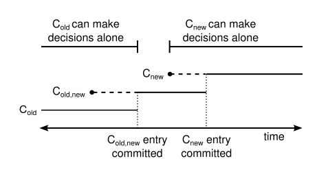

# Chapter 4. Cluster Membership Changes

## 安全性 Safety

成员变更仅需实现两个RPC即可，概述如下


假如允许直接批量添加新的节点，可能会导致安全问题，例如出现两个majority，如图中Server1和Server2构成旧集群的majority，而Server3、Server4和Server5构成新集群的majority，从而可能出现2个leader


增减节点可以有以下两种方式：

- 批量增减节点，基于联合共识，[见此](#使用联合共识实现任意数量的成员变更-arbitrary-configuration-change-using-joint-consensus)
- 每次只允许添加/删除单个节点，通过多次增减来实现集群规模的改变，其安全性如下图所示：

    

    可见原集群是奇数或偶数节点时，任意添加或减少单个节点并不改变majority（途中蓝色部分代表旧集群的majority，红色部分代表新集群的majority，**可见任意情况下旧majority和新majority会有重叠**，因此不可能出现两个独立的majority）

    集群变化Cluster configuration可以作为特殊的entry存在于replicated log中，从而Raft可以在对cluster configuration entry持久化后（并不需要达成共识，所有节点在新集群配置持久化后即进行更新，随后新集群对这条entry执行commit，此时认为集群更新结束）实现安全的集群更新并且期间持续为client提供服务而不停机，参考流程如下

    1. Leader收到AddServer/RemoveServer请求带有新的configuration
    2. Leader将新的config加入log并进行replicate
    3. 所有收到这条config的节点**写入log并直接生效而不需要等到commit，即所有节点都采用最新看到的config**
    4. 当新的config对应的集群对这条config达成共识即commit时，认为当次config change结束，可以执行下一条AddServer/RemoveServer请求，此时如果是RemoveServer对应的节点则可以安全关闭此节点

    这样的设计会导致下述三种情况：

    1. Leader可能刚写入了config就宕机发生Leader改变，从而这条**entry可能会被覆写移除，那么已经看到新config的节点就需要回滚到旧config**
    2. **一个节点需要接收处理即使不在该节点当前config内的一个Leader发出的RPC**，否则的话在config change前的所有log都无法收到，自然也就不可能看到config change，无法完成集群更新
    3. **一个节点需要vote一个即使不在该节点当前config内的一个candidate**，否则的话比如向3节点集群加入新节点而1个节点宕机，如果加入的节点不投票那么原先的2个节点无法选出leader

    单个节点的变更会引入安全性问题，[案例原文](https://www.zhihu.com/question/65667634)：

    ```text
           A            B            C
        Leader-S1    Leader-S4    Leader-S1&S4
    S1  [1] [2]         X         [1] [2]

    S2  [1]          [1]          [1]
                                  --network-partition--
    S3  [1]          [1] [3] [4]  [1] [3] [4]

    S4  [1]          [1] [3] [4]  [1] [3] [4]

    Initial: S1获得S2,S3,S4的投票成为leader，并append并commit了一条[1]NoOP
    Stage A: S1 append了一条[2]ConfigChange，内容为Remove S4，未广播即宕机
             此时S1认为的集群只有{S1, S2, S3}
    Stage B: S4获得S2,S3的投票成为新leader，append了一条[3]NoOP，未commit又append了一条[4]ConfigChange，内容为Remove S1，只复制到了S3
             此时S3,S4认为集群只有{S2, S3, S4}，从而足够commit日志[3]和[4]
    Stage C: 出现网络分区network partition，此时S1,S2无法连通S3,S4，且S1恢复并成为新leader
             S1认为集群只有{S1, S2, S3}，收到S2的票即可成为leader
    
    此后出现S1和S4均是leader，且即使网络恢复时也无法互融，已经commit的日志出现分歧
    ```

    类似的情况均发生在leader变更与ConfigChange一同出现时，因此单节点成员变更需要引入额外的约束，**Leader只有在自身的NoOP被committed之后才允许接收config change**，对于案例中，由于S4成为leader后的`[3]NoOP`在S2还未收到时，无法被commit，从而不能执行新的`[4]ConfigChange`，此时也就不会因为仅收到S3的vote而成为leader

    **注意：考虑到上述复杂情况，工业界的实现里，以etcd为例采取commit配置项了之后再应用新配置的方法，以braft为例采用了joint consensus方法**

## 可用性 Availability

### 1. 新服务器追赶 Catching up new servers

通常一个新节点在**不带有任何日志的情况下加入集群，可能会带来可用性问题**，如下图的两种情况：


- 当加入一个新节点且一个旧节点宕机时，由于需要3个节点才能达成共识，此时的S4日志过于缺失导致整个集群在等待S4日志追赶上当前进度，这个期间无法进行新日志的追加，即出现不可用
- 快速成功加入了三个节点，且S4, S5, S6日志都过于缺失，由于需要4个节点才能达成共识，此时整个集群都在等至少S4, S5, S6中的一个节点日志追赶上当前进度，这个期间无法进行新日志的追加，即出现不可用

Raft引入了一个新的角色Learner/Observer来解决这种可用性问题，即在日志追赶上之前，新加入的节点**Learner只接收leader的日志执行log replication，不参与vote，不参与commit，**待等到日志足够新时，才真正加入集群成为Follower；同时，Learner也可以应用在一致性要求较低（如[最终一致性eventual consistency](https://en.wikipedia.org/wiki/Eventual_consistency)）的只读场合，Raft集群将log replicate到一大批Learner上作为内容分发，这些Learner不接收一致性读请求和写请求，不参与Raft集群的操作

对于希望成为Follower的Learner，由Leader负责监控其replication进度，算法如下：


1. 将log replication过程分割为多个round，每个round包含当前leader所有可以复制的日志，在复制的过程中接收到新的请求即构成了下一次round
2. 由于目标是追赶上leader的日志，那么理论上如果proposal速度恒定，每一次round所包含的entries都应该比上一次要少，即收敛到0
3. 设定固定的round次数，当Leader发现在达到这一个次数时的最后一次round耗时少于election timeout时（下一次round理论上entries更少，则耗时应少于election timeout，但不绝对），就进行配置变更将Learner加入集群成为Follower，Client此时可能发生一次election timeout时长的不可用是可以接受的
4. 如果固定round次数后最后一次round耗时依然大于election timeout，此时Leader可以选择放弃成员变更，Learner依然继续接收日志，重试整个流程就可能成员变更成功

### 2. 移除当前主节点 Removing the current leader

存在更复杂的移除自身的方式，但推荐方式是首先进行Leadership transfer，将另一个节点指定为主节点后，再在新Leader上进行成员变更移除旧Leader

### 3. 破坏性的节点 Disruptive servers

当成员变更移除某个节点后，由于被移除节点不会收到新的config也不会收到heartbeat，因此超时后会发起选举冲击集群，从而导致Leader转为Follower，即使新的Leader已经完成选举，被移除节点依然无法发现自己不在新的config内，继续重复发起选举导致整个集群不可用，通过heartbeat流程如下：

1. Leader通过能够向Follower发送heartbeat来确认自己的有效性
2. 每个节点收到heartbeat时就会更新自己的election timeout计时器，如果在未超时时收到了vote请求，则可以直接丢弃这条请求或是拒绝vote，这并不影响正常选举，因为正常选举发生时一定已经超过了超时
3. Leader能够正常收到来自集群的heartbeat响应，则不会被不在集群中的vote请求影响，可以直接丢弃这条请求

由于leadership transfer会在超时内发起选举，与上述流程矛盾，因此对于leadership transfer导致的选举，可以通过在vote请求内额外加入一个标志位来确保Leader能正常转移

**注意：实际实现中也有采用prevote机制来避免破坏性节点的方案例如etcd，具体算法[见此](09.Leader_Election_Evaluation.md#防止重新加入集群的节点破坏集群-preventing-disruptions-when-a-server-rejoins-the-cluster)**

### 4. 可用性讨论 Availability argument

假定在config change过程中，旧集群的majority在直到config change commit时都可用，新集群的majority一直可用，那么：

- Leader可以在config change过程中被选举
  - 如果新集群中的一个节点有最新的日志，那么可以从新集群的majority中获得vote并成为Leader
  - 否则config change一定没有committed，那么一个节点有最新的日志就可以从旧集群的majority和新集群的majority中获得vote并成为Leader
- Leader一旦被选上，就可以在config change过程中被保持，除非自身被移除
  - 只要Leader在过程中能够发送heartbeat，那么Leader和Follower都不会被其他高term的消息影响
- Leader可以在config change过程中持续给client提供服务
  - Leader可以在config change过程中继续将client的请求append到log上等待commit
  - 由于Learner并不参与commit和vote，因此期间Leader可以正常commit请求并响应client
- Leader可以完成config change

## 使用联合共识实现任意数量的成员变更 Arbitrary Configuration Change Using Joint Consensus

如图，虚线代表ConfigChange的日志被append，但还未commit，实现代表committed，**实现联合共识成员变更的流程如下**：

1. 旧leader收到ConfigChange请求，创建ConfigChange同时包含旧集群old和新集群new的配置`C_old,new`，并且复制到所有节点上，同样的，每个节点**一旦看到ConfigChange就会立即应用**而不需要等到commit，即此时的leader认为集群有`C_new + C_old`
2. **旧集群majority和新集群majority内各自commit**，期间如果leader宕机，则新leader可以从`C_old`或`C_old,new`下诞生，取决于胜出的candidate是否已经见到了`C_old,new`，显然`C_new`集群不可能单独选出leader
3. 当`C_old,new`被新旧集群各自commit后，此时**后续操作需要新旧集群各自达成共识**才能继续，并且leader必须从见到`C_old,new`的节点中选出
4. 随后leader可以**添加ConfigChange仅包含新集群`C_new`提交给新旧集群**（一样是一旦见到即应用）
5. 旧集群中的节点一旦见到`C_new`，就相当于自己退出，而新集群majority一旦见到`C_new`，此后就可以单独继续执行（新集群majority就足够commit这条`C_new`）



在上述**同时需要旧集群majority和新集群majority的阶段称之为联合共识joint consensus**，期间：

- 所有log都被replicated到两个集群的**所有节点**上
- **两个集群的任一节点都可以作为leader**
- 共识（agreement，用与election和commit）**需要两个集群各自majority都达成**
  
联合共识允许在一条ConfigChange还在进行过程中旧开始新的ConfigChange，但在实践中意义并不大，并且由于在过渡期需要分别统计旧集群和新集群的majority，因此对于leader election，log replication过程都需要做出相应的修改

注意：由于single-server变更每一个节点变更都需要commit一条日志（并且为了安全在leader变更时需要额外等待NoOP被提交），而**joint-consensus仅需commit两条日志就可以应对任意节点增减且没有安全问题**

## 系统集成 System Integration

在实际系统集成使用Raft，通常需要集群成员管理来进行失效节点替换等工作，往往较好的方式是配置一个策略，每次先添加节点作为Learner/Observer，随后转换为Follower，再remove失效服务器，从而在全过程中平滑过渡

在启动一个新集群时，也可以考虑单节点作为集群启动，第一条日志就是集群的配置即自身，随后通过多次添加节点扩展到所需的集群规模
