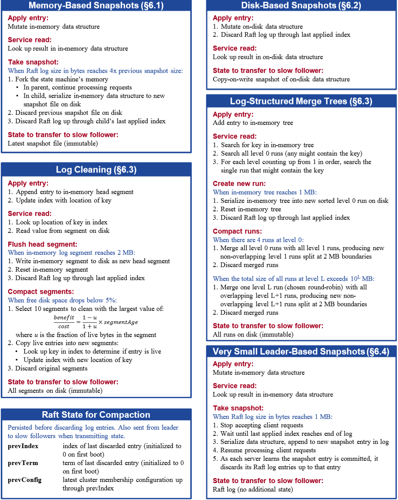
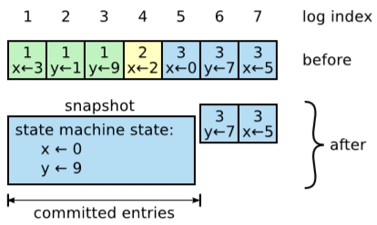
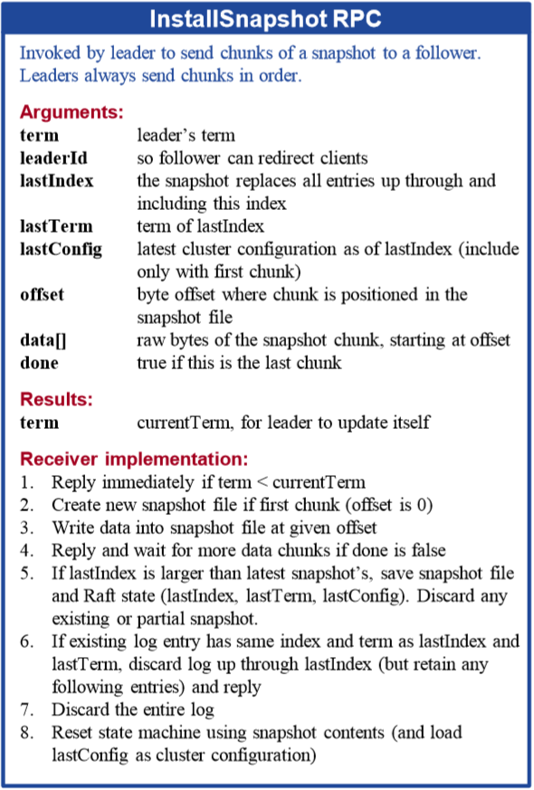
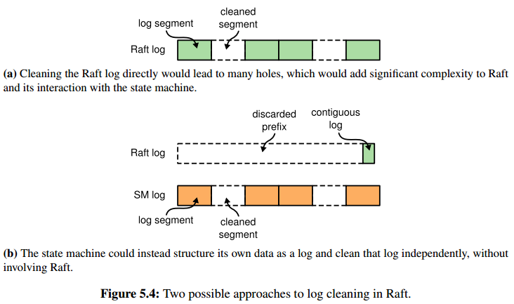
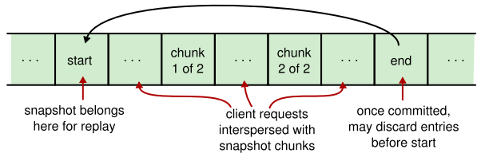

# Chapter 5. Log Compaction

## 概述 Overview

随着Raft的运行，越来越多的日志堆积会导致磁盘耗尽影响可用性，同时大量过期的日志已经没有存在的必要而可以删除，日志的压缩往往通过快照来实现，常见的不同方式如下：

1. 内存状态机的快照是最简单的，进行快照时，直接将状态机的当前状态作为快照写入持久存储，此时就可以将快照截止index之前的log删除
1. 磁盘状态机下，磁盘内容就是状态机的快照，一条Raft log一旦被应用到状态机上，就可以被删除，同时只有在需要给其他节点发送快照时才需要将磁盘内容作为快照发送到对端
1. 增量方式例如log cleaning和log-structured merge trees
1. 通过Leader直接将快照写入raft log，通过log replication达成共识，只适合非常小的状态机

在snapshot的过程中，需要额外注意以下3点：

- **节点自由控制快照的index进行log compaction而并不通过Leader统一控制**（除了不常见的方式4）
- Raft会**保存被删除的最后一条entry的index和term**，即对应snapshot的index和term，用于log的一致性检查，同时也会**保存最近的集群配置config**，用于支持集群成员变更config change
- 当log replicate被拒绝且Follower所需的log在Leader上已经被删除时发送snapshot

log compaction涉及到的RPC与概念如下图所示：

## 内存状态机快照 Snapshotting Memory-based State Machines

### 快照流程

内存状态机首先需要将自己的状态写入磁盘，完成后即snapshot结束，此时Raft进行日志清理log compaction并将最后一条删除的日志的index和term一样计入snapshot，以及最后的集群成员配置config，日志清理完成后，在此之前的过期snapshot也可以一并删除

当Follower需要snapshot时，Leader就会发送一条InstallSnapshot RPC并且带有一部分Snapshot的数据，Snapshot通过多个chunk有序发送，而对于接收的Follower：

- 如果snapshot index大于当前Follower的最新index，则删除所有log并直接从snapshot index开始接收后续log
- 如果snapshot index小于当前Follower的最新index，则Follower只能删除snapshot index及之前的log，后续log需要维护原样

### 并发快照 Snapshotting concurrently

实践中，内存状态机的状态保存及序列化往往非常耗时，为了确保不影响正常操作，快照往往需要和一般操作并发，常见的方法有：

1. 状态机采用**不可变数据结构构建immutable data**，从而能够实现在快照时继续正常操作
2. **写时复制copy-on-write技术**，例如内存状态机在需要快照时，使用fork，随后让子进程完成快照，父进程继续进行常规操作

另外为了避免内存占用过多，内存状态机也可以通过支持streaming接口实现流式快照，如果在内存不够时放弃snapshot，那么不应该重试（往往会持续失败）

### 快照时机 When to snapshot

由于快照占用CPU\内存\硬盘资源，过早的快照浪费资源，而过晚的快照可能导致log非常大，快照的时机有以下几种参考方式：

1. **每一定数量的entries**时即触发snapshot
1. **log占用硬盘达到一定容量**时即触发snapshot
1. **根据前一次snapshot的size * 容量factor 和 当前log大小比较**，来触发snapshot，这种方式较好，只需要当前snapshot的大小和log的大小，同时根据容量factor来控制磁盘占用量，以及系统资源分配给正常操作和snapshot的比例
1. 由于集群正常commit日志需要majority，那么可以**刻意调用minority进行snapshot**，此时集群的majority的资源服务client，minority的资源用于快照，并且**相互流转从而达到动态的每个节点都周期性当majority实现commit和当minority完成snapshot**，精细的调度器可以使得并发snapshot不再是个必须点

### 注意点 Implementation concerns

1. 保存和读取快照Saving and loading snapshots：可以考虑添加压缩方式和校验和
1. 传输快照Transferring snapshots
1. 日志移除和避免不安全的访问Eliminating unsafe log accesses and discarding log entries
1. 使用写时复制进行并发快照Snapshotting concurrently with copy-on-write
1. 决定快照时机Deciding when to snapshot：基于Raft log size和last snapshot size来决定

## 磁盘状态机快照 Snapshotting Disk-based State Machines

磁盘状态机总是有完整的状态储存在磁盘上，且**每应用一条entry都会更新到磁盘上，从而Raft log entry可以立即被安全删除**，而问题在于磁盘状态机每次都需要将entry应用到磁盘上会带来性能问题，虽然每时每刻磁盘上都有快照，但是由于一直在修改因此也不能直接将磁盘内容发送给Follower而需要有写时复制等技术

## 增量清理方法 Incremental Cleaning Approaches

### 日志清理简介 Basics of log cleaning

Log cleaning中，log被分割为连续的regions称为segments，每一轮日志清理根据如下算法进行：

1. 选择拥有较大比例过时entries的segments
1. 复制其中未过时的entries到log的头部
1. 释放segments占有的存储空间

对于多个segments，整个流程是可以并发进行的

### LSM简介 Basics of log-structured merge trees

1. LSM会保存一小部分最近读写的keys在磁盘上的日志里
1. 当此日志增长到阈值大小时，所有key就会排序并写入到一个文件称为run，runs文件永远不会被修改
1. 多个runs文件会被compaction到一起，相同的key在多个runs文件里，最新版本的值会被保留；对于读取key，首先检查最近的日志，随后再检查每一个run文件，为了减少检查的开销，通常会对run文件构建一个bloom过滤器

### 日志清理和LSM在Raft中的使用 Log cleaning and LSM trees in Raft

增量策略的原理是对于快照来说，每隔一段时间对状态机进行snapshotting非常消耗系统资源，引起抖动，**同时很多状态也许自上一个快照以来并没有变化，即数据出现冗余，增量式的方法通过连续不断的增量"snapshot"使得系统资源抖动更小**

例如采用LSM，最近的数据首先写入log文件，当log达到一定大小后会生成新的run文件，连续不断的run构成了整个状态机的快照，相当于原先每次都要全局做的snapshot，现在分成了逐次产生run，更加平滑，当Follower需要时就把所有run文件发送过去，同时run文件本身不会被修改更利于并发（除了compaction过程）

## 基于主节点的方法 Alternative: Leader-based Approaches

- 在Raft log中存储状态机信息Storing snapshots in the log
    
    可能的危险在于如果snapshot做到一半出现宕机，则接收者需要处理只有一部分的snapshot
- 对于非常小的状态机的方法Leader-based approach for very small state machines
    直接将状态机的全部信息写入log

由于依赖主节点进行snapshot会导致数据冗余（**所有节点各自的Raft log包含所有信息足够进行snapshot**）占用额外的网络带宽，且局限过多，因此基本不使用这种方式
