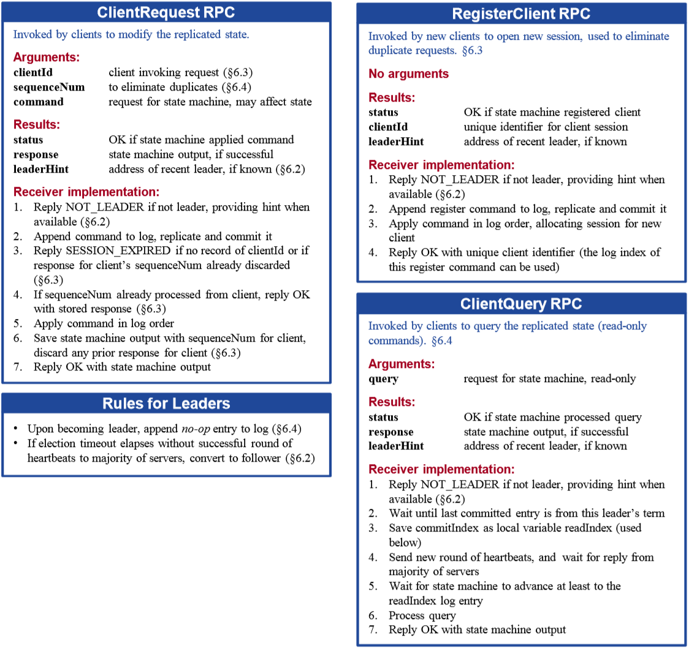
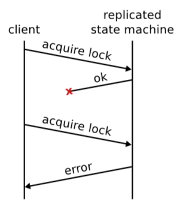

# Chapter 6. Client Interaction

## 概述 Overview

## 寻找集群 Finding the Cluster

对于集群成员不改变的情况来说，所有成员地址可以直接写入静态配置文件，从而所有client可以根据配置文件找到集群节点，对于会动态改变集群成员的情况来说，通常有如下方法：

- 使用网络广播或多播来找到所有节点，但是适用范围有限
- 使用外部服务来发现集群例如DNS，那么在集群成员变化时也就需要额外更新DNS服务

## 将请求路由给主节点 Routing Requests to the Leader

通常Raft的请求需要Leader参与处理，而client只知道所有节点但不知道具体Leader节点，通常可以有如下方法：

- Client随机挑选一个节点发送请求，如果不是Leader，则拒绝Client请求并在响应里带上Leader的地址（通常所有节点知道当前的Leader节点，Leader会在log replication的请求里带上自身标识，但如果正在选举等Leader未知的情况，则可以返回当前Leader不可用，client稍后重试即可），复杂性保留在client端（推荐做法）
- Client随机挑选一个节点发送请求，如果不是Leader，则节点将请求重新发送给Leader进行处理，即节点充当了Leader的代理，但是这会增加节点的复杂性

注意：**Leader信息本身无法保证时刻准确**，在多种情况下可能导致client请求被延迟：

- **Leaders**：如果出现网络分区等情况，一个Leader与majority失去联系，此时client的请求无法被完成，因此Leader在持续一个election timeout收不到heartbeat响应时应该自动降格为Follower
- **Followers**：Followers一直保存着当前Leader的信息，但是一旦出现选举或term改变就应该立即丢弃Leader信息直到新的Leader被发现
- **Clients**：clients在失去当前Leader的连接后应该随机选择节点进行请求而不是坚持重连，因为原leader有可能宕机

## 实现线性一致性语义 Implementing Linearizable Semantics

通常情况下，Raft提供[at-least-once语义](http://docs.oasis-open.org/amqp/core/v1.0/amqp-core-transport-v1.0.html#:~:text=This%20basic%20pattern%20can%20be%20modified%20in%20a%20variety%20of%20ways%20to%20achieve%20different%20guarantees.)，因为假如client的请求在被Raft应用到状态机后，Leader在返回给client前宕机，导致client需要向新Leader并发起重复的请求，从而一条请求可能被应用多次如图（除非状态机的操作都是幂等的[idempotent](https://en.wikipedia.org/wiki/Idempotence)）

### 1. 实现线性一致性

Raft通过记录所有clients的sessions和请求执行情况并去重来做到线性一致性：

- 每个client会有一个**唯一ID对应一个session**（使用RegisterClient RPC）保存在集群里，同时每个**proposal会被赋予一个唯一序列号unique serial number, SN**
- 当client重试proposal时带有相同的SN，那么当Raft发现已经执行过改SN的proposal并且有结果时，不再执行直接返回结果，即每个节点维护一个小型KeyValue存储，Key就是ID和SN，Value就是执行结果
- client的请求执行完后先将结果写入KeyValue后再返回，proposal会首先根据SN检查KeyValue，若已经执行就直接返回结果（执行的结果在每个节点都会写入节点内的KeyValue，因此即使宕机，只要带上相同的SN去其他节点就会得到相同的结果）
- **KeyValue也需要与Snapshot一起保存确保重启后恢复所有session的执行记录**，但每次更新状态机的结果不用写日志，只保存在内存即可，在每次重启后根据snapshot和日志replay时重建KeyValue

### 2. 允许并发请求和删除过时结果

一个client可以并发发起多个请求，并且带有最小的未收到回复的SN，从而Raft可以安全删除比此SN更早的请求对应的结果等过时信息

### 3. Session淘汰

由于不能无限增加session的数量，有一些client在结束所有请求或是意外宕机后应该合理回收session资源，但是session的回收必须达成共识，否则在一些节点上回收了session而在另一些节点上依然保留，会导致client请求结果异常，通常有以下方式进行资源统一管理：

- 设定session数量上限，**采用LRU**进行汰换session
- 使用**基于时间戳**的淘汰，最后一条请求的时间超过一个阈值即该session被淘汰

### 4. Session失效

当client带有一个ID对应失效或不存在的session时，Raft直接返回异常，要求Client重新注册即可（虽然这里依然会有非常小的概率出现重复执行请求）

## 更有效的处理只读请求 Processing Read-only Queries More Efficiently

只读请求由于并不修改状态机，因此可以跳过log replication流程从而获得显著的性能提升，但是如果只读请求跳过log replication则可能出现**过期读Stale Read**，例如由于当前Leader可能被网络分区而隔离，新的Leader已经应用了新的log从而在旧Leader上读取的结果是过期的；通过**Read Index**协议可以保证线性一致性读:

1. 当一个节点刚成为Leader时，由于不能直接commit上一个term的log，因此需要等待自己term内的第一条entry被commit才可以提供读服务（Leader一上任就会在term内首先提交一条空的log从而隐式commit上一个term的log）
1. Leader保存自己当前的commit index作为read index，低于此read index的请求都可以直接响应
1. Leader通过**发送heartbeat能够收到majority响应（check quorum）来确保自己仍然是Leader**，从而read index就是已知的最大commit index
1. Leader等到**apply index大于等于read index**时即可以访问状态机并返回client读请求的响应从而确保线性一致性读
1. Follower通过向Leader请求read index（**Leader收到Follower请求后完成1-3过程即返回给Follower，Follower执行完4过程就可以回复client**）从而Follower也可以提供读服务，分担Leader的读压力

参考3过程，可以使用时钟来进一步减少ReadIndex协议需要的网络通信（但如果时钟不准确，则lease不准确可能导致Stale Read），由于每一次读请求都需要一次heartbeat，那么可以积累多个读请求只发一次heartbeat从而减小网络负担，但是这会对部分读请求带来延迟，由于**一次heartbeat可以确保在election timeout内当前节点一定是Leader，从而可以合并多个读请求需要的heartbeat次数，即在leader上引入基于时间的lease**，每次heartbeat都可以重置lease，只要lease不超过election timeout不过期，那么leader可以不发送heartbeat就直接返回读请求，**注意如果主动发起leadership transfer则需要将lease失效**

通过client在读请求时提供最后一次看到的状态机响应对应的Raft log index，如果节点当前applied index小于client提供的index，则暂时不返回结果，从而client可以获得顺序一致性[Sequential Consistency](https://en.wikipedia.org/wiki/Sequential_consistency)保证，但不是强一致性，因为只确保了返回结果比上次结果更新，但未必是当前最新的状态
