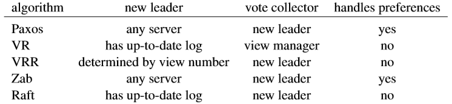
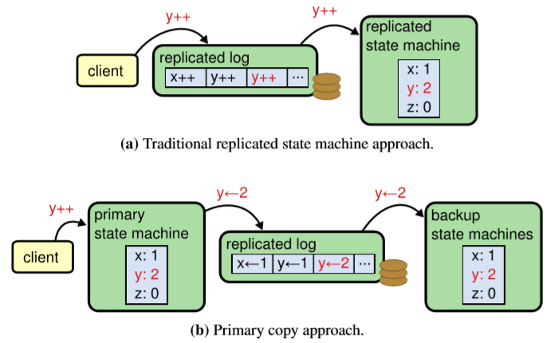
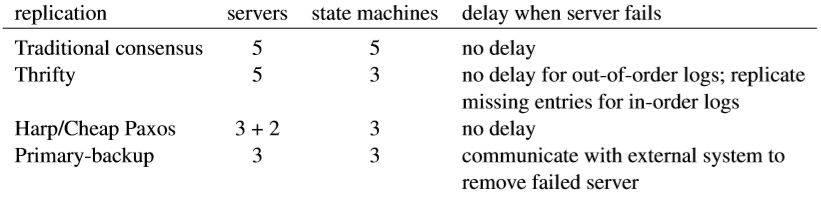
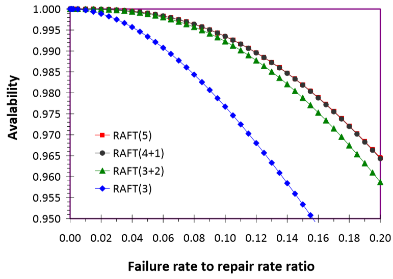

# Chapter 11. Related Work

## 共识算法概览 Overview of Consensus Algorithms

**Paxos, VR(Viewstamped Replication), Zab(ZooKeeper Atomic Broadcast), Raft都是处理故障停止fail-stop情况而不是拜占庭问题Byzantine failures的算法，后者允许任意的错误和行为(arbitrary failures and misbehaviors)**

- Paxos
Lamport的原始论文中只对Paxos做了整体的描述而不足以支撑细致的实现，因此在工程界中有多种Paxos的实现及其变种并不与原始论文完全一致
- 基于主节点的算法Leader-based algorithms
  - VR和Zab都是类似Raft的基于主节点的算法，VR的核心算法又称为VRR(Viewstamped Replication Revisited)，但VR的使用范围并不广
  - Zab中client获得了更强一些的一致性保证即FIFO client order保证，允许：一个client异步一次提交批量请求并释放一个锁，另一个client能按顺序看到批量的请求和锁被释放
  - Paxos中乱序提交，因此不能提供这种FIFO client order保证
  - VR和Raft中由于节点之间的网络不保证有序及client重试，因此需要session和TCP（保证网络有序）等额外机制来提供这种FIFO client order保证

## 选举 Leader Election

### 检测故障主节点 Detecting and Neutralizing a Failed Leader

在所有现实设置中，**故障failed节点和慢slow节点是无法区分的**，通常通过心跳heartbeat和超时timeout来确保最终completeness能发现故障节点，并且不会对可用节点造成影响accuracy，同时**慢Leader会拖慢整体响应，因此当作故障节点被降为Follower**反而是对系统整体有好处的
Paxos使用proposal number，Raft使用term，VR使用view，Zab使用epoch来描述每一轮主节点，这个值是单调递增的

- 在Zab和Raft中，使用选举vote来确保每一轮都只有一个leader；
- 在Paxos和VR中，将term分为不同的块从而避免节点的竞争，例如每一轮通过Round-Robin的方式分配term

### 选择新节点并确保包含所有已提交日志 Selecting a New Leader and Ensuring It Has All Committed Entries

- **Raft要求新Leader必须拥有最新的log**，从而在选举时避免了需要将log传递到新Leader上，显著减少了选举时的负担，简化了数据流（一定从Leader向Follower流动）
- **Zookeeper也已经通过限制Leader必须有最新的log，从而减少负担对Zab进行了优化**，未优化前的Zab通过所有节点向Leader发送log，Leader接受最新的log从而让自己的log最新
- **Paxos通过Leader对每一条log entry都进行裁定（single-decree Paxos）从而直到committed value**，直到所有可用节点上都没有新的proposals，这个过程可能**导致集群出现较长时间的延迟**
- **VRR通过所有节点向Leader发送log，Leader接受最新的log**从而让自己的log最新

注意：Raft可以通过**LeaderTransfer来间接支持preference指定Leader**

## 日志复制与提交 Log Replication and Commitment

- 所有算法都指出了如何将log发送到其他节点上以及何时标记为committed，通常一次通信（1 RTT）就可以实现，并且可以批量化和流水线化进行优化，不同的算法差异主要是在**对乱序的支持**上：
  - **Raft, Zab, VR都限制所有entries必须依次有序append并commit**，从而所有Follower的log和Leader的log保持一致
  - **Paxos允许任意顺序的accept和commit日志**，但并没有带给Paxos显著的性能提升

  对于Raft, Zab, VR来说，也可以在网络传输时乱序，此时需要在Follower上额外维持一个缓存来暂存还未有序的log（类似TCP滑动窗口）

- 同时每个算法中，刚成为Leader的节点如何处理已有的日志也有些许差别：
  - Paxos中，**Leader需要对每一条发现的log entry都执行two phases of single-decree Paxos**，改写和改变其当前的proposal number，此时Leader可以replicate和commit更多的log但还不能apply
  - VRR和Zab中，**Leader首先将所有log发送给所有Follower**，随后log被重新编号为当前的view/term
  - Raft中，**Leader首先发送一条noop entry从而隐式commit自身所有的log**，确保所有节点和Leader一致，这有两点需要注意：
    1. Raft的Leader不能直接commit来自上一个term的日志，而是通过当前term的noop entry进行隐式commit，而这依赖于Raft Log的设计上使得每一条commit的日志依赖于前一条commit，而这是在Paxos的single-decree中不可能的，因为后者的日志没有这种依赖关系
    2. 如果出现**不停的Leader切换**，则会一直出现noop entry，从而有可能导致**空间耗尽**，但在实际中这不可能出现

## 集群成员变化 Cluster Membership Changes

1. α策略
2. 选举期间进行成员变化Changing membership during leader election
3. Zab
   - **Zab的策略和Raft的joint策略最为接近**，都包含了两个阶段：
     1. 包含新config的entry在旧集群的majority和新集群的majority上都提交，此时旧Leader依然可以继续replicate日志但不能进行commit（除非旧Leader也是新集群的一部分）
     2. 旧Leader发送Activate消息给新的集群，通知新集群的配置已经commit，从而让新集群发起选举，如果旧Leader也属于新集群，那么可以继续成为新Leader

     在Raft中，类似Activate的消息通过Log而不是消息进行通知，并且Raft中每个节点都是用最近的集群配置（不一定commit）从而Raft的集群转变和中途故障恢复更为简单

   - **但是如果要移除的是Leader自身**，则Zab在下述方面与Raft不同：
     1. Raft中Leader在降级前依然可以继续replicate并commit日志，而在Zab中Leader只能replicate而不能commit任何在config后的日志
     2. Zab中Leader被移除后会立即在新集群中进行选举同时旧Leader也可以在此时立即指定新Leader，而在Raft中需要等待新集群超时发起选举，但也可以通过Leader transfer来达到和Zab类似的效果

## 日志压缩 Log compaction

由于现实系统不可能有无限大的存储空间，因此日志压缩对所有算法来说都是必须的，但是由于日志压缩并不在共识算法的涵盖范围内，因为讨论甚少

## 复制状态机策略和主副本策略 Replicated State Machines vs. Primary Copy Approach

复制状态机和主副本策略主要在三个方面不同：

- **主副本策略中的主要状态机primary state machine会体现出还未commit的日志的效果**，而复制状态机replicated state machine只会体现出committed日志的效果，从而对主副本策略来说，这会导致不一致的问题，因此主副本中的状态机必须确保只有在commit后才能应用externalize日志，并且如果另一个节点成为Leader，则旧Leader里的状态机需要回滚uncommitted日志
- 复制状态机策略下，无论一条entry最终会不会导致状态机变化，一定会达成共识并占据空间，而在主副本状态机的情况下，如果一条entry没有效果，则可以直接跳过共识环节
- 复制状态机策略下，**每一条entry都必须是确定性的deterministic**，即对不同节点的状态机应用相同的entry必然导致相同的结果，但是主副本状态机没有这个要求，**主副本状态机可以对request做任何事，只要最终产生的结果是确定性的deterministic即可**

混合策略hybrid，即在**任意non-deterministic请求到达时，通过服务端自己的规则最终将请求转换为deterministic，从而就可以交给共识模块**，常见实现中往往采用混合策略，而复制状态机只作为一个底层共识模块，从而服务端可以只将deterministic的critical数据交给共识模块

## 性能 Performance

### 减轻主节点瓶颈Reducing Leader Bottleneck

- **轮换主节点Rotating Leader (Mencius)**
    通过对log index进行分割成为多个范围，每个范围都由不同的节点作为Leader，从而每个Leader都能进行propose提高系统的吞吐量，但同样存在两个可能的缺点：
    1. 某一个慢节点可能拖慢整个系统，影响延迟（但不影响吞吐量），需要有跳过慢节点的机制
    1. 故障节点同样会降低整个系统效率，需要集群回收故障节点被分配的log index，但是对于Raft非Leader节点宕机通常不影响整个系统

- **将Leader负担分给clients Offloading Leadership Burden to Clients (Fast Paxos)**
    clients的请求直接提交给集群而不一定是Leader，即Leader运行Paxos第一阶段解决proposed but uncommitted日志随后给clients一个proposal number，clients就使用proposal number将请求提交给所有节点，每个节点在达成共识（fast quorum 向上取整3N/4）后将请求添加到第一个未使用的log entry，存在两个问题：
    1. 通常client需要知道状态机的响应，仅仅知道请求被commit是不够的，因此集群中也必须有节点在请求被commit后需要apply给状态机，随后返回状态机的结果给client
    1. 少量请求时Fast Paxos可以降低延迟，但是当出现冲突时就需要Leader进行冲突解决（slow quorum 向下取整N/2+1或重试fast quorum），激烈冲突下可能到时性能下降

- **利用交换性 Exploiting [Commutativity](https://en.wikipedia.org/wiki/Commutative_property) (Generalized and Egalitarian Paxos)**
    `TODO`

### 减少节点数Reducing Number of Servers (Witnesses)

通过在系统**负载高时仅replicate给majority来减少网络等负载，在系统空闲时再replicate给全部节点**，但代价就是一旦出现Leader宕机，在选举时能够成为Leader的节点会减少，同时新Leader也需要传输更多的日志给落后节点

**见证节点Witnesses仅参与是否commit entries和vote（自身不成为Leader）但不参与replicate log同时也没有状态机**，当一个Follower宕机之后，Witness optionally参与替代宕机节点进行存储日志，直到该Follower重启或被替换

例如下图，当5节点Raft集群被替换为4+1witnesses时，可用性几乎与5节点完全一致；当5节点Raft集群被替换为3+2witnesses时，可用性仅略微下降；而4+1和3+2的可用性均显著高于3节点Raft集群；同时对用户请求的处理和集群log replication性能高于5节点Raft集群

### 避免写入持久存储Avoiding Persistent Storage Writes

激进的实现通过使用in-memory replication来代替写入持久化存储（或改为异步持久化），一旦一个节点宕机，**重启后缺失的log通过其他节点来获得，缺点是极端情况下会出现数据丢失**，例如majority几乎同时宕机，则未写入持久化的部分日志此时就丢失了，此时集群不再可用

## 正确性 Correctness

`TODO`

## 可理解性 Understandability

`TODO`
