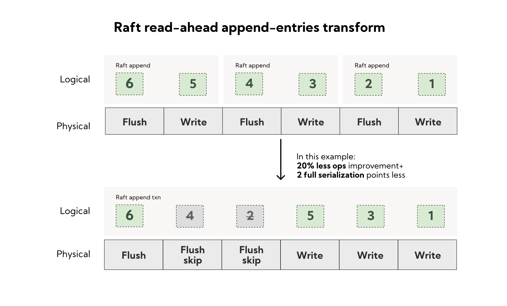

# The Kafka API is great - now let's make it fast

[original post](https://redpanda.com/blog/redpanda-vs-kafka-faster-safer)

## Overview

18种工作负载，数据都replicate到3个节点，唯一的区别在于Kafka可以采用in-memory replication using page cache，而Redpanda只能采用safe mode，即`acks=all`且每一批数据都`flush`

- safe mode，两者都是`acks=all`且每一批数据都`fsync()`

  

- in-memory replication using page cache without explicit flushes，而Redpanda依然是safe mode
  
  

*个人意见：实际部署Kafka时不一定会采用完全安全的模式，甚至可能不会选择`acks=all`*

## A mountain of improvements for safe workloads

个人非常赞同的一段话：

> However, once you get your replication model set, the rest of the life of the product is spent on **predictability**, and for big-data and real-time systems, that means **understandable, flat-tail latencies**.
> It is not enough to be fast. It is not enough to be safe. When trying to handle hundreds of terabytes per day of streaming you need to be predictable not only in the way the product breaks **in case of network partitions, bad disks, etc.**, but also in **how performance degrades as a function of hardware saturation.** This is at the core of operational simplicity for streaming systems.

确定性和可预测性，尤其是在系统资源饱和、硬件故障情况下的系统表现在如今的超大规模分布式系统种更为重要，微小的预期外抖动都有可能给整个系统带来不可预计的影响，而可预测的性能和表现在系统扩容缩容、灾备、故障转移时能够提供更精确可靠的参考。另外有一篇[基于磁盘的可预测性能进行建模设计磁盘IO调度器](https://github.com/JasonYuchen/notes/blob/master/seastar/New_Disk_IO_Scheduler_For_RW.md)的博文也非常不错。

- **No page cache**
  放弃页缓存，采用直接读写磁盘数据的做法，早已被数据库领域所采纳，例如[Direct IO和Buffered IO代价](https://github.com/JasonYuchen/notes/blob/master/linux/direct_io_writes.md)

  页缓存通常是通用软件需要进行磁盘IO时非常好的一个选择，引入的额外代价有限，但显著简化了软件所需要进行的操作，且在一定范围提升了性能。但是当你设计一个消息队列系统，且是[基于日志的系统](https://github.com/JasonYuchen/notes/blob/master/kafka/06.Kafka_Internals.md#replicated-logs-quorums-isrs-state-machines)，则**开发者对磁盘的访问模式更为清楚**（如同数据库领域采用Direct IO的原因就是数据库对缓存页的管理会比操作系统的页缓存机制更为高效），此时开发者能够采用更底层的Direct IO接口实现出更高效率的磁盘IO模式

  采用Direct IO，Redpanda可以对磁盘IO的行为、错误、尾延迟更具有可预测性，通过观测磁盘的响应情况可以进一步动态调整缓存池策略（[反馈控制](https://github.com/JasonYuchen/notes/blob/master/seastar/Dynamic_Priority_Adjustment.md)），并对内存使用情况有一个更全面的监控和利用（Buffered IO中页缓存由操作系统控制，不可控且难以预测）
- **Automatic Linux kernel tuning**
  Redpanda在运行前会自动调整Linux内核的一些配置，来进一步加速，包括：
  - 禁用Linux Block-IO自动合并，在`/sys/block/\*`设置nomerges，从而避免一些检查开销，以及让Redpanda能够更确定性的获得IO操作时的内存footprint
  - 合并中断，将上下文切换带来的开销降低
  - 中断亲和性affinity调整，从而初始发起IO请求的处理器会收到内核相应的中断通知
- **Adaptive fallocation**
  自适应的文件空间预分配，从而尽可能避免每一次写入都需要修改全局的内核文件元信息，而更新元信息是全局操作存在竞争的可能性，这种**预分配减少了更新全局元数据的频率，从而降低了数据竞争的可能性**

  
  
- **Out-of-order DMA writes**
  DMA操作需要内存对齐，Redpanda每个线程都会维护一组**已经完成内存对齐的buffer chunks共享于不同文件的磁盘读写**，当需要读写磁盘时就会从内存缓存池中申请所需的buffer chunks，由于其已经对齐，因此可以**乱序并发提交给磁盘**，充分利用现代NVMe磁盘的高并发特性，这种设计之下越是活跃的topic partition，就能申请到越多的buffer chunks从而能够应对短时的峰值流量

  

  `TODO`
  
  [segment](https://github.com/redpanda-data/redpanda/blob/dev/src/v/storage/segment.cc)
  
  [segment appender](https://github.com/redpanda-data/redpanda/blob/dev/src/v/storage/segment_appender.cc) 
  
  [concurrency](https://github.com/redpanda-data/redpanda/commit/7beddff36f248ef2d3663eb83ed48d4d5951f5e8)
  
  [?](https://github.com/redpanda-data/redpanda/commit/2c9a4dd4c95f5bb7a18d15d27d3176736a197ee6)

  ```text
  -> append segment
    -> append head
      -> return ready (maybe await commitment?)
  
  .> background_head_write
    -> dma_write head (out-of-order?)
      -> maybe advance committed
        -> notify awaiters if any
  
  .> flush when necessary
    -> advance committed (`fsync`-ed offset) 
      -> notify awaiters if any
  ```

  How to wait and how to notify ? out-of-order dma_write with accumulative commitment (like tcp sliding window) ? need further confirmation.

- **Raft read-ahead op dispatcher**
  在解析Raft操作时通过人为的毫秒级延迟Raft的写入操作，解析完更多的Raft操作从而可以在一次`fsync()`中包含更多的写入，如下图，确定了图中范围内的全部操作后才开始写入，而不是每解析一个写入都立即写入并同步，此时优化后只需要一次同步（*AKA批量处理？*）
  
  

- **No Virtual Memory**
  `TODO` [Seastar Allocator & Fragmentation Analysis](https://github.com/redpanda-data/redpanda/blob/dev/docs/rfcs/20201208_fragmentation.md)

- **TPC Buffer Management**

  `TODO` [iobuf class](https://github.com/redpanda-data/redpanda/blob/dev/src/v/bytes/iobuf.h)

- Redpanda peek() `TODO` [followup](https://www.infoq.com/presentations/raft-kafka-api/)
  - pipelining
  - batching
  - out-of-order execution
  - kernel tuning
  - write-behind buffering
  - fragmented-buffer parsing
  - integer decoding
  - streaming compressors
  - cache-friendly look-up structures
