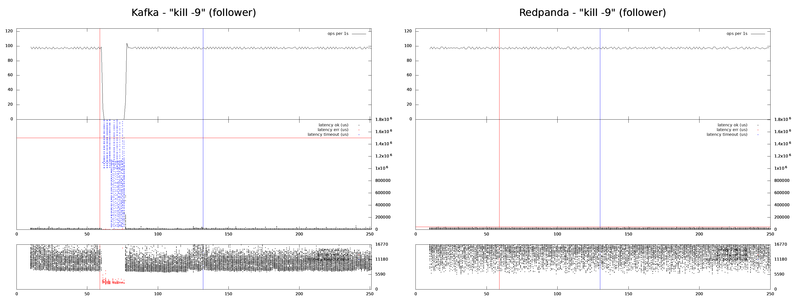
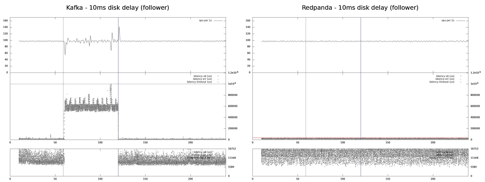
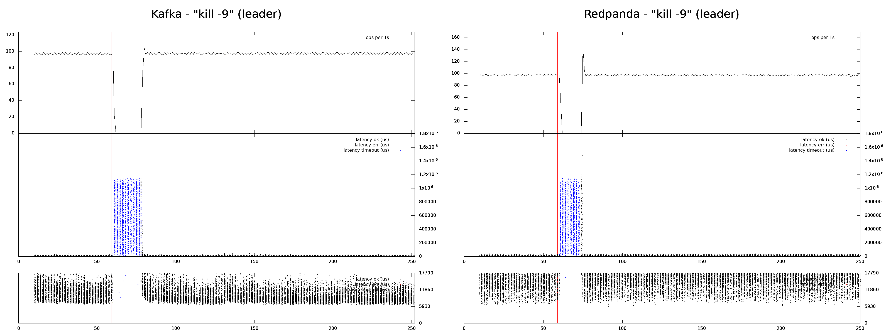
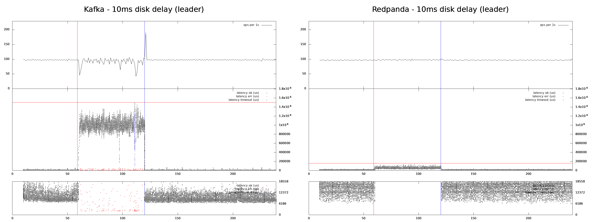
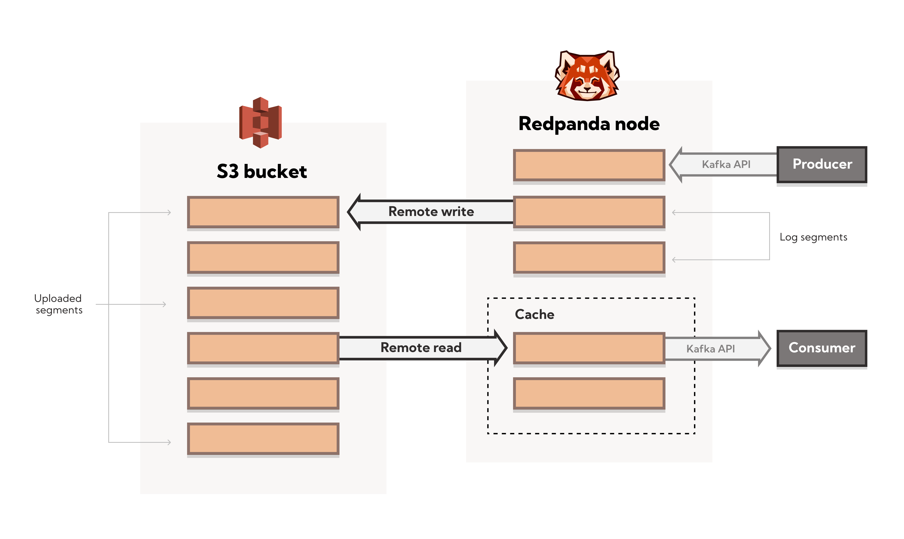

# High-availability deployment of Redpanda: Patterns and considerations

[original post](https://redpanda.com/blog/high-availability-software-deployment-patterns-part-1)

## Understanding failure scenarios

- **Individual node failure**
  - 单节点宕机，考虑采用集群部署 clustered deployment
- **Rack or switch failure**
  - 该机架上所有节点宕机，考虑采用分布在多个机架上的集群部署 clustered deployment spread across multiple racks/network failure domains
- **DC/DC-room failure**
  - 数据中心所有节点宕机，考虑采用扩展的集群部署，一个集群横跨多个数据中心 stretch cluster and/or replicated deployment
- **Region failure**
  - 域内所有节点宕机，考虑地理分布的集群部署 geo stretched-cluster and/or replicated deployment
- **Global, systemic outage**, e.g. DNS failures, routing failures, etc.
  - 全球节点宕机，考虑冷备份 offline backups or replicas in 3rd party domains
- **Human action**, e.g. inadvertent, malicious, etc.
  - 人为故障/错误导致不可用或损坏，考虑冷备份 offline backups

## Deployment patterns for high availability and disaster recovery

- Clustered deployment
  - 采用**Rack Awareness**进行部署，从而节点会被自动分配到不同机架上，提高可用性
- Multi-availability-zone deployment
  - 采用Rack Awareness进行部署，不同的AZ标记为不同的机架即可，此时集群的性能可能会受到跨AZ的带宽/延迟的影响
- Multi-region deployment
  - 通常跨region的带宽/延迟影响较大，可以通过**指定leader partition的位置**（靠近producer/consumer）来减轻影响，或者是修改`ACK=1`（可能会丢失数据）
- Multi-cluster deployment
  - 采用MirrorMaker在多个集群间完成**asynchronous replication**

## Considerations when deploying clusters for high availability

- **Replica synchronization**
  Kafka采用**In-Sync Replicas ISR**的概念，而Redpanda采用Raft算法的**quorum-based majority**概念，当要求同样不丢数据时，基于quorum的算法对任意节点宕机、缓慢的容忍度更高，详细可见[此对比](https://redpanda.com/blog/kafka-redpanda-availability)，而ISR的设计在于若能够容忍数据丢失则性能有极大的提升

  
  
  
  
  
  
  

- **Rack awareness**
  当启用Rack Awareness时，Redpanda会基于以下策略将topic的副本放置在不同的机架上：
  - rack的数量和replica的数量：当`#rack >= #replica`时，所有replica都会放置在独立的rack上，而`#rack < #replica`时，所有rack都会有replica，随后其余的replicas再继续均分到rack上
  - 节点CPU数量：优先选择拥有更多CPU数量的节点来存放replica
  - 节点使用率：优先选择已经持有较少replica的节点
- **Partition leadership**
  对应Kafka的**unclean leader election**，即丢失所有ISR后为了维持可用性从而在非持有最新数据的节点上开启写入，会有丢失数据的风险，而Redpanda采用quorum机制，可以容忍minority的宕机，假如已经majority都已经宕机，若要继续写入同样会有类似的丢失数据风险，这是**数据可靠性和系统可用性的权衡**
- **Producer acknowledgment**
  除了Kafka中提到的几种[ACK选项](https://github.com/JasonYuchen/notes/blob/master/kafka/03.Kafka_Producers.md#configuring-producers)，Redpanda由于实现的不同在这一点上有非常多的细节差异`TODO`
- **Partition rebalancing**
  在新节点加入、旧节点离开或是节点宕机的情况下，Redpanda会自动进行多节点参与的partition重平衡过程
- **Remote vs. local storage**
  通常选择远端存储的目的在于高可用，例如选择S3等云存储，而本地存储的目的在于高性能以及更精准的磁盘控制，Redpanda及底层的Seastar库内置了磁盘IO调度器，会充分挖掘本地磁盘的性能，并同时也会将数据备份存放到S3上
- **Disaster recovery**
  Redpanda也提供**分层的存储tiered storage**，会将topic数据被分到S3兼容的存储设备中，分层存储实现了：
  - topic recovery
  - remote read replicas
  - infinite data retention
  
  

  *越来越多的系统开始采用这种分层存储，选择本地高性能，选择S3高可用，例如[RisingLight](https://www.risingwave-labs.com/blog/state-management-for-cloud-native-streaming/)也是类似*
