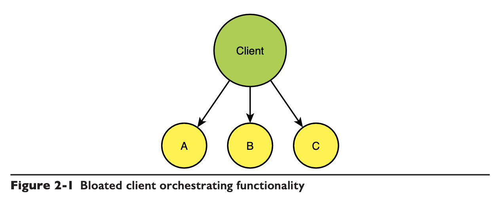
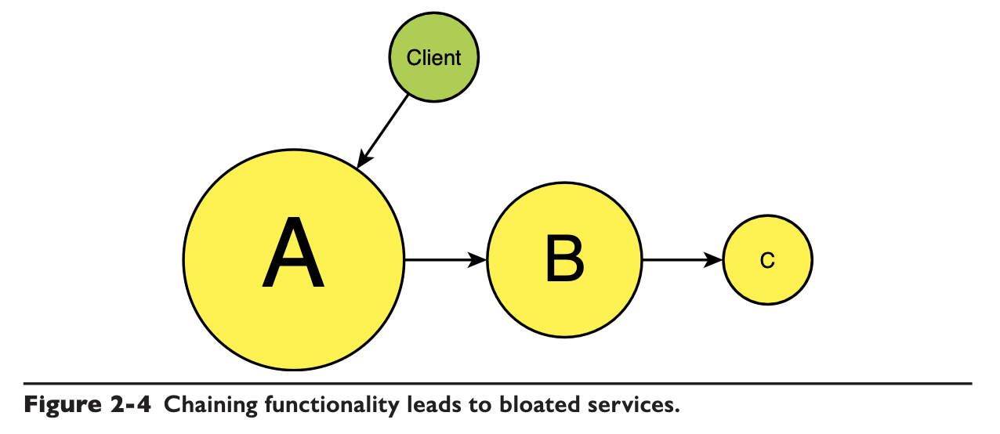
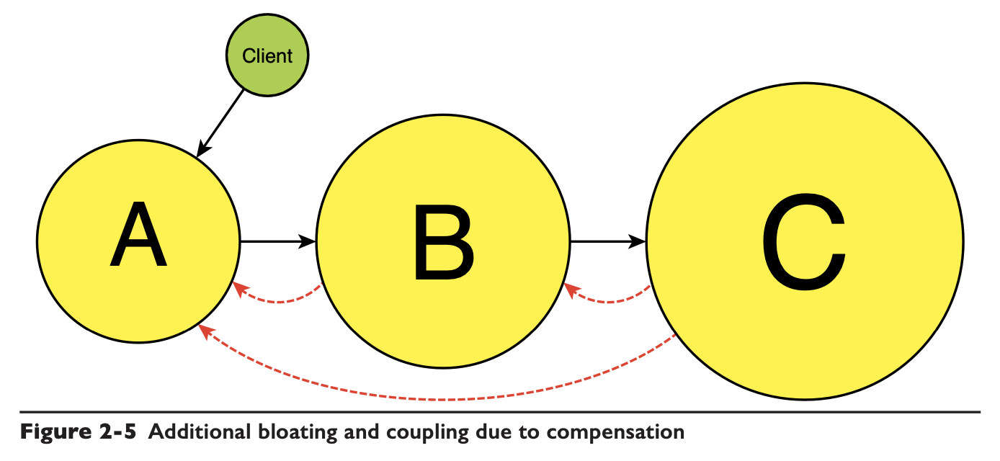
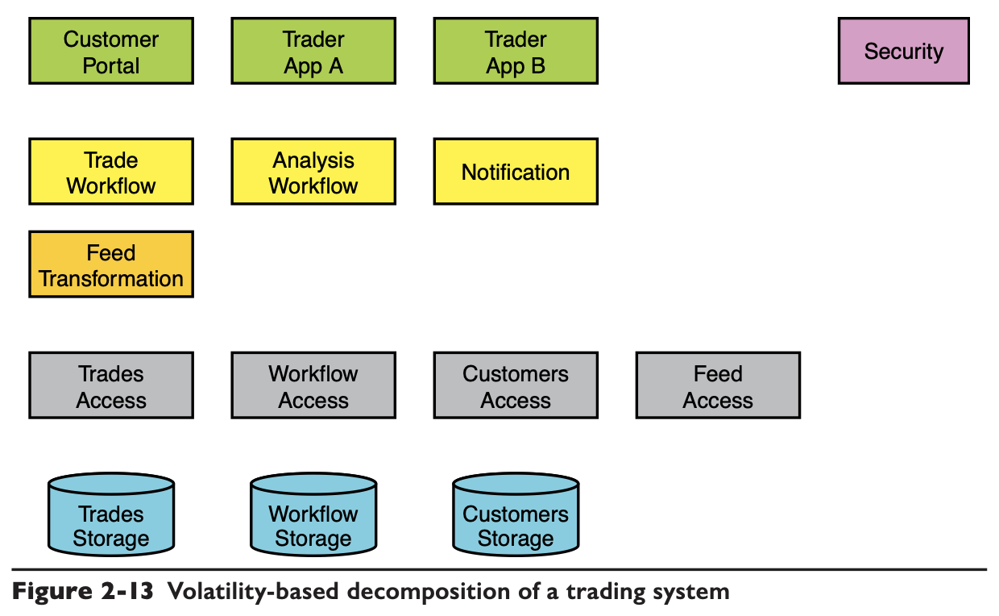

# Chapter 02 Decomposition

> The design flaws are a direct result of the incorrect decomposition of the systems.

## Avoid Functional Decomposition

> **Functional decomposition** decomposes a system into its building blocks based on the functionality of the system.

### Problems with Functional Decomposition

- **Precluding Reuse**
    A decomposed system that uses A -> B -> C, if another system wants to reuse B but will not do A or C, it will fail as **B is not an independent reusable service at all**, A, B and C are tightly coupled.
- **Too Many or Too Big**
- **Clients Bloat and Coupling**
    Functional decomposition leads to flattening of the system hierarchy, which makes client tightly coupled with too many decomposed services. e.g. client has to be aware of A, B, C, ... N services, **Ideally, the client and services should be able to evolve independently.**

    

- **Multiple Points of Entry**
    e.g. client needs to enter the system in A, B and C, three places, which means there are **multiple places to worry about authentication, authorization, scalability, transactions, etc.**
- **Services Bloating and Coupling**
    also consider [Transaction management in a microservice architecture](../mp/04.Managing_Transactions.md#Transaction%20management%20in%20a%20microservice%20architecture)

    

    

### Reflecting on Functional Decomposition

- **Nature of the Universe (TANSTAAFL)**

    > Design, by its very nature, is a high-added-value activity. Design adds value, or even a lot of value.

    Functional Decomposition is easy and straightforward.

### Avoid Domain Decomposition

> The reason domain decomposition does not work is that **it is still functional decomposition**.

### Faulty Motivation

> The motivation for functional or domain decomposition is that the business or the customer wants its **feature as soon as possible**.

### Testability and Design

> A crucial flaw of both functional and domain decomposition has to do with testing. With such designs, the level of coupling and complexity is so high that the **only kind of testing developers can do is unit testing**.
> 
> Therefore, by precluding regression testing, functional decomposition makes the entire system untestable, and **untestable systems are always rife with defects**.

## Volatility-Based Decomposition

***Decompose based on volatility***, which identifies areas of **potential change** and encapsulates those into services or system building blocks.

> With functional decomposition, your building blocks represent areas of functionality, not volatility. As a result, when a change happens, by the very definition of the decomposition, it **affects multiple (if not most) of the components** in your architecture.

### Decomposition, Maintenance, and Development

Systems designed with volatility-based decomposition present a stark contrast in their ability to respond to change.

### The Volatility Challenge

**Volatility is often not self-evident.**

- **The 2% Problem**
    When you spend 2% of your time on any complex task, you will never be any good at it.

- **The Dunning-Kruger Effect**
    People unskilled in a domain ***tend to look down on it***, thinking it is less complex, risky, or demanding than it truly is.

- **Fighting Insanity**
    Doing things the same way but expecting better results is the definition of insanity.

## Identifying Volatility

### Axes of Volatility

Two ways the system could face change:
1. same customer **over time**
2. same time **across customers**

- **Design Factoring**
    Looking for areas of volatility using the axes of volatility is an **iterative process interleaved with the factoring** of the design itself.

- **Independence of the Axes**
    Something that changes for one customer over time should not change as much across all customers at the same point in time, and vice versa.

### Example: Volatility-based Trading System

It is vital to ***call out the areas of volatility and map them in your decomposition*** as early as possible.

Identify both the areas of:

- volatility to encapsulate
- those not to encapsulate, e.g. **the nature of the business**

*Volatility is intimately related to longevity.* The more frequently things change, the more likely they will change in the future, but at the same rate.
