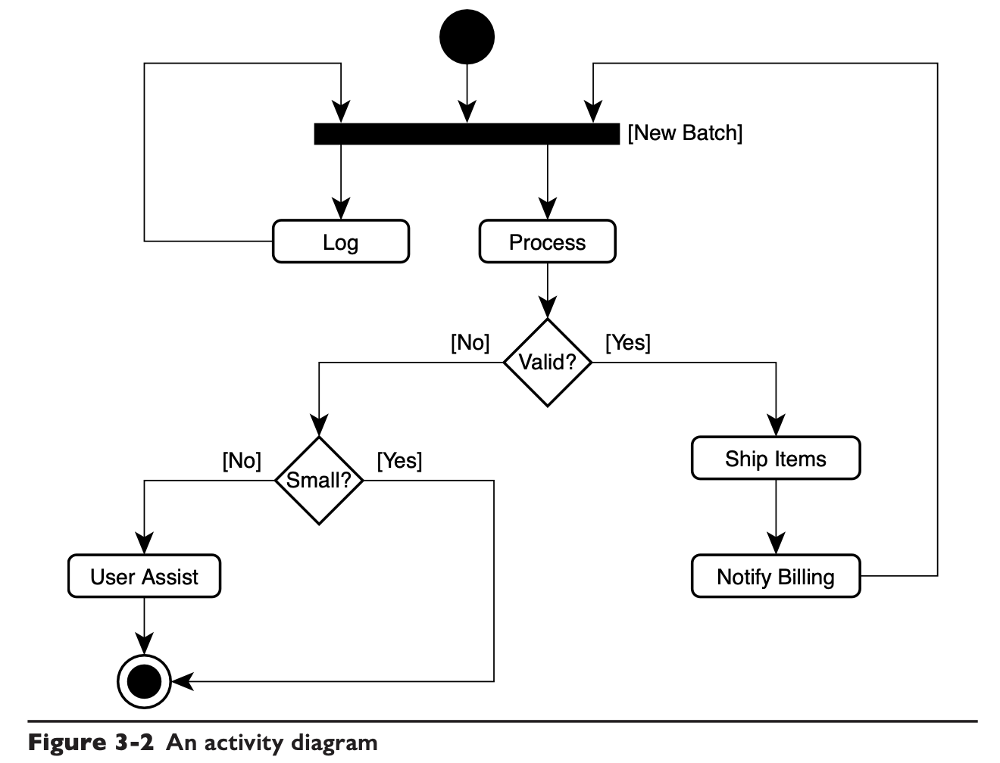
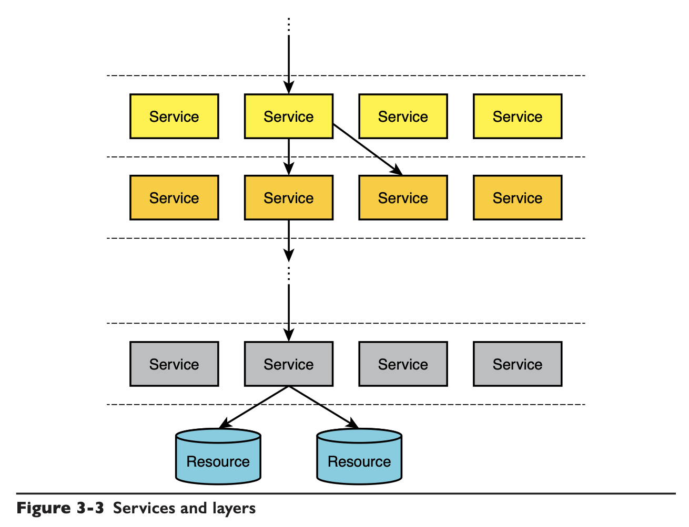
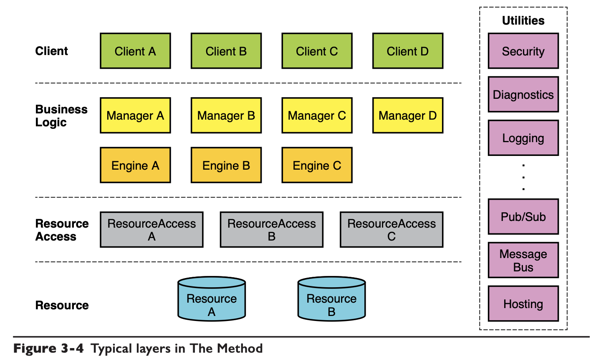
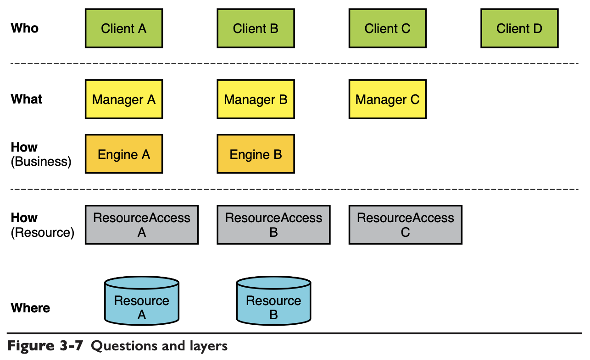

# Chapter 03 Structure

## Use Cases and Requirements

### Required Behaviors

Requirements should **capture the required behavior** rather than the required functionality. A **use case** is an expression of required behavior

## Layered Approach

[Microservices Patterns](../mp/01.Escaping_Monolithic_Hell.md#microservice-architecture-to-the-rescue)

## Typical Layers

A well-designed *ResourceAccess* component exposes in its contract the **atomic business verbs around a resource**. (avoid including `Open/Close/Select/Insert/etc` operations which may expose the underlying resource)

## Classification Guidelines

### What's in a Name

- XXX Manager: a noun associated with the **encapsulated volatility**, e.g. `AccountManager`
- YYY Engine: a noun describing the **encapsulated activity**, e.g. `CalculatingEngine`
- ZZZ Access: a noun associated with the **resource**

### The Four Questions

### Managers-to-Engines Ratio

> For an Engine to exist, there must be some **fundamental operational volatility** that you should encapsulate—that is, an unknown number of ways of doing some- thing. Such volatilities are **uncommon**.

Managers and Engines tend to maintain a **golden ratio**.

### Key Observations

- **volatility decreases top-down** (client -> resource)
- **reuse increases top-down**
- **almost-expendable managers** (functional decomposition leads to big and expensive manager)

## Subsystems and Services

***Design iteratively, build incrementally***

## Open and Closed Architectures

### Open Architecture

**Any component can call any other component** regardless of the layer in which the components reside.

In general, in software engineering, **trading encapsulation for flexibility is a bad trade**.

### Closed Architecture

A closed architecture opens a **chink** in the layers, allowing components in one layer to call those in the adjacent lower layer.

### Semi-Closed/Semi-Open Architecture

A semi-closed/semi-open architecture allows **calling more than one layer down**.

- Key piece of infrastructure, calling more layers down to squeeze performance
- Codebase that hardly ever changes, will not have to maintain, e.g. network stack implementation

### Relaxing the Rules

- **Calling Utilities**: almost all other components will use utilities, e.g. logging, security
- **Calling ResourceAccess by Business Logic**
- **Managers Calling Engines**: Engines are just expression of the *Strategy Design Pattern* used to implement Managers' workflows.
- **Queued Manager-to-Manager**: business systems quite commonly have one use case that triggers a much-deferred execution of another use case, asynchronous operation.

### Design "Don'ts"

- *Clients* do not call multiple *Managers* in the same use case.
- *Clients* do not call *Engines*
- *Managers* do not queue calls to more than one *Manager* (refactor with *Pub/Sub* for such cases)
- *Engines* do not receive queued calls
- *ResourceAccess* services do not receive queued calls
- *Clients* do not publish events
- *Engines, ResourceAccess, Resources* do not publish events (*Managers* may publish events)
- *Engines, ResourceAccess, Resources* do not subscribe to events (*Managers* may subscribe to events)
- *Engines* never call each other
- *ResourceAccess* services never call each other
