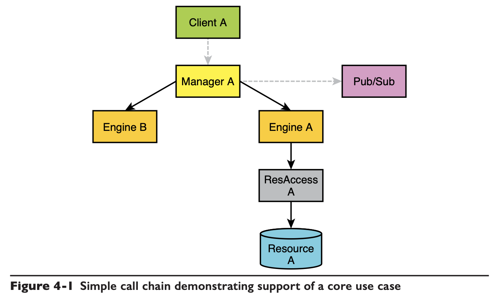
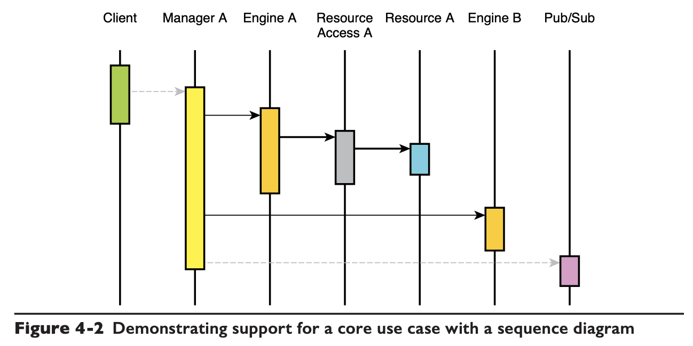

# Chapter 04 Composition

## Requirements and Changes

***Never design against the requirements.***

## Composable Design

### Core Use Cases

The core use cases represent the **essence** of the business of the system. The whole point of requirements analysis is to recognize the core use cases (and the areas of volatility).

- **Call Chain**

    

- **Sequence Diagram**

    

Even in a large system you are commonly looking at **2~5** Managers, **2~3** Engines, **3~8** ResourceAccess and Resources, and **~6** Utilities.

## There is No Feature

***Features are always and everywhere aspects of integration, not implementation.***

## Handling Change

Containing the change within *Managers*. The *Manager* should be almost expendable to contain changes:

- Implementing *Engines* is expensive.
- Implementing a *ResourceAccess* is nontrivial.
- Designing and implementing *Resources* that are scalable, reliable, highly performant, and very reusable is time- and effort-consuming.
- Implementing *Utilities* always requires top skills, and the result must be trustworthy.
- Designing a superior user experience or a convenient and reusable API for *Clients* is time and labor intensive.
