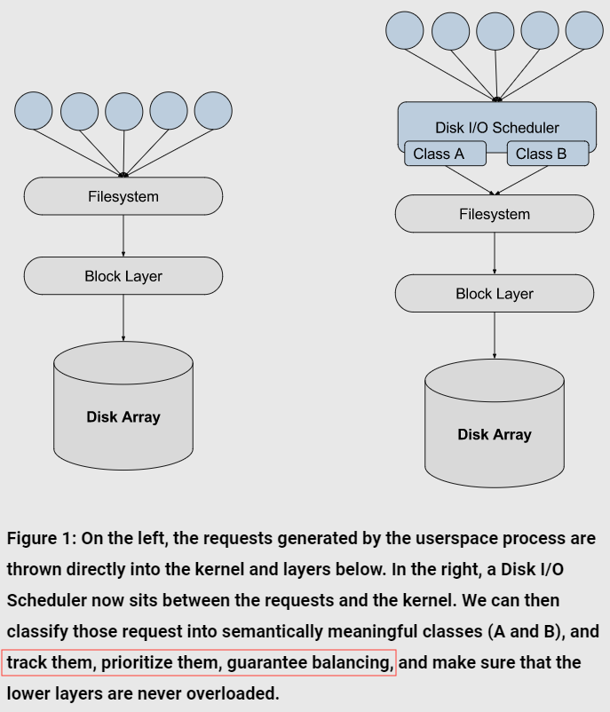
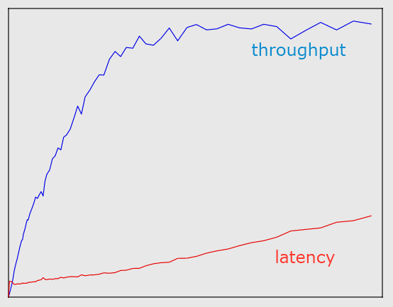
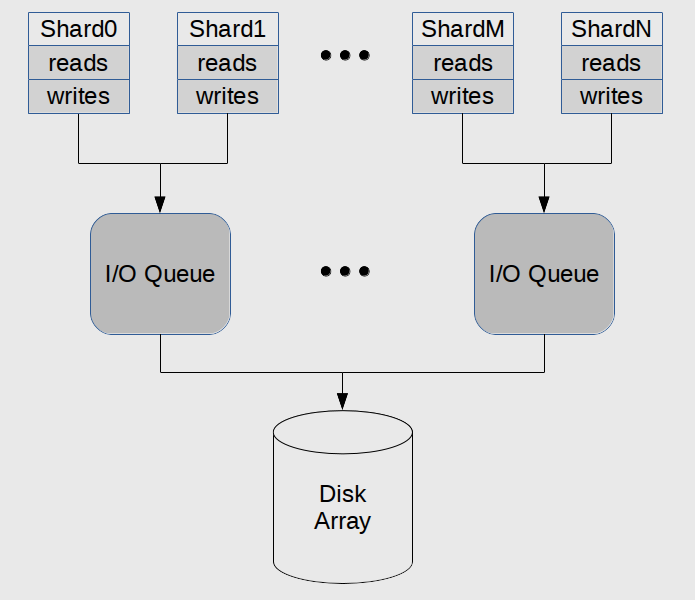
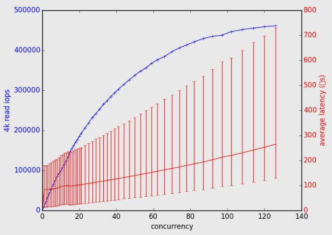
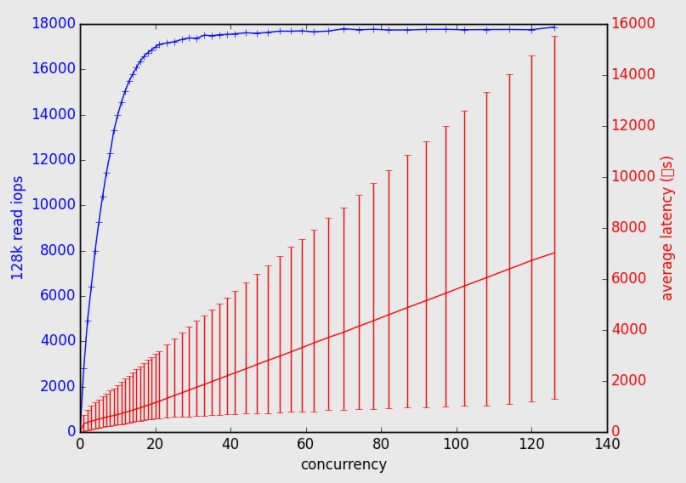
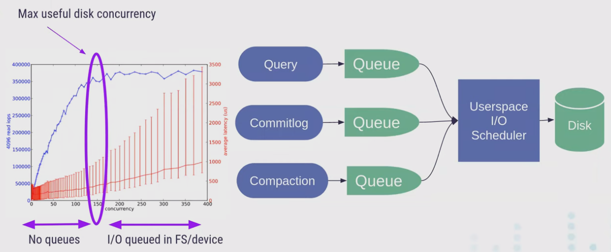
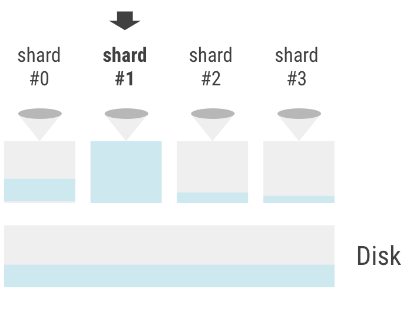
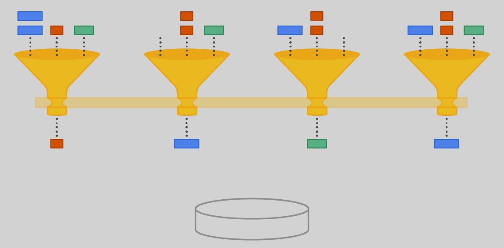
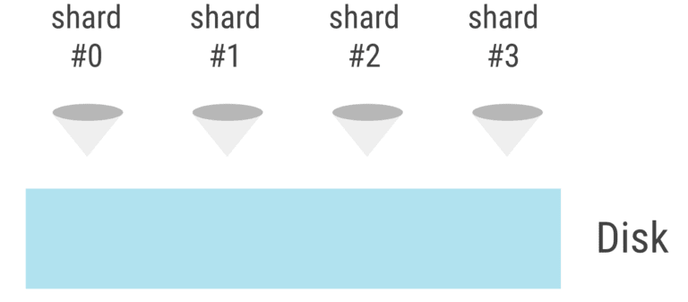

# Designing a Userspace Disk I/O Scheduler for Modern Datastores

## Part I: 动机与原理 Motivation

[original post](https://www.scylladb.com/2016/04/14/io-scheduler-1/)

在诸如数据库等应用中，会有大量需要进行磁盘读写的线程，称之为Actor（即并发编程模型中的Actor），而与网络I/O不同的是磁盘I/O通常很难进行**Actor之间的IO申请调度、带宽分配、优先级等细粒度的控制**，例如如果一次较短的读取请求被排在较多的写请求后执行，则读请求的延迟就会显著增大

### 限制在途的I/O请求数 Limiting the number of outstanding requests

在高并发的场景下，我们通常希望产生的I/O请求能够迅速被底层存储层处理结束，但是现实中往往会出现I/O请求的堆积，而**堆积的位置在I/O栈中有多种可能**：磁盘队列、内核阻塞层、文件系统等

对于seastar这样的异步模型，请求在队列中堆积而最终会完成（无论成功失败）并不影响异步模型，并且延迟是不能免除的，只是采用用户态的调度器进行所有请求的精细控制，其真正优点如下：

- **统计数据 metrics**：在用户态控制所有请求可以统计出在I/O不同阶段下等待的请求，从而对于上层负载均衡、限流器、熔断器等组件可以对全局的请求有更好的把握，即加强了系统的**可观测性observability**
- **优先级 priority**：有一些特定的请求可以避免被排在无法控制的底层队列尾部，而是可以在有机会时直接执行
- **撤销 cancel**：对于一些还未执行的请求可以及时撤销，从而尽可能避免浪费硬件资源



### 文件系统 The filesystem

seastar的**thread-per-core, TPC**设计，使得单个线程占用CPU在运行后不能出现任何会阻塞的操作，否则就会导致该线程上的所有工作都被阻塞，因此seastar的磁盘I/O极度依赖底层的XFS（XFS对Asynchronous IO的支持较其他文件系统而言更好），但**即使是XFS也会在一些情况下出现阻塞**

XFS为了提升并行度，会从一个allocation group中为事务日志和元数据更新分配缓存，而如果一个allocation group在被耗尽时、或出现竞争时就可能导致I/O submission回退到同步行为，即阻塞

### 阻塞层 The Linux block layer

当某个磁盘上有超过128个（通过`sudo cat /sys/class/block/sda/queue/nr_requests`可以查看，并且可以配置）尚未返回的I/O请求时，Linux内核阻塞层就会直接拒绝接收新的请求，并**同步等待**直到有请求返回才会接收新的请求

但是**简单增加该值并不能解决阻塞问题**，一方面因为出现阻塞往往是大量请求难以被及时处理或是有其他故障，增加该值只会掩盖表面问题，另一方面假定每个请求延迟200微妙，大小为128kB，则限制请求数为128时可以达到600MB/s的吞吐量——这已经是主流SATA SSD的设计吞吐量了（NVMe SSD的吞吐量可以达到2000MB/s以上）

### 磁盘内队列 The disk array itself

现代磁盘内部也会有队列来提升并发I/O性能，当请求足够多时队列就会被填充满，此时请求的处理延迟就会不断增加而吞吐量却不会再改变——**系统过载overload**，可以参考[Little's Law](https://github.com/JasonYuchen/notes/blob/master/brpc/flow_control.md#littles-law)

显然**最佳并发度max useful disk concurrency发生在磁盘吞吐量恰好达到平台时**，在其左侧没有队列堆积但磁盘吞吐量没有充分发挥出来，在其右侧吞吐量没有进一步提升而队列堆积请求延时上升



显然如同Little's Law中的分析，当磁盘过载后，继续发起新的请求只会增加延迟，没有任何益处，且有可能导致上游服务超时不断重试引起雪崩

### 限制磁盘并行度 Limiting the disk parallelism in practice

scylla/seastar通过在运行真正的服务前，首先在系统上运行`iotune`工具来发现系统的最佳承载能力——`--max-io-requests`

`TODO: 增加对比测试结果 https://www.scylladb.com/2016/04/14/io-scheduler-1/`

### The Linux Storage Stack


## Part II: 调度器的设计 Seastar Disk I/O Scheduler Design - The I/O Queues

[original post](https://www.scylladb.com/2016/04/29/io-scheduler-2/)

在所有的调度算法中，都需要考量**公平性fairness**的问题，往往是基于预先定义的优先级进行任务的调度，seastar中称之为`priority classes`

从上文中可以看出，Linux内核层对每一块磁盘的未返回请求数量有一个全局的限制，而seastar采用了shared-nothing的设计，因此在seastar中的**每个shard都需要有一种机制与其他shards一起分配磁盘I/O的全局限制量`nr_requests`值**

最简单的设计就是均分全局数量，seastar的内存设计（每个shard均分可用内存）就是如此，在工作量能够较好的均匀分配（没有**倾斜skew**）到所有shards上时资源利用较为充分，否则也会出现**碎片问题fragmentation**

尤其是当全局限制较小甚至少于shards数量时，每个shard的请求配额极小，极有可能造成部分shards忙碌但更多shards空闲进而浪费磁盘I/O资源，因此对于磁盘I/O来说，seastar并没有简单采用基于shards均匀分配的方案，而是采用自适应的方式，**基于多个`I/O Queue`进行均分**，每个`I/O Queue`均分全局限制量，而多个shards共享一个`I/O Queue`（如果全局限制足够大，则每个shard独享一个`I/O Queue`，此时就回退到了简单均分的方案）



从而seastar的磁盘I/O调度器就需要在考虑`priority classes`时对每个`I/O Queue`进行shards任务的分配和调度

注意：**此版本已经不再是最新的设计**，见下文[scheduler 2.0的设计](#part-iv-避免偏差-new-io-scheduler)，[`--num-io-queues`选项已经被废弃](https://github.com/scylladb/seastar/issues/864)，且[scheduler 3.0的设计](https://groups.google.com/g/seastar-dev/c/8WNR4GLskGY)也正在被讨论

### 选择队列数量 Choosing the right number of I/O Queues

每个`IO Queue`都会被固定放置在一个shard中，此shard就被称为该`IO Queue`的协调者coordinator，并且**所有与此`IO Queue`交互的shards都必须属于同一个[NUMA节点](https://en.wikipedia.org/wiki/Non-uniform_memory_access)**（这个限制也隐式规定了整个seastar下的`IO Queue`数量最少为NUMA节点的数量）

可以通过`--num-io-queues`来显式指定数量，显然越少则局部的并行性越好磁盘利用越充分，但跨核心通信引入的I/O代价也越高（通常一个较大的I/O请求本身例如128KB就足够掩盖跨核通信带来的开销），因此在部署系统时需要根据硬件性能和工作负载类型进行设计（seastar提供了`iotune`工具进行自适应调整）

### 优先级 Priority classes in Scylla

在Scylla 1.0版本中，所有读写请求都被分为了6个优先级类：

|Priority class|Shares|
|:-|-:|
|Commitlog|100|
|Memtable writes|100|
|Compaction (reads&writes)|100|
|CQL query read|100|
|Repair/Streaming reads|20|
|Repair/Streaming writes|20|

`TODO: 查看当前最新版本的Scylla的配置`

### 队列的内部功能 Internal Functioning of an I/O Queue

每个`IO Queue`在seastar内部就是`class fair_queue`，源代码[见此](https://github.com/scylladb/seastar/blob/master/src/core/fair_queue.cc)

`IO Queue`需要负责对不同优先级的请求根据优先级的配额shares进行流量控制，即**在每个时间窗口内每个优先级类内只允许限制数量的I/O请求被执行**，这个时间窗口的长度也可以配置

同时`IO Queue`单次允许不超过N个I/O请求被同时提交，N就是该`IO Queue`的本地队列深度，另外由于每个I/O请求的数据量并不同，因此**仅根据请求数量分配也有可能导致磁盘的带宽分配并不按此比例**，所以`IO Queue`还引入了请求的权重weight一同参与流量控制的计算，在**scylla中每个请求的权重与请求大小是次线性关系sublinear**（通常发起1次10kB的请求会优于发起10次1kB的请求，因此sublinear更适用实际场景）

在流量控制的计算中采用**指数衰减算法**如下，每个I/O请求在发起时的初始代价设为$c_0=w/s$，随着时间的推移，其权重指数衰减为以下值：

```math
c=e^{t/\tau}c_0=e^{t/\tau}(w/s)
```

在每个`priority class`内部会有个累加器记录该优先级下所有发出请求的I/O代价总和，当并发请求数量少于`IO Queue`队列深度时，所有`priority class`的请求都可以进入，但是当出现竞争时就必须等待，而`IO Queue`每次都会**挑选代价总和最低的`priority class`进行执行，而I/O请求的代价随着时间指数衰减相当于是'优先级'提高最终一定会被执行，保证了没有饥饿的发生**，类似[Xen Credit Scheduler](https://wiki.xenproject.org/wiki/Credit_Scheduler)，代价计算过程`<seastar/src/core/fair_queue.cc>`如下：

```cpp
void fair_queue::dispatch_requests(std::function<void(fair_queue_entry&)> cb) {
    //// skip

    // 采用_base作为上一次规范化后的基准时间，所有新请求都基于该_base进行规范化
    // 从而避免了每次要对_accumulated进行decay，只需要将新请求decay到_base就可以直接累加
    auto delta = std::chrono::duration_cast<std::chrono::microseconds>(std::chrono::steady_clock::now() - _base);
    // _maximum_capacity(cfg.max_req_count, cfg.max_bytes_count)
    // 将weight规范化后再计算获得cost，规范化是为了同时考虑IOPS和bandwidth，过程见fair_queue_ticket::normalize
    auto req_cost  = req._ticket.normalize(_group.maximum_capacity()) / h->_shares;
    // 根据时间的偏移进行指数衰减，tau的值通常是100ms
    auto cost  = expf(1.0f/_config.tau.count() * delta.count()) * req_cost;
    float next_accumulated = h->_accumulated + cost;
    // 持续的I/O请求累计代价使得出现某个priority class的累计代价达到了inf
    // 则需要所有priority class一起重新规范化并计算代价
    while (std::isinf(next_accumulated)) {
        // 通常一次重新规范化后，所有priority class的_accumalted就足够小了，此时时间基准base也更新，因此循环体往往只执行一次
        normalize_stats();
        delta = std::chrono::duration_cast<std::chrono::microseconds>(std::chrono::steady_clock::now() - _base);
        cost  = expf(1.0f/_config.tau.count() * delta.count()) * req_cost;
        next_accumulated = h->_accumulated + cost;
    }
    h->_accumulated = next_accumulated;

    //// skip
}

/// A ticket is specified by a weight and a size. For example, one can specify a request of weight
/// 1 and size 16kB. If the fair_queue accepts one such request per second, it will sustain 1 IOPS
/// at 16kB/s bandwidth.
class fair_queue_ticket {
    uint32_t _weight = 0; ///< the total weight of these requests for capacity purposes (IOPS).
    uint32_t _size = 0;   ///< the total effective size of these requests
}

/// The normalization function itself is an implementation detail, but one can expect either weight or
/// size to have more or less relative importance depending on which of the dimensions in the
/// denominator is relatively higher.
/// 规范化实际上可以是不同的实现，来体现出IOPS或是size占据更重要的地位，实际denominator就是_group.maximum_capacity()
/// 而后者根据配置进行初始化denominator._weight=cfg.max_req_count, denominator._size=cfg.max_bytes_count
///   cfg.max_req_count：该队列中最大允许的并发IO请求数
///   cfg.max_bytes_count：该队列中最大允许的IO字节数
float fair_queue_ticket::normalize(fair_queue_ticket denominator) const noexcept {
    return float(_weight) / denominator._weight + float(_size) / denominator._size;
}

/// 约1.17549e-38
float fair_queue::normalize_factor() const {
    return std::numeric_limits<float>::min();
}

void fair_queue::normalize_stats() {
    // 此时time_delta由于std::log(1.17549e-38)变为近似-87.3，对于100ms的tau，则base向后跳约9s
    auto time_delta = std::log(normalize_factor()) * _config.tau;
    // time_delta is negative; and this may advance _base into the future
    // 更新该次规范化后的基准时间点_base，此后的新请求的代价都会根据此_base进行代价规范化
    _base -= std::chrono::duration_cast<clock_type::duration>(time_delta);
    // 将所有priority class的累加器一起规范化（累加计数到过大的一个数，因此一起按normalize_factor()比例进行缩小）
    // 由于所有priority class竞争时，由fair queue挑选_accumulated最小的执行，因此一起按比例缩小的好处：
    //   1. 不会变为负值
    //   2. 保持了相对大小关系
    for (auto& pc: _all_classes) {
        pc->_accumulated *= normalize_factor();
    }
}
```

### Scylla的调度器 Scylla's I/O Scheduler in Practice

采用4个优先级类，每次请求大小设置为128KB，测试结果如下：

|Shares Distribution|Throughput KB/s|
|:-|:-|
|10, 10, 10, 10|137.5k, 137.5k, 137.5k, 137.5k|
|100, 100, 100, 100|137.5k, 137.5k, 137.5k, 137.5k|
|10, 20, 40, 80|37.3k, 73.7k, 146.6k, 292.4k|
|100, 10, 10, 10|421.2k, 42.9k, 42.9k, 42.9k|

## Part III: 进一步降低延迟 Better Latencies Under Any Circumstance

[original post](https://www.scylladb.com/2018/04/19/scylla-i-o-scheduler-3/)

Scylla在运行时会通过统计数据来找出磁盘的[最佳并发度max useful disk concurrency](#磁盘内队列-the-disk-array-itself)，但是初始版本统计存在以下局限性：

1. **I/O请求并没有区分读read/写write**，调优的参数只有`--max-io-requests`，并且自适应调优时基于了读reads，而现代硬盘对两者的支持不尽相同，通常对读请求的响应会好于对写请求的响应，那么就可能会出现在一块已经有重的写负载磁盘上执行读时，响应远不及预期
2. **调优没有考虑请求的大小**，在自适应调优时只使用了固定的4kB读取请求，但实际上不同大小的请求会对最优并发度有较大影响，例如下图，显然对于4k请求和128k请求的最佳并发度并不同，前者在120时依然没有饱和，后者在20时就已经出现了瓶颈

   

   

通常磁盘会提供**IOPS**和带宽**bandwidth**两个指标，例如Samsung SSD 850 PRO的IOPS为95k和512MB/s的读带宽（写入略微少于512MB/s），那么对于95k IOPS的4kB请求会消耗371MB/s的带宽，IOPS首先达到瓶颈；而如果是128kB的请求则仅需4k IOPS就会耗尽带宽，而**IO Scheduler就应该同时监测这两个指标，任一达到瓶颈就说明磁盘已经饱和**

注意：这一部分代码实际上是[IO Scheduler 2.0](#part-iv-新调度器-new-io-scheduler)的代码

```cpp
void fair_queue::dispatch_requests(std::function<void(fair_queue_entry&)> cb) {
    while (_requests_queued) {
        /// skip

        auto& req = h->_queue.front();
        // 尝试获取IO配额，若不够则说明磁盘过载，退出本轮dispatch循环
        if (!grab_capacity(req._ticket)) {
            break;
        }
        
        /// skip
    }
}

bool fair_queue::grab_capacity(fair_queue_ticket cap) noexcept {
    if (_pending) {
        return grab_pending_capacity(cap);
    }

    fair_group_rover orig_tail = _group.grab_capacity(cap);
    // 核心在于比较是否过载，maybe_ahead_of中会同时比较fair_queue_ticket中的weight和size，必须同时没有超过head才可以执行
    // head的weight限制就是最大并发请求数，基于磁盘的IOPS，head的size限制就是最大吞吐量字节数，基于磁盘的bandwidth
    if ((orig_tail + cap).maybe_ahead_of(_group.head())) {
        _pending.emplace(orig_tail, cap);
        return false;
    }

    return true;
}

fair_queue_ticket fair_group_rover::maybe_ahead_of(const fair_group_rover& other) const noexcept {
    // fair_queue_ticket重载了operator bool()，在 weight>0 || size>0 时是true
    // 因此必须同时为0，即weight和size均未达到head的限制，才会返回false，即"not ahead of"
    return fair_queue_ticket(std::max<int32_t>(_weight - other._weight, 0),
            std::max<int32_t>(_size - other._size, 0));
}
```

通过对IO请求同时控制IOPS和bandwidth消耗，可以更精确找到磁盘的最佳并发程度，并且**对于短读取（例如重写负载下的偶发4kB读取）的延迟有显著优化**，例如下表128kB的写请求持续打满磁盘带宽，而每10ms发生一次4kB的读请求：

||Before||After||
|:-|:-|:-|:-|:-|
||128 kB writes|4kB reads|128kB writes|4kB reads|
|Throughput|518MB/s|219KB/s|514MB/s|347KB/s|
|Avg lat.|24ms|8ms|24ms|1ms|
|P95|24ms|9ms|24ms|2ms|
|P99|36ms|12ms|35ms|6ms|
|P999|43ms|15ms|36ms|7ms|

## Part IV: 新调度器 New IO Scheduler

[brief](https://www.scylladb.com/2021/01/28/project-circe-january-update/)

[detail](https://www.scylladb.com/2021/04/06/scyllas-new-io-scheduler/)

磁盘通常可以用两个维度来描述其性能：**IOPS**和**throughput**，通常所有IO密集的程序应尽可能避免耗尽磁盘处理能力——overwhelming the disk，这种状态下磁盘请求堆积且无法区分出请求的重要性，例如对于Scylla这种数据库系统来说，前台查询的性能至关重要，而后台数据清理等IO操作则可以作为低优先级任务执行，尽可能降低前台查询请求的延迟

Seastar采用了[无共享shared nothing](Introduction.md)的设计，并在开始时采用了[IO coordinator的设计](#part-ii-调度器的设计-seastar-disk-io-scheduler-design---the-io-queues)尽可能提高磁盘的利用率而不过载



- **不可避免的跨核通信延迟**（`non-coordinator <-> coordinator`）
  seastar的任务调度时间片是0.5ms，则在最坏情况下IO请求会额外有1ms的跨核延迟，这样的延迟在**现代NVMe磁盘上已经非常可观**，以及在如果需要**取消IO请求**时也必须进行跨核通信
- **单个Coordinator无法解决skew**
  Multiple IO Coordinators的设计静态均分了磁盘的所有带宽和吞吐量，则当某个Coordinator特别繁忙而其他较空闲时，磁盘利用率过低，即出现**IO请求偏差skew**，但是如果全局只使用单个Coordinator时，虽然可以解决skew的问题，但是会显著加大Coordinator所在shard的负担，影响其其他任务，单个shard可能无法完全利用上磁盘

新的IO Scheduler有两个核心设计：**避免跨核通信、充分利用磁盘**

### IO Group

原先的IO Scheduler设计中，数个shards共享一个`IO Queue`，并且实际持有`IO Queue`的shard称为coordinator，而其他shards需要通过消息通信message passing的方式将IO请求提交给coordinator

所有`IO Queue`均分物理磁盘的IOPS和bandwidth限制，而`IO Queue`最多情况下会与shards一一对应，即每个shard都是coordinator，**当IO请求数量在`IO Queue`层面不均匀时依然有可能出现磁盘浪费**，如下图：



并且由于non-coordinator需要跨核通信，不仅有可能带来**IO请求延迟的上升**，而且**复杂化了Cancellation**——需要将cancellation事件也跨核通信

[IO Scheduler 2.0的设计中](https://groups.google.com/g/seastar-dev/c/HyMWhmF4EPw/m/nsqpVEcnCgAJ)，引入了共享IO容量，即`IO Group`的设计

每个IO Group管理多个shards的磁盘IO请求配额（**shards通过IO Group对象申请和归还IO请求额度**，一个系统可以有多个IO Group对象）：当shard需要进行IO时，首先从所属的`IO Group`申请所需额度，若不满足则等到额度足够时再执行（另一个IO请求完成并且归还额度时）



**每个shard持有自己的`IO Queue`，而多个`IO Queue`则共享一个`IO Group`，每个`IO Group`都可以配置成物理磁盘的容量限制**，默认情况下每个NUMA节点对应一个`IO Group`包含该NUMA节点的所有shards，当某个shard发起IO请求时，就从其`IO Queue`所在的`IO Group`获取配额，当该IO请求完成时再将配额还给`IO Group`，从而每个shard都能完全利用上磁盘如下图：



### Capacity Rovers

在IO负载过重，有shard需要等待时，简单的等待额度并不可行，例如多个shard都在等待时，**必须保证公平性fairness**而不是一旦有额度就随机选择执行（会导致**饥饿**）

为了实现所有等待的shards能够得到公平的运行，采用了类似TCP窗口的设计，**每个shard实际等待在IO额度链上的某个点**，构成类似队列的先后关系，从而在IO额度被释放时，队列中较前的shard首先被得到执行

head rover和tail rover则是两个原子变量，每个shard都需要参与更新这两个原子变量，显然更新原子变量的过程是可能发生竞争的（原子变量的CAS操作是乐观并发机制），因此理论上存在"幸运"的shard成功率比其他shards要高，从而能够运行更多的IO请求，这种情况**在NUMA架构下是非常明显的**，需要更新remote NUMA node的rover延迟显著高于更新local NUMA node的rover，从而remote NUMA node几乎很难成功

因此为了在NUMA架构下也尽可能协调所有shards的IO请求，通常**每个NUMA节点至少有一个IO Group对象**管理该节点的所有shards，此时每个NUMA节点的IO Group又回到了IO Scheduler最初始的IO Queue的设计——**静态均分了磁盘带宽**

`IO Group`内的磁盘容量分配不能简单采用`atomic::fetch_add/fetch_sub`，因为**当超出限制时，后续持续请求IO请求的shards能够实际得到执行的顺序无法得到保障**，可能会出现某个shard饥饿

在这里采用了**滑动窗口sliding window的方式**，使用`head`标识实际的容量和`tail`标识当前执行的容量，即`head - tail`就是可用容量，当发起IO请求时`tail += cost`，结束IO请求时`head += cost`，假如某次IO请求占用的容量超过的可用余量，即`tail += cost; tail > head`就需要等待，此时`tail`已经被更新到超过`head`的值，**该请求就会等到`head >= tail`才被执行，从而保证了IO请求过多时实际的执行顺序与请求的提交顺序一致**

```cpp
fair_group_rover fair_group::grab_capacity(fair_queue_ticket cap) noexcept {
    // 发起IO请求时无论当前tail是否已经超过head，总是会递增tail，并且返回递增前tail的值
    fair_group_rover cur = _capacity_tail.load(std::memory_order_relaxed);
    while (!_capacity_tail.compare_exchange_weak(cur, cur + cap)) ;
    return cur;
}

bool fair_queue::grab_capacity(fair_queue_ticket cap) noexcept {
    // 当前有等待中的IO请求，则首先尝试执行等待的请求
    if (_pending) {
        return grab_pending_capacity(cap);
    }

    fair_group_rover orig_tail = _group.grab_capacity(cap);
    // tail已经被递增了，但是如果检测到递增后的tail超过了head，就会放入_pending等待
    if ((orig_tail + cap).maybe_ahead_of(_group.head())) {
        _pending.emplace(orig_tail, cap);
        return false;
    }

    return true;
}

bool fair_queue::grab_pending_capacity(fair_queue_ticket cap) noexcept {
    // pending head就是实际等待的位置点，即此前递增tail后超过head的位置
    fair_group_rover pending_head = _pending->orig_tail + cap;
    // 若是依然比当前head要前，则不执行
    if (pending_head.maybe_ahead_of(_group.head())) {
        return false;
    }

    if (cap == _pending->cap) {
        _pending.reset();
    } else {
        /*
         * This branch is called when the fair queue decides to
         * submit not the same request that entered it into the
         * pending state and this new request crawls through the
         * expected head value.
         * 
         * 若此时试图执行的请求并不是让fair queue进入pending状态的请求
         * 即此时的cap与pending记录的cap不同
         * 则是执行新的IO请求（类似插队？），并且更新tail和pending
         */
        _group.grab_capacity(cap);
        _pending->orig_tail += cap;
    }

    return true;
}
```

## Part V: 磁盘非线性带宽 Support for non-linear disk bandwidth

在[Part III](#part-iii-进一步降低延迟-better-latencies-under-any-circumstance)中提到的问题并没有被完全解决，默认了磁盘的读和写请求的性能接近，假定了1次128KiB的请求等同于2次64KiB请求，这些都与实际情况不完全相同

[Implementing a New IO Scheduler Algorithm for Mixed Read/Write Workloads](https://github.com/JasonYuchen/notes/blob/master/seastar/New_Disk_IO_Scheduler_For_RW.md)