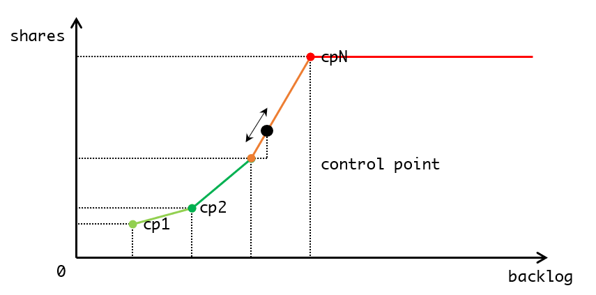

# Dynamic Priority Adjustment

## Task Scheduling and Priority

[反馈控制的实例](https://github.com/JasonYuchen/notes/blob/master/db/Quarantine_Talks.md#scylladb-no-compromise-performance)

## Backlog Controller

`syclla/backlog_controller.hh`

例如现在有A，B两个服务采用了`backlog_controller`，A服务作为关键任务其控制点为`cp1 {10, 10}, cp2 {20, 80}`，B服务作为后台服务其控制点为`cp1 {10, 10}, cp2 {20, 20}`

1. 系统低负载下运行正常，此时A，B均处于低于各自`cp1`的位置，各占有10 shares，从而A，B均分CPU各占有50%的CPU资源
2. 上游请求增多，系统负载增大，随着队列开始堆积A，B服务均超出`cp1`的位置，此时A以`(80-10)/(20-10) = 7 shares/unit`的速度开始提高自身对CPU的占用，而B以`(20-10)/(20-10) = 1 share/unit`的速度开始太高自身对CPU的占用
3. 假定A的队列此时达到30，B的队列达到60，则A稳定占用80 shares，B稳定占用20 shares，实际上A占有80%的CPU资源，B占有20%的CPU资源，shares与CPU资源的关系可以见[IO Scheduler的设计](https://github.com/JasonYuchen/notes/blob/master/seastar/Disk_IO_Scheduler.md#%E9%98%9F%E5%88%97%E7%9A%84%E5%86%85%E9%83%A8%E5%8A%9F%E8%83%BD-internal-functioning-of-an-io-queue)
4. 当关键任务A通过更大CPU占比迅速消耗队列后，上游请求减少，A队列没有继续新增，维持在低位，即回到了低于`cp1`的位置，此时A稳定占用10 shares，而B由于CPU占用少队列依然较多超出`cp2`的位置，稳定占用20 shares，此时实际上A占有33%的CPU资源，B开始占用67%的CPU资源
5. 随着A占用的减少，B占用开始增加，CPU始终全负荷运转，B的队列也开始减少，最终回到低于`cp1`的位置
6. 系统回到低负载、A和B各占用50%的CPU资源



```cpp
// Simple proportional controller to adjust shares for processes for which a backlog can be clearly
// defined.
//
// Goal is to consume the backlog as fast as we can, but not so fast that we steal all the CPU from
// incoming requests, and at the same time minimize user-visible fluctuations in the quota.
//
// What that translates to is we'll try to keep the backlog's first derivative at 0 (IOW, we keep
// backlog constant). As the backlog grows we increase CPU usage, decreasing CPU usage as the
// backlog diminishes.
//
// The exact point at which the controller stops determines the desired CPU usage. As the backlog
// grows and approach a maximum desired, we need to be more aggressive. We will therefore define two
// thresholds, and increase the constant as we cross them.
//
// Doing that divides the range in three (before the first, between first and second, and after
// second threshold), and we'll be slow to grow in the first region, grow normally in the second
// region, and aggressively in the third region.
//
// The constants q1 and q2 are used to determine the proportional factor at each stage.
class backlog_controller {
public:
    future<> shutdown() {
        _update_timer.cancel();
        return std::move(_inflight_update);
    }
protected:
    struct control_point {
        float input;
        float output;
    };

    seastar::scheduling_group  _scheduling_group;
    const ::io_priority_class& _io_priority;
    std::chrono::milliseconds  _interval;
    timer<>                    _update_timer;

    std::vector<control_point> _control_points;

    // 回调函数，返回当前需要反馈控制的队列长度
    std::function<float()>     _current_backlog;
    // updating shares for an I/O class may contact another shard and returns a future.
    future<>                   _inflight_update;

    virtual void update_controller(float shares) {
        _scheduling_group.set_shares(shares);
        if (!_inflight_update.available()) {
            return; // next timer will fix it
        }
        _inflight_update = _io_priority.update_shares(uint32_t(shares));
    }

    void adjust() {
        auto backlog = _current_backlog();

        if (backlog >= _control_points.back().input) {
            // 当队列长度已经超过最后一个控制平面时，维持相应最大的shares
            update_controller(_control_points.back().output);
            return;
        }

        // interpolate to find out which region we are. This run infrequently and there are a fixed
        // number of points so a simple loop will do.
        size_t idx = 1;
        while ((idx < _control_points.size() - 1) && (_control_points[idx].input < backlog)) {
            idx++;
        }
        
        // 根据队列长度计算出所处于的控制范围，cp为当前控制点，last为前一个控制点
        control_point& cp = _control_points[idx];
        control_point& last = _control_points[idx - 1];
        // 线性控制函数，输出是输入的线性关系 y = a + bx ，而斜率则由所处的控制区域前后的两个控制点cp，last来确定
        // 此处斜率 b = (cp.output - last.output) / (cp.input - last.input)
        float result = last.output + (backlog - last.input) * (cp.output - last.output) / (cp.input - last.input);
        update_controller(result);
    }

    backlog_controller(
        seastar::scheduling_group sg,
        const ::io_priority_class& iop,
        std::chrono::milliseconds interval,
        std::vector<control_point> control_points,
        std::function<float()> backlog)
        : _scheduling_group(sg)
        , _io_priority(iop)
        , _interval(interval)
        , _update_timer([this] { adjust(); })
        , _control_points(std::move(control_points))
        , _current_backlog(std::move(backlog))
        , _inflight_update(make_ready_future<>())
    {
        _update_timer.arm_periodic(_interval);
    }

    // Used when the controllers are disabled and a static share is used
    // When that option is deprecated we should remove this.
    backlog_controller(
        seastar::scheduling_group sg,
        const ::io_priority_class& iop,
        float static_shares) 
        : _scheduling_group(sg)
        , _io_priority(iop)
        , _inflight_update(make_ready_future<>())
    {
        update_controller(static_shares);
    }

    virtual ~backlog_controller() {}
public:
    backlog_controller(backlog_controller&&) = default;
    float backlog_of_shares(float shares) const {
        size_t idx = 1;
        // No control points means the controller is disabled.
        if (_control_points.size() == 0) {
                return 1.0f;
        }

        while ((idx < _control_points.size() - 1) && (_control_points[idx].output < shares)) {
            idx++;
        }
        const control_point& cp = _control_points[idx];
        const control_point& last = _control_points[idx - 1];

        // Compute the inverse function of the backlog in the interpolation interval that we fall
        // into.
        // 根据当前的控制量shares、控制点及线性控制方程 y = a + bx 反推出队列长度 x
        // The formula for the backlog inside an interpolation point is y = a + bx, so the inverse
        // function is x = (y - a) / b
        return last.input + (shares - last.output) * (cp.input - last.input) / (cp.output - last.output);
    }
    seastar::scheduling_group sg() {
        return _scheduling_group;
    }
};

// memtable flush CPU controller.
//
// - First threshold is the soft limit line,
// - Maximum is the point in which we'd stop consuming request,
// - Second threshold is halfway between them.
//
// Below the soft limit, we are in no particular hurry to flush, since it means we're set to
// complete flushing before we a new memtable is ready. The quota is dirty * q1, and q1 is set to a
// low number.
//
// The first half of the virtual dirty region is where we expect to be usually, so we have a low
// slope corresponding to a sluggish response between q1 * soft_limit and q2.
//
// In the second half, we're getting close to the hard dirty limit so we increase the slope and
// become more responsive, up to a maximum quota of qmax.
class flush_controller : public backlog_controller {
    static constexpr float hard_dirty_limit = 1.0f;
public:
    flush_controller(seastar::scheduling_group sg, const ::io_priority_class& iop, float static_shares) : backlog_controller(sg, iop, static_shares) {}
    flush_controller(seastar::scheduling_group sg, const ::io_priority_class& iop, std::chrono::milliseconds interval, float soft_limit, std::function<float()> current_dirty)
        : backlog_controller(sg, iop, std::move(interval),
          std::vector<backlog_controller::control_point>({
              {0.0, 0.0},
              {soft_limit, 10},
              {soft_limit + (hard_dirty_limit - soft_limit) / 2, 200},
              {hard_dirty_limit, 1000}}),
          std::move(current_dirty)
        )
    {}
};

class compaction_controller : public backlog_controller {
public:
    static constexpr unsigned normalization_factor = 30;
    static constexpr float disable_backlog = std::numeric_limits<double>::infinity();
    static constexpr float backlog_disabled(float backlog) { return std::isinf(backlog); }
    compaction_controller(seastar::scheduling_group sg, const ::io_priority_class& iop, float static_shares) : backlog_controller(sg, iop, static_shares) {}
    compaction_controller(seastar::scheduling_group sg, const ::io_priority_class& iop, std::chrono::milliseconds interval, std::function<float()> current_backlog)
        : backlog_controller(sg, iop, std::move(interval),
          std::vector<backlog_controller::control_point>({
              {0.0, 50},
              {1.5, 100},
              {normalization_factor, 1000}}),
          std::move(current_backlog)
        )
    {}
};
```
