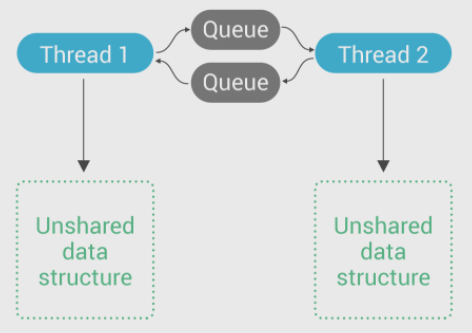

# seastar中的异步唤醒

[original post](https://www.scylladb.com/2018/02/15/memory-barriers-seastar-linux/)

## 背景

seastar作为一个全异步编程框架，使用[reactor](Reactor.md)的范式并大量采用队列进行[任务传递和执行](Message_Passing.md)



### 1. 简单队列

一种最简单的消息队列实现就是采用锁和条件变量来保护队列，当没有数据时就等待，类似如下方式：

```cpp
// producer
task_queue.submit(task);

// consumer
while (true) {
    task = task_queue.wait_pop();
    handle(task);
}
```

对于简单协作方式而言，例如只有单个生产者和单个消费者并且任务类型单一，这种方式就足够了，但是对于复杂任务类型和复杂协作方式，这种模式就存在局限性：

1. 单一`task_queue`无法区分`task`的**优先级**
2. 通过锁来保护`task_queue`，**多核扩展性**不佳，竞争激烈时锁会导致严重的线程上下文调度context switch开销，采用无锁队列可以减轻这个问题但是当提交任务少时就变为了死循环`pop`任务
3. 可以通过OO的方式使用单一`task_queue`存放不同类型的任务，但是如果不同任务类型之间存在**执行顺序的优化空间**则难以通过单一`task_queue`来实现
   **执行顺序的优化空间**例如：如果只有一个`task_queue`里连续提交了计算密集任务，紧接着连续提交了I/O任务，则消费端只能按此顺序执行，导致执行效率不是最优（先提交IO再执行密集计算任务，等执行完成时IO任务也可能执行完成，并发），如果分为两个`task_queue`则可以考虑混合搭配计算密集任务和IO任务的执行，最大化CPU效率（类似乱序执行和超线程技术希望解决的问题）
4. 通常主要用于处理计算密集的任务（资源一直就绪而不需要等待）

### 2. 事件循环

事件循环现在普遍的非阻塞I/O编程范式，reactor模式就是典型的做法，在有任务时就不会等待而是一直处理，没有任务时就等待事件唤醒，在Linux下通常使用`epoll`来实现事件循环（例如`libevent, libuv, libev, muduo`），基本流程如下（此时的`task_queue`可以是无锁的）：

```cpp
// producer
task_queue.submit(task);
// e.g. ::write(fd, one, sizeof(one)) to make ::epoll_wait() return
engine.wake_up(); 

// consumer
while (true) {
    // return when someone called engine.wake_up()
    events = poll_wait();
    handle(events);
}
```

异步、事件驱动，并且可以注册监听各种事件，在事件就绪时才会进行相应的处理使得处理效率极高，但是对于任务并发数极高的场景下，**一次`wake_up()`导致的[系统调用的开销](https://github.com/JasonYuchen/notes/blob/master/linux/io_uring.md#%E5%BC%82%E6%AD%A5-asynchronous)依然不可忽视**

### 3. 改进的事件循环

由于生产者和消费者分属两个线程，因此**使用原子变量作为标记位记录状态就可以简单避免系统调用**，并且在高频任务处理下实际上不需要进入`sleep`而是采用轮询的方式（**此时轮询polling比中断interruption更为高效**）：

```cpp
atomic_bool sleep;

// producer
task_queue.submit(task);
if (sleep.load(std::memory_order_seq_cst)) {
    engine.wake_up();
}

// consumer
while (true) {
   events = poll();      // won't wait
    if (events.empty()) {
        sleep.store(true, std::memory_order_seq_cst);
        events = poll(); // handle the rest tasks
        handle(events);
        engine.wait();   // wait for interruption
    } else {
        sleep.store(false, std::memory_order_relaxed);
        handle(events);
    } 
}
```

采用`std::memory_order_seq_cst`的目的是为了**避免指令重排**，例如下面这种指令**重排后**的执行情况：

```text
[producer]              [consumer]
read sleep -> false 
                        events.empty() -> true
                        sleep = true
                        handle rest events
                        wait()
submit(task)
not wake_up()
```

1. 生产者侧的`sleep`读取被重排到了`submit()`之前，而此时消费者侧正好处理完最后的任务发现`events.empty() == true`而准备进入等待
2. 此时生产者提交任务，发现`sleep == false`，而消费者进入`wait()`
3. 生产者并未`wake_up()`导致提交的任务需要等到超时或被其他提交唤醒后才会处理，该任务延迟增大

而采用`std::memory_order_seq_cst`避免指令重排，就可以确保：

1. 如果`sleep == true`，唤醒，此时的`task_queue`已经包含了任务，此次唤醒一定会执行该任务
2. 如果`sleep == false`，那么engine要么正常执行任务，要么还在`sleep = true`之前，所以在`sleep = false`后的处理剩余任务一定能处理到该新提交的任务

此时系统调用通过原子变量进行同步，仅在需要时才会进行唤醒，避免了冗余的系统调用，**但是这已经是最佳做法了吗？**

### 4. 进一步改进的事件循环 - seastar的方式

对于任务并发数极高的重负载场景，可见消费者几乎都是工作状态，此时采用几乎不会改变值的原子变量，也会带来性能额外损失，因为**原子变量引入了内存屏障memory barrier，禁止了指令重排序**，关于内存屏障和内存模型可以参考[Memory Model](https://github.com/GHScan/TechNotes/blob/master/2017/Memory_Model.md)

## 将负载转移至空闲方 Moving Work to Idle Cores

在上述第3种方式中，通过使用原子变量及`std::memory_order_seq_cst`来进行条件唤醒减少系统调用的次数和开销，但是代价就是引入了内存屏障禁止了重排序而对性能不利：

- 对于即将进入sleep的consumer，即使有内存屏障也没有关系：进入sleep说明负载很小，加入内存屏障对性能的影响可以忽略

- 在producer侧采用**完全内存屏障full memory barrier**带来的性能损失则会相对显著：系统繁忙时每一次提交任务都需要**内存屏障保护一个几乎不会改变的值**`sleep == false`

优化方式就是**将内存屏障的操作从producer侧转移到consumer侧，consumer在准备sleep时主动在其他cores上插入内存屏障**——虽然这样优化会使得consumer在sleep时的代价会非常高，但是既然都要sleep了并不会在乎这点开销；而不sleep时就免去了这些开销

seastar中consumer侧即将sleep阶段的代码如下，可以注意到使用了`std::memory_order_relaxed`设置`sleep = true`之后使用`try_systemwide_memory_barrier()`进行插入内存屏障的操作：

```cpp
// src/core/reactor.cc reactor::smp_pollfn
virtual bool try_enter_interrupt_mode() override {
    // systemwide_memory_barrier() is very slow if run concurrently,
    // so don't go to sleep if it is running now.
    _r._sleeping.store(true, std::memory_order_relaxed);
    bool barrier_done = try_systemwide_memory_barrier();
    if (!barrier_done) {
        _r._sleeping.store(false, std::memory_order_relaxed);
        return false;
    }
    if (poll()) {
        // raced
        _r._sleeping.store(false, std::memory_order_relaxed);
        return false;
    }
    return true;
}
```

- **方式一：使用`mprotect()`注入内存屏障**
    Linux kernel中的页保护信息page protection information是存储在页表page tables中的，并且也可能被缓存在快表Translation Lookaside Buffers, TLBs中，而TLB并不是一致的：当页表被修改时，缓存了相应数据的TLB并不会被更新或失效

    因此**kernel必须主动失效对应的TLBs，而每个core都有自己的TLB，这就使得kernel必须发送消息给每个core的TLB并等待确认**，作为这个过程的副作用，kernel生成了一个完全内存屏障，利用这种方式使得consumer在producers上插入内存屏障的代码如下：

    ```cpp
    // src/core/systemwide_memory_barrier.cc
    void systemwide_memory_barrier() {
        // 这里是尝试使用第二种更高效的方法，但并不是所有系统上都支持
        // syscall(SYS_membarrier, MEMBARRIER_CMD_PRIVATE_EXPEDITED, 0);
        if (try_native_membarrier()) {
            return;
        }

        // FIXME: use sys_membarrier() when available
        static thread_local char* mem = [] {
        void* mem = mmap(nullptr, getpagesize(),
                PROT_READ | PROT_WRITE,
                MAP_PRIVATE | MAP_ANONYMOUS,
                -1, 0) ;
        assert(mem != MAP_FAILED);

        // If the user specified --lock-memory, then madvise() below will fail
        // with EINVAL, so we unlock here:
        auto r = munlock(mem, getpagesize());
        // munlock may fail on old kernels if we don't have permission. That's not
        // a problem, since if we don't have permission to unlock, we didn't have
        // permissions to lock.
        assert(r == 0 || errno == EPERM);

        return reinterpret_cast<char*>(mem);
        }();
        // Force page into memory to make madvise() have real work to do
        *mem = 3;
        // Evict page to force kernel to send IPI to all threads, with
        // a side effect of executing a memory barrier on those threads
        // FIXME: does this work on ARM?
        // 主动修改页数据后要求内核发送Inter-Processor Interrupt, IPI给每个线程
        // 来使TLB失效，相应的副作用就是产生了内存屏障
        int r2 = madvise(mem, getpagesize(), MADV_DONTNEED);
        assert(r2 == 0);
    }
    ```

- **方式二：使用更高效的`membarrier()`**
    方式一使用到了`mmap`，而`mmap`内部存在一个`mmap_sem`的读写锁，当系统负载很高时几乎不会sleep，因此没有额外开销；当系统负载很低时，几乎都在sleep中，也没有额外开销；但是当**系统负载中等且核心数非常多**时，就会出现明显的竞争使得系统性能出现下降

    在较新的Linux内核中引入了新的系统调用`membarrier()`以及一个更加新的选项`MEMBARRIER_CMD_PRIVATE_EXPEDITED`，直接就完成了在所有核心上插入内存屏障的功能，并且性能表现比方式一更快

    ```cpp
    // src/core/systemwide_memory_barrier.cc
    static bool try_native_membarrier() {
        if (has_native_membarrier) {
            syscall(SYS_membarrier, MEMBARRIER_CMD_PRIVATE_EXPEDITED, 0);
            return true;
        }
        return false;
    }
    ```

回到producer一侧，此时producer已经不需要插入完全内存屏障了，因此只使用`std::memory_order_relaxed`即可，但是这里**依然需要编译器屏障`std::atomic_signal_fence()`来确保producer侧的指令不会被编译器重排**，前述方法都是在应对硬件指令重排

```cpp
// src/core/reactor.cc smp_message_queue::lf_queue
void maybe_wakeup() {
    // Called after lf_queue_base::push().
    //
    // This is read-after-write, which wants memory_order_seq_cst,
    // but we insert that barrier using systemwide_memory_barrier()
    // because seq_cst is so expensive.
    //
    // However, we do need a compiler barrier:
    std::atomic_signal_fence(std::memory_order_seq_cst);
    if (remote->_sleeping.load(std::memory_order_relaxed)) {
        // We are free to clear it, because we're sending a signal now
        remote->_sleeping.store(false, std::memory_order_relaxed);
        remote->wakeup();
    }
}
```

## 性能

原文中并没有列出具体的性能对比，这里留作`TODO`，待补充对比结果
