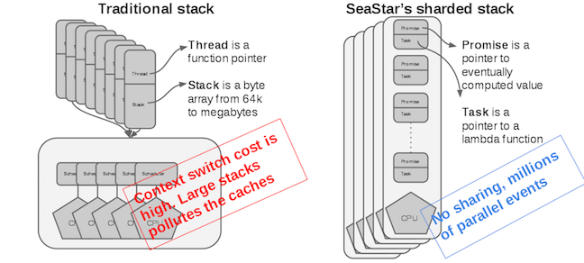

# seastar中的消息传递

## Shared-nothing设计

当需要跨核同步时，采用锁可能会导致竞争和等待，浪费CPU的时钟周期，即使采用原子变量，在竞争激烈时一次原子变量修改也会导致微秒级的耗时（普通变量仅需纳秒级耗时），参考[bvar的设计原理](https://github.com/apache/incubator-brpc/blob/8199994e54fb3077625a1539b21d63d8e9e75ca0/docs/en/bvar.md)


**seastar在每个核心上运行一个应用程序线程，通过基于无锁队列显式的消息传递**（当跨核心通信不可避免时），而没有任何其他诸如共享数据、锁等同步方式——**Shared-nothing**，从而尽可能避免**锁unscalable lock primitives**、**缓存抖动cache bouncing**等影响

## Actor模式

**[Actor Model](https://en.wikipedia.org/wiki/Actor_model)是一种并发编程模型**，每个线程在这种模型中作为一个Actor对不同类型的message做出响应，因此Actor也可以视为一个状态机，同时Actor也可以给其他Actor发送消息

Actor模型下，每个Actor内部是单线程运行，因此是可以完全无锁的，并且Actor接收/发出message是全异步操作，只有接收message的队列本身需要保证操作的线程安全（保证Actor自身正在取message与多个Actors往此发送messages的线程安全），每个Actor都有一个message queue用于接收消息，例如从此Actor `A`自身的`queue`中取出了消息`a`并执行操作，根据结果选择发送一个`b`消息给另一个Actor `B`的`queue`由`B`来执行`b`

Actor模型中需要识别每个Actor，通过识别对方进行消息通信与任务协作，与此相对应的另一种并发编程模型为[CSP Model](https://en.wikipedia.org/wiki/Communicating_sequential_processes)

**CSP模型中的主体是管道channel**，每个管道承载不同的消息，任意Process都可以根据需要在不同的管道中接收发送消息，这种模式下并不关心消息来自谁发给谁，而只关心不同管道可以取出不同的消息，例如从`A`管道取出的消息`a`执行一定操作，根据结果选择去`C`管道取出消息`c`执行一定操作，并发送一个`b`消息给管道`B`而不关心谁从`B`中取出`b`

**Actor模型中的Actor与CSP模型中的Process很相似，而Actor模型中的message queue和CSP模型中的channel很相似**

## `submit_to`

**seastar中采用了Actor模式进行核与核之间的任务传递**，显然每个CPU就是一个Actor，符合seastar的shared-nothing设计，相关代码位置`<seastar/core/smp.hh>`，`<src/core/smp.cc>`， `<src/core/reactor.cc>`

1. 当某个CPU的线程希望另一个CPU上的线程执行任务时，就可以调用`submit_to`

    ```cpp
    template <typename Func>
    static futurize_t<std::result_of_t<Func()>> smp::submit_to(unsigned t, Func&& func) noexcept {
        return submit_to(t, default_smp_service_group(), std::forward<Func>(func));
    }
    ```

2. `submit_to`将需要调用的函数加入到与对端CPU通信的队列`smp_message_queue`中

    ```cpp
    template <typename Func>
    static futurize_t<std::result_of_t<Func()>> smp::submit_to(unsigned t, smp_submit_to_options options, Func&& func) noexcept {
        using ret_type = std::result_of_t<Func()>;
        if (t == this_shard_id()) {
            // 如果是submit_to所在CPU的队列，则直接执行，本文暂时省略掉这里的各种case处理
        } else {
            // 加入到对端CPU的执行队列，所有CPU之间的通道构成一个二维矩阵的形式
            return _qs[t][this_shard_id()].submit(t, options, std::forward<Func>(func));
        }
    }

    static std::unique_ptr<smp_message_queue*[], qs_deleter> _qs;
    // _qs[A][B]代表从CPU B到CPU A的通道（包含执行队列和完成队列）
    // 队列采用了boost::lockfree::spsc_queue，并且默认大小为128

    smp_message_queue::lf_queue _pending;   //执行队列
    smp_message_queue::lf_queue _completed; //完成队列
    ```

3. 构造一个`async_work_item`包装待执行的任务并提交流量控制检测，并且返回一个`future`，而`async_work_item`也继承了`task`，因此其`run_and_dispose`在任务被执行时会被reactor引擎调用

    ```cpp
    template <typename Func>
    futurize_t<std::result_of_t<Func()>> smp_message_queue::submit(shard_id t, smp_submit_to_options options, Func&& func) noexcept {
        memory::scoped_critical_alloc_section _;
        auto wi = std::make_unique<async_work_item<Func>>(*this, options.service_group, std::forward<Func>(func));
        auto fut = wi->get_future();
        submit_item(t, options.timeout, std::move(wi));
        return fut;
    }
    ```

4. 基于信号量，通过`smp_service_group`对调用进行**流量控制**，若允许调用就将任务加入缓冲队列，并在`move_pending`中真正加入对端CPU的执行队列`_pending`

    ```cpp
    void smp_message_queue::submit_item(shard_id t, smp_timeout_clock::time_point timeout, std::unique_ptr<smp_message_queue::work_item> item) {
        // matching signal() in process_completions()
        auto ssg_id = internal::smp_service_group_id(item->ssg);
        auto& sem = get_smp_service_groups_semaphore(ssg_id, t);
        // Future indirectly forwarded to `item`.
        (void)get_units(sem, 1, timeout).then_wrapped([this, item = std::move(item)] (future<smp_service_group_semaphore_units> units_fut) mutable {
            if (units_fut.failed()) {
                item->fail_with(units_fut.get_exception());
                ++_compl;
                ++_last_cmpl_batch;
                return;
            }
            // work的所有权移交给了对端CPU
            _tx.a.pending_fifo.push_back(item.get());
            // no exceptions from this point
            item.release();
            units_fut.get0().release();
            if (_tx.a.pending_fifo.size() >= batch_size) {
                // 当缓冲队列待执行的任务数量超过batch_size时，主动唤醒远端CPU的reactor
                move_pending();
            }
        });
    }
    ```

5. 在reactor引擎中会获取各类待执行任务，磁盘网络I/O，异步lambda任务等等，也包括了其他CPU发送过来的任务，这里省略reactor执行过程，见`smp::poll_queues()`和`reactor::run_some_tasks()`，而执行任务就会调用到`task->run_and_dispose()`，从第3步可以看出，提交的`async_work_item`也实现了这个方法

    ```cpp
    virtual void async_work_item::run_and_dispose() noexcept override {
        // _queue.respond() below forwards the continuation chain back to the
        // calling shard.
        (void)futurator::invoke(this->_func).then_wrapped([this] (auto f) {
            if (f.failed()) {
                _ex = f.get_exception();
            } else {
                _result = f.get();
            }
            // 调用完成时，将item再回送给原CPU的完成队列
            _queue.respond(this);
        });
        // We don't delete the task here as the creator of the work item will
        // delete it on the origin shard.
        // 此远端CPU并不拥有这个work，待发起work的CPU收到work完成消息时就会delete
    }

    void smp_message_queue::respond(work_item* item) {
        // _completed_fifo是一个缓冲队列
        // 当已完成的任务超过batch_size时，或是此前reactor引擎正好休眠时才会直接flush并且唤醒reactor引擎
        // 正常运行的reactor引擎会主动从_completed_fifo获取完成的结果，过程见smp::poll_queues()
        _completed_fifo.push_back(item);
        if (_completed_fifo.size() >= batch_size || engine()._stopped) {
            flush_response_batch();
        }
    }
    ```

6. 与远端CPU执行`task->run_and_dispose()`不同，**本地CPU消费**已经完成的`work_item`时会通过`smp_message_queue::process_completions`消费完成队列，进而调用了`async_work_item::complete()`

    ```cpp
    size_t smp_message_queue::process_completions(shard_id t) {
        auto nr = process_queue<prefetch_cnt*2>(_completed, [t] (work_item* wi) {
            wi->complete();
            auto ssg_id = smp_service_group_id(wi->ssg);
            // 与第4步中的信号量流量控制相对应，每次消费完一次调用，就可以增加quota
            get_smp_service_groups_semaphore(ssg_id, t).signal();
            // 由发起work的CPU负责删除自己分配的work_item
            delete wi;
        });
        _current_queue_length -= nr;
        _compl += nr;
        _last_cmpl_batch = nr;

        return nr;
    }

    virtual void async_work_item::complete() override {
        if (_result) {
            _promise.set_value(std::move(*_result));
        } else {
            // FIXME: _ex was allocated on another cpu
            _promise.set_exception(std::move(_ex));
        }
    }
    ```

    注意：从这里可以看出，每个任务虽然是在远端CPU执行，但是在**消费结果设置`promise`时依然是在发起任务的CPU一侧**，结合[seastar中的协程](Coroutines.md#1-当这个future对象已经完成时)是在设置`promise`后调用`coroutine_handle::resume`恢复执行，因此**seastar的协程并不会跨线程执行**，都是由创建协程的CPU执行

7. 在完成时调用`async_work_item::complete()`就会对相应的`promise`对象设置结果，从而**引发后续依赖此结果的`.then()`被执行**，见在[Coroutine一文中的分析](Coroutines.md#then)
