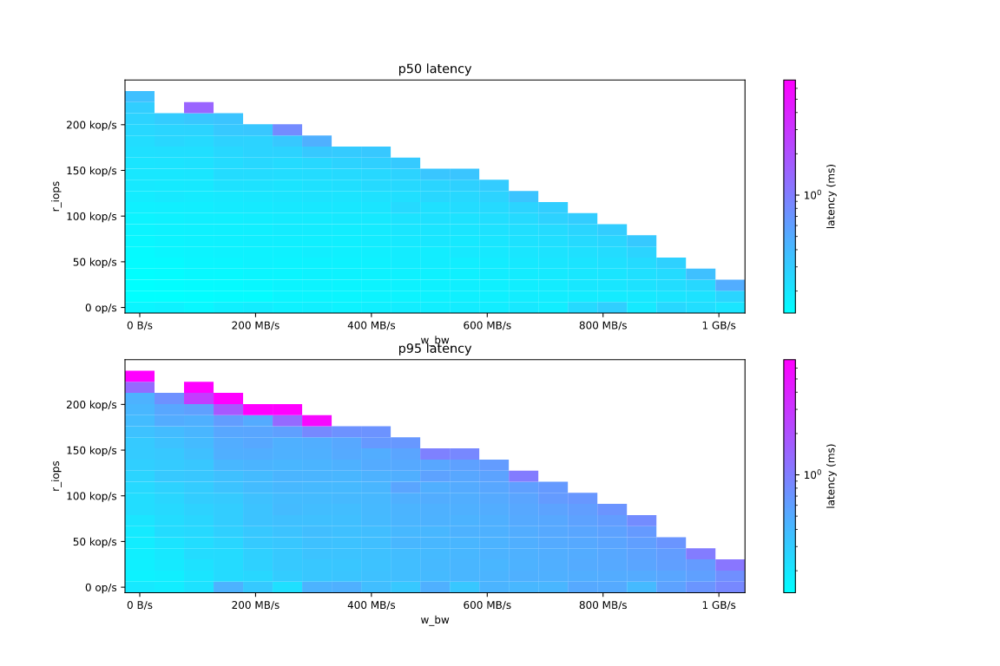
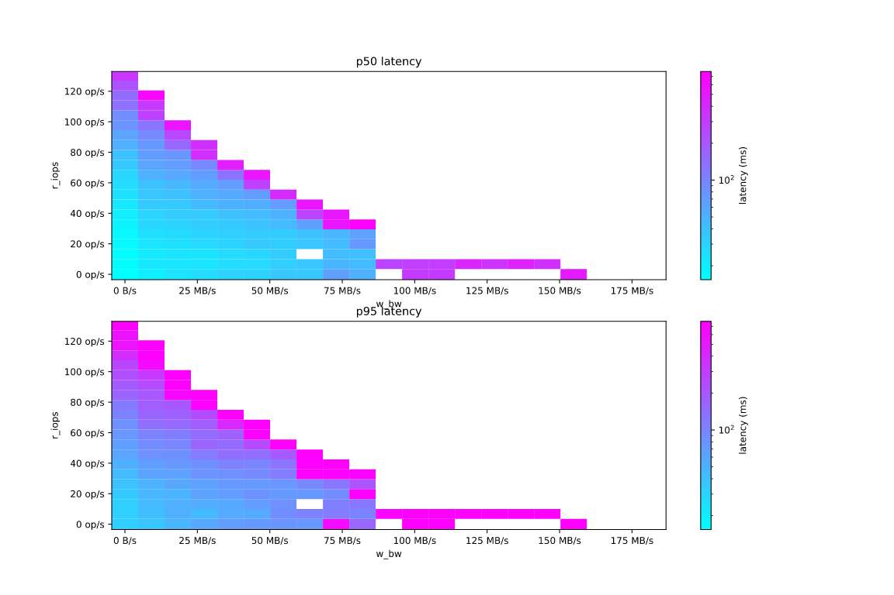
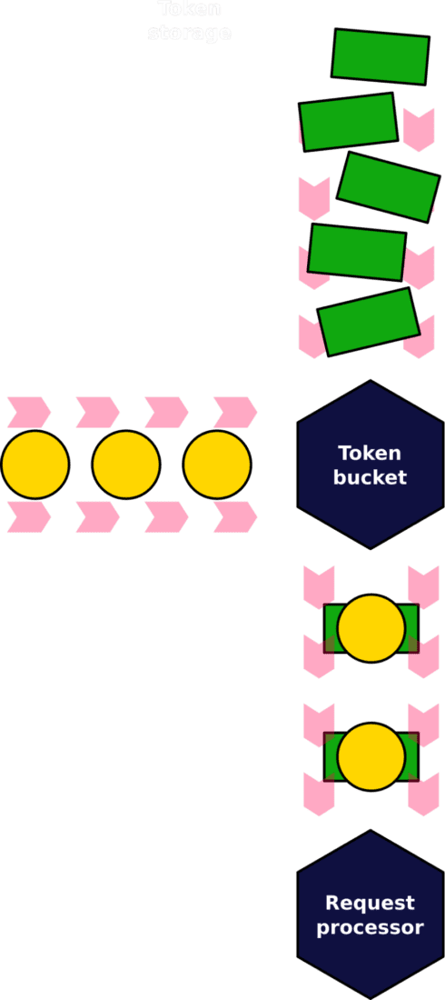
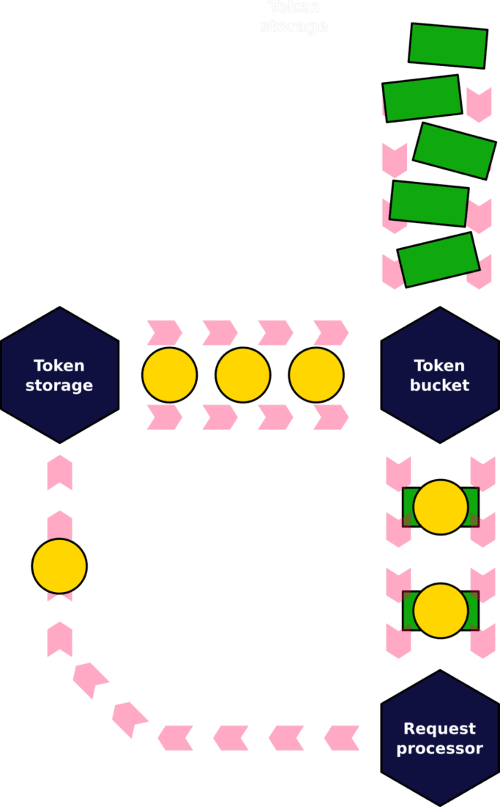
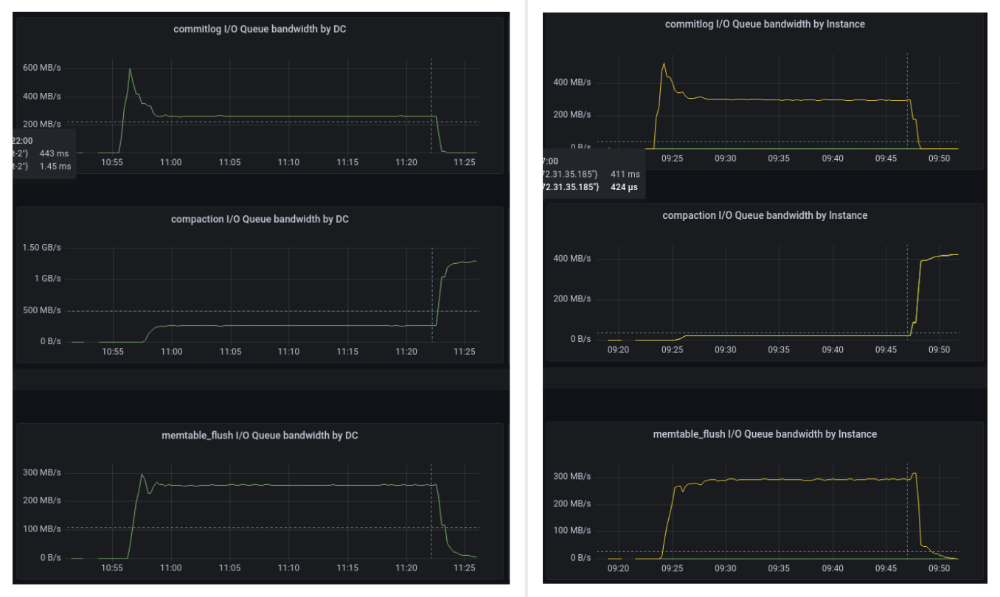
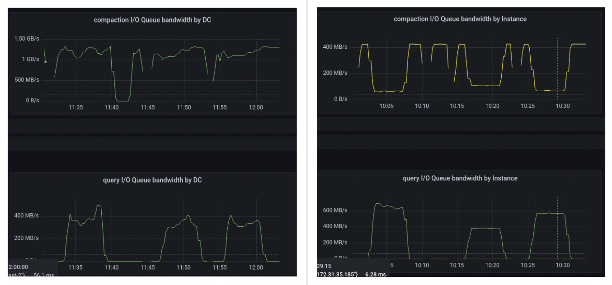
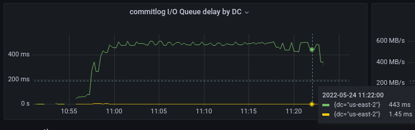
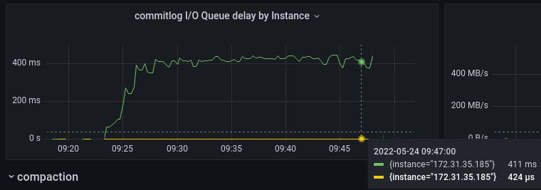
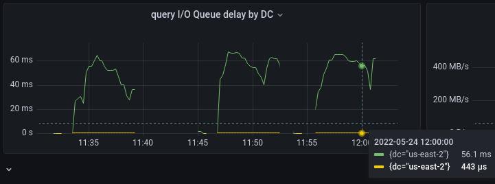
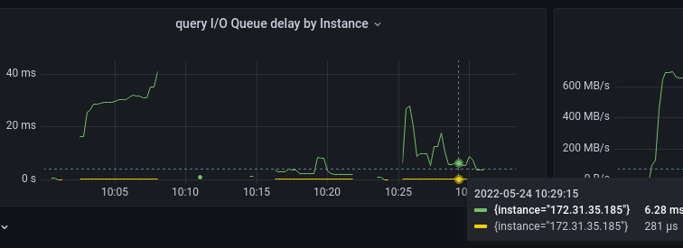

# Implementing a New IO Scheduler Algorithm for Mixed Read/Write Workloads

[original post](https://www.scylladb.com/2022/08/03/implementing-a-new-io-scheduler-algorithm-for-mixed-read-write-workloads/)

## Introduction

在[前文 Disk IO Scheduler](https://github.com/JasonYuchen/notes/blob/master/seastar/Disk_IO_Scheduler.md)中提到过，先前的磁盘调度器模型对读写请求不加区分，视作同质的请求来建模并以此来控制磁盘的IO请求调度，这是不真实的，**实际的磁盘读写操作存在各自的特点**，在同质的假设下可能导致一个前端读请求被埋没在后端写请求中，前端读请求作为高优先级的任务反而延迟表现不佳

磁盘IO调度器的核心目标依然没有改变，即通过**协调读写请求以达到最佳并发性能和最大吞吐量**，既不overwhelm，也不underutilize，同时还必须考虑到Seastar的[shared-nothing](https://github.com/JasonYuchen/notes/blob/master/seastar/Shared_Nothing.md)架构，充分**尊重shards之间的公平性**

## Towards Modeling the Disk

磁盘的性能可以用四个参数来描述，即**读写的IOPS和读写的throughput**，Seastar对磁盘的建模经历了多个阶段，演化基本如下：

1. 通过配置选项确定磁盘的最大IOPS，随后调度器会避免超过该给定值，即仅考虑整体的IOPS
2. 磁盘的吞吐量与延迟互相影响，而仅仅IOPS无法反映出吞吐量的影响，因此引入了每个请求涉及读写的字节数，从而引入throughput，此时考虑整体的IOPS和throughput
3. 采用per-shard均分磁盘能力的模式会更容易导致磁盘underutilized，因此通过per-numa均分磁盘能力，多个shard共享一个fair-group的方式（本质上并没有改变对磁盘建立的读写模型）
4. 读写请求并不是同质的，显然磁盘对读和写的流程不同，因此更为细化的方式应是对磁盘进行四个参数的建模，即需要考虑读写的IOPS和读写的throughput（本文内容）

## The Data

通过一个简单的工具[Diskplorer](https://github.com/scylladb/diskplorer)来对磁盘施加变化的负载（例如纯读负载、纯写负载、读写混合等，**参考YCSB**），显然负载包含了上述四个参数的变化，最终体现的是延迟，因此结果应该是**5维的状态空间**，从而来衡量的真实性能，例如下图构建了R_IOPS-W_bandwidth的关系（平面中难以画出5维的结果，因此可以通过投影观察）：



图中（示例为NVMe磁盘）可以近似看出**半双工half-duplex**的表现，即当读IOPS加倍时，为了维持延迟不变则需要写吞吐量减半，即**近似线性负相关关系**

*HDD有较为特别的结果，在少于100MB/s也是近似线性负相关关系，但是在100MB/s上则完全无法服务读请求，类似**截断**的表现*



## The Math

从上图可以推测可以**采用线性模型来描述磁盘**，即表达为：

```math
\frac{bandwidth_r}{B_r} + \frac{iops_r}{O_r} + \frac{bandwidth_w}{B_w} + \frac{iops_w}{O_w} \le K
```

其中$B_x$代表最大读写吞吐量，$O_x$代表最大读写IOPS，并且IOPS和吞吐量本身就是数据量对时间的一阶导数，因此上式又可以改写为对时间的一阶导数表达形式：

```math
\frac{d}{dt}(\frac{bytes_r + M_B \times bytes_w}{B_r} + \frac{ops_r + M_O \times ops_w}{O_r}) \le K
```

其中$M_B=\frac{B_r}{B_w}$为最大读写吞吐量之比，$M_O=\frac{O_r}{O_w}$为最大读写IOPS之比

为了便于衡量每个请求的磁盘影响力，即标准化请求代价，采用两个元组来描述一个请求，对读请求来说$T = \{1, bytes\}$，对写请求来说$T = \{M_O, M_B \times bytes\}$（即以读请求的IOPS和throughput为基准，写请求为相应"倍数"的读）从而一次操作的代价可以**基于读请求标准化**为：

```math
N(T)=\frac{T_0}{O_r}+\frac{T_1}{B_r}
```

从而将时间微分形式的关系转换为：

```math
\frac{d}{dt}(\sum_T N(T)) \le K
```

从而对于磁盘IO调度器来说，约束任意时刻的"速度"是非常困难的，但是**约束一个累积值的增长是简单的，即[令牌桶token bucket](https://en.wikipedia.org/wiki/Token_bucket)算法**

## The Code

令牌桶算法中，有两个输入值和一个输出值，输入值为实际请求的数据量和**被限流的令牌量**，从而要求数据量和令牌量必须匹配才能输出，通过**限制可控令牌的速率来间接控制不可控请求的速率**，如下图：



每个请求会在桶中等待直到能够获取到$N(T)$的令牌量才被真正发送给磁盘，而令牌则会以给定的速率$K$补充到桶中

需要**特别注意**的是，由于现代SSD自身存在一些垃圾回收等后台过程，因此依然可能会出现短暂的处理能力下降，而上述简单的令牌桶算法并不能感知到这一点，导致当**应用请求和SSD自身后台过程冲突时性能下降**

实际在Seastar中采用了二级令牌桶，即**令牌并不是凭空产生并补充给令牌桶的，而是在真正的IO请求完成时才会补充给二级令牌桶**，随后再以恒定速率$K$回充给一级令牌桶



采用上述修改后的令牌桶算法，确保了应用的所有IO请求实际上不会突破模型预测的理论上限和实际硬盘表现出来的上限，具体代码实现的[commit](https://github.com/scylladb/seastar/commit/837cadbe12c1b2be12158d48fffadfc8407c187d)及流程分析[见此](#implementation)

## Results

结果可以从两个角度来衡量：

1. 磁盘调度器是否通过调度确保了IOPS和throughput始终在磁盘特性的**安全区域**内
2. 新算法下是否真实利用了磁盘对读写请求处理的异质性，从而**提高了读写请求的实际性能**

如下图来自于ScyllaDB 4.6和5.0的性能对比测试，测试配置细节见原文，前者采用前一版本的磁盘调度器，后者采用本文描述的新算法

1. **数据导入过程中的吞吐量对比**
   （左侧为4.6曲线代表整体吞吐量，右侧为5.0黄色代表写入绿色代表读取）

   - 4.6中维持了总带宽达到了800MB/s，而这就是磁盘的峰值性能，相比之下**5.0仅维持在710MB/s**这是因为考虑了读写的不同所产生的最后聚合带宽

    

2. **前端查询过程中的吞吐量对比**
   （左侧为4.6曲线代表整体吞吐量，右侧为5.0黄色代表写入绿色代表读取，三个阶段平台是因为读请求的入流速度分别为`10k, 5k, 7.5k`）

   - 5.0中对后台compaction过程的读写进行了更大的限制（我们通常总是希望后台进程能够在系统闲置时运作，在**前端请求忙碌时尽可能将资源用于降低前端延迟**，因此5.0更符合我们的目标），而相应的5.0前端请求所占用的磁盘资源更多
   - 从三个峰值的读请求占用带宽可以推测出4.6中的前端请求处理相对不稳定**甚至无法满足预期的读请求速率**，带宽存在波动，而5.0则非常稳定

    

Seastar考虑了两类延迟，**不可控的队列in-queue延迟（下图中的绿线）**和**可控的磁盘in-disk延迟（下图中的黄线）**，前者由应用层的实际请求数量决定并且由应用层来维护（例如Scylla引入[背压机制](https://www.scylladb.com/2018/12/04/worry-free-ingestion-flow-control/)），而后者则由Seastar来控制并追求最优

1. **数据导入过程中的延迟对比**
   （上图为4.6，下图为5.0，黄色代表磁盘in-disk延迟，绿色代表队列in-queue延迟）

   - 5.0的磁盘延迟约为443微秒，显著低于4.6版本的1.45毫秒，**延迟显著优化**

    

    

2. **前端查询过程中的延迟对比**
   （上图为4.6，下图为5.0，黄色代表磁盘in-disk延迟，绿色代表队列in-queue延迟）

   - 后台compaction过程被抑制，从而充分多的资源用于处理前端请求（**short and latency sensitive reads**）
   - 5.0的前端请求磁盘处理延迟降低约一半，而**队列延迟则显著降低**，对于前端查询过程来说，队列延迟以及磁盘延迟一起作为上游可观测的延迟，而这个延迟得到了显著优化

    

    

## Implementation

- `fair_queue_ticket`用于描述**IO请求的代价，维度包括IOPS和size**
  - `make_ticket`根据IO请求的读写/大小，以及磁盘相应的最大读写带宽/IOPS，计算出该次IO请求的代价，并根据读写请求的差异，将**写请求的代价转换为读请求的代价**

    ```cpp
    // seastar/core/fair_queue.hh
    class fair_queue_ticket {
        uint32_t _weight = 0;      ///< the total weight of these requests for capacity purposes (IOPS).
        uint32_t _size = 0;        ///< the total effective size of these requests

        // 根据给定的denominator（通常是磁盘配置的最大容量_cost_capacity）进行标准化处理
        float normalize(fair_queue_ticket denominator) const noexcept {
            return float(_weight) / denominator._weight + float(_size) / denominator._size;
        }
    };

    
    fair_queue_ticket make_ticket(io_direction_and_length dnl, const io_queue::config& cfg) noexcept {
        struct {
            unsigned weight;
            unsigned size;
        } mult[2];

        mult[io_direction_write] = {
            cfg.disk_req_write_to_read_multiplier,
            cfg.disk_blocks_write_to_read_multiplier,
        };
        mult[io_direction_read] = {
            io_queue::read_request_base_count,
            io_queue::read_request_base_count,
        };

        const auto& m = mult[dnl.rw_idx()];
        return fair_queue_ticket(m.weight, m.size * (dnl.length() >> io_queue::block_size_shift));
    }
    ```

- `rovers<T, yes>`实现了**先进先出队列模式**的两个令牌桶，即上文所述的改进型算法（`rovers<T, no>`实现了单令牌桶）
  回顾上文改进的令牌桶算法，结合rovers可以发现：
  - **一级令牌桶**：直接从中获取tokens用于IO请求，就是 `(tail head)` 这一段
  - **二级令牌桶**：IO请求完成时才会回充，并且**从中获取tokens用于给定速率回充给一级令牌桶**，就是 `(head ceil)` 这一段，从而调用`bucket.replenish(now)`将`head`前进等同于消费 `(head ceil)` 桶并补充 `(tail head)` 桶，并且当前最多不能超过`max_extra`的量即`ceil - head`的量

```cpp
template <typename T>
struct rovers<T, capped_release::yes> {
    using atomic_rover = std::atomic<T>;

    // tail ----> head ----> ceil
    // 每次分配调用bucket.grap(tokens)实际等于tail.fetch_add(tokens)，即tail前进
    // 每次释放调用rovers.release(token)实际等于ceil.fetch_add(tokens)，即ceil前进
    // 每次回充调用bucket.replenish(now)中会进行回充，head.fetch_add(tokens)，即head前进
    atomic_rover tail;
    atomic_rover head;
    atomic_rover ceil;

    rovers(T limit) noexcept : tail(0), head(0), ceil(limit) {}

    T max_extra(T) const noexcept {
        return wrapping_difference(ceil.load(std::memory_order_relaxed), head.load(std::memory_order_relaxed));
    }

    void release(T tokens) {
        fetch_add(ceil, tokens);
    }
};
```

- `shared_token_bucket`实现了令牌桶算法的数据结构，额外限制了最大回充速率等，核心接口就是：
  - `grab`：为IO请求申请tokens
  - `release`：IO请求结束时回充给二级令牌桶
  - `replenish`：按给定速率$K$从二级令牌桶中获取tokens补充给一级令牌桶

    ```cpp
    // seastar/util/shared_token_bucket.hh
    template <typename T, typename Period, capped_release Capped, typename Clock = std::chrono::steady_clock>
    class shared_token_bucket {
        using rate_resolution = std::chrono::duration<double, Period>;

        T _replenish_rate;
        const T _replenish_limit;
        const T _replenish_threshold;
        std::atomic<typename Clock::time_point> _replenished;

        /*
        * The token bucket is implemented as a pair of wrapping monotonic
        * counters (called rovers) one chasing the other. Getting a token
        * from the bucket is increasing the tail, replenishing a token back
        * is increasing the head. If increased tail overruns the head then
        * the bucket is empty and we have to wait. The shard that grabs tail
        * earlier will be "woken up" earlier, so they form a queue.
        *
        * The top rover is needed to implement two buckets actually. The
        * tokens are not just replenished by timer. They are replenished by
        * timer from the second bucket. And the second bucket only get a
        * token in it after the request that grabbed it from the first bucket
        * completes and returns it back.
        */

        using rovers_t = rovers<T, Capped>;
        static_assert(rovers_t::atomic_rover::is_always_lock_free);
        rovers_t _rovers;

        T tail() const noexcept { return _rovers.tail.load(std::memory_order_relaxed); }
        T head() const noexcept { return _rovers.head.load(std::memory_order_relaxed); }

        /*
        * Need to make sure that the multiplication in accumulated_in() doesn't
        * overflow. Not to introduce an extra branch there, define that the
        * replenish period is not larger than this delta and limit the rate with
        * the value that can overflow it.
        *
        * The additional /=2 in max_rate math is to make extra sure that the
        * overflow doesn't break wrapping_difference sign tricks.
        */
        static constexpr rate_resolution max_delta = std::chrono::duration_cast<rate_resolution>(std::chrono::hours(1));
    public:
        static constexpr T max_rate = std::numeric_limits<T>::max() / 2 / max_delta.count();

    private:
        static constexpr T accumulated(T rate, rate_resolution delta) noexcept {
            return std::round(rate * delta.count());
        }

    public:
        shared_token_bucket(T rate, T limit, T threshold, bool add_replenish_iffset = true) noexcept
                : _replenish_rate(std::min(rate, max_rate))
                , _replenish_limit(limit)
                , _replenish_threshold(std::clamp(threshold, (T)1, limit))
                // pretend it was replenished yesterday to spot overflows early
                , _replenished(Clock::now() - std::chrono::hours(add_replenish_iffset ? 24 : 0))
                , _rovers(_replenish_limit)
        {}

        T grab(T tokens) noexcept {
            return fetch_add(_rovers.tail, tokens) + tokens;
        }

        // 被调用时是IO请求完成时将token回充给二级令牌桶
        void release(T tokens) noexcept {
            _rovers.release(tokens);
        }

        // 被调用时根据时间差和回充速率，从二级令牌桶获取tokens补充给一级令牌桶
        void replenish(typename Clock::time_point now) noexcept {
            auto ts = _replenished.load(std::memory_order_relaxed);

            if (now <= ts) {
                return;
            }

            auto delta = now - ts;
            // 根据上次回充和现在的时间差，计算出给定速率下所需要执行回充的量extra
            auto extra = accumulated_in(delta);

            // 至少达到replenish_threshold才会执行一次回充，这是考虑到回充是原子操作
            // 频繁执行原子操作也会有额外代价
            if (extra >= _replenish_threshold) {
                // 更新回充时刻失败说明有其他shard已经完成回充，等待下一次
                if (!_replenished.compare_exchange_weak(ts, ts + delta)) {
                    return; // next time or another shard
                }
                // 向一级令牌桶执行回充，并且不能补充超过二级令牌桶此时持有的量（即使可能少于该时间差x速率的理论值），
                // 这是因为磁盘并不保证性能能够稳定持续，若磁盘后台GC等任务导致实际token的消耗变慢，而固定速率回充会导致
                // 前端继续向忙碌的磁盘发出请求，最终出现“滚雪球”效应并急剧劣化磁盘性能
                fetch_add(_rovers.head, std::min(extra, _rovers.max_extra(_replenish_limit)));
            }
        }

        T deficiency(T from) const noexcept {
            return wrapping_difference(from, head());
        }

        template <typename Rep, typename Per>
        static auto rate_cast(const std::chrono::duration<Rep, Per> delta) noexcept {
            return std::chrono::duration_cast<rate_resolution>(delta);
        }

        // the number of tokens accumulated for the given time frame
        template <typename Rep, typename Per>
        T accumulated_in(const std::chrono::duration<Rep, Per> delta) const noexcept {
            auto delta_at_rate = std::min(rate_cast(delta), max_delta);
            return accumulated(_replenish_rate, delta_at_rate);
        }

        // Estimated time to process the given amount of tokens
        // (peer of accumulated_in helper)
        rate_resolution duration_for(T tokens) const noexcept {
            return rate_resolution(tokens / _replenish_rate);
        }

        T rate() const noexcept { return _replenish_rate; }
        T limit() const noexcept { return _replenish_limit; }
        T threshold() const noexcept { return _replenish_threshold; }
        typename Clock::time_point replenished_ts() const noexcept { return _replenished; }

        void update_rate(T rate) noexcept {
            _replenish_rate = std::min(rate, max_rate);
        }
    };
    ```

- `fair_group`采用双令牌桶的方式对所有IO请求进行quota分配（基于每个IO所属类别持有的shares）

    ```cpp
    class fair_group {
    public:
        using capacity_t = uint64_t;
        using clock_type = std::chrono::steady_clock;

        /*
        * tldr; The math
        *
        *    Bw, Br -- write/read bandwidth (bytes per second)
        *    Ow, Or -- write/read iops (ops per second)
        *
        *    xx_max -- their maximum values (configured)
        *
        * Throttling formula:
        *
        *    Bw/Bw_max + Br/Br_max + Ow/Ow_max + Or/Or_max <= K
        *
        * where K is the scalar value <= 1.0 (also configured)
        *
        * Bandwidth is bytes time derivatite, iops is ops time derivative, i.e.
        * Bx = d(bx)/dt, Ox = d(ox)/dt. Then the formula turns into
        *
        *   d(bw/Bw_max + br/Br_max + ow/Ow_max + or/Or_max)/dt <= K
        *
        * Fair queue tickets are {w, s} weight-size pairs that are
        *
        *   s = read_base_count * br, for reads
        *       Br_max/Bw_max * read_base_count * bw, for writes
        *
        *   w = read_base_count, for reads
        *       Or_max/Ow_max * read_base_count, for writes
        *
        * Thus the formula turns into
        *
        *   d(sum(w/W + s/S))/dr <= K
        *
        * where {w, s} is the ticket value if a request and sum summarizes the
        * ticket values from all the requests seen so far, {W, S} is the ticket
        * value that corresonds to a virtual summary of Or_max requests of
        * Br_max size total.
        */

        /*
        * The normalization results in a float of the 2^-30 seconds order of
        * magnitude. Not to invent float point atomic arithmetics, the result
        * is converted to an integer by multiplying by a factor that's large
        * enough to turn these values into a non-zero integer.
        *
        * Also, the rates in bytes/sec when adjusted by io-queue according to
        * multipliers become too large to be stored in 32-bit ticket value.
        * Thus the rate resolution is applied. The t.bucket is configured with a
        * time period for which the speeds from F (in above formula) are taken.
        */

        static constexpr float fixed_point_factor = float(1 << 24);
        using rate_resolution = std::milli;
        using token_bucket_t = internal::shared_token_bucket<capacity_t, rate_resolution, internal::capped_release::yes>;

    private:

        /*
        * The dF/dt <= K limitation is managed by the modified token bucket
        * algo where tokens are ticket.normalize(cost_capacity), the refill
        * rate is K.
        *
        * The token bucket algo must have the limit on the number of tokens
        * accumulated. Here it's configured so that it accumulates for the
        * latency_goal duration.
        *
        * The replenish threshold is the minimal number of tokens to put back.
        * It's reserved for future use to reduce the load on the replenish
        * timestamp.
        *
        * The timestamp, in turn, is the time when the bucket was replenished
        * last. Every time a shard tries to get tokens from bucket it first
        * tries to convert the time that had passed since this timestamp
        * into more tokens in the bucket.
        */

        const fair_queue_ticket _cost_capacity;
        token_bucket_t _token_bucket;

    public:

        // Convert internal capacity value back into the real token
        static double capacity_tokens(capacity_t cap) noexcept {
            return (double)cap / fixed_point_factor / token_bucket_t::rate_cast(std::chrono::seconds(1)).count();
        }

        auto capacity_duration(capacity_t cap) const noexcept {
            return _token_bucket.duration_for(cap);
        }

        struct config {
            sstring label = "";
            /*
            * There are two "min" values that can be configured. The former one
            * is the minimal weight:size pair that the upper layer is going to
            * submit. However, it can submit _larger_ values, and the fair queue
            * must accept those as large as the latter pair (but it can accept
            * even larger values, of course)
            */
            unsigned min_weight = 0;
            unsigned min_size = 0;
            unsigned limit_min_weight = 0;
            unsigned limit_min_size = 0;
            // max IOPS
            unsigned long weight_rate;
            // max bandwidth
            unsigned long size_rate;
            float rate_factor = 1.0;
            std::chrono::duration<double> rate_limit_duration = std::chrono::milliseconds(1);
        };

        explicit fair_group(config cfg)
                // 根据配置的值计算出最大IO能力
                : _cost_capacity(cfg.weight_rate / token_bucket_t::rate_cast(std::chrono::seconds(1)).count(), cfg.size_rate / token_bucket_t::rate_cast(std::chrono::seconds(1)).count())
                , _token_bucket(cfg.rate_factor * fixed_point_factor, std::max<capacity_t>(cfg.rate_factor * fixed_point_factor * token_bucket_t::rate_cast(cfg.rate_limit_duration).count(), ticket_capacity(fair_queue_ticket(cfg.limit_min_weight, cfg.limit_min_size))), ticket_capacity(fair_queue_ticket(cfg.min_weight, cfg.min_size)))
        {
            // some assertions
        }

        fair_group(fair_group&&) = delete;

        fair_queue_ticket cost_capacity() const noexcept { return _cost_capacity; }
        capacity_t maximum_capacity() const noexcept { return _token_bucket.limit(); }
        capacity_t grab_capacity(capacity_t cap) noexcept { return _token_bucket.grab(cap); }
        clock_type::time_point replenished_ts() const noexcept { return _token_bucket.replenished_ts(); }
        void release_capacity(capacity_t cap) noexcept { _token_bucket.release(cap); }
        void replenish_capacity(clock_type::time_point now) noexcept { _token_bucket.replenish(now); }
        void maybe_replenish_capacity(clock_type::time_point& local_ts) noexcept;

        capacity_t capacity_deficiency(capacity_t from) const noexcept;
        capacity_t ticket_capacity(fair_queue_ticket ticket) const noexcept;

        std::chrono::duration<double> rate_limit_duration() const noexcept {
            std::chrono::duration<double, rate_resolution> dur((double)_token_bucket.limit() / _token_bucket.rate());
            return std::chrono::duration_cast<std::chrono::duration<double>>(dur);
        }
    };
    ```

- `fair_queue`真正负责多个shards/通常一个numa节点的IO请求调度，其核心逻辑在于`dispatch_requests`，其参数`cb`回调就是真正发送IO请求给磁盘，一次IO请求的大致流程如下：

   1. 调用IO接口并最终提交给`io_queue`，例如`posix_file_impl::write_dma`或`posix_file_impl::read_dma`（以下都以写请求为例）

        ```cpp
        future<size_t>
        posix_file_real_impl::write_dma(uint64_t pos, const void* buffer, size_t len, const io_priority_class& pc, io_intent* intent) noexcept {
            return posix_file_impl::do_write_dma(pos, buffer, len, pc, intent);
        }

        future<size_t>
        posix_file_impl::do_write_dma(uint64_t pos, const void* buffer, size_t len, const io_priority_class& io_priority_class, io_intent* intent) noexcept {
            auto req = internal::io_request::make_write(_fd, pos, buffer, len, _nowait_works);
            return _io_queue.submit_io_write(io_priority_class, len, std::move(req), intent);
        }

        future<size_t>
        io_queue::submit_io_write(const io_priority_class& pc, size_t len, internal::io_request req, io_intent* intent, iovec_keeper iovs) noexcept {
            auto& r = engine();
            ++r._io_stats.aio_writes;
            r._io_stats.aio_write_bytes += len;
            // io_direction_and_length标记读还是写请求，并带上大小，从而后续可以计算代价
            return queue_request(pc, io_direction_and_length(io_direction_write, len), std::move(req), intent, std::move(iovs));
        }
        ```

    2. 在`io_queue`中会根据请求是否超过阈值，对其进行分割，**单次过大的请求会被分割成多个较小的IO请求**，这里以不分割为例，加入队列后的IO请求就等待reactor引擎进行处理

        ```cpp
        future<size_t>
        io_queue::queue_request(const io_priority_class& pc, io_direction_and_length dnl, internal::io_request req, io_intent* intent, iovec_keeper iovs) noexcept {
            size_t max_length = _group->_max_request_length[dnl.rw_idx()];

            if (__builtin_expect(dnl.length() <= max_length, true)) {
                return queue_one_request(pc, dnl, std::move(req), intent, std::move(iovs));
            }
            // split, queue, wait...
        }

        future<size_t>
        io_queue::queue_one_request(const io_priority_class& pc, io_direction_and_length dnl, internal::io_request req, io_intent* intent, iovec_keeper iovs) noexcept {
            return futurize_invoke([&pc, dnl = std::move(dnl), req = std::move(req), this, intent, iovs = std::move(iovs)] () mutable {
                // First time will hit here, and then we create the class. It is important
                // that we create the shared pointer in the same shard it will be used at later.
                auto& pclass = find_or_create_class(pc);
                auto queued_req = std::make_unique<queued_io_request>(std::move(req), *this, pclass, std::move(dnl), std::move(iovs));
                auto fut = queued_req->get_future();
                if (intent != nullptr) {
                    auto& cq = intent->find_or_create_cancellable_queue(dev_id(), pc.id());
                    queued_req->set_intent(cq);
                }

                _streams[queued_req->stream()].queue(pclass.fq_class(), queued_req->queue_entry());
                // 这里提早release，真正的queued_req会在dispatch_requests的回调queued_io_request::dispatch()中释放资源
                queued_req.release();
                pclass.on_queue();
                _queued_requests++;
                return fut;
            });
        }
        ```

    3. reactor引擎会进行[轮询poll](https://github.com/JasonYuchen/notes/blob/master/seastar/Reactor.md#reactor%E5%92%8Cpollfn)，随后有IO请求等待的队列`io_queue`就会被执行请求分发提交给磁盘

        ```cpp
        class reactor::io_queue_submission_pollfn final : public reactor::pollfn {
        public:
            virtual bool poll() final override {
                return _r.flush_pending_aio();
            }
        };

        bool
        reactor::flush_pending_aio() {
            for (auto& ioq : _io_queues) {
                ioq.second->poll_io_queue();
            }
            return false;
        }

        void
        io_queue::poll_io_queue() {
            for (auto&& st : _streams) {
                st.dispatch_requests([] (fair_queue_entry& fqe) {
                    queued_io_request::from_fq_entry(fqe).dispatch();
                });
            }
        }
        ```

    4. IO请求的处理过程主要包含的步骤见代码和注释，注意该实现已经与[此前的流程](https://github.com/JasonYuchen/notes/blob/master/seastar/Disk_IO_Scheduler.md#part-iv-%E6%96%B0%E8%B0%83%E5%BA%A6%E5%99%A8-new-io-scheduler)略有不同 

        ```cpp
        auto
        fair_queue::grab_capacity(const fair_queue_entry& ent) noexcept -> grab_result {
            // 若已经有处于pending的请求，则首先检查该pending请求所claim的tokens是否可以被抢占
            if (_pending) {
                return grab_pending_capacity(ent);
            }

            capacity_t cap = _group.ticket_capacity(ent._ticket);
            // 尝试获取tokens，若超过了当前可用的余额，则需要等待token回充，此时pending
            capacity_t want_head = _group.grab_capacity(cap);
            if (_group.capacity_deficiency(want_head)) {
                _pending.emplace(want_head, cap);
                return grab_result::pending;
            }

            return grab_result::grabbed;
        }

        auto
        fair_queue::grab_pending_capacity(const fair_queue_entry& ent) noexcept -> grab_result {
            // 有pending的情况下说明曾经分配失败，此时首先尝试回充tokens
            _group.maybe_replenish_capacity(_group_replenish);

            // token依然不足，直接返回pending
            if (_group.capacity_deficiency(_pending->head)) {
                return grab_result::pending;
            }

            capacity_t cap = _group.ticket_capacity(ent._ticket);
            // 优先级更高的任务其代价大于当前pending的任务，返回无法抢占
            if (cap > _pending->cap) {
                return grab_result::cant_preempt;
            }
            
            // 优先级更高的任务其代价小于当前pending的任务，将差值返还给令牌桶
            if (cap < _pending->cap) {
                _group.release_capacity(_pending->cap - cap); // FIXME -- replenish right at once?
            }

            _pending.reset();
            return grab_result::grabbed;
        }

        void
        fair_queue::dispatch_requests(std::function<void(fair_queue_entry&)> cb) {
            capacity_t dispatched = 0;
            boost::container::small_vector<priority_class_ptr, 2> preempt;

            // TODO: why dispatched < _group.maximum_capacity() / smp::count ?
            while (!_handles.empty() && (dispatched < _group.maximum_capacity() / smp::count)) {
                // priority_queue _handlers为优先队列，因此top总是优先级最高的请求
                priority_class_data& h = *_handles.top();
                if (h._queue.empty()) {
                    // 当前priority_class没有可执行的请求，continue处理下一个priority_class
                    pop_priority_class(h);
                    continue;
                }

                auto& req = h._queue.front();
                // 尝试获得访问磁盘的tokens
                auto gr = grab_capacity(req);
                if (gr == grab_result::pending) {
                    break;
                }
                // 无法抢占pending的任务，说明tokens无法满足当前priority_class的任务，尝试跳过并执行后续低优先级的请求
                // 若后续请求可以满足则会先执行，等到while结束时将跳过的priority_class再放回队列
                if (gr == grab_result::cant_preempt) {
                    pop_priority_class(h);
                    preempt.emplace_back(&h);
                    continue;
                }

                _last_accumulated = std::max(h._accumulated, _last_accumulated);
                pop_priority_class(h);
                h._queue.pop_front();

                _resources_executing += req._ticket;
                _resources_queued -= req._ticket;
                _requests_executing++;
                _requests_queued--;

                // Usually the cost of request is tens to hundreeds of thousands. However, for
                // unrestricted queue it can be as low as 2k. With large enough shares this
                // has chances to be translated into zero cost which, in turn, will make the
                // class show no progress and monopolize the queue.
                auto req_cap = _group.ticket_capacity(req._ticket);
                auto req_cost  = std::max(req_cap / h._shares, (capacity_t)1);
                // signed overflow check to make push_priority_class_from_idle math work
                // 非常罕见的情况下，当累积代价溢出时，对每个队列的累计代价一起进行修正，从而保证了priority_class之间的相对优先级
                if (h._accumulated >= std::numeric_limits<signed_capacity_t>::max() - req_cost) {
                    for (auto& pc : _priority_classes) {
                        if (pc) {
                            if (pc->_queued) {
                                pc->_accumulated -= h._accumulated;
                            } else { // this includes h
                                pc->_accumulated = 0;
                            }
                        }
                    }
                    _last_accumulated = 0;
                }
                h._accumulated += req_cost;
                h._pure_accumulated += req_cap;

                dispatched += _group.ticket_capacity(req._ticket);

                // 回调实际上调用了queued_io_request::from_fq_entry(fqe).dispatch();提交IO操作给磁盘
                cb(req);

                if (h._plugged && !h._queue.empty()) {
                    // 若当前priority_class的请求队列还有队列，则放回_handlers等待后续继续被执行
                    push_priority_class(h);
                }
            }

            for (auto&& h : preempt) {
                push_priority_class(*h);
            }
        }
        ```
