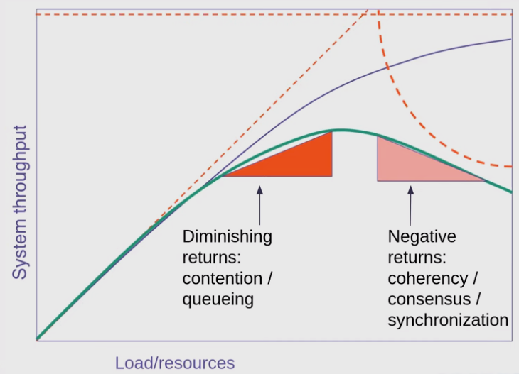
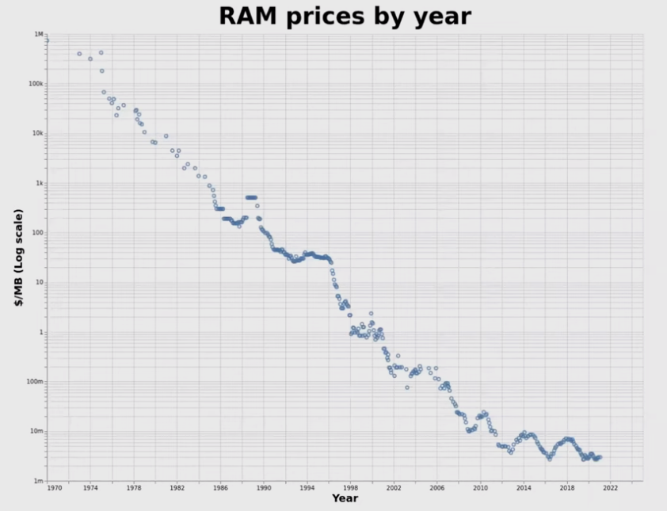
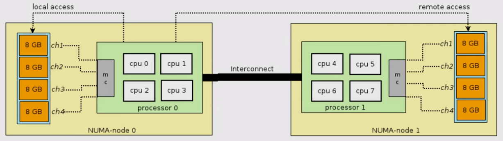
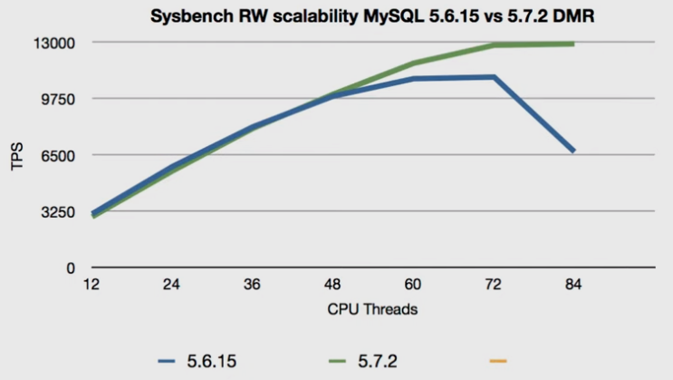
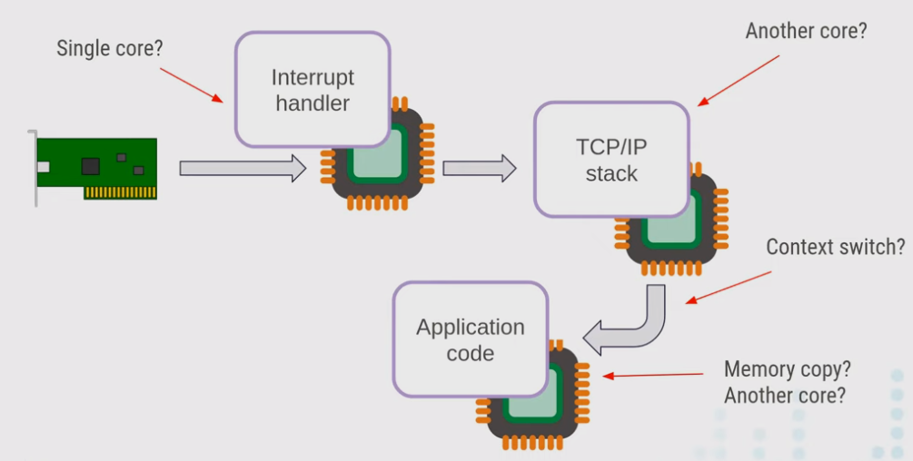
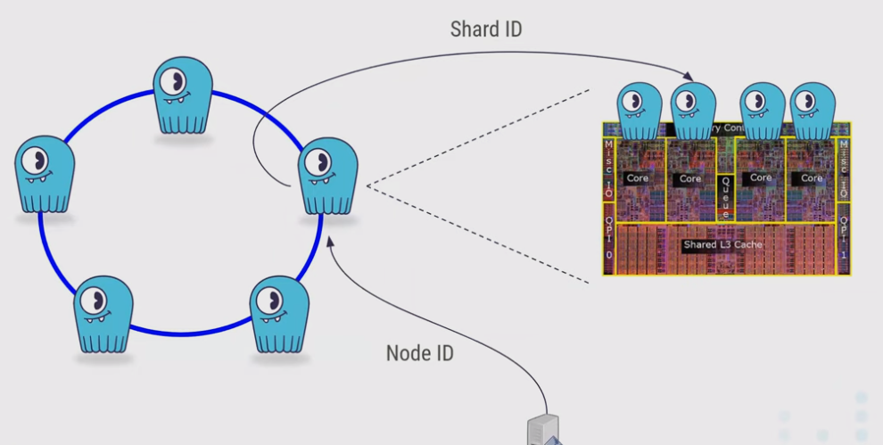
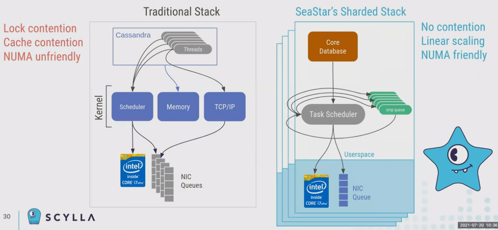
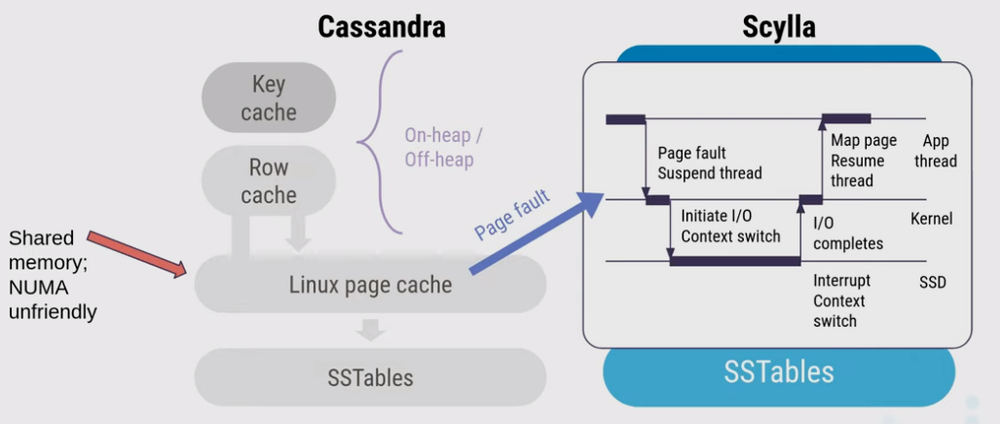
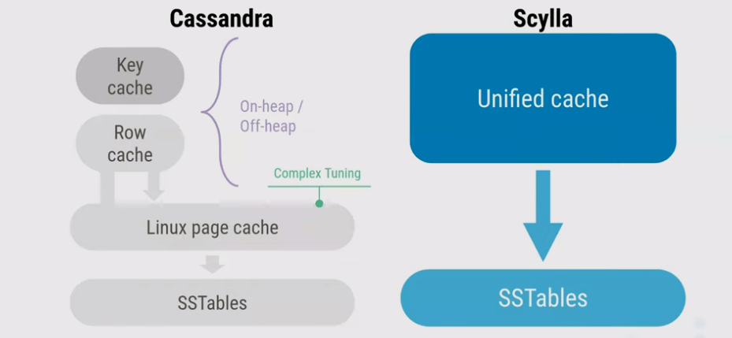

# Seastar: Shared-nothing Architecture

[Scylla Webinar: Under the Hood of a Shard-per-Core Architecture](https://go.scylladb.com/wbn-shard-per-core-architecture-registration.html)

## 扩展性规则 The Universal Scalability Law

当资源/负载线性扩展时，系统在一定程度上能够满足扩展，而当扩展到一定程度时就会出现一定程度的竞争contention、等待queueing等导致系统的吞吐量无法再跟随线性扩展

更严重的是当负载持续增大后，竞争更加激烈，同步开销、缓存击穿等各种问题导致系统的吞吐量甚至反而下降

传统的**共享内存架构shared-memory architecture**设计通常是应对资源和负载在较小范围内的线性扩展，采用以下设计思想，但是随着硬件极速发展这种架构已经出现了明显的瓶颈，无法充分利用硬件资源：

- Process/thread per client connection (或reactor设计)
- N storage/IO threads
- Mutex/Futex来保护存储数据的一致性

## 硬件发展 Hardware Evolution

在过去的十年里，硬件的发展趋势有所不同，从上图中可以看出处理器从**单核向多核发展，频率与单核处理能力基本进入瓶颈期**，不同硬件发展如下：

- **CPU**
  - Cores: 1 -> 256
  - Frequency: ~4 GHz
- **RAM**
  - Capacity: 2 GB -> 2 TB
  - Latency: not changed much ~10 ns
- **Disk**
  - Capacity: 10 GB -> 10 TB
  - Latency: 10 ms -> 10 us (NVMe SSD)
- **Network**
  - throughput: 1 Gbps -> 100 Gbps (even up to 400 Gbps)

内存的容量急剧增大，但访问延迟并没有显著变化，而硬盘的容量显著提升且延迟也显著减少，从而一次内存访问大约~1000 CPU时终周期，而一次硬盘访问大约~1000 内存访问，同时**NUMA**使得内存访问延迟也不一致：

## 对传统架构的影响

### MySQL

MySQL的架构（shared-memory）中采用了大量的锁来保护共享数据，当线程数超过60且越来越多时，旧版本的MySQL性能锐减，而新版本的MySQL已无法随着线程增加而获得性能提升

### Linux Kernel

Linux Kernel也是多线程的设计，并且依赖于**Context Switch ~1-5us**代价低，相比于所要处理的任务本身足够快的假设，这在早年间是符合实际情况的，一次阻塞I/O本身可能需要数ms完成，额外的上下文切换追加数us的延迟是不显著的

基于中断响应interruption-driven的内核I/O机制使得当有I/O请求时会发生多次上下文切换，以及数据的内核态/用户态复制（现在也有**零拷贝优化zero-copy**）和跨核心处理导致数据局部性变差

**Linux Kernel在多核时代的扩展性并不好**，内核中有大量共享数据和锁：

- Counters, stats
- VFS metadata
- Page cache
- Various cache
- Memory locks
- Socket locks
- CPU core locality
- NUMA locality

## 重新构思数据库架构

Scylla/Seastar采用了shared-nothing的架构，并且尽可能采用分区的方式来减小锁和跨核同步的开销：

- Mini operating system in userspace
- [Task scheduler](Reactor.md)
- [I/O scheduler](Disk_IO_Scheduler.md)
- Fully asynchronous - [userspace coroutines](Coroutines.md)
- Direct I/O, self-managed cache (bypass page cache)
- One thread per core, one shard per core
- NUMA friendly, Linear scaling

### Scylla vs. Cassandra

Cassandra无法控制内核的Context Switch（也是所有**mmaped设计的常见问题**），且自身的缓存（row cache、key cache）与操作系统的page cache功能重叠冗余

### Q&A

1. Can CPU-bound scylla processes be mapped to **individual disks**?
   No, even if you have individual disks, **the disk controller is still shared**. It does not make a lot of sense to treat individual disks as individual.
2. What if the **load is skew** and some cores are busy while others are idle?
   Skewness is a common problem in all partition-based arch, just **further partitions** the hot part of the data。
