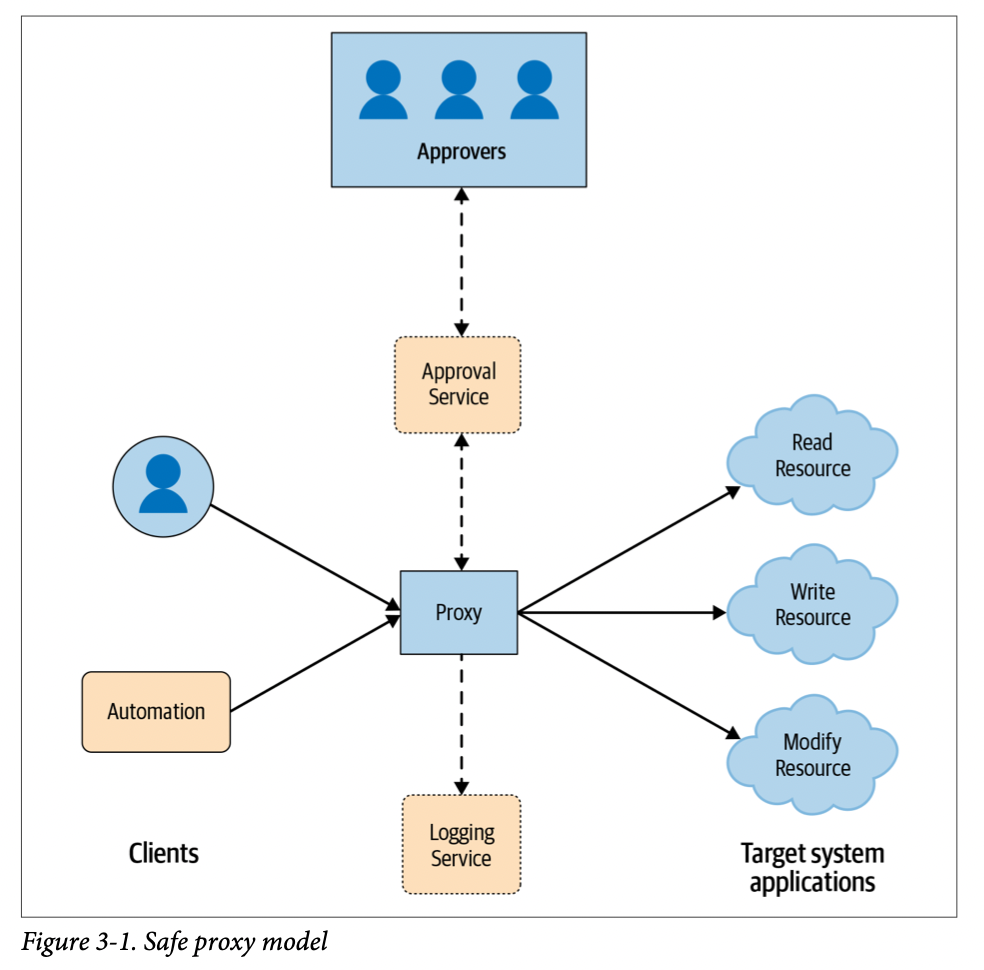

# Chapter 03. Case Study: Safe Proxies

采用**安全代理Safe Proxies**可以精细的控制连接到系统上的行为，通过多个方面来提升系统的可靠性和安全性：



- 一个集中实施**多端验证multi-party authorization MPA**的中心节点
- **操作的鉴权和记录**，每一个操作都会被记录在案
- **限流**，例如重启等操作被逐步执行，预防人为错误大规模的影响整个生产环境
- **持续演进**，在此中心节点上可以很好的继续进行安全性和可靠性增强

但这样的安全代理同样也会有一些缺点需要注意：

- 额外的运维负担
- 若只部署单个实例，则属于SPoF，因此需要考虑**部署多个安全代理**实现冗余
- 安全代理的**访问权限控制ACL**
- 可能成为攻击者首先想要攻破的中心节点

安全代理作为中间层应该对用户尽可能透明，因此其应**采用和系统完全相同的API，仅在执行前后额外增加鉴权、日志等操作**，例如Google Tool Proxy：

- 一个Tool Proxy的部署配置示例，包含允许的`role`、是否需要授权`mpa`等等

    ```json
    config = {
        proxy_role = 'admin-proxy'
        tools = {
            borg = {
            mpm = 'client@live'
            binary_in_mpm = 'borg'
            any_command = true
            allow = ['group:admin']
            require_mpa_approval_from = ['group:admin-leads']
            unit_tests = [{
                expected = 'ALLOW'
                command = 'file.borgcfg up'
            }]
        } }
    }
    ```

- 用户可以通过`tool-proxy-cli --proxy_address admin-proxy borg kill`来执行`borg kill`命令，这个过程中实际发生了：
  1. proxy校验并记录所有RPC操作
  2. proxy检查调用者的身份，确保是`group:admin`
  3. 由于该`borg kill`操作属于敏感操作，因此proxy并不会立即执行，而是会根据配置，等待`group:admin-leads`中的成员授权
  4. 若获得授权，则proxy会进一步执行命令，等待结果，并将结果返回

    ```text
           workstation
    +-----------------------+
    | $ tool-proxy-cli .... |
    +-----------------------+
                |
                v
    +-----------------------+
    |       Tool Proxy      | <-------> external approvers if needed
    +-----------------------+
                |
                v
    +-----------------------+
    | Borg: execute cmd.... |
    +-----------------------+
    ```
