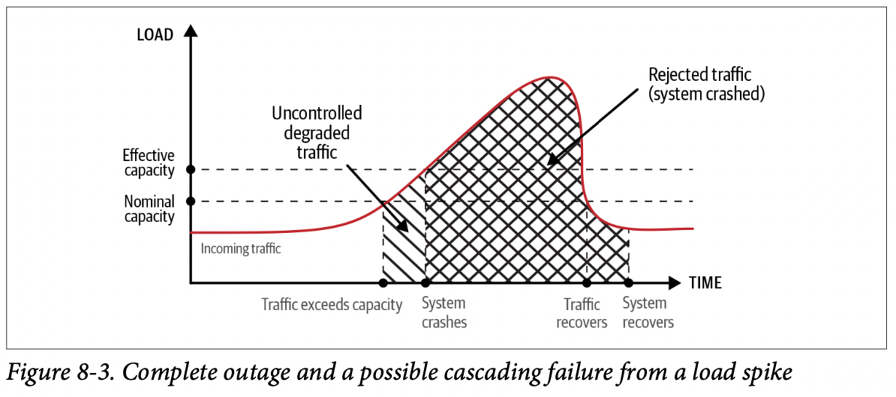
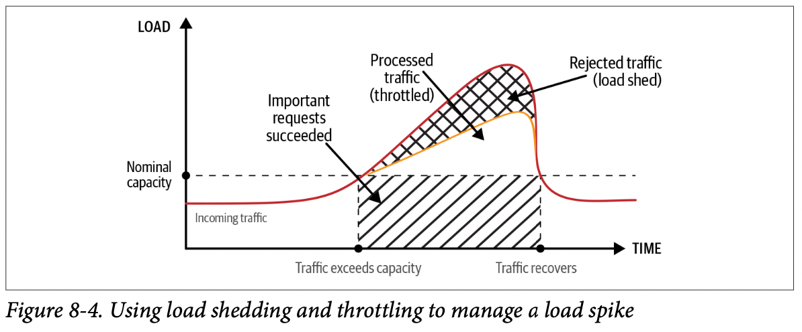

# Chapter 08. Design for Resilience

## Design Principles for Resilience

- **系统的每一层都应该具有独立的弹性设计** Design each layer in the system to be independently resilient.
- **对功能的重要性和代价进行分级评估**，从而在系统压力过大时可以选择保障高优先级的功能正常运作，而牺牲低优先级的功能，即将有限的系统资源投入到更重要的功能模块中
- **系统的不同功能模块之间应有明确清晰的边界**，从而提升不同模块的隔离性，有利于弹性容灾和功能降级
- 采用**分隔冗余 compartment redundancy** 来预防局部的故障
- **在安全的前提下，尽可能将弹性容灾措施自动化，从而减少系统的响应时间**
- **持续验证系统的弹性容灾能力**，保证系统弹性的有效性

## Defense in Depth

通常可以将攻击分为四个阶段：

1. Thread modeling and vulnerability discovery
2. Deployment
3. Execution
4. Compromise

以Google App Engine（允许在Google的服务上运行用户提供的代码，从而由Google完成弹性部署）为例，用户代码Application运行在运行时Python/Java Runtime上，而后者运行在Google的基础操作系统Base OS上

1. 系统内置的I/O接口被替换为安全的I/O接口直接访问Google的云服务，禁止用户程序直接操作底层的I/O
2. 用户程序只能够访问固定目录下固定用户的本地磁盘数据，从而禁止用户程序扫描其他磁盘数据
3. 为了避免用户直接使用编译好的程序绕过接口替换，Google App Engine禁止用户使用自己提供的共享库、编译好的字节码等
4. 采用多层沙盒sandbox机制，监控用户程序的所有行为并将危险操作隔离在沙盒中

   ```text
   +-----------------------------------------------------------+
   |  ptrace sandbox                                           |
   | +--------------------------------------------------------+|
   | |  NaCL sandbox                                          ||
   | | +-----------------------------------------------------+||
   | | |  Python audit and functionality reduction           |||
   | | | +--------------------------------------------------+|||
   | | | |  Python runtime that runs untrusted user code    ||||
   | | | |                                                  ||||
   | | | +--------------------------------------------------+|||
   | | +-----------------------------------------------------+||
   | +--------------------------------------------------------+|
   +-----------------------------------------------------------+
   ```

## Controlling Degradation

由于可控/不可控的因素，系统最终有可能需要**降级degradation**来保护最核心的功能，可控降级能够维持高优先级功能的正常运作、避免大规模失效、避免级联故障

- **关闭低优先级/边缘功能**，从而释放相应的资源
  例如常见系统的TLS连接支持ECC和RSA加密系统，而ECC对于私钥操作的资源要求更低，因此极端情况下可以关闭RSA的支持，通过ECC来支撑更多的连接数
- **尽快生效操作**，从而避免系统陷入更紧张的状态
  例如服务端程序可以尽快开关各项功能，调整资源，动态扩容/缩容等，而客户端由于不可控的因素，并不适用这一条准则
- **理解并保护最有价值最核心系统的资源**
  例如Gmail提供简易HTML模式，关闭所有UI的特效，从而允许用户依然能够正常的打开邮件查看内容，注意这一条规则依然会服从于安全性要求，假如安全性得不到满足时简易HTML模式也不会提供

*核心在于事先做好规划和应急响应流程，从而在事故发生时能够有序可控降*，并且需要在安全性和可靠性之间做权衡，通常关闭一些功能可能会导致安全性的下降，例如若2FA服务宕机不可用，是否依然允许用户登陆系统

### Differentiate Costs of Failures

- **计算资源 Computing resources**
  假如一个操作最终失败了，则找个操作此前消耗掉的计算资源就是浪费的，因此**fail-fast**，尽早的检查操作本身的合法性、是否能够成功，避免计算资源无意义的浪费

  另外假如服务器处于资源紧张状态，由上游客户端减少请求、或是本服务器主动**限流**，也可以减少资源消耗的情况
- **用户体验 User experience**
  当系统处于资源紧张/降级状态时，任何功能被关闭、或是为了可靠性牺牲了安全性的变动，都需要明确的传递给用户，从而避免出现“意外”
- **缓解速度 Speed of mitigation**
  当系统降级/宕机，到完全恢复的时间显著影响了系统故障的成本，越快的响应越减轻故障带来的代价

### Deploy Response Mechanisms

通常，理想的系统应该在面对故障时能够**自动、高效、安全、预先定义**的响应，从而最大程度上保全安全性和可靠性

- **减负 Load shedding**
  相比于过大负载直接导致系统宕机，从而所有请求都会失败，我们更倾向于**依然服务部分重要的请求，而直接忽略/丢弃另一部分请求**，即系统减负

  可以基于每个请求的**优先级、潜在的代价、当前服务的资源情况等**来综合考虑决定是否需要丢弃一些请求，这个策略应该预先写入到服务端程序中，从而在系统资源紧张时自动生效
- **限流 Throttling**
  限流通常可以通过**延迟响应但不超过超时**，从而间接降低了客户端的请求速率，并减轻系统负载

  限流同样可以基于客户端/请求的优先级、代价、服务资源等综合考虑延迟的时间，这个策略也应该能够自动生效

未采用减负和限流措施的服务响应情况和采用措施的情况对比如下：





为了能够高效、自动的生效减负和限流措施 **manage degradation controls at scale**，往往需要一个**中心化的管理服务监控所有服务的资源占用和请求处理情况，并自动化的进行降级，避免系统进入危险状态**（此时可能已经有重要的请求被拒绝/丢弃），这个管理服务应该基于业务逻辑设计的各项指标进行运作，能够及时的在重要服务即将失效时介入保护系统

仅基于服务自身的资源占用和请求处理指标就能够决定是否需要降级，能够**避免对中心化管理服务的依赖，从而有更好的可靠性**，另外所有降级事件都应该被详细记录以便后续的事故分析

### Automate Responsibly

当自动化降级操作执行时，需要**特别注意操作本身对安全性/可靠性的权衡**，避免在不经意间降低了系统的安全性

- **Failing safe (open) vs. failing secure (closed)**
  - 最大化可靠性的系统应该尽可能在任何时候都能够提供服务，即使系统的一致性已经受到影响，只要能够提供服务，依然可以选择提供服务
  - 最大化安全性的系统应该在有任何危险时就立即拒绝提供服务，只要系统无法验证一致性是否依然得到保证，就应该默认拒绝所有服务

  通常在规划系统的降级操作时不必过于一刀切和极端，而是应该**基于业务逻辑合理的规划**，设置系统运作的**安全红线 minimal nonnegotiable security posture**
- **A foothold for humans**
  通常人类操作员也应该参与到降级的过程，在一些不明确、非平凡的事件发生时能够及时做出决策（预先定义好的情况难以枚举系统可能面临的所有风险），并且在设计降级策略时需要注意影响范围，**降级也可以有限额，避免无限制的扩大降级影响面**，例如单个服务器不能够无限制的一直丢弃某一类RPC请求，一旦降级的限额被耗尽，就应该由人类操作员介入，执行更高级别的非自动化降级措施

  ***最重要的原则之一：自动化降级不应该关闭员工访问公司设施的服务***

## Controlling the Blast Radius

## Failure Domains and Redundancies

## Continuous Validation

## Practical Advice: Where to Begin
