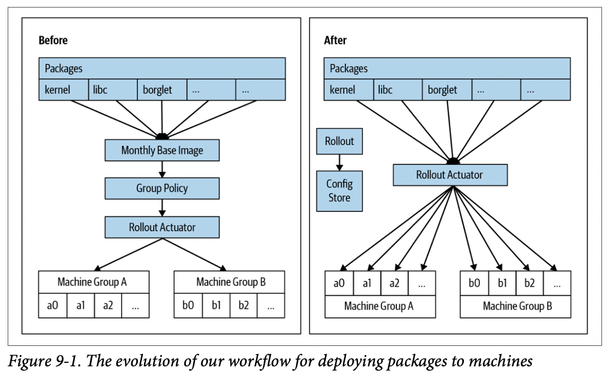

# Chapter 09. Design for Recovery

## What Are We Recovering From?

系统通常在遇到这些问题时需要考虑恢复（分类并不重要，**快速安全准确的恢复系统最重要**）：

- **Random Errors**：地震、自然灾害、硬件故障等不可预知的错误
- **Accidental Errors**：人类无意的行为
- **Malicious Actions**：黑客、内部员工破坏等恶意行为，在开源软件内植入破坏代码等
- **Software Errors**：软件逻辑bug等

## Design Principles for Recovery

- **快速响应 Design to Go as Quickly as Possible**
  需要特别注意的是恢复过程本身有可能使问题恶化，但**能够快速更新/回滚系统的自动化部署系统非常重要**（k8s等），并且推荐做法是*紧急上线系统*就是*常规上线系统*的快速版本，从而两个上线系统没有本质差别（例如紧急上线就是最大程度多节点并行上线），避免因流程不同而引入风险

  例如可以做到精确到每一个依赖的升级部署，当更新某一个库时可以精确控制依赖该库的系统/组件/机器重启（对于应用程序，个人更倾向于基于docker的全静态链接无依赖可执行文件上线）

  

- **避免依赖外部时间 Limit Your Dependencies on External Notions of Time**
  外部时间不受控的流逝，若恢复过程依赖了外部时间则可能导致恢复失败，例如事务需要校验外部证书，而在重放时外部证书可能已经超过了有效时间而失效，导致事务重放失败

  > **Tying events to wall-clock is often an anti-pattern.**

  实际应该考虑的做法是依赖人为标记的单调递增**版本号 epoch/version numbers**或是受控的**有效列表 validity lists**，假如需要依赖时间段时也应考虑**时间差+时间退止 backstop rate limit**从而最大程度不再依赖外部绝对时间

- **回滚是安全和可靠的权衡 Rollbacks Represent a Tradeoff Between Security and Reliability**
  当出现一些问题时，首先可以考虑的安全做法就是回退到可靠的版本，从而回滚可疑的变更（绝大多数生产环境中的问题都是代码逻辑/配置修改有错导致的），但显然这个回滚（包括回滚到多久之前的版本）就是系统安全性与可靠性的权衡，有可能会引入已经修复的安全漏洞

  为了减少重新引入安全漏洞的可能，可以采用**拒绝列表 deny lists**、**安全版本号 security version numbers SVN**、**最小安全版本 minimum acceptable security version numbers MASVN**、**更新签名密钥 rotating signing keys**等方式（`TODO: 每一项的具体做法`）
- **采用撤回机制 Use an Explicit Revocation Mechanism**
  显式高效的撤回机制可以在需要时紧急撤回一些账号的访问权限，从而最快速度停止侵入行为
- **明确期望的系统状态 Know Your Intended State, Down to the Bytes**
  当进行故障恢复时，提前对期望恢复到的系统状态有认知能够极大的有利于自动化故障恢复（**无状态stateless**的服务更容易管理和恢复，但注意严格来说即使是无状态的服务也是有代码版本、监听的端口号等状态信息）
  - Host management: 例如软件包有可能因磁盘损坏/人为替换/宇宙射线等而被破坏，Google的系统会持续监测本地文件系统的状态，并且**周期性检查每一个文件的校验和并与部署时的数据对比，一旦不吻合就会进入恢复流程**；有一些进程在启动后会有内存中的状态，不再读取磁盘数据，这些程序就必须支持`post_install`命令在启动后能够重启/刷新内存状态
  - Device firmware: 追踪管理所有硬件固件的版本和配置值，可以采用Host management中相同的策略
  - Global services: 带有持久化状态的全局服务（存储、命名、身份识别等）是最难恢复的，因此**部署此类服务时通常要确保部署多个实例互为备份，通常这些组件有自身的复杂恢复逻辑，依赖备份节点提供服务并后台等待故障节点的自动恢复**，是常见做法，并且搭配灾难测试来确保措施有效
  - Persistent data: 做法[参考此处](https://www.usenix.org/conference/srecon18europe/presentation/bennett)，备份数据也应该是加密保存的，避免被攻击者恶意篡改并引起回档从而生效
- **持续测试和验证 Design for Testing and Continuous Validation**
  故障恢复流程也应该得到持续的测试和验证确保在紧急时能够生效，对于过大过复杂的系统，进行端到端的测试和验证是非常困难的，此时可以考虑**谨慎设计接口、将核心逻辑模块抽取出来单独测试验证**（例如Etcd实现的Raft状态机及其测试）

## Emergency Access

紧急情况下的系统访问是必须的，但同样也必须有一定的安全要求

- Access Controls
- Communications: 紧急情况发生时，不同responder的沟通渠道也需要仔细选择，尽可能少依赖，在出现事故时必须可用
- Responder Habits: 紧急访问的流程和正常访问的流程应尽可能相同，从而使得responder能够用同样的习惯来使用两套系统，避免紧急时因流程生疏而易于出错

## Unexpected Benefits

当一个系统从构建时就考虑到了恢复，那么除了紧急情况下的应对以外，恢复还可以用在一些日常维护操作上，例如当云主机因云服务提供商的原因需要下线处理时，可以充分利用恢复机制来自动预热启用一台新的服务器
