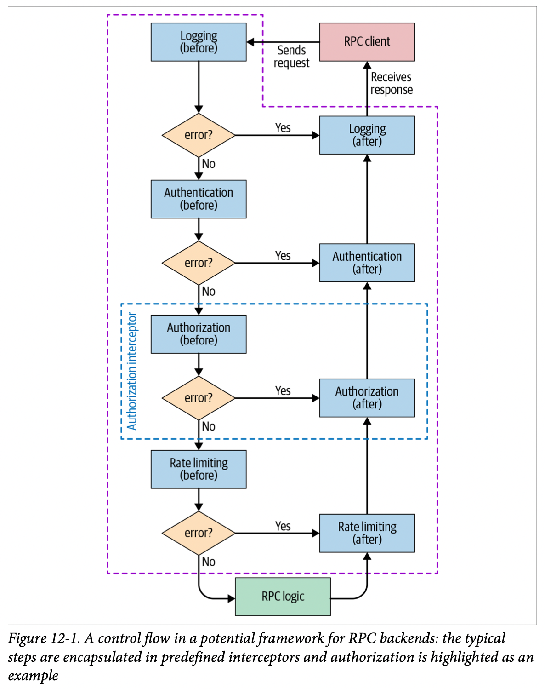

# Chapter 12. Writing Code

## FrameWorks to Enforce Security and Reliability

绝大多数应用都有类似的**安全模块**（鉴权、日志、加解密等）和**可靠性模块**（限流、负载均衡、重试等），每次开发新的应用都从头实现这些可重用模块过于浪费资源，通常这些公共模块就会由框架提供

> It doesn’t always make sense to develop your own frameworks. In many cases, the best strategy is to **reuse existing solutions**.

一个RPC框架的流程可以如下图所示，所有相关的鉴权、统计等信息加入到`context`对象中让RPC框架使用，开发者只需要关心真正执行的逻辑RPC logic即可：

RPC框架通常应内置**指数回退的重试**用于应对瞬态网络不稳定等错误，也应支持**多个下游节点自动容错转移**用于应对某个节点长期不可用

## Common Security Vulnerabilities

OWASP列出的十大安全漏洞：

- **SQL Injection**
  当采用用户输入拼接SQL时，有可能使用了恶意的输入导致执行了预期外的SQL语句；应采用**bound parameters**和**prepared statements**避免这种问题，同时应在框架中内置约束禁止使用用户输入直接拼接SQL语句
- Broken Authentication
  采用OAuth等鉴权设施，避免直接将请求发送给后端
- Sensitive Data Exposure
  对不同的敏感信息采用不同的类型，随后利用强类型语言的类型约束来避免一些意外数据暴露，例如用`string`存储敏感信息可能会被意外打印出来，应使用特殊的`SomeSecureInfo`并禁用打印
- XML External Entities, XXE
  使用禁用了XXE功能的XML解析器
- Broken Access Control
  通常是应用层设计实现时容易出现的漏洞，应采用框架来要求每个请求都必须有良好定义的访问权限
- Security Misconfiguration
  采用的框架应有默认的安全限制，并且禁止使用不安全的选项
- **Cross-site Scripting, XSS**
  `TODO`，用户提供的HTML数据**必须sanitizd/escaped**后才能够插入到HTML页面上
- Insecure Deserialization
  采用的序列化框架应可以应对任意不受信的数据输入，例如protobuf
- Using Components with Known Vulnerabilities
  尽可能保持依赖库的版本最新，避免采用存在安全漏洞的组件
- Insufficient Logging & Monitoring
  避免ad hoc日志，尽可能采用logging interceptor的形式来合理的记录事件

## Lessons for Evaluating and Building Frameworks

- **Simple, Safe, Reliable Libraries for Common Tasks**
  从一个简单可靠的小库开始到大的复杂系统，特殊的需求通过大量仔细的review来实现
- **Rollout Strategy**
  - Incremental rollout: 增量式的重构，提供新接口并标记旧接口为`deprecated`（可以在git hook中添加规则检查是否使用了旧接口），随后逐步迁移旧用法
  - Legacy conversions

## Simplicity Leads to Secure and Reliable Code

> **Whenever practical, try to keep your code clean and simple.**

- **Avoid Multilevel Nesting**
  避免多层嵌套的代码，可以显著提高可读性
- **Eliminate YAGNI Smells**
  避免过早/过渡设计，为“未来”可能用到而提供接口只会额外增加复杂度、文档、测试，You Aren't Gonna Need It YAGNI
- **Repay Technical Debt**
  在快速迭代过程中可能会产生非常多的`TODO/FIXME`待实现，应确保这些数量不持续增加，适时清理
- **Refactoring**
  > **Never mix refactoring and functional changes in a single commit to the code repository.**

## Security and Reliability by Default

### Choose the Right Tools

选择语言/框架/库时通常需要考虑与基础代码的结合性、库的丰富性、开发团队的技能情况，另外还需要考虑：

- Use **memory-safe** languages
- Use **strong typing** and **static type checking**

### Use Strong Types

采用不带类型的primitives（例如`int`）则可能导致以下问题：

- 传递了**语法合法但语义无效**的数据
  例如`AddUserToGroup(string, string)`无法看出两个参数谁是`User`谁是`Group`，应改为`Add(User("alice"), Group("root-users"))`
- 非预期的数据类型隐式转换
  例如`Bar(bool is_safe)`传入其他类型比如`5`也有效但可能是编写代码时写错的bug
- 难以理解的类型层级关系
- 混乱的单位
  参考事件采用`int`表达和`std::chrono`中类型的差别

### Sanitize Your Code

- **C++: Valgrind / Google Sanitizers**
- **Go: Race Detector**
