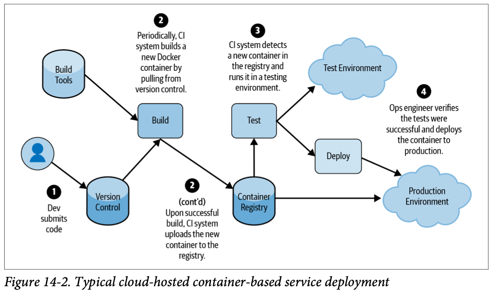
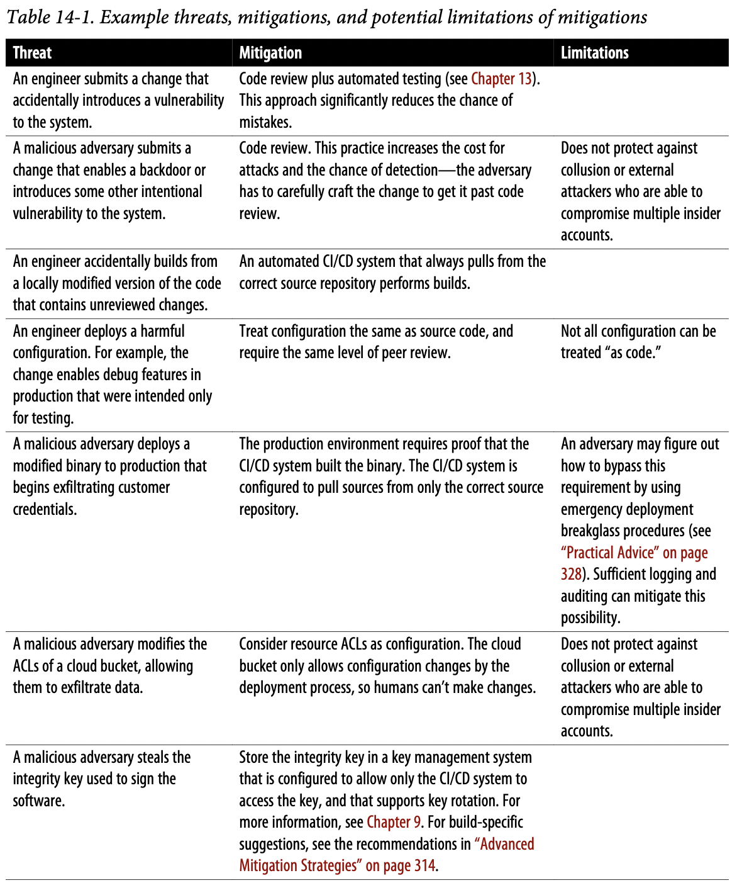
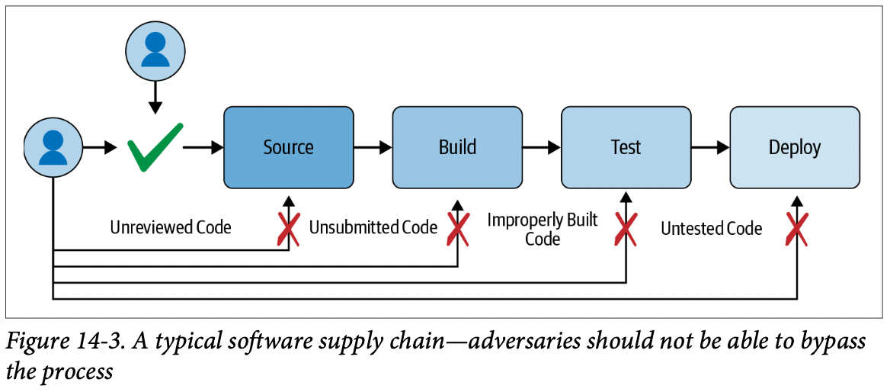
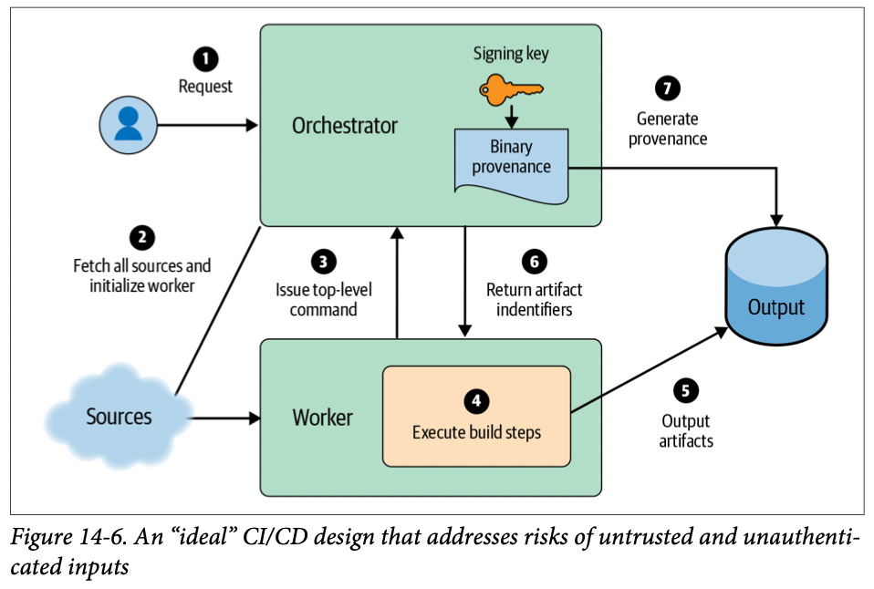
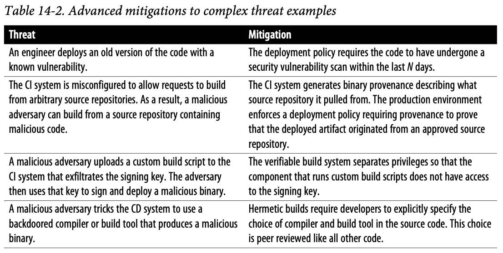

# Chapter 14. Deploying Code

## Concepts and Terminology

- **Software Supply Chain**
  软件供应链，描述了一个系统从代码的**编写、构建、测试到部署**的完整流程，通常包括版本控制系统VCS，持续集成CI和持续交付CD
- **Build**
  > A build is any transformation of input artifacts to output artifacts.
- **Artifact**
  > An artifact is any piece of data—for example, a file, a package, a Git commit, or a virtual machine (VM) image.
- **Deployment**
  > A deployment is any assignment of some artifact to some environment.

## Threat Model

在整个Software Supply Chain的流程中，通常可以在如下环节引入危险：

- 编写：工程师的代码意外引入了风险，或黑客恶意提交包含后门/漏洞的代码
- 构建：工程师意外采用了本地代码（尚未提交/审查）构建了程序
- 部署：工程师意外采用了错误的配置进行了部署，或黑客恶意部署了修改过的程序
- 配置错误，例如CI系统被错误配置导致允许从任意源代码执行构建、数据存储ACL被修改导致可以偷取用户资料、CD系统被黑客引入了植入后门的编译器或构建系统等

## Best Practices

- **Require Code Reviews**
- **Rely on Automation**
  将所有的构建、测试、部署的流程都自动化，并且对整个链上任意的配置变更都要求code review，并且在有必要的情况下可以锁住停止该自动化系统以防止侵入者利用
- **Verify Artifacts, Not Just People**
  所有的工程师必须有鉴权，同样所有的数据和程序也需要签名和校验，因为受信的工程师依然有可能意外错误使用了版本不符合的程序，对数据和程序校验可以避免这一点
- **Treat Configuration as Code**
  配置也应该被视为一种代码，需要同样走VCS管理、code review、测试、部署的流程，不能被随意更改
- **Don't Check In Secrets!**
  密钥、令牌等永远不应该被嵌入源代码或由VCS来管理，尽可能**采用合适的密钥管理系统**，例如Cloud KMS

## Securing Against the Treat Model

## Advanced Mitigation Strategies

### Binary Provenance

每个build都应该携带有一个binary provenance包含了这个build的必要信息例如输入的数据、执行的转换、触发该操作的实体：

- Authenticity (required): 通常是放置对剩下整个binary provenance加密后的数据
- Outputs (required): 通常是每个输出内容的加密hash值
- Inputs: 例如源代码版本、依赖及版本等
- Command: 例如编译命令
- Environment: 环境变量、架构信息等
- Input metadata
- Debug info
- Versioning: 例如时间戳、binary provenance的版本号等

### Provenance-based Deployment Policies

可以对部署进行额外的约束，例如要求满足一些条件的build才能被部署，就可以通过**检测每个build的binary provenance**来确定是否满足要，CI/CD系统可以自动根据Inputs找到相应的源代码仓库，并且对比所有输入，核心在于：

- Verify that **the provenance is authentic**.
- Verify that **the provenance applies to the artifact**.
- Verify that **the provenance meets all the policy rules**.

### Verifiable Builds

持有密钥的*Orchestrator*单独部署维护有更好的可靠性/安全性

### Deployment Choke Points

Choke Points代表了流程上必须要经过的环节，例如**部署Proxy来作为必须要经过的节点**，从而可以审查所有请求

### Post-Deployment Verification

## Practical Advice

- Take It **One Step at a Time**
- Provide **Actionable** Error Messages
- Ensure **Unambiguous** Provenance
- Create Unambiguous Policies
- Include a **Deployment Breakglass**

## Secuing Against the Threat Model, Revisited

