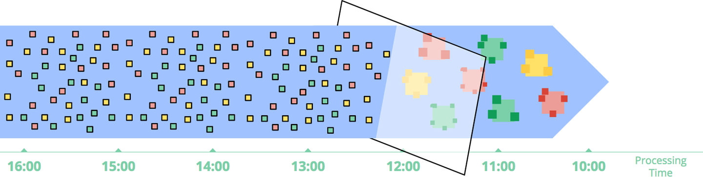
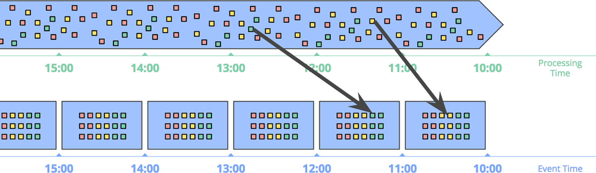

# Chapter 1. Streaming 101

## 什么是流 Terminology: What Is Streaming?

### 术语 Terminology

- **Streaming system**: 一种被设计成能处理无限数据集的数据处理引擎
  > A type of data processing engine that is designed with infinite datasets in mind

描述数据有两个重要的维度：**基数cardinality**和**形式constitution**

**基数cardinality**角度来看可以分为两类：

- **Bounded data**：有限数据量的数据
  > A type of dataset that is finite in size
- **Unbounded data**：无限数据量的数据
  > A type of dataset that is infinite in size (at least theoretically)

**形式constitution**角度来看可以分为两类：

- **Table**：某一时刻数据集的一个整体视图
  > A holistic view of a dataset at a specific point in time
- **Stream**：逐个数据元素的视图体现出数据集随时间的变化
  > An element-by-element view of the evolution of a dataset over time

### 被夸大的流的局限性 On the Greatly Exaggerated Limitations of Streaming

由于一些历史原因，流数据系统总是被为提供了**低延迟low-latency**、**不准确inaccurate/speculative**的服务并且总是需要一个可靠的批处理系统来提供最终可靠的结果（即著名的**Lambda架构**）

而如今，**良好设计的流数据系统可以提供的功能是批处理系统的超集**，如Apache Flink

- **正确性 Correctness**
  正确性依赖一致可靠的存储，流数据系统需要随着时间周期性的进行**快照checkpointing/snapshotting**来持久化状态，而快照保存的状态以及流数据一定要能够容忍宕机并能够正确恢复，对于**端到端恰好一次exactly-once语义**，**强一致性strong consistency**是必要的，Flink中关于一致性的讨论[见此](https://arxiv.org/pdf/1506.08603.pdf)
- **能够从时间尺度上分析的工具 Tools for reasoning about time**
  由于批处理系统的数据与时间无关，而提供了时间尺度上分析工具的流数据系统就能够提供比批处理系统更多的功能，从时间尺度上来分析数据是流数据系统最重要的特征之一

### 事件时间与处理时间 Event Time vs. Processing Time

- **事件时间 Event time**：事件真实发生的时刻
- **处理时间 Processing time**：事件被系统观测/处理到的时刻

理想中这两者应该是同一时刻，发生的时刻也就是被观测到的时刻，但在**现实中这两个时刻存在偏差，并且偏差是高度不定的**，例如软硬件资源受限、网络阻塞、分布式系统的复杂逻辑、竞争等都导致了这两个时刻之间的偏差一直在变化，下图中红线与虚线之间的水平距离反映了流数据系统与理想世界的偏差**event-time skew**，垂直距离反映了流数据系统的处理延迟**processing-time lag**

显然，由于处理时间与事件时间本质上的不同，以及不定的偏差，**假如需要考虑事件时间就不能简单的依赖处理时间进行分析**，进行窗口分析时也需要选择合理的时间窗口（**processing-time windowing** or **event-time windowing**）

另一方面，无限数据量的数据可能还会有**乱序、重复、丢失**等其他问题，假如使用事件时间窗口evet-time windowing，如何确定在某个时刻发生的所有数据已经被系统接收？因此流数据系统在设计时就应该考虑到新数据到来时旧数据也可能会被更新

## 数据处理模式 Data Processing Patterns

### 有限数据 Bounded Data

处理有限数据是非常简单以及直接的，可以采用例如MapReduce等方式处理

### 批量处理无限数据 Unbounded Data: Batch

1. **固定窗口 Fixed Windows**
   最常见的批量处理无限数据的方式就是采用固定窗口，将一批数据加入一个固定大小的窗口，同一个窗口的数据作为一批数据一起处理，并且重复不断的采用这种批量化方式来处理源源不断的数据，如下图基于时间进行窗口分割

   

   在现实中这种方式往往存在**完整性问题completeness problem**，即假如某些事件由于网络延迟等因素，没有及时被归类在应该在的窗口中，例如10:59发生的事件在11:01才抵达并被归入11:00-12:00这一窗口，则前一个窗口少了数据，后一个窗口多了数据（或丢弃，则此时依然没有解决前一个窗口少数据的问题，完整性无法得到保证）
2. **会话 Sessions**
   当固定窗口的方式遇到用户会话的场景就会有更多问题，通常用户会话开始和结束都高度不确定，导致**同一个会话的数据很有可能被分割进两个甚至更多窗口**，假如提高窗口大小则降低了这种分割的可能性，但又有更多数据处理的延迟，或者采用特殊的逻辑将多个不同窗口内相同会话的数据整合，但又极大的提升了处理引擎的复杂度

   

### 流式处理无限数据 Unbounded Data: Streaming

在现实世界的分布式系统环境下，无限数据往往来自于系统各个组件，高度无序，往往需要流数据系统的处理流水线中基于时间进行重排，从而能够将相关联的事件放在一起，并且分布式系统的不可靠性也导致了某个时间点的数据并不一定都能及时被观测到（延迟、丢失等等）

1. **时间不可知 Time-agnostic**
   时间不可知处理主要是针对时间不重要的场景，完全依赖于**数据驱动**处理，因此几乎所有流数据系统都天然支持时间不可知处理，例如：
   - **过滤 Filtering**：过滤数据仅需要对每个数据进行判断即可，并不依赖先后顺序，与时间无关

     

   - **内连接 Inner Joins**：对两个无限流进行内连接仅需缓存其中一条流的数据并不断与另一条流的数据执行连接（也许需要一些垃圾回收策略防止缓存数据过大，而垃圾回收策略也许会与时间有关）；但是**外连接并不属于时间不可知处理**，对于外连接而言如果已知其中一侧用于连接的数据，如何获知另一侧数据是否会到来？通常无法知道，此时通常引入**超时timeout**来处理，而超时显然就与时间有关

     

2. **近似算法 Approximation Algorithm**
   例如近似Top-N算法、流式K-means算法，由于这些算法处理的数据通常是先到先处理的（即基于处理时间）因此对于处理时间与事件时间有较大偏差时输出的结果意义非常有限（**误差可能很大**）

   

3. **窗口 Windowing**
   - 窗口种类
     - **固定窗口 Fixed/Tumbling Windows**：将时间分割为多块，并均匀应用到所有数据上；均分并且应用到整个数据集的窗口也称为**对齐的窗口aligned windows**，若是会有一些相位变化来适应数据的不同子集的窗口则称为**非对齐的窗口unaligned windows**
     - **滑动窗口 Sliding/Hopping Windows**：属于一种更泛化的固定窗口，其窗口长度和周期固定，当周期少于长度时就会出现重叠，而周期等于长度时退化为固定窗口，而周期大于长度时就会丢失一些数据变为类似采样窗口（只处理了全部数据的子集），与固定窗口一样，滑动窗口通常也是对齐的
     - **会话 Sessions**：典型的动态窗口，不同的会话会持续的时间不同，包含的数据也不同，针对会话的窗口往往用于分析用户行为，并且会话窗口的长度依赖实际的数据而不能预先定义（但可以用会话超时的时限作为窗口上限），会话窗口是典型的非对齐窗口

     

   - **基于处理时间的窗口 Windowing by processing time**
     采用基于处理时间的窗口，相当于将系统缓存，并定时处理缓存中的数据如下图，这种处理方式**简单直接**，易于实现，但当每个事件有一个事件时间时，**一旦事件抵达顺序不一致即乱序**（通常如此，分布式系统的本质难题）则处理时间窗口内的数据就难以展现真实情况

     

   - **基于事件时间的窗口 Windowing by event time**
     基于事件时间的窗口能够更好的洞悉数据源的真实情况，是时间窗口处理的"金标准gold standard of windowing"

     

     与基于处理时间窗口不同的是，基于事件时间窗口还可以创建**动态长度的窗口**，达到**会话窗口session window**的效果

     

     由于需要考虑到事件的**乱序**等问题，基于事件时间的窗口有两个显著的弱点：
     - **缓冲 Buffering**：由于事件抵达乱序，且延迟不一，通常需要维护更长的缓冲队列；但目前硬件存储成本往往是整个系统中最低的，且一些聚合处理算法并不需要保存历史数据，因此这个问题并不严峻
     - **完整性 Completeness**：乱序导致处理端对某个窗口内的数据是否完整没有先验知识，无法判断是否已收到全部数据，一种解决方法是启发式策略类似水印watermark等但并不保证绝对准确，另一种方式是依赖流水线创建者指定数据是否完整以及数据不完整时的更新策略来保证完全正确
