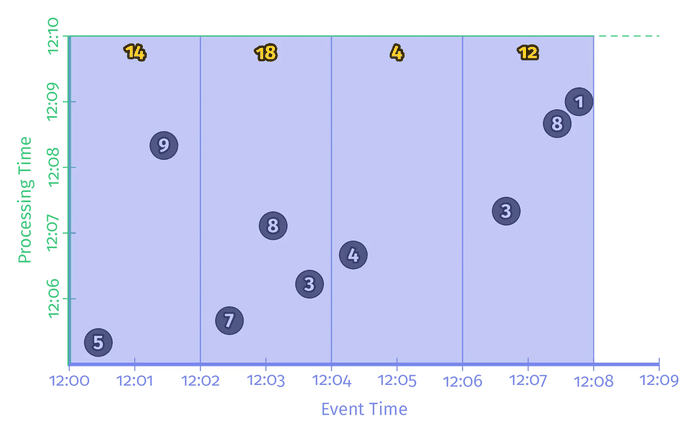
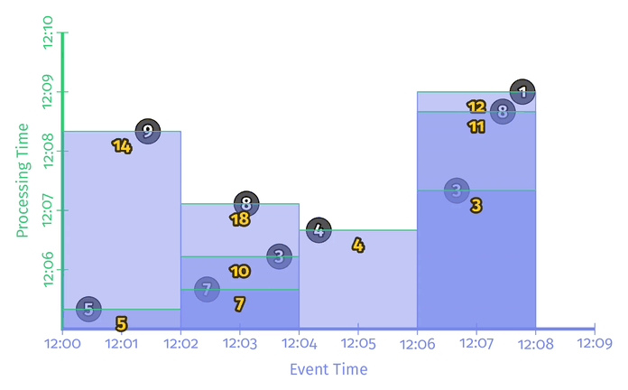
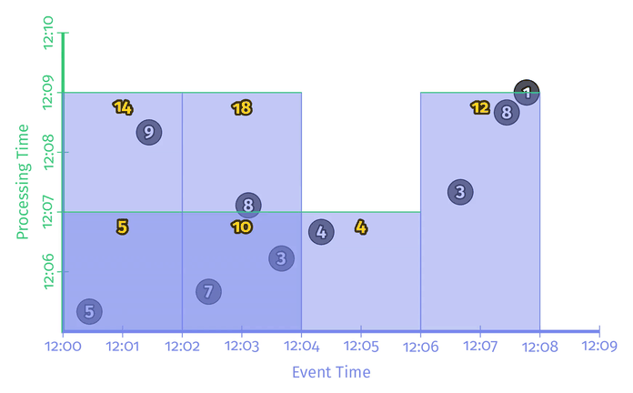
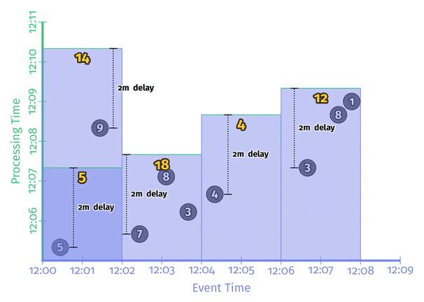
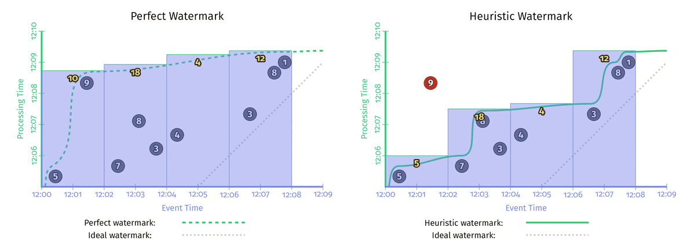
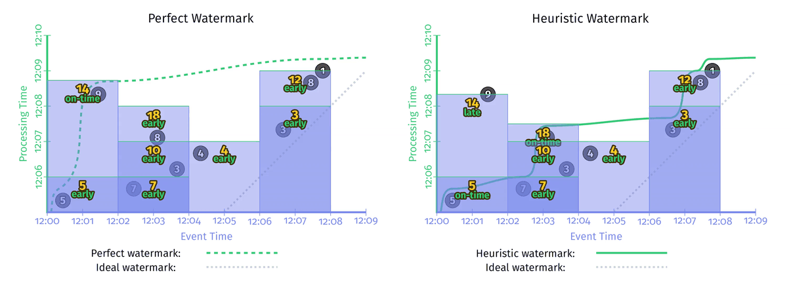
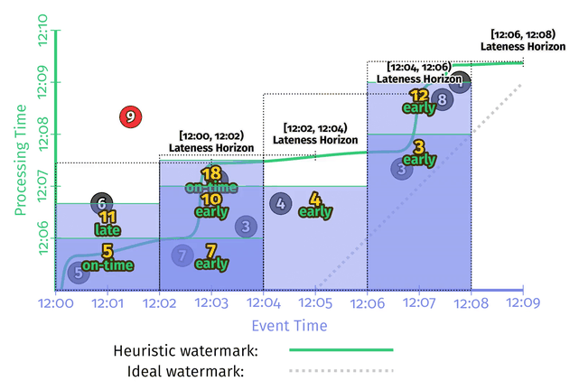
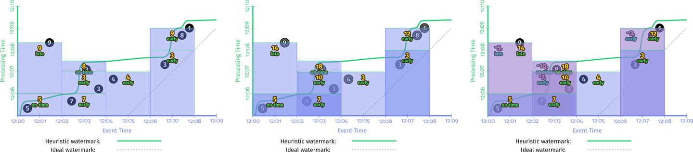

# Chapter 2. The What, Where, When, and How of Data Processing

- **触发 Triggers**：触发器使得窗口处理更为灵活，触发器用于触发一次窗口计算，对同一个窗口可以在每次有数据更新时触发一次从而使结果更加精确
- **水印 Watermarks**：用于标记一次窗口所有数据都已出现，例如带有X事件时间的水印意味着所有时间早于X的事件都已被观测到
- **累积 Accumulation**：累积模式指定了相同窗口的多次触发计算结果之间的关系，这些结果取决于计算方式可能完全无关、或是独立的增量、或是有重叠

## What: Transformations

在本章余下内容中都基于找个例子：计算关键字分组的和，数据集类似如下，事件时间EventTime就是得分发生的时刻，而处理时间ProcTime就是该得分消息被系统观测到的时间：

```text
------------------------------------------------
| Name  | Team  | Score | EventTime | ProcTime |
------------------------------------------------
| Julie | TeamX |     5 |  12:00:26 | 12:05:19 |
| Ed    | TeamX |     9 |  12:01:26 | 12:08:19 |
| Amy   | TeamX |     3 |  12:03:39 | 12:06:13 |
                       ...
```

数据的转换通常可以分为三类：**逐元素**（类似map）和**聚合**（类似reduce），以及混合两种方式的**组合**


在上述累加分数的案例中，采用批处理引擎处理一组数据，则代码如下：

```java
// PCollection is a kind of dataset that can be element-wise parallel processed
PCollection<String> raw = IO.read(...);
PCollection<KV<Team, Integer>> input = raw.apply(new Parser());
PCollection<KV<Team, Integer>> totals = input.apply(Sum.integersPerKey());
```

对于单个关键字的数据处理，批处理引擎按照处理时间的顺序读入数据，并不断计算中间结果，直到获取全部数据后输出如下图：


## Where: Windowing

对于无上限数据集的流数据处理，永远不可能到数据结束了再输出结果，此时就需要通过定义窗口来改变计算的模式

同样上述示例，假如采用fixed 2-minute窗口，则代码如下：

```java
PCollection<KV<Team, Integer>> totals = input
  .apply(Window.into(FixedWindows.of(TWO_MINUTES)))
  .apply(Sum.integersPerKey());
```

与批处理获取全部数据输出一次结果不同，此时根据事件时间分为4个窗口如下图，并注意到第一个窗口首先结果是5，当后面遇到属于该窗口的9时再更新结果为14：



## When: The Wonderful Thing About Triggers Is Triggers Are Wonderful Things

当数据完全时才计算每个窗口的结果在流数据计算中并不现实，采用**触发器triggers来显式要求计算窗口**更为灵活合理

触发器通常可以分为两类以及组合使用这两类：

- **重复更新触发器 Repeated Update Triggers**：每当某窗口有新数据时都会自动更新窗口的计算结果，或是每隔一定时间重复触发一次计算，选择触发计算的频率则是成本和延迟的折中，大多数实际系统都采用这种触发器
- **完整性触发器 Completeness Triggers**：当某窗口的数据**被系统认为已经完全**时才会触发一次计算，实际上就是基于**水印 watermarks**

以上述例子为例采用重复更新触发器，并且每一条记录就更新结果，示例如下：

```java
// update per record
PCollection<KV<Team, Integer>> totals = input
  .apply(Window.into(FixedWindows.of(TWO_MINUTES))
               .triggering(Repeatedly(AfterCount(1))))
  .apply(Sum.integersPerKey());
```



对于这种重复更新触发器来说，其输出结果随着时间进行更多数据进入最终会收敛到真实结果，保证了最终一致性

除了每条数据都更新的重复更新触发器以外，也有每一段延时更新一次的周期更新触发器（也分为**对齐aligned**和**非对齐unaligned**两种如下图，前者可能出现一次性非常多的窗口一起触发导致负载过大，后者由于非对齐就避免了这种峰值负载），而对齐的周期更新触发器实际上就是类似Spark Streaming实现的**微批量microbatching方式**的流处理





虽然保证了最终一致性，但是显然采用周期更新的方式**无法知道数据收敛到正确值的时刻**，最终一致性并不对达成一致性的时刻有要求

## When: Watermarks

水印watermarks代表时间上的一个约束，即此**水印所代表的事件时间之前的所有事件已经被观测到**，保证此水印代表的时刻数据已经完整

水印也可以分为以下两类：

- **完美水印 Perfect Watermarks**：系统对数据有完全的掌握则可以构建完美水印，完美水印代表着数据只可能准时或早到，晚于水印的数据不可能出现，但实践中是不可能的
- **启发式水印 Heuristic Watermarks**：实践中系统无法构建完美水印，退而求其次则是启发式水印，通过尽可能多的信息（分区、是否有序、数据量、时钟等）来猜测数据的完整性情况，并尽力保证精确性，实践中往往效果相当不错

采用水印的方式来计算前述的例子，则代码和过程如下：

```java
PCollection<KV<Team, Integer>> totals = input
  .apply(Window.into(FixedWindows.of(TWO_MINUTES))
               .triggering(AfterWatermark()))
  .apply(Sum.integersPerKey());
```



包括完美水印在内，水印可以有很多种计算方式（从而上图中的绿线形态不同），右侧的启发式水印就没有包含第9个数据点从而导致数据不准确，除了**计算准确性**以外，不同的水印计算方式也影响了**计算延迟**

相比于周期更新触发器，水印提供了窗口内数据是否完整、当前结果是否已经是"水印认可的准确"结果的判断，即**水印触发了计算后，该结果就可以被认为是准确的了**

一个非常常见的使用案例就是外连接outer join，**如何判断是否应该生成一个部分连接partial join**，如果没有水印系统，只能通过一个**延迟处理时间processing-time delay**，当该延迟时间内没有观测到连接对应的数据时就生成一个部分连接结果，显然如果处理时间和事件时间的偏移小于该延迟时，结果时准确的，但一旦超过则结果不准确

水印的问题就来自于计算延迟和准确性这两方面，因此挑选一个水印计算方式使得延迟可接受且准确度尽可能高是非常困难的：

- **太慢 Too slow**：如果某些数据出现意外长的延迟且被系统考虑到了，则后续所有窗口数据就会显著延迟，例如上图中左侧完美水印的计算结果，所有窗口都因为数据9而显著延迟
- **太快 Too fast**：如果水印过快的执行计算（通常是启发式水印），即对数据完整性过于乐观，则有可能丢失数据导致不准确

## When: Early/On-Time/Late Triggers FTW

前述讨论可以看出，重复更新触发器提供了逐步收敛的最终一致性保证但无法给出数据完整性的判断，水印提供了数据完整性的判断但延迟可能很大且正确性可能无法保证，**结合两种方式来提供低延迟、准确完整的计算方式**，即**early/on-time/late触发器**：

- **零或多个过早的计算 early panes**：在水印之前周期更新零次或多次窗口的计算值，从而允许观测数据的不断更新，缓解水印"too slow"的问题
- **单个及时的计算 on-time pane**：在水印时更新一次窗口的计算值，此时系统"相信"数据已经完整
- **零或多个过晚的计算 late panes**：在水印之后继续周期更新零次或多次窗口的计算值（假如是完美水印则不应该有过晚的计算）用于弥补启发式水印下过晚的数据导致不准确的问题，即"too fast"问题

```java
// before the watermark, update the result per minute
// after the watermark, update the result per record
PCollection<KV<Team, Integer>> totals = input
  .apply(Window.into(FixedWindows.of(TWO_MINUTES))
               .triggering(AfterWatermark()
                             .withEarlyFirings(AlignedDelay(ONE_MINUTE))
                             .withLateFirings(AfterCount(1))))
  .apply(Sum.integersPerKey());
```



当组合使用这两种窗口触发方式之后，完美水印和启发式水印产生结果的模式变得非常相似，但对于启发式水印来说依然还存在着一个更严峻的问题：**窗口的生命周期 window lifetime**，在过晚多久以后就可以充分自信的认为数据已经完整并可以回收该窗口？

## When: Allowed Lateness

流数据中数据可能出现任意延迟，而现实中则**不可能永久保存所有窗口的状态**来等待过晚的数据，通常通过定义**最大允许延迟allowed lateness**（也可以认为是垃圾回收周期）来约束窗口的生命周期，显然所有晚于该时间抵达的数据就会被简单抛弃

同样的，最大允许延迟也可以分为以下两方面：

- **定义在处理时间上的允许延迟**，在收到水印后即开始倒计时，这种方式简单直接，但**相对不可靠**，例如系统自身宕机等原因导致数据堆积超出延迟，则会发生以外丢弃已经抵达只是未及时处理的有效数据
- **定义在事件时间上的允许延迟**，在收到水印后根据水印记录的事件时间，当水印的事件时间超出允许延迟后就进行旧窗口的回收，**更为合理可靠**，能更好的应对系统自身的延迟、宕机等故障

对于水印而言通常也可以分为两种：**低水印low watermark**和**高水印high watermark**，前者悲观的记录了系统中**尚未被处理的最旧的时间时间戳**（也是本书默认所指的水印），后者则是乐观的记录了系统**最新记录的事件时间戳**（最近抵达系统的事件的时间时间戳，而不是所有可见事件里最新的时间戳，事件可能乱序）

```java
// before the watermark, update the result per minute
// after the watermark, update the result per record
PCollection<KV<Team, Integer>> totals = input
  .apply(Window.into(FixedWindows.of(TWO_MINUTES))
               .triggering(AfterWatermark()
                             .withEarlyFirings(AlignedDelay(ONE_MINUTE))
                             .withLateFirings(AfterCount(1)))
               .withAllowedLateness(ONE_MINUTE))
  .apply(Sum.integersPerKey());
```

图中的粗黑线标记了当前的处理时间，而细黑虚线则标记了窗口的最大生存时间（事件时间），当水印经过了窗口的最大生存时间时，该窗口的所有状态就被丢弃

例如对于第一个窗口，**系统在处理时刻12:07:30收到了携带有事件时间12:03的水印，此时第一个窗口12:00-12:02（最大延迟1分钟）就可以被回收了**，水印线在每个窗口的截止时间+最大延迟（事件时间）所在高度对应的处理时间即为该窗口在处理时间上的回收时刻，第一个窗口为12:07:30，第二个窗口为12:07:35，第三个窗口为12:08:45，第四个窗口为12:09:30



对于**能够使用完美水印的系统，最大延迟应该为零**，不会有过晚数据的情况发生

## How: Accumulation

采用前述**周期更新+水印+最大允许延迟**的窗口计算方式（即early/on-time/late triggers）会使一个窗口在一段时间内产生多个计算结果，如果处理这些计算结果通常有以下三种模式：

- **丢弃 Discarding**
  每当有新的计算结果生成时，就直接丢弃先前的计算结果，仅保留当下窗口值即**增量**，通常适用于下游处理也会做类似聚合计算的情形，也可以称为**增量模式 Delta mode**
- **累积 Accumulating**
  每个新的计算结果都被累积到先前的结果上，即生成**聚合值**，当下最新的计算结果就是最终结果，也可以称为**值模式 Value mode**
- **累积和收回 Accumulating and retracting**
  每当有新的计算结果生成时，累积到先前的结果产生新的结果，同时再撤销先前的计算结果，即生成**聚合值+增量**，这种方式即可以做到当下最新的计算结果就是最终结果，也可以在下游通过聚合计算获得同样的最新结果，也可以称为**值与撤回模式 Value and Retractions mode**

||Discarding|Accumulating|Accumulating & Retracting|
|:-|:-|:-|:-|
|Pane 1: input=[3]|3|3|3|
|Pane 2: input=[8, 1]|9|12|12, -3|
|Final Value|9|12|12|
|Sum(Panes)|12|15|12|



显然三种方式的效率、代价、延迟不尽相同，因此需要根据具体场合和成本综合选择
