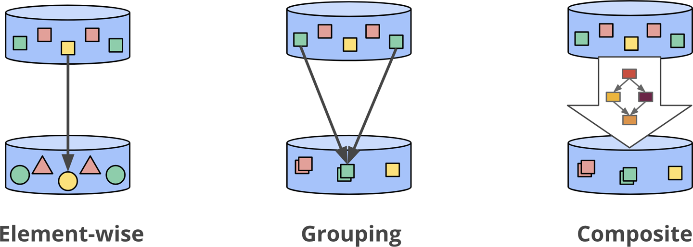
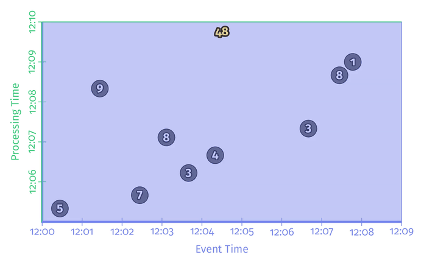

# Chapter 2. The What, Where, When, and How of Data Processing

- **触发 Triggers**：触发器使得窗口处理更为灵活，触发器用于触发一次窗口计算，对同一个窗口可以在每次有数据更新时触发一次从而使结果更加精确
- **水印 Watermarks**：用于标记一次窗口所有数据都已出现，例如带有X事件时间的水印意味着所有时间早于X的事件都已被观测到
- **累积 Accumulation**：累积模式指定了相同窗口的多次触发计算结果之间的关系，这些结果取决于计算方式可能完全无关、或是独立的增量、或是有重叠

## What: Transformations

在本章余下内容中都基于找个例子：计算关键字分组的和，数据集类似如下，事件时间EventTime就是得分发生的时刻，而处理时间ProcTime就是该得分消息被系统观测到的时间：

```text
------------------------------------------------
| Name  | Team  | Score | EventTime | ProcTime |
------------------------------------------------
| Julie | TeamX |     5 |  12:00:26 | 12:05:19 |
| Ed    | TeamX |     9 |  12:01:26 | 12:08:19 |
| Amy   | TeamX |     3 |  12:03:39 | 12:06:13 |
                       ...
```

数据的转换通常可以分为三类：**逐元素**（类似map）和**聚合**（类似reduce），以及混合两种方式的**组合**



在上述累加分数的案例中，代码如下：

```java
// PCollection is a kind of dataset that can be element-wise parallel processed
PCollection<String> raw = IO.read(...);
PCollection<KV<Team, Integer>> input = raw.apply(new Parser());
PCollection<KV<Team, Integer>> totals = input.apply(Sum.integersPerKey());
```



## Where: Windowing

## When: The Wonderful Thing About Triggers Is Triggers Are Wonderful Things

## When: Watermarks

## When: Early/On-Time/Late Triggers FTW

## When: Allowed Lateness

## How: Accumulation
