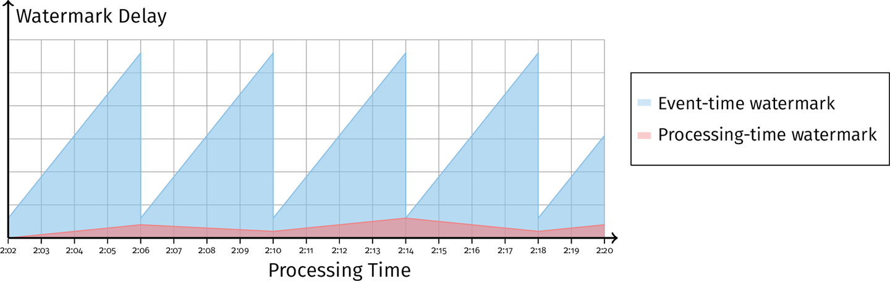

# Chapter 3. Watermarks

## 定义 Definition

对于任意无限数据流而言，最重要的一点就是判断某个事件窗口event-time window是否已经关闭（所有数据是否已经收到），即能够**描述流水线的处理进度**

对于每个事件，假定都有一个**事件时间戳event timestamp**，而所有事件分布在不同的流水线上并行处理，因此其处理顺序无法得到保证，从而一个流水线中各种事件的事件时间可以构成如下的分布：


即少数数据在一开始就能较及时（事件时间与处理时间相差不大）被处理，大量数据在某个延迟后都会被处理，少量数据在延迟较大的时候才会被处理，构成类似正态分布的处理情况

**水印的定义：一个单调递增的时间戳代表了最久未被处理的事件**

> The watermark is a monotonically increasing timestamp of the oldest work not yet completed.

- **完整性 Completeness**：当水印超过某个时间T后，其单调性可以保证此后不会再发生除了过晚数据以外的计算，从而可以确定窗口的关闭
- **可见性 Visibility**：若某个事件卡住了流水线的处理，导致水印无法单调增加，则可以通过被卡住的水印来定位问题

## 源水印的构建 Source Watermark Creation

### 完美水印的构建 Perfect Watermark Creation

完美水印保证了没有过晚数据，从而流水线可以很好的依赖完美水印来确定窗口的关闭，但是完美水印要求对流数据的完全掌握，这在大部分现实系统中都不可能，以下两个例子可以采用完美水印：

1. **入流时间标记 Ingress timestamping**
   流数据系统在初次接触到流入数据时，就将每个事件都标记上一个进入时间作为事件时间，即当前处理时间作为事件时间，从而系统对所有数据有完美的掌握，可以采用完美水印

   其缺点也非常明显，即将处理时间作为事件时间导致了事件本身的真实发生时间直接被忽略，水印与数据是否完整并没有真正的相关性

2. **静态时间顺序的日志处理 Static sets of time-ordered logs**
   静态的时间顺序的日志也可以采用完美水印来处理，例如一个Apache Kafka topic并且是一组固定的分区，每个分区包含了时间单调递增的事件，此时完美水印就是所有分区中持有最小事件时间戳的事件

   这种场景等效于一个**有限乱序处理bounded out-of-order processing**，其乱序的尺度被约束在了已知的有限分区中，但这种系统中的完美水印与事件时间真实相关且有意义

### 启发式水印的构建 Heuristic Watermark Creation

启发式水印无法保证没有过晚数据，因此采用启发式水印的系统还需要有处理过晚数据的机制，一个好的启发式水印可以尽可能减小过晚数据的数量，从而使得水印本身足够充当一个窗口的关闭标志，以下两个例子采用了启发式水印：

1. **动态时间顺序的日志处理 Dynamic sets of time-ordered logs**
   一组动态的结构化日志数据文件，每个单独的文件内所有事件是时间顺序的，但是跨文件的时间顺序是未定义的并且总文件数量也是未定义的，例如一个Apache Kafka topic但是分区数量不定，此时可以采用已知的所有分区中的最小事件时间戳作为启发式水印，并且整合数据增长率、外部带宽占用、网络拓扑结构等信息尽可能提高启发式水印的精度

2. **Google Cloud Pub/Sub**
   采用两条流水线，一条Base真正处理数据，一条Tracking用于生成启发式水印，[见此](#3-google-cloud-pubsub)

对于启发式水印而言，对源数据了解越多，启发式水印的精度越高，因此**没有万能one-size-fits-all的启发式水印构建方法**，另一方面一旦上游观测到了水印，就会将水印扩散到所有下游中，完美/启发式水印被扩散后依然是完美/启发式水印，因此追踪窗口数据的完整性问题就被规约到**在数据源创建尽可能好的水印**问题

## 水印的扩散 Watermark Propagation

通常一个流数据系统上的流水线包含了多个不同的处理阶段，可以定义每个阶段边界的水印如下：

- **输入水印 input watermark**：捕获了该阶段的输入数据进度，对于有上游的阶段来说，输入水印就是**所有上游（分区/实例/分片）的最小值**
- **输出水印 output watermark**：捕获了该阶段自身的数据进度，定义为阶段内**所有非过晚nonlate数据的事件时间以及输入水印的最小值**，可以认为就是以下各种水印中的最小值：
  - **每个源的水印 per-source**：发送阶段
  - **每个外部输入的水印 per-external input**：流水线的外部源
  - **每个状态组件的水印 per-state component**：某个阶段内的处理状态
  - **每个输出缓冲的水印 per-output buffer**：接收阶段

通过引入输入/输出水印，就可以计算出对应阶段引入的延迟，同时一个阶段往往也会引入各种**输出缓存队列供流水线下一级消费**，每个缓存队列也可以有自身的水印，并且所有缓存队列水印中最小的可以认为是该阶段的输出水印，从而细粒度的水印可以更容易的探查流水线stall的位置


### 理解水印扩散 Understanding Watermark Propagation

案例：计算两个场景下（mobile、console）用户session的持续时长，即window length，并且将两个场景的时长输出作为输入计算出固定窗口内的平均session长度

```java
// session expires in 1 minute
PCollection<Double> mobileSessions = IO.read(new MobileInputSource())
    .apply(Window.into(Sessions.withGapDuration(Duration.standardMinutes(1)))
                 .triggering(AtWatermark())
                 .discardingFiredPanes())
    .apply(CalculateWindowLength());

PCollection<Double> consoleSessions = IO.read(new ConsoleInputSource())
    .apply(Window.into(Sessions.withGapDuration(Duration.standardMinutes(1)))
                 .triggering(AtWatermark())
                 .discardingFiredPanes())
    .apply(CalculateWindowLength());

// average session length in fixed windows
PCollection<Double> averageSession = PCollectionList
    .of(mobileSessions)
    .and(consoleSessions)
    .apply(Flatten.pCollections())
    .apply(Window.into(FixedWindows.of(Duration.standardMinutes(2)))
                 .triggering(AtWatermark()))
    .apply(Mean.globally())
```


从计算的过程中有两点值得注意：

- mobile阶段和console阶段的**输出水印不会早于输入水印**，通常会晚一些
- 平均session长度的**输入水印则是上一阶段输出水印中的较小者**，即mobile阶段和console阶段的较小输出水印（注意观察**黄色实线和红蓝色虚线**的关系）

> The downstream input watermark is an alias for the minimum composition of the upstream output watermarks

### 水印扩散与输出时间戳 Watermark Propagation and Output Timestamps

在前述例子中，mobile和console作为第一阶段，其输出结果的时间戳均是窗口结束时间，通常数据输出时可以选择多种时间戳作为输出时间戳，只要处于**合理的范围内即第一个非过晚数据点时间到此后任意时刻**皆可：

- **窗口结束 End of the window**：采用这个时刻就可以安全保证输出的时间戳能够代表窗口的结束，并且这个选择是水印最为平滑的方式

  

- **第一个非过晚数据 The first nonlate element**：采用第一个数据点可以使水印非常保守，但代价是导致水印可能进展受限
  
  

- **某个数据点 A specific element**

从上述例子中可以看出，选择不同的**输出时间戳会直接影响到下一阶段的计算结果**：

- **水印延迟 Watermark delay**：相比于选择窗口结束时间作为输出时间戳作为输出时间戳，选择第一个非过晚数据点会显著减慢水印的进展速度，这是因为选择第一个非过晚数据点后，水印也被约束到该数据点，但是又必须等到该窗口的输入完全时才能进展，**只有某个窗口的数据已经完成并输出时，输出水印（下一阶段的输入水印）才可以有进展**，而如果选择窗口结束时间作为输出则确保了该时刻数据已经完全
- **语义不同 Semantic differences**：注意到不同的选择导致了下一阶段结果的不同，而这无所谓对错，只是计算方式的不同，即语义不同

### 重叠窗口的难题 The Tricky Case of Overlapping Windows

当采用第一个非过晚数据earliest element作为窗口数据且是滑动窗口sliding window时很有**可能导致下游引入额外的延迟**

通常可以采用一些策略来**确保窗口N+1的输出时间戳一定是大于窗口N的输出时间戳**，来减轻这种不必要的延迟

## 百分比水印 Percentile Watermarks

前述的水印均是系统中当前正在处理的最早的事件带有的事件时间戳，而引入**百分比水印可以实现更为灵活的一些触发策略，同时百分比水印可以更快的进展**，前者在出现长尾延迟数据时会非常缓慢


如下图所示，当采用较小的百分比水印可以显著加快输出数据的速度，同时利用过晚数据（代价是较小的百分比数据产生更多的过晚数据）继续更新窗口值，可以确保窗口数据最终都是正确的，**百分比水印提供了平衡延迟和数据准确度的方式**


## 处理时间水印 Processing-Time Watermarks

采用**与事件时间水印完全相同的方式定义处理时间水印**，从而可以使用**处理时间水印来表征数据的处理延迟**，而前者表征了数据延迟，从而可以区分出一个阻塞等待的系统是：

- **在数据上阻塞 data delay**：事件时间水印延迟不断增加，例如固定窗口计算会周期性的延迟事件时间水印，延迟到窗口边界计算一次，如下图：

  

- **在系统自身上阻塞 system stuck**：处理时间水印和事件时间水印延迟均不断增加

## 水印的案例学习 Case Studies

### 1. Google Cloud Dataflow

Google Cloud Dataflow是Apache Beam流水线处理系统

系统的多个worker会分别处理数据集的不同分区，从而对于水印来说就需要聚合计算出所有分区范围（不同的范围处于不同的worker上）内最小的水印，此**水印的聚合计算过程由一个中心化的节点完成centralized aggregator agent**，从而该中心节点就作为**水印的基准single source of truth**

每个worker需要维护一个**租约lease**，确保全局范围内某个key只有一个worker正在处理并更新其持久化状态，中心节点必须只能接收持有租约的worker传达的水印数据

### 2. Apache Flink

Apache Flink是分布式、高性能、高可用流数据系统框架

Flink采用了**流数据带内in-band**水印的追踪和聚合，即水印与常规数据一起在流水线中被处理，如下图：


数据源A与B会周期性生成水印，在Flink中也被称为**快照checkpoint**，例如图中数据源A生成了53快照，此时就保证在该快照后不会再有时间早于53的非过晚数据（正常数据）被生成，从而下游的处理节点收到53快照时就会执行相应的处理并继续更新状态向更下游发出快照

Flink的这种**带内in band水印**有以下优点：

- **减小了水印的扩散延迟**，直接在数据流中的水印延迟远低于需要与中心节点交互的水印
- 没有水印中心节点从而**避免了水印计算的单点故障**
- **固有的可扩展性**，没有中心节点从而可扩展性不受中心节点能力的约束

而另一方面，**带外out-of-band水印**也有其自身优点：

- **单一的基准 single source of truth**，从而更易于统一监控流水线的处理情况
- **允许生成依赖全局信息的水印**，而带内水印导致节点仅有自身的知识**partial view**，难以控制和生成与全局信息有关的水印

### 3. Google Cloud Pub/Sub

Google Cloud Pub/Sub是实时消息real-time messaging服务，可以在任意独立的应用上传递消息，应用通过client主动向Pub/Sub拉取数据Pull并且确认接收Ack，拉取数据时并不能指定而是由Pub/Sub决定提供哪些数据（即可能乱序）

在Pub/Sub系统上设计**启发式的水印**，并且假定数据源有良好的行为：时间戳乱序的数据程度有限（假定限度为10s）

Pub/Sub提供了**最旧未被确认的时间戳**oldest unacknowledged publish timestamp，该时间戳并不是消息的事件时间戳，而是消息被Pub/Sub观测到时附加的时间戳（实际上属于**处理时间戳**）

创建**两个订阅分别为Base和Tracking**，Base订阅会实际消费处理数据而Tracking订阅只会处理元数据并**估计水印watermark estimation**，在这里由于Base订阅会被分布式的拉取数据且涉及多个分片shards，因此仅靠Base订阅无法判断水印位置


从Base订阅中可以获得最旧未被确认的`pt=100`以及相应的**积压事件backlog**，而Tracking订阅则可以根据backlog中积压事件的最小时间戳`et=6`来估计水印的时间戳为`et=6`

Tracking订阅需要满足：

- **比Base订阅足够前**，即至少超出Base订阅的乱序程度
- 足够快速接近实时，没有或几乎**没有积压的情况**


对于**密集的数据流**，这种方式工作良好，可以持续根据Tracking和Base订阅的情况更新水印的估计值；对于**稀疏的数据流**，例如数分钟内都没有抵达新的数据，则可以**直接更新水印到实时**从而确保流水线能够在数据不足时依然正常计算；只要源数据的乱序程度始终在有限的范围内，采用这种方式下这两种数据流都不会出现过晚数据
