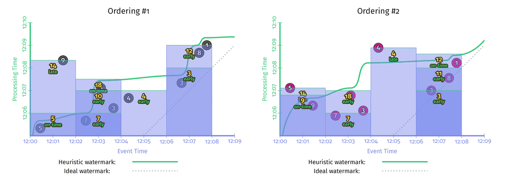
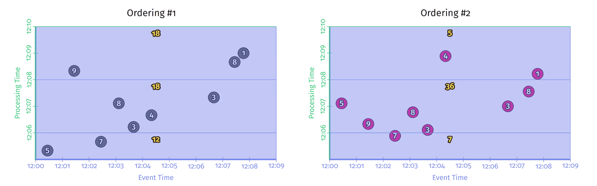
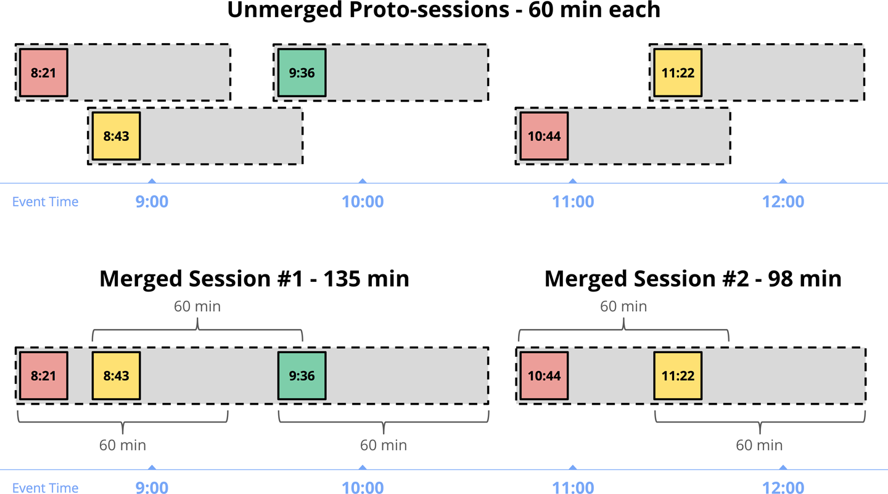
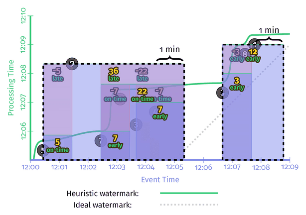
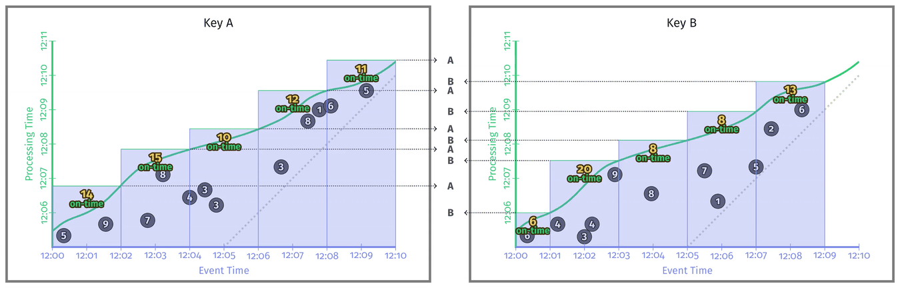
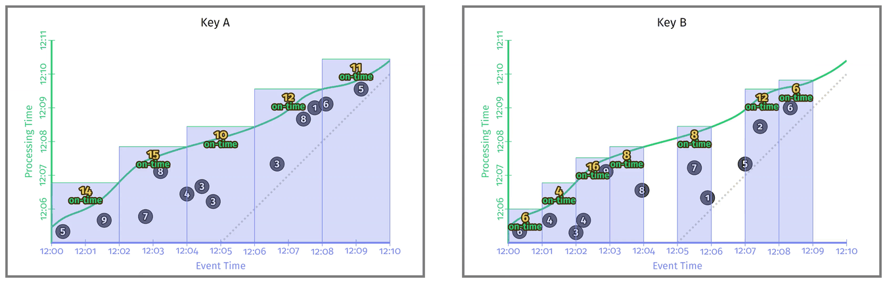
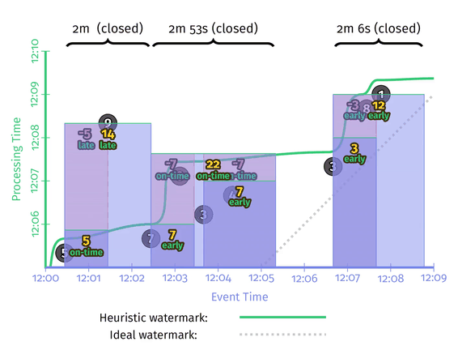

# Chapter 4. Advanced Windowing

## When/Where: Processing-Time Windows

实现处理时间窗口的方式主要有以下两种：

- **触发器 Triggers**：**忽略事件时间**，采用触发器来计算基于处理时间的窗口
- **入流时间 Ingress time**：在数据进入系统时，直接**赋予当前处理时间作为事件时间**，随后依然采用事件时间窗口的计算方式

这两者几乎一样，只有在涉及多个阶段的流水线上计算会略有出入，触发器的方式使得在窗口N的数据有可能在下一阶段出现在窗口N-1或N+1，而采用进入时间的方式则窗口N的数据在下一阶段一定也是窗口N

以两组事件时间完全相同，但是处理时间不同的数据（即**乱序**到达）为例来说明不同的时间计算结果

### 事件时间窗口 Event-Time Windowing

采用**固定窗口、事件时间、启发式水印**计算如下，显然两种顺序的数据得出完全一样的结果，虽然中间过程的early/on-time/late过渡结果不同，但是最终事件时间窗口的结果与处理时间无关



### 处理时间窗口-触发器 Processing-Time Windowing via Triggers

采用**固定周期触发、全局窗口**的方式基于处理时间进行计算，并且每次触发时**丢弃上一次触发计算的结果**

- 采用了周期触发的方式，所以**实际上"窗口"是在Y轴——处理时间上**分割出来的
- **处理时间窗口对数据顺序敏感**，因此两个顺序的数据计算结果不同



### 处理时间窗口-入流时间 Processing-Time Windowing via Ingress Time

采用**固定窗口、完美水印**的方式基于处理时间计算（因为事件时间被处理时间覆盖，此时系统对数据有完全的掌握可以计算出完美水印，[见此](03.Watermarks.md#完美水印的构建-Perfect-Watermark-Creation)），此时当窗口结束时发生一次计算

- 由于处理时间覆盖了事件时间，并且因此可以实现完美水印，计算窗口就**在完美水印线上完成**
- **处理时间窗口对数据顺序敏感**，因此两个顺序的数据计算结果不同
- 此时窗口发生在事件时间轴上（但由于事件时间就是处理时间），也同样对应到相同的处理时间轴上
- 这种处理时间的完美水印，与基于处理时间进行全局窗口固定周期触发的触发器方式，得出**相同的计算结果**


## Where: Session Windows

**会话窗口是一种数据驱动的窗口，其窗口范围是动态且非对齐的**，通常通过一个**会话号session ID**来定义一个独一无二的会话，带有此会话号的数据都会被聚合在同一个会话窗口中；另一种方式是通过**活跃时间**来聚合数据（**基于事件时间**），相邻两个数据间隔在阈值以内时统一算同一个会话，这种方式的处理难度比采用会话号的方式高很多（随着数据的到来，**根据事件时间戳需要合并重叠的窗口**）



```java
PCollection<KV<Team, Integer>> totals = input
    .apply(Window
        .into(Sessions.withGapDuration(ONE_MINUTE))
        .triggering(AfterWatermark()
            .withEarlyFiring(AlignedDelay(ONE_MINUTE))
            .withLateFiring(AfterCount(1))))
    .apply(Sum.integersPerKey());
```



以处理时间的顺序步骤如下：

1. 第一个数据点5出现，被放置在单独的**原始会话窗口proto-session window**中并且窗口的范围就是数据点事件时间+活跃时间1分钟
2. 第二个数据点7出现时，同上处理
3. 水印通过了5所在的原始会话窗口，此时5作为**ontime数据**，所在的原始会话窗口生成一次数据
4. 水印进入了7所在的原始会话窗口，此时7作为**early数据**，所在的原始会话窗口生成一次数据
5. 短时间内数据点3和4连续出现（间隔少于1分钟），被纳入同一个原始会话窗口，并且在数据点4后续1分钟后生成一次数据
6. 数据点8出现后，其对应的原始会话窗口与数据点7，以及数据点3/4所在的两个窗口均重叠，**三个原始会话窗口合并**为一个
7. 数据点9出现时，前几个窗口均合并成最终一个会话窗口，并生成结果，可以注意到这里采用的窗口数据累积方式是[Accumulating and retracting](https://github.com/JasonYuchen/notes/blob/master/streamingsystems/02.What_Where_When_How.md#how-accumulation)

## Where: Custom Windowing

相比于**固定fixed、滑动sliding和会话session窗口**以外，**自定义窗口**类型更加强大，Apache Beam种一个自定义窗口的主要策略包含：

- **窗口赋值 Window Assignment**：赋值策略可以允许每个事件哦都被放置在一个起始窗口中，极端情况下每个元素都是独立的窗口
- **窗口合并 Window Merging (optional)**：合并策略可以允许多个窗口根据规则进行合并

### 固定窗口的衍生 Variations on Fixed Windows

|Assignment|Merging|
|:-:|:-:|
|每个事件基于时间戳、窗口大小、偏移量等放入合适的窗口|不合并|

```java
public class FixedWindows extends WindowFn<Object, IntervalWindow> {
    private final Duration size;
    private final Duration offset;
    public Collection<IntervalWindow> assignWindow(AssignContext c) {
        // calculate the start time of the window this element c belongs to
        long start =
            c.timestamp().getMillis() -
            c.timestamp().plus(size).minus(offset).getMillis() % size.getMillis();
        return Arrays.asList(IntervalWindow(new Instant(start), size));
    }
}
```

- **非对齐固定窗口 Unaligned Fixed Windows**
  对应一组流数据，假如需要根据每个key建立固定窗口进行计算，且默认每个key的窗口都是对齐的，则会出现每一个窗口结束就迎来一次所有窗口计算，**系统性能按窗口时间发生周期性波动**，显然对齐每个key的窗口有利于跨多个key进行同时间窗口的数据对比，但是当没有这种需求时，也可以通过仅对齐相同key的窗口，不同key的窗口**不对齐来均衡时间尺度上系统的负载**

    ```java
    public class UnalignedFixedWindows extends WindowFn<KV<K, V>, IntervalWindow> {
        private final Duration size;
        private final Duration offset;
        public Collection<IntervalWindow> assignWindow(AssignContext c) {
            long perKeyShift = hash(c.element().key()) % size;
            // calculate the start time of the window this element c belongs to with a shift
            long start =
                perKeyShift +
                c.timestamp().getMillis() -
                c.timestamp().plus(size).minus(offset).getMillis() % size.getMillis();
            return Arrays.asList(IntervalWindow(new Instant(start), size));
        }
    }
    ```

  

- **关键字分组的固定窗口 Per-element/key Fixed Windows**
  对**不同的关键字形成的组可以采用不同长度的固定窗口**，通常会提供一些选择，例如30分钟、60分钟、90分钟三种可选长度，**任意长度在实践中难以做到**

    ```java
    public class PerElementFixedWindows<T extends HasWindowSize> extends WindowFn<T, IntervalWindow> {
        // size is tunable
        private final Duration offset;
        public Collection<IntervalWindow> assignWindow(AssignContext c) {
            Duration size = c.element().getWindowSize(); // per-element/key window size
            // calculate the start time of the window this element c belongs to using per-element window size
            long start =
                c.timestamp().getMillis() -
                c.timestamp().plus(size).minus(offset).getMillis() % size.getMillis();
        }
    }
    ```
  
  

### 会话窗口的衍生 Variations on Session Windows

|Assignment|Merging|
|:-:|:-:|
|每个事件初始时放入原始会话窗口，该窗口起始于事件时间戳，终止于**活跃时间gap duration**后|合并时，所有窗口会被排序，存在重叠的窗口就会被合并|

```java
public class Sessions extends WindowFn<Object, IntervalWindow> {
    private final Duration gap;
    public Collection<IntervalWindow> assignWindows(AssignContext c) {
        return Arrays.asList(new IntervalWindow(c.timestamp(), gap));
    }
    public void mergeWindows(MergeContext c) {
        // 1. Sort
        List<IntervalWindow> sortedWindows = new ArrayList<>();
        for (IntervalWindow window : c.windows()) {
            sortedWindows.add(window);
        }
        Collections.sort(sortedWindows);

        // 2. Merge
        List<MergeCandidate> merges = new ArrayList<>();
        MergeCandidate current = new MergeCandidate();
        for (IntervalWindow window : sortedWindows) {
            if (current.intersects(window)) {
                current.add(window);
            } else {
                merges.add(current);
                current = new MergeCandidate(window);
            }
        }
        merges.add(current);
        for (MergeCandidate merge : merges) {
            merge.apply(c);
        }
    }
}
```

- **受限长度的会话窗口 Bounded Sessions**
  通常系统不会允许任意长度的会话，因此会话窗口的长度不能超过一个限定值，若超过则按两个独立的窗口计算

    ```java
    public class BoundedSessions extends WindowFn<Object, IntervalWindow> {
        private final Duration gap;
        private final Duration maxSize;
        public Collection<IntervalWindow> assignWindows(AssignContext c) {
            return Arrays.asList(new IntervalWindow(c.timestamp(), gap));
        }
        public void mergeWindows(MergeContext c) {
            List<IntervalWindow> sortedWindows = new ArrayList<>();
            for (IntervalWindow window : c.windows()) {
                sortedWindows.add(window);
            }
            Collections.sort(sortedWindows);
            List<MergeCandidate> merges = new ArrayList<>();
            MergeCandidate current = new MergeCandidate();
            for (IntervalWindow window : sortedWindows) {
                MergeCandidate next = new MergeCandidate(window);
                if (current.intersects(window)) {
                    current.add(window);
                    // current proto-window starts from the first sub window till the last sub window
                    if (new Duration(current.front().start(), current.back().end()) <= (maxSize - gap)) {
                        continue;
                    }
                    // current window exceeds bounds, so flush and move to next
                    next = new MergeCandidate();
                }
                merges.add(current);
                current = new MergeCandidate(window);
            }
            merges.add(current);
            for (MergeCandidate merge : merges) {
                merge.apply(c);
            }
        }
    }
    ```

    

### 没有银弹 One Size Does Not Fit All

从上述三个实例：非对齐固定窗口 unaligned fixed windows，关键字分组固定窗口 per-element/key fixed windows，受限长度会话窗口 bounded sessions，可以看出，不同的场合下有不一样合适的窗口实现，**支持自定义窗口（Assignment，Merging）的系统可以非常简单轻松的实现各种不同类型的窗口**
