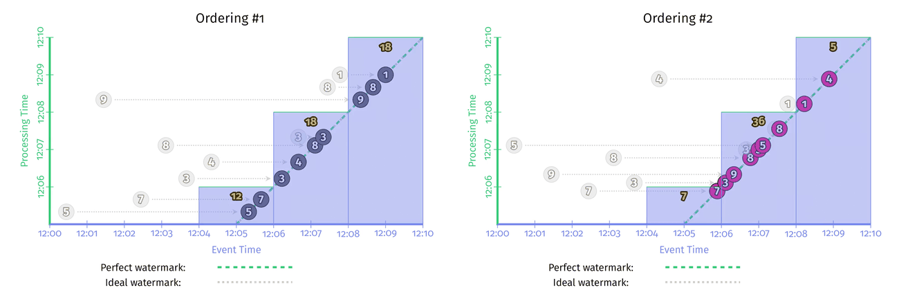

# Chapter 4. Advanced Windowing

## When/Where: Processing-Time Windows

实现处理时间窗口的方式主要有以下两种：

- **触发器 Triggers**：**忽略事件时间**，采用触发器来计算基于处理时间的窗口
- **入流时间 Ingress time**：在数据进入系统时，直接**赋予当前处理时间作为事件时间**，随后依然采用事件时间窗口的计算方式

这两者几乎一样，只有在涉及多个阶段的流水线上计算会略有出入，触发器的方式使得在窗口N的数据有可能在下一阶段出现在窗口N-1或N+1，而采用进入时间的方式则窗口N的数据在下一阶段一定也是窗口N

以两组事件时间完全相同，但是处理时间不同的数据（即**乱序**到达）为例来说明不同的时间计算结果

### 事件时间窗口 Event-Time Windowing

采用**固定窗口、事件时间、启发式水印**计算如下，显然两种顺序的数据得出完全一样的结果，虽然中间过程的early/on-time/late过渡结果不同，但是最终事件时间窗口的结果与处理时间无关


### 处理时间窗口-触发器 Processing-Time Windowing via Triggers

采用**固定周期触发、全局窗口**的方式基于处理时间进行计算，并且每次触发时**丢弃上一次触发计算的结果**

- 采用了周期触发的方式，所以**实际上"窗口"是在Y轴——处理时间上**分割出来的
- **处理时间窗口对数据顺序敏感**，因此两个顺序的数据计算结果不同


### 处理时间窗口-入流时间 Processing-Time Windowing via Ingress Time

采用**固定窗口、完美水印**的方式基于处理时间计算（因为事件时间被处理时间覆盖，此时系统对数据有完全的掌握可以计算出完美水印，[见此](03.Watermarks.md#完美水印的构建-Perfect-Watermark-Creation)），此时当窗口结束时发生一次计算

- 由于处理时间覆盖了事件时间，并且因此可以实现完美水印，计算窗口就**在完美水印线上完成**
- **处理时间窗口对数据顺序敏感**，因此两个顺序的数据计算结果不同
- 此时窗口发生在事件时间轴上（但由于事件时间就是处理时间），也同样对应到相同的处理时间轴上
- 这种处理时间的完美水印，与基于处理时间进行全局窗口固定周期触发的触发器方式，得出**相同的计算结果**



## Where: Session Windows

**会话窗口是一种数据驱动的窗口，其窗口范围是动态且非对齐的**，通常通过一个**会话号session ID**来定义一个独一无二的会话，带有此会话号的数据都会被聚合在同一个会话窗口中；另一种方式是通过**活跃时间**来聚合数据（**基于事件时间**），相邻两个数据间隔在阈值以内时统一算同一个会话，这种方式的处理难度比采用会话号的方式高很多（随着数据的到来，**根据事件时间戳需要合并重叠的窗口**）


```java
PCollection<KV<Team, Integer>> totals = input
    .apply(Window
        .into(Sessions.withGapDuration(ONE_MINUTE))
        .triggering(AfterWatermark()
            .withEarlyFiring(AlignedDelay(ONE_MINUTE))
            .withLateFiring(AfterCount(1))))
    .apply(Sum.integersPerKey());
```


以处理时间的顺序步骤如下：

1. 第一个数据点5出现，被放置在单独的**原始会话窗口proto-session window**中并且窗口的范围就是数据点事件时间+活跃时间1分钟
2. 第二个数据点7出现时，同上处理
3. 水印通过了5所在的原始会话窗口，此时5作为**ontime数据**，所在的原始会话窗口生成一次数据
4. 水印进入了7所在的原始会话窗口，此时7作为**early数据**，所在的原始会话窗口生成一次数据
5. 短时间内数据点3和4连续出现（间隔少于1分钟），被纳入同一个原始会话窗口，并且在数据点4后续1分钟后生成一次数据
6. 数据点8出现后，其对应的原始会话窗口与数据点7，以及数据点3/4所在的两个窗口均重叠，**三个原始会话窗口合并**为一个
7. 数据点9出现时，前几个窗口均合并成最终一个会话窗口，并生成结果，可以注意到这里采用的窗口数据累积方式是[Accumulating and retracting](https://github.com/JasonYuchen/notes/blob/master/streamingsystems/02.What_Where_When_How.md#how-accumulation)
