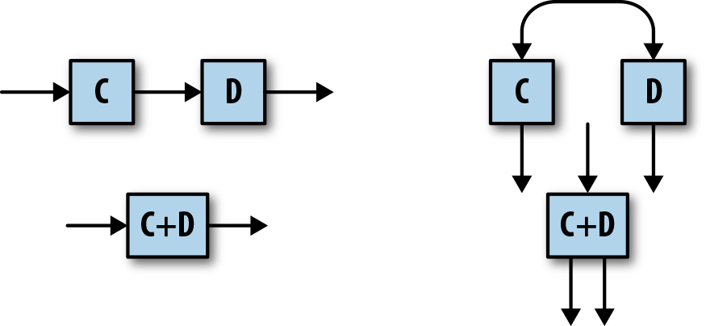
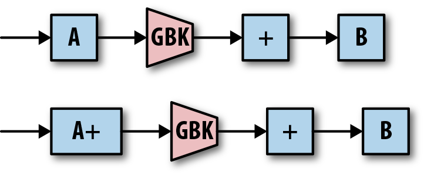

# Chapter 5. Exactly-Once and Side Effects

## 为什么要恰好一次 Why Exactly Once Matters

在流数据无法做到精确计算结果时即没有恰好一次时，往往会采用**Lambda架构：双写数据**，批处理计算出精确结果但延迟高，流数据计算出粗略结果但延迟低，这种架构带来了更多的麻烦：

- 不准确 Inaccuracy
- 不一致 Inconsistency
- 复杂 Complexity
- 不可预测 Unpredictability
- 延迟 Latency

本章介绍了Google Cloud Dataflow实现恰好一次的策略，基于Google Cloud Pub/Sub，后者是一种多发布多订阅消息系统，并且**不保证传递顺序、不保证同一个任务传递给同一个接收者**

## 精确性和完整性 Accuracy vs. Completeness

通常在处理数据时，我们总是希望每一条数据既不被丢弃也不会重复，即**恰好一次exactly-once**，在[流数据处理系统的流程中](https://github.com/JasonYuchen/notes/blob/master/streamingsystems/02.What_Where_When_How.md#when-allowed-lateness)，一个窗口内（包括early/on-time/late）的数据应该得到恰好一次处理，而超过了最大允许延迟后的数据就被显式丢弃

- **副作用 Side Effects**
  在灵活的流处理系统实现中，往往允许用户自定义一些处理逻辑custom transformation，当处理数据时就会调用自定义处理逻辑，而调用次数并不一定是恰好一次

  通常为了容忍worker宕机，每一条数据都会**至少处理一次at-least-once**，此时如果自定义逻辑包含**非幂等nonidempotent**的部分，就会产生副作用
  
  实践中这种非幂等的副作用往往是必然发生的，流数据系统末端最终需要**将结果输出给外部系统，而这种结果输出不是幂等的**，因此外部系统在首次收到流数据系统的输出结果时往往需要通过一些业务上的知识进行结果的去重处理，即幂等化

- **问题定义 Problem Definition**
  **端到端恰好一次end-to-end exactly once**保证由以下三个部分分别恰好一次处理来实现：
  - **Shuffle**：在流数据处理系统中，数据往往会根据需要往返多个不同的分布式节点，例如GroupByKey操作，这种数据根据需要重组分区归类的过程就是**shuffle**，显然在shuffle中需要保证每个数据只会被shuffle一次
  - **Sources**：数据源需要保证产生的数据也是不会重复的，每一条数据都是独一无二的
  - **Sink**：数据终点同样也需要保证每个数据的处理结果只会产生一次

## shuffle恰好一次 Ensuring Exactly Once in Shuffle

分布式系统中通常使用Remote Procedure Call, RPC进行通信，包括传输数据，而RPC有可能因为各种原因失败，为了避免丢失RPC需要有重试的机制来确保可靠传递数据，实现**至少一次at-least-once成功传递数据**

引入重试之后，同样有可能因为各种原因导致表面上失败的RPC实际上成功传递了数据，例如超时引起了重试而前序的RPC实际上成功了，此时相当于传递了多份相同的数据，因此RPC需要有去重的机制来确保数据只有一份，实现**至多一次at-most-once成功传递数据**，这种去重机制实际上非常简单，只需要**每个数据记录都带有一个唯一的标签unique identifer**，当收到的数据标签此前已经存在时（例如构建一个KV存储，K就是UID，V就是具体数据，从而对相同的K执行任意次`set(K, V)`结果是相同的，即**采用幂等操作将非幂等操作幂等化**），就可以直接丢弃这份重复数据

引入**重试upstream backup**和**去重deduplication**后，shuffle就可以做到恰好一次

## 确定性 Addressing Determinism

引入重试和去重尚未解决用户自定义逻辑的不确定性带来的副作用，并且在实践中有些场合需要包含不确定性（例如需要随机处理）的自定义逻辑，而另外也有可能是用户没有意识到自定义逻辑隐含了不确定性

通过使用**快照checkpointing**可以使得不确定的处理变为**等效确定effectively deterministic**，每一个transform（包括用户的custom transformation）后的结果都在**发往下一个阶段前先与UID一起快照保存**在持久化存储中，随后当**重试时首先检查UID是否已经有快照保存的结果**，若有则直接返回先前的结果，本质原理和KV存储的幂等性使非幂等操作幂等化相同

## 性能 Performance

为了达成恰好一次处理，每个数据都会携带相应的UID，并且当处理结束时输出结果也会被快照保存到持久存储上，而整个过程会引入额外的开销，因此需要尽可能优化I/O

### 图优化 Graph Optimization

流数据处理系统往往分为多个阶段/节点处理数据，可以从处理图（类似Spark lineage的DAG）应用两种优化：

- **融合处理 Fusion**
  将逻辑上的多个步骤合并成单个执行阶段，从而显著减小I/O次数并简化执行流

  

- **合并 Combiner Lifting**
  优化满足**结合律associative**和**交换律commutative**的聚合操作（例如`Count`和`Sum`），在局部先执行部分聚合，随后再将数据发送给主要的聚合算子，即**部分聚合提前执行combiner lifting**，例如下游节点是`Sum`则上游每个节点都先执行局部`Sum`在发送给下游而不是每个数据都发送给下游

  

### 布隆过滤器 Bloom Filters

对于一个稳定运行状况良好的流处理系统来说，数据重传导致重复的可能性非常低，而每一条数据都必须通过UID来确认是独一无二的，因此能够**高效查找UID是否重复**是提升流数据系统正常情况下的吞吐量的核心

**采用布隆过滤器进行UID的查找**，当一条数据到来时首先进行布隆过滤器查找，**假如不存在则可以确保不存在**进而避免更昂贵的从持久化存储中查找，并加入到布隆过滤器中，**假如存在则有一定概率概率存在**，此时再去持久化存储中查找，如前所述正常运行的情况下重复的概率非常低，因此最后需要去持久化存储中查找的概率极低

随着数据处理的进行，**布隆过滤器中数据越多则假阳性率越高**（布隆过滤器认为存在但实际不存在），此时需要重建布隆过滤器，通常可以**对布隆过滤器按时间分组**，例如每隔10分组一个新的布隆过滤器，系统对每条数据进行对应的布隆过滤器查找，并在一段时间后**垃圾回收过时的布隆过滤器**

### 垃圾回收 Garbage Collection

每个节点都维护了UID的持久化存储，而对于过时的数据就可以及时垃圾回收

- 方式一：对每条数据都带上**严格单调递增的序列号**（例如UID采用单调递增的序列号），则节点可以记录**当前未见到的最小序列号**，在此序列号之前的数据已经见到过了则可以安全垃圾回收，并且后续有任何小于此序列号的数据都一定时重复的，不需要查询持久化存储而直接丢弃
- 方式二：在前述使用布隆过滤器时对每条数据都加上了抵达节点的时间戳（处理时间processing timestamp），则此时节点就可以**通过该抵达时间戳计算出一个垃圾回收水印，从而对于水印时间之前的UID持久化存储就可以直接垃圾回收**，采用处理时间水印的额外好处是可以[观测到系统的处理延迟](https://github.com/JasonYuchen/notes/blob/master/streamingsystems/03.Watermarks.md#%E5%A4%84%E7%90%86%E6%97%B6%E9%97%B4%E6%B0%B4%E5%8D%B0-processing-time-watermarks)

在一些情况下（例如**网络残留network remnants**使得一些数据在网络中卡了任意长的时间而未被丢弃，随后又突然出现在系统中）可能出现数据延迟到水印后才抵达系统，但是当下的设计中只有当数据抵达了系统才会继续处理从而水印才有可能继续前进，**只要当水印继续前进后出现的过旧数据，显然已经被处理过了因此可以简单丢弃**

## source恰好一次 Exactly Once in Sources

对于文件数据源来说，数据是静态且固定顺序的，因此**每次读取都是确定性的且没有任何副作用**，例如Apache Kafka也提供类似的保证，每一个Kafka topic下分成固定的分区partitions且每个分区内的顺序是确定性的，因此从Kafka同一个partition中顺序读取就和从文件读取一样确定性

另外例如Google Cloud Pub/Sub则是非确定性的数据源，当订阅者处理失败时，Pub/Sub会重新发布这条数据到任意一个订阅者，接收的订阅者以及接受顺序均没有保证，因此**数据源需要提供每条数据的UID**从而允许流数据系统可以根据UID进行去重处理

数据源的恰好一次要求数据源的**读取是确定性的，或者对每一条数据提供UID**

## sink恰好一次 Exactly Once in Sinks

从上述讨论来看，sink作为一个外部系统是无法避免数据重复的可能性的，因此最佳方式是将**sink处理的操作幂等化**，例如set/overwrite一个数据库的值就是幂等的操作

另一方面例如**窗口操作也不是幂等的**，当某个窗口收到`e0, e1, e2`数据并完成计算发出结果后而确认处理完前（假如顺序是`process->output->commit`则是output后而commit前）节点宕机，当重启后重新计算此时额外收到了`e3`，就会出现计算`e0, e1, e2, e3`的数据并发出，此时**前后两次相同窗口的输出结果并不相同，因此并不是去重能解决的问题**，此时通过reshuffle由Dataflow确保在reshuffle前只有一种结果可以穿越shuffle边界

> Dataflow currently guarantees that **only one version of a DoFn’s output** can make it past a shuffle boundary

若在系统中生成UID再传递给sink，则在**生成UID的过程后也要加上reshuffle过程**，利用reshuffle来确保提供给sink的操作是幂等的，同一条数据任意次重试都已经带有不变的UID，否则例如这次记录A进入sink时根据时间戳分配了`UID_1234`，而需要重试重新传递记录A时就有可能给记录A分配任意其他UID，使用reshuffle使得UID分配后就是确定不变的

注意：实际上**只要保证结果的输出是稳定的，例如UID并不随机**而是根据数据摘要而成，而并不一定需要reshuffle

## 案例 Use Cases

### 1. Example Source: Cloud Pub/Sub

Cloud Pub/Sub系统支持多个生产者在named topic上产生数据，多个消费者订阅named topic并且每次收到数据要及时ACK，同时一次数据传递失败会导致Pub/Sub随机挑选另一个worker进行数据传递且顺序也不保证一致，但每个数据都会携带UID

在Dataflow中**通过`hash(UID)`来指定worker**，从而确保最终处理同一个数据的worker是同一条，并且通过UID进行去重来保证恰好一次

### 2. Example Sink: Files

**通过`rename`这一确定性的方法**实现文件数据的恰好一次输出exactly-once sink，即数据只输出到临时文件，待内容完整后再重命名到最终文件，此时无论中途失败多少次，只有最后成功的临时文件会成功成为最终文件（etcd的Raft中实现WAL的compaction也是采用了rename）：

```java
c   // 每个记录带上随机的shard ID
    .apply("AttachShard", WithKeys.of(new RandomShardingKey(getNumShards())))
    // 根据shard ID分组聚合所有数据
    .apply("GroupByShard", GroupByKey.<..>create())
    // 对每个窗口，每个shard的元素都写入一个临时文件，注意这个输出操作具有非确定性的副作用
    // 例如出现意外重启多次，则会产生多个不同名字的随机临时文件，但是只会有一个传递到后续流程
    .apply("WriteTempFile", ParDo.of(new DoFn<..> {
        @ProcessElement
        public void processElement(ProcessContext c, BoundedWindow window) {
            // 将c.element()输出到一个临时文件
            c.output(new FileResult());
        }}))
    // 将一系列文件组合成singleton key
    .apply("AttachSingletonKey", WithKeys.<..>of((Void)null))
    .apply("FinalizeGroupByKey", GroupByKey.<..>create())
    // 原子的重命名rename，此操作是幂等的
    .apply("Finalize", ParDo.of(new DoFn<.., Void> {
        @ProcessElement
        public void processElement(ProcessContext c) {
            for (FileResult result : c.element()) {
                rename(result.getTemporaryFileName(), result.getFinalFilename());
            }
        }}));
```

### 3. Example Sink: Google BigQuery

```java
c   // 对每个数据带上一个UID
    .apply(new DoFn<> {
        @ProcessElement
        public void processElement(ProcessContext c) {
            String uid = UUID.randomUUID().toString();
            c.output(KV.of(ThreadLocalRandom.current().nextInt(0, 50), new RecordWithId(c.element(), uid)));
        }})
    // reshuffle所有数据，从而施加的uid就稳定（如果没有这一步，则如果出现意外，重启后同一条数据可能带有两次不同的随机uid
    .apply(Reshuffle.<Integer, RecordWithId>of())
    // 此时uid已经稳定，可以将数据输入BigQuery，并且后者会确保去重因此数据可以任意次输入
    .apply(ParDo.of(new DoFn<..> {
        @ProcessElement
        public void processElement(ProcessContext c) {
            insertIntoBigQuery(c.element().record(), c.element().id());
        }}));
```

## 其它系统 Other Systems

### 1. Apache Spark Streaming

Spark Streaming采用**微批量microbatch**的架构处理连续的流数据，将连续的数据表达为连续的RDD，即每个微批量就是一个RDD，从而可以依赖批量处理batch processing天然的exactly-once（从MapReduce开始，对于批处理的shuffle已经非常成熟，但是代价就是延迟更高）

Spark假定所有操作都是幂等的，并且会视情况进行重放数据replay，通过快照checkpoint来减少重放的代价，具体细节可以参考[MIT 6.824对Spark的分析](https://github.com/JasonYuchen/notes/blob/master/mit6.824/15.Big_Data_Spark.md)

### 2. Apache Flink

Flink通过周期性计算**全局一致性快照consistent snapshot**来保证恰好一致性（**Chandy-Lamport分布式快照算法**），该快照会伴随着流数据（带内快照in-band）

Flink的快照是通过数据源生成**带序号快照标签numbered snapshot marker**插入到六数据中，每个节点/算子收到上游的所有标签后，就会将当前的状态持久化保存，随后将标签扩散给下游；当所有节点/算子都完成某次序号的快照时，完整的全局一致性快照完成，而正在传输过程中**in-flight的数据并不需要被包括在快照中**，Flink采用基于TCP的有序可靠消息传达

当任意节点宕机时，全局都会**回滚到各节点保存的上一次全局一致性快照的状态**，由于Flink静态分配任务给固定的节点，因此任意连接出错都可以基于上一条成功数据的**序列号**重建连接并且相应的任务会由同一个发送者发送，注意这些序列号是每个连接独立的，与快照序号无关

由于Flink在任意时刻都可能发生回滚，因此未在快照中的状态都是易变的tentative，从而**对于非确定性的sink来说必须等到一次快照才能将快照内的新数据发送给外界**，否则如果出现回滚就可能出现重复传递（显然对于**确定性的sink就不必等带待快照**），通常这种等待会增加sink处向外输出结果的延迟，但是总的而言**Flink延迟依然低于Spark Streaming**因为后者在每一个阶段都引入了微批量的延迟

相比于Dataflow，Flink采取的策略更为简洁，这是因为Flink有额外的假设：

- **故障是少见的**，因为每次故障会引起全局节点回滚，极大影响系统的延迟和处理能力，**平均故障时间必须少于快照时间**，否则的话系统总是在尝试进行快照而无法处理任何数据
- **快照的生成代价不高**，生成较快，从而不会引入过多的延迟
- **任务是静态分配给worker的**（至少在一次snapshot周期内），从而简化了恰好一次的设计，因为重建连接后发布者和接收者以及顺序都没有改变
