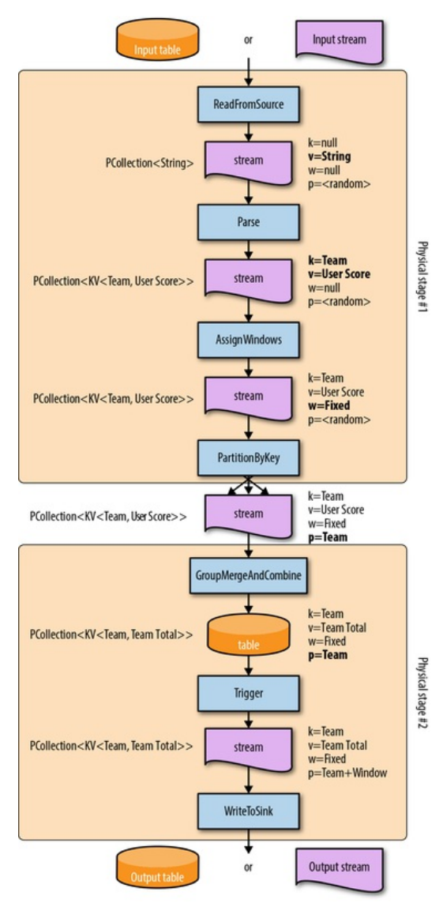

# Chapter 6. Streams and Tables

## 流数据和表 Stream-and-Table Basics

在数据库中，[数据库的日志就是一种描述表变化的流，而表也可以认为是这种流的聚合视图](https://github.com/JasonYuchen/notes/blob/master/ddia/EX.Making_Sense_of_Stream_Processing.md)

- **Streams -> Tables：对变化流的聚合结果就是一张表**
- **Tables -> Streams：观测表的一系列变化产生的就是流**

## 批处理和流表 Batch Processing vs. Streams and Tables

### MapReduce

在MapReduce这个批处理模型中，Map阶段读取一个静态表的数据，并对每一个元素执行映射操作最后将结果写入本地磁盘：

```text
[table] -> MapRead -> [stream] -> Map -> [stream] -> MapWrite -> [table]
```

Reduce阶段读取所有Map写入的数据表并生成类似流的方式让Reduce处理，最后汇总再将结果写入本地磁盘：

```text
[table] -> ReduceRead -> [stream] -> Reduce -> [stream] -> ReduceWrite -> [table]
```

从流和表的角度来看，MapReduce这样的**批处理框架实际上也就是在处理流和表的互相转换**，并在其中执行用户定义的处理方式

## What, Where, When, and How in a Streams and Tables World

### What: Transformations

- **非分组 Nongrouping**
  接收流式的数据，并产生转换后的流数据，`stream -> Transform -> stream`，例如过滤filter等
- **分组 Grouping**
  接收流式的数据，并分组处理后产生表，`stream -> Transform -> table`，例如聚合aggregation等


假如要读取的状态数据就是最后一步的结果时，简单存储在表中直接读取也是可行，但是如果并非最后一步而是整个流水线的中间环节，则`stream -> Trasnform -> table -> Read -> stream`这种典型环节中发生了不必要的stream/table之间的转换，而更应该**直接从stream中读取所需要的结果，即Log as a Database**

### Where: Windowing

在流数据和表stream/table场景中，**窗口计算就意味着流-表转换stream-to-table conversion**，主要有以下两点考量：

- **窗口赋值 Window Assignment**
  将一条数据记录放入一个或多个窗口内，从而对应的窗口就组合了用户对该记录指定的key，隐式构建了一个**复合键composite key**用于分组

  对于将一条数据记录放入多个窗口的情况（例如滑动窗口可能在多个窗口包含同一条数据），理论上应该是**每个窗口都含有独立的一条相同数据但拥有不同的复合键**，底层系统在实现上可以采用一些优化方式仅保留同一份数据记录
- **窗口合并 Window Merging**
  适用在动态、数据驱动的窗口类型中，例如会话窗口session windows

图中在流数据窗口处理后相当于在table中产生了4个分组对应4个窗口


当需要考虑窗口合并时，将数据记录分组处理时就必须考虑到所有可能被合并的窗口，因此系统通常**不会直接采用key/window这样简单的复合键**，而是**采用层次性的复合键并使用用户定义的key作为根节点，具体的window作为子节点**，从而每个自定义key能够合并的窗口都在用户定义的key根节点之下：需要执行窗口合并时，系统**首先根据用户自定义的key进行分组，随后在每个key组内再合并具体的窗口**

合并窗口的另一个难点在于当**发生合并时必须更新table**，系统也必须对合并前的旧窗口进行处理，即被合并的窗口值被删除，并添加合并后的新窗口值到table中（由于这种修改"过去"的合并操作**难保证强一致性**，非常多现实系统还会采用**atomicity/parallelization作为key而不是key+window**）

> **commit deletes** for old unmerged windows in conjunction with an insert for the new merged window into the table
>
> When window merging becomes involved, that composite key is treated
more like a hierarchical key, allowing the system to handle **the nasty business
of grouping by key, figuring out window merges within that key, and then atomically applying all the necessary mutations to the corresponding table** for
us. Hooray for layers of abstraction!

### When: Triggers

在流数据的场景中，触发器triggers会进行窗口数据的计算，而在流数据和表场景下，**触发器本质上和数据库的触发器（触发从而修改表内容）是相同的，即根据事件更新数据**，采用per-record trigger的处理流程示例如下：


显然此前章节提到的[early/on-time/late triggers](https://github.com/JasonYuchen/notes/blob/master/streamingsystems/02.What_Where_When_How.md#when-earlyon-timelate-triggers-ftw)也可以适用于此：


`TODO: triggers in batch processing system`

### How: Accumulation

第二章中提到了三种累积模式[discarding/accumulating/accumulating and retracting](https://github.com/JasonYuchen/notes/blob/master/streamingsystems/02.What_Where_When_How.md#how-accumulation)显然也可以直接适用在流数据和表的场景中

采用队伍积分案例来展示整个过程：

```java
PCollection<String> raw = IO.read();
PCollection<KV<Team, Integer>> input = raw.apply(new ParseFn());
PCollection<KV<Team, Integer>> totals = input
    .apply(Window.into(FixedWindows.of(TWO_MINUTES))
                 .triggering(AfterWatermark().withEarlyFirings(AlignedDelay(ONE_MINUTE))
                                             .withLateFirings(AfterCount(1))))
    .apply(Sum.integersPerKey());
```



**物理执行计划中的要点：**

- **物理阶段和融合 Physical stages and fusion**
  通常每个逻辑阶段都映射到单独的物理阶段非常低效，非常多的优化会在生成物理执行计划时应用，最典型的就是尽可能融合更多的逻辑执行阶段到一个物理执行阶段中
- **键、值、窗口、分区 Keys, Values, Windows, Partitioning**

**逻辑执行计划中的环节及相应的物理阶段：**

- `ReadFromSource`
  读取raw数据，没有K，V只是字符串，没有W，没有分区P或任意分区P
- `Parse`
  解析raw数据，从而生成键值对K-V，此时没有W，没有分区或任意分区P
- `Window+Trigger`
  该逻辑操作实际上对应了多个顺序执行的物理操作：
  - `AssignWindows`：将每个元素分配给一组窗口，这个操作也是非分组的nongrouping，因此输入流数据并产生新的流数据（分好窗口的，w=Fixed）
  - `GroupMergeAndCombine`前合并：合并key下的窗口，这个操作是分组的grouping，产生的数据就会输入给`GroupMergeAndCombine`
  - `GroupMergeAndCombine`后触发：`GroupMergeAndCombine`作为分组操作就会将流转换为表，随后的触发器操作就反向将表再转换回流数据。即ungrouping
- `Sum`
  该逻辑操作实际上对应了复合物理操作：
  - partition（`PartitionByKey`）：即根据key的值将流数据分流到不同分区（往往在不同物理节点上）上，又可称为**Shuffle**，也是非分组操作nongrouping
  - aggregation（`GroupMergeAndCombine::Combine`）：在基于key分组后，首先执行窗口合并 window merging and grouping，随后就进行真正的聚合，显然是一个分组操作，因此流数据在此转换为表（后会由触发器再转回流）
- `WriteToSink`
  最后的写出操作，将触发器获得的流数据写到sink给下一个阶段或作为最终结果，写出的数据可以是流或者是表

在物理执行过程中实际有三类操作：

- **nongrouping**：stream->stream，例如`Parse`
- **grouping**：stream->table，例如`GroupMergeAndCombine`
- **ungrouping**：table->stream，例如`Trigger`

## 流数据和表的相对性 A General Theory of Stream and Table Relativity

- 数据处理系统（批处理或流处理）包括**流stream、表table、以及处理流和表的操作operations**
- **表tables**相当于数据的视图或是容器，可以用来累积数据、观测数据的变化，**Tables are data at rest**
- **流streams**相当于数据随时间的变化，**Streams are data in motion**
- **操作operations**：
  - **stream->stream**：Nongrouping(element-wise)，通常是编解码、转换、过滤等
  - **stream->table**：Grouping，聚合流数据生成表
  - **table->stream**：Ungrouping(triggering)，通过触发器将表的变化情况作为流数据输出，[数据库的CDC](https://github.com/JasonYuchen/notes/blob/master/ddia/EX.Making_Sense_of_Stream_Processing.md#%E5%8F%98%E5%8C%96%E6%95%B0%E6%8D%AE%E6%8D%95%E8%8E%B7-integrating-databases-and-kafka-with-change-data-capture)
  - **table->table**：nonexistent，data at rest不可能在不被动态化处理的情况而直接变为另一个data at rest
