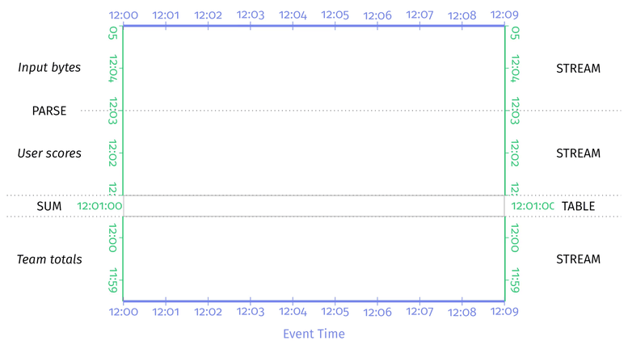
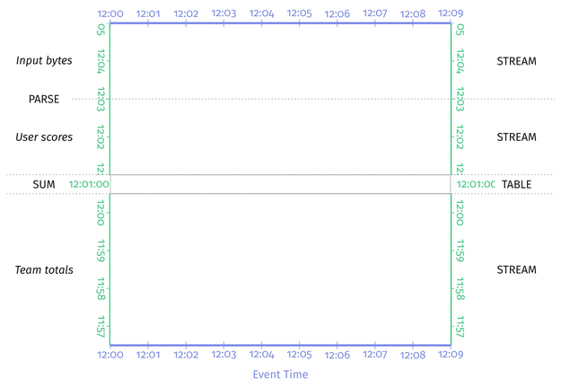
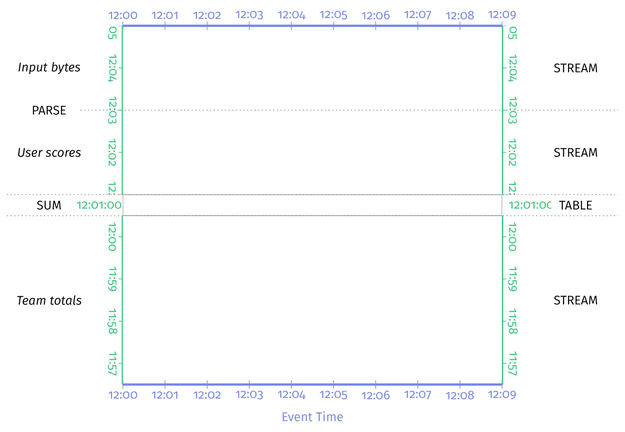

# Chapter 6. Streams and Tables

## 流数据和表 Stream-and-Table Basics

在数据库中，[数据库的日志就是一种描述表变化的流，而表也可以认为是这种流的聚合视图](https://github.com/JasonYuchen/notes/blob/master/ddia/EX.Making_Sense_of_Stream_Processing.md)

- **Streams -> Tables：对变化流的聚合结果就是一张表**
- **Tables -> Streams：观测表的一系列变化产生的就是流**

## 批处理和流表 Batch Processing vs. Streams and Tables

### MapReduce

在MapReduce这个批处理模型中，Map阶段读取一个静态表的数据，并对每一个元素执行映射操作最后将结果写入本地磁盘：

```text
[table] -> MapRead -> [stream] -> Map -> [stream] -> MapWrite -> [table]
```

Reduce阶段读取所有Map写入的数据表并生成类似流的方式让Reduce处理，最后汇总再将结果写入本地磁盘：

```text
[table] -> ReduceRead -> [stream] -> Reduce -> [stream] -> ReduceWrite -> [table]
```

从流和表的角度来看，MapReduce这样的**批处理框架实际上也就是在处理流和表的互相转换**，并在其中执行用户定义的处理方式

## What, Where, When, and How in a Streams and Tables World

### What: Transformations

- **非分组 Nongrouping**
  接收流式的数据，并产生转换后的流数据，`stream -> Transform -> stream`，例如过滤filter等
- **分组 Grouping**
  接收流式的数据，并分组处理后产生表，`stream -> Transform -> table`，例如聚合aggregation等



假如要读取的状态数据就是最后一步的结果时，简单存储在表中直接读取也是可行，但是如果并非最后一步而是整个流水线的中间环节，则`stream -> Trasnform -> table -> Read -> stream`这种典型环节中发生了不必要的stream/table之间的转换，而更应该**直接从stream中读取所需要的结果，即Log as a Database**

### Where: Windowing

在流数据和表stream/table场景中，**窗口计算就意味着流-表转换stream-to-table conversion**，主要有以下两点考量：

- **窗口赋值 Window Assignment**
  将一条数据记录放入一个或多个窗口内，从而对应的窗口就组合了用户对该记录指定的key，隐式构建了一个**复合键composite key**用于分组

  对于将一条数据记录放入多个窗口的情况（例如滑动窗口可能在多个窗口包含同一条数据），理论上应该是**每个窗口都含有独立的一条相同数据但拥有不同的复合键**，底层系统在实现上可以采用一些优化方式仅保留同一份数据记录
- **窗口合并 Window Merging**
  适用在动态、数据驱动的窗口类型中，例如会话窗口session windows

图中在流数据窗口处理后相当于在table中产生了4个分组对应4个窗口


当需要考虑窗口合并时，将数据记录分组处理时就必须考虑到所有可能被合并的窗口，因此系统通常**不会直接采用key/window这样简单的复合键**，而是**采用层次性的复合键并使用用户定义的key作为根节点，具体的window作为子节点**，从而每个自定义key能够合并的窗口都在用户定义的key根节点之下：需要执行窗口合并时，系统**首先根据用户自定义的key进行分组，随后在每个key组内再合并具体的窗口**

合并窗口的另一个难点在于当**发生合并时必须更新table**，系统也必须对合并前的旧窗口进行处理，即被合并的窗口值被删除，并添加合并后的新窗口值到table中（由于这种修改"过去"的合并操作**难保证强一致性**，非常多现实系统还会采用**atomicity/parallelization作为key而不是key+window**）

> **commit deletes** for old unmerged windows in conjunction with an insert for the new merged window into the table
>
> When window merging becomes involved, that composite key is treated
more like a hierarchical key, allowing the system to handle **the nasty business
of grouping by key, figuring out window merges within that key, and then atomically applying all the necessary mutations to the corresponding table** for
us. Hooray for layers of abstraction!

### When: Triggers

在流数据的场景中，触发器triggers会进行窗口数据的计算，而在流数据和表场景下，**触发器本质上和数据库的触发器（触发从而修改表内容）是相同的，即根据事件更新数据**，采用per-record trigger的处理流程示例如下：



显然此前章节提到的[early/on-time/late triggers](https://github.com/JasonYuchen/notes/blob/master/streamingsystems/02.What_Where_When_How.md#when-earlyon-timelate-triggers-ftw)也可以适用于此：



`TODO: triggers in batch processing system`

### How: Accumulation
