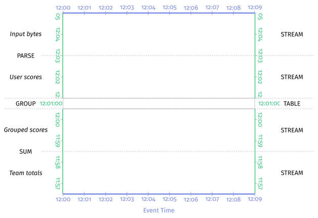
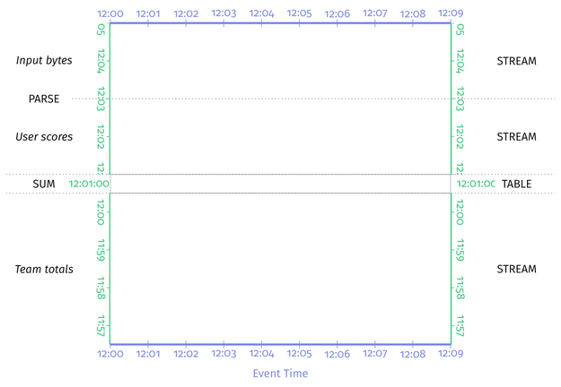
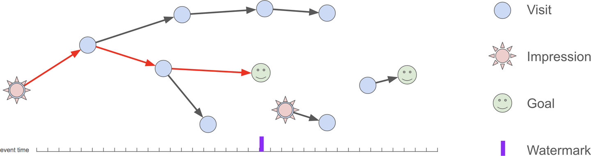

# Chapter 7. The Practicalities of Persistent State

## 动机 Motivation

### 不可避免的故障 The Inevitability of Failure

通常批处理系统认为输入数据集是有限大小，且可以重新输入的reprocessing the input，因此在持久化快照上的设计相对比较简单（通常**以shuffle作为节点保存快照**，例如MapReduce和Spark的设计均是如此）

而流数据系统的输入数据是无限的且通常认为不能被重新输入一次的，因此流数据系统需要一个更加精细的**持久化快照系统来保证at-least-once/exactly-once语义**（对于at-most-once语义可以不需要快照）

### 正确性与效率 Correctness and Efficiency

由于故障和出错是不可避免的，因此持久化状态可以认为提供了以下两种优势：

- **正确性的基石 A basis for correctness**
  通常流数据处理的无限量数据是不能重复被处理的，采用持久化状态相当于保存了一部分历史数据的处理结果状态，从而在故障恢复时只需要从该状态出发，**相当于已经处理了持久化状态时之前的所有数据**，从而能确保正确性
- **最小化重复工作的方式 A way to minimize work duplicated and data persisted**
  不考虑数据本身是否无限量，处理数据需要耗费资源和时间，而持久化快照相当于暂存了中间结果，从而当面临故障需要重新处理时，可以快速恢复到快照状态而不需要从头处理数据（处理数据需要耗费计算资源，保存未被处理的数据需要耗费存储资源，通常快照占用的空间少于原数据），**最小化重复的工作和最小化存储开销**

## 隐式状态 Implicit State

通常持久化状态需要找到**效率与一致性的平衡点**，总是持久化对一致性有利而对效率不利，总不持久化对效率有利而对一致性不利

### Raw Grouping

将原始数据根据key分组，随后每当有新元素到达时就简单追加到对应组的末尾，如下图：



这种方式相比于增量合并Incremental Combining有以下缺陷：

- **存储更多的数据**，每个窗口的所有输入数据都被持久化存储
- 多次触发器触发导致**重复计算**了已经计算过的元素
- 假如grouping节点就是持久化状态的节点，则宕机重启时就必**须重新计算窗口的结果**

### Incremental Combining

非常多应用在窗口中的聚合函数（例如求和、平均、最大值等）有以下特性：

- 增量聚合过程中展示出**中间状态intermediate form**相比于该状态所需的元素更为紧凑，例如对于`SUM`而言，存储中间状态`10`比存储原始数据`1,2,3,4`更为紧凑
- 增量聚合过程对顺序没有要求，即**满足交换律commutativity和结合律associativity**，例如`COMBINE(COMBINE(a, b), c) == COMBINE(a, COMBINE(c, b))`

从而在聚合时就可以通过以下两个角度进行优化：

- **增量 Incrementalization**
  不需要提前缓存所有数据，而是在抵达窗口后**按抵达顺序直接聚合**即可，这样也可以负载更平滑（相比于需要缓存所有数据并一次性聚合出结果）
- **并行 Parallelization**
  不需要按顺序逐个聚合整个组的所有顺序，可以**分为任意子组进行并行聚合**，最后再合并为最终结果（这也是MapReduce算法的核心思想，充分利用多台分布式机器）



这种方式的主要缺点就是所适用的聚合算法**必须满足交换律和结合律**，而在实践中则需要更加灵活的算法

## 泛化状态 Generalized State

Raw Grouping和Incremental Combining共有的缺点就是**缺乏灵活性**，前者要求分组缓存结果，后者要求满足交换率和结合律，而对于一种泛化通用的持久化状态，通常要求以下三方面的灵活性：

- **数据结构 data structures**
  需要能够支持业务逻辑的高效数据结构，raw grouping实际上使用appendable list，incremental combination实际上使用单个值，实践中往往希望使用更多**复杂但适用的数据结构**例如map、set、graph等
- **读写粒度 r/w granularity**
  对不同的数据结构持久化保存的数据，**任意时刻都能够高效的读取或写入任意量的数据**，读取和写入也应该支持并行和批量化，例如set可以通过bloom过滤器支持高效读取某个元素
- **处理调度 scheduling of processing**
  支持在流数据的**两种时间轴（处理时间、事件时间）上任意时刻发生指定的处理**，类似timer的处理调度，例如指定在某一事件时间上进行触发窗口计算，则在代表该事件时间的数据抵达系统时就会触发窗口计算

### Case Study: Conversion Attribution

raw grouping和incremental combination均不适用于一个常见的流数据处理场合：**广告的转化归因conversion attribution**（用于分析广告转化率有效性的来源）

假定有一个流数据分析引擎处理某个网站的访问数据，且带有导向该网站的impressions，转化归因的目标就是**分析某个impression对达成该网站某种目标（例如注册账户、购买物品等）的有效性**如下图，红色箭头线就代表一个有效的attributed conversion：



对于任意的流数据系统，都必须考虑以下要求：

- **乱序数据 Handle out-of-order data**：例如网站的多次点击数据是分布式的，往往会乱序抵达分析引擎
- **大量数据 Handle high volumes of data**：为了尽可能分析用户行为，有可能需要处理并存储大量用户长时间的访问模式（甚至可以是长达90天内的visit-impression-goal tree）
- **反垃圾 Protect against spam**：广告转化率直接影响到广告投放和收益，因此分析引擎的正确性必须得到保证，从而必须满足恰好一次以及反垃圾（例如某个用户在短时间内多次点击同一个广告不应该产生多次有效数据）
- **优化性能 Optimize for performance**：考虑到读写持久化存储代价高，分析引擎往往需要处理相当大规模的数据，因此每个环节都必须考虑性能

### Conversion Attribution with Apache Beam

采用Apache Beam的State和Timer来解决整个问题，并实现持久化状态的读写：

1. **visit，impression，attribution等对象的POJO定义**，略去了大量的模板代码

    ```java
    class Visit {
        private String url;
        private Instant timestamp;
        // 限定每个url只有一个可能的referring url，从而将DAG退化为Tree
        private String referer;
        private boolean isGoal;
        // 省略一些constructor/getter/setter/toString
    }

    class Impression {
        private Long id;
        private String sourceUrl;
        private String targetUrl;
        private Instant timestamp;
        public String sourceAndTarget() {
            return sourceUrl + ":" + targetUrl;
        }
        // 省略一些constructor/getter/setter/toString
    }

    class VisitOrImpression {
        private Visit visit;
        private Impression impression;
        // 省略一些constructor/getter/setter
    }

    class Attribution {
        private Impression impression;
        private List<Visit> trail;
        private Visit goal;
        // 省略一些constructor/getter/setter
    }
    ```

2. **定义Beam的`DoFn`来消费`Visits`或`Impressions`的集合**，user作为key进行分组，产生多组`Attributions`
   在该`AttributionFn`类内需要实现：
   - **以map的形式存储所有visits**，对应的URL作为key，从而可以从goal快速反向遍历出整个链路，即生成`Attribution::trail`（具体实现在`Attribution::attributeGoal`中）
   - **以map的形式存储所有impressions**，对应的source+target URL作为key
   - 当收到某次visit的数据代表了goal时，设置相应的**event-time timer来触发计算goal attribution**，从而当水印处理到goal对应的事件时间时，一次trail必然完整就可以触发timer计算
   - 由于Apache Beam无法动态增减timers（所有timer必须在流水线定义的时候同时确定），因此采用**单一一个attribution timer来记录所有未计算goal中最近的一个**（具体实现在`Attribution::processElement`中），每次计算后就更新为下一个最近的即可（具体实现在`Attribution::attributeGoal`中）

    ```java
    class AttributionFn extends DoFn<KV<String, VisitOrImpression>, Attribution> {
        // 所有visits的map，key由url构成
        @StateId("visits")
        private final StateSpec<MapState<String, Visit>> visitsSpec =
            StateSpecs.map(StringUtf8Coder.of(), AvroCoder.of(Visit.class));

        // 所有impreesions的map，key由sourceUrl和targetUrl一起构成
        // sourceUrl可以是一次查询query，而targetUrl可以是一次点击click
        // 一次查询可能产生多次点击对应多次impressions，因此将sourceUrl和targetUrl一起组合为key
        @StateId("impression")
        private final StateSpec<MapState<String, Impression>> impSpec =
            StateSpecs.map(StringUtf8Coder.of(), AvroCoder.of(Impression.class));

        // 所有goal的set
        @StateId("goals")
        private final StateSpec<SetState<Visit>> goalsSpec =
            StateSpecs.set(AvroCoder.of(Visit.class));

        // 记录事件时间最近的goal的时间戳
        @StateId("minGoal")
        private final StateSpec<ValueState<Instant>> minGoalSpec =
            StateSpecs.value(InstantCoder.of());

        // timer定义在事件时间轴上，唯一一个timer与事件时间最近的goal绑定
        @TimerId("attribution")
        private final TimerSpec timerSpec =
            TimerSpecs.timer(TimeDomain.EVENT_TIME);

        // continued
    ```

   回顾对**数据结构data structures灵活性**的要求，这里我们使用了map、set、value、timer

    ```java
        // 流数据处理系统每次有新数据抵达时，就会进入此处理函数
        @ProcessElement
        public void processElement(
                @Element KV<String, VisitOrImpression> kv,
                @StateId("visits") MapState<String, Visit> visitsState,
                @StateId("impressions") MapState<String, Impression> impressionsState,
                @StateId("goals") SetState<Visit> goalsState,
                @StateId("minGoal") ValueState<Instant> minGoalState,
                @TimerId("attribution") Timer attributionTimer) {
            Visit visit = kv.getValue().visit();
            Impression impression = kv.getValue().impression();

            if (visit != null) {
                if (!visit.isGoal()) {
                    LOG.info("Adding visit: {}", visit);
                    // 实时更新visits的map作为持久化保存的状态
                    visitsState.put(visit.url(), visit);
                } else {
                    LOG.info("Adding goal (if absent): {}", visit);
                    // 实时更新goals的set作为持久化保存的状态
                    goalsState.addIfAbsent(visit);
                    Instant minTimestamp = minGoalState.read();
                    // 每当发现goal时就动态更新timer的时间戳为event-time最近的一次goal
                    if (minTimestamp == null || visit.timestamp().isBefore(minTimestamp)) {
                        LOG.info("Setting timer from {} to {}",
                                Utils.formatTime(minTimestamp),
                                Utils.formatTime(visit.timestamp()));
                        attributionTimer.set(visit.timestamp());
                        minGoalState.write(visit.timestamp());
                    }
                    LOG.info("Done with goal");
                }
            }
            if (impression != null) {
                // logical impreesion根据source url和target url进行去重，仅保留处理时间上先抵达的impression
                LOG.info("Adding impression (if absent): {} → {}",
                        impression.sourceAndTarget(),
                        impression);
                // 实时更新impressions的map作为持久化状态保存
                impressionsState.putIfAbsent(impression.sourceAndTarget(), impression);
            }
        }

        // continued
    ```

   回顾对**读写粒度w/r granularity灵活性**的要求，这里每一个visit/impression都会调用一次`processElement`，而在其中仅对涉及到的数据进行读写，例如发现新的goal只会修改goals set、min goal、timer而不会涉及更大的visit map和impression map

    ```java
        private Impression attributeGoal(
                Visit goal,
                Map<String, Visit> visits,
                Map<String, Impression> impressions,
                List<Visit> trail) {
            Impression impression = null;
            Visit visit = goal;
            while (true) {
                // 迭代从goal反推到impression，并生成对应的链路trail
                String sourceAndTarget = visit.referer() + ":" + visit.url();
                LOG.info("attributeGoal: visit={} sourceAndTarget={}",
                        visit,
                        sourceAndTarget);
                if (impressions.containsKey(sourceAndTarget)) {
                    LOG.info("attributeGoal: impression={}", impression);
                    // Walked entire path back to impression. Return success.
                    return impressions.get(sourceAndTarget);
                } else if (visits.containsKey(visit.referer())) {
                    // Found another visit in the path, continue searching.
                    visit = visits.get(visit.referer());
                    trail.add(0, visit);
                } else {
                    LOG.info("attributeGoal: not found");
                    // Referer not found, trail has gone cold. Return failure.
                    return null;
                }
            }
        }

        @OnTimer("attribution")
        public void attributeGoal(
                @Timestamp Instant timestamp,
                @StateId("visits") MapState<String, Visit> visitsState,
                @StateId("impressions") MapState<String, Impression> impressionsState,
                @StateId("goals") SetState<Visit> goalsState,
                @StateId("minGoal") ValueState<Instant> minGoalState,
                @TimerId("attribution") Timer attributionTimer,
                OutputReceiver<Attribution> output) {
            LOG.info("Processing timer: {}", Utils.formatTime(timestamp));

            // 异步读取所有visits，impressions，goals状态，这里同样体现了r/w granularity的灵活性
            // 此时粗粒度批量读取所有数据（比细粒度逐个读取元素）更加高效
            // Batch state reads together via futures.
            ReadableState<Iterable<Map.Entry<String, Visit>>> visitsFuture =
                visitsState.entries().readLater();
            ReadableState<Iterable<Map.Entry<String, Impression>>> impressionsFuture =
                impressionsState.entries().readLater();
            ReadableState<Iterable<Visit>> goalsFuture = goalsState.readLater();

            // Accessed the fetched state.
            Map<String, Visit> visits = buildMap(visitsFuture.read());
            Map<String, Impression> impressions = buildMap(impressionsFuture.read());
            Iterable<Visit> goals = goalsFuture.read();

            // 找到与此触发时间戳对应的goal
            // Find the matching goal
            Visit goal = findGoal(timestamp, goals);

            // Attribute the goal
            List<Visit> trail = new ArrayList<>();
            Impression impression = attributeGoal(goal, visits, impressions, trail);
            if (impression != null) {
                output.output(new Attribution(impression, trail, goal));
                impressions.remove(impression.sourceAndTarget());
            }
            goalsState.remove(goal);

            // Set the next timer, if any.
            Instant minGoal = minTimestamp(goals, goal);
            if (minGoal != null) {
                LOG.info("Setting new timer at {}", Utils.formatTime(minGoal));
                minGoalState.write(minGoal);
                attributionTimer.set(minGoal);
            } else {
                minGoalState.clear();
            }
        }
    }
    ```

   回顾对**处理调度scheduling of processing灵活性**的要求，设置timer了之后可以**将goal attribution的计算推迟到了确信该goal对应的链路全都完整后才会触发**（事件时间轴的水印时间抵达goal的时间则发生在goal前的impression和visits可以确信全部都收到了），从而最大程度上减少了重复工作（例如每次有数据都检查goal的链路能否生成）以及提高效率

3. **已经被简化的设计和更多挑战**
   - 多个用户的行为
   - 垃圾回收
   - visits应该是DAG而不是tree
