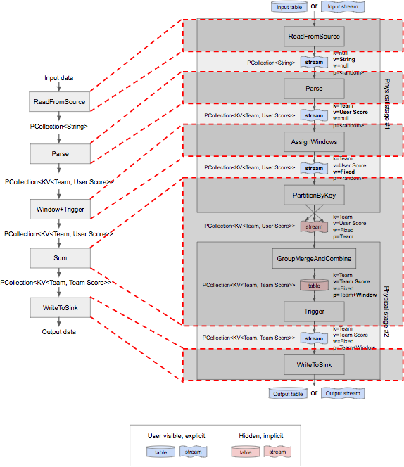
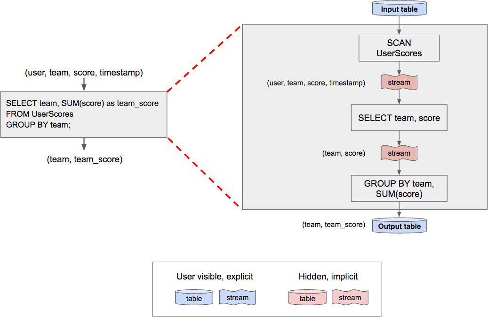

# Chapter 8. Streaming SQL

## 什么是流式查询? What Is Streaming SQL?

### 关系代数 Relational Algebra

SQL的理论基础就是关系代数，而关系代数最重要的一个属性就是**闭包closure**，即任意关系代数的算子operator都接收一个关系relation并生成新的关系relation

对于Streaming SQL而言，Streaming是一等公民，而关系代数应能够同样简洁自然的应用到Streaming上

### 时变关系 Time-Varying Relations

传统的关系是静态的**point-in-time relations**，因此当Streaming需要整合进SQL时，必须将关系拓展到动态情况**time-varying relatiosn, TVR**

假设传统的**经典关系是二维的**，x轴是各属性列，y轴是记录行，则**时变关系是三维的**，z轴就是**随时间变化该关系不同的版本/快照**（每条记录的时间戳是抵达系统的处理时间戳processing timestamp）：

```text
time--------------------->-------------------------->-------------------------->
      [12:01, 12:03)             [12:03, 12:07)              [12:07, inf)
-------------------------  -------------------------  -------------------------
| Name  | Score | Time  |  | Name  | Score | Time  |  | Name  | Score | Time  |
-------------------------  -------------------------  -------------------------
| Julie | 7     | 12:01 |  | Julie | 7     | 12:01 |  | Julie | 7     | 12:01 |
-------------------------  | Frank | 3     | 12:03 |  | Frank | 3     | 12:03 |
                           | Julie | 1     | 12:03 |  | Julie | 1     | 12:03 |
                           -------------------------  | Julie | 4     | 12:07 |
                                                      -------------------------
```

z轴在时间上连续，并且捕获了所有改变的情况，形成了时间上一系列静态的关系，从而当施加关系代数的算子时，就**等同于向每一个状态都施加一次运算**，从而获得新的时间上连续的关系TVR，这种定义有两个重要的方面：

- 经典关系代数中**所有算子都可以施加给TVR**，并且对每一个版本施加时的行为不变
- 对TVR施加算子后获得新的TVR，即**保证了关系代数的闭包**

例如对上述数据施加一次聚合操作，根据Name分组聚合Score：

```text
---------------------------------------------------------
|       [-inf, 12:01)       |       [12:01, 12:03)      |
| ------------------------- | ------------------------- |
| | Name  | Score | Time  | | | Name  | Score | Time  | |
| ------------------------- | ------------------------- |
| |       |       |       | | | Julie | 7     | 12:01 | |
| |       |       |       | | |       |       |       | |
| |       |       |       | | |       |       |       | |
| |       |       |       | | |       |       |       | |
| ------------------------- | ------------------------- |
---------------------------------------------------------
|       [12:03, 12:07)      |       [12:07, now)        |
| ------------------------- | ------------------------- |
| | Name  | Score | Time  | | | Name  | Score | Time  | |
| ------------------------- | ------------------------- |
| | Julie | 7     | 12:01 | | | Julie | 7     | 12:01 | |
| | Julie | 1     | 12:03 | | | Julie | 1     | 12:03 | |
| | Frank | 3     | 12:03 | | | Frank | 3     | 12:03 | |
| |       |       |       | | | Julie | 4     | 12:07 | |
| ------------------------- | ------------------------- |
---------------------------------------------------------

SELECT name, SUM(score) FROM game GROUP BY name;

---------------------------------------------------------
|       [-inf, 12:01)       |       [12:01, 12:03)      |
| ------------------------- | ------------------------- |
| | Name  | Score | Time  | | | Name  | Score | Time  | |
| ------------------------- | ------------------------- |
| |       |       |       | | | Julie | 7     | 12:01 | |
| |       |       |       | | |       |       |       | |
| ------------------------- | ------------------------- |
---------------------------------------------------------
|       [12:03, 12:07)      |       [12:07, now)        |
| ------------------------- | ------------------------- |
| | Name  | Score | Time  | | | Name  | Score | Time  | |
| ------------------------- | ------------------------- |
| | Julie | 8     | 12:03 | | | Julie | 12    | 12:07 | |
| | Frank | 3     | 12:03 | | | Frank | 3     | 12:03 | |
| ------------------------- | ------------------------- |
---------------------------------------------------------
```

### 流和表 Streams and Tables

对比表TABLE和流STREAM在随着时间变化后的数据情况，表TABLE就是每次数据变化时刻的快照（a sequence of classic relations），而流STREAM额外引入了**Undo列**来表明被撤回的数据行（event-by-event stream capturing the evolution of TVR）：

> the **TABLE** captures a snapshot of the entire relation at a specific point in time, whereas the **STREAM** captures a view of the individual changes to the relation over time.

1. 在12:01开始，此时表和流没有差别，只是对表而言数据已经完备，而流采用**时间戳+省略号**代表数据只有当前时间范围内的部分并不完整

    ```text
              TABLE                          STREAM
    -------------------------   --------------------------------
    | Name  | Total | Time  |   | Name  | Total | Time  | Undo |
    -------------------------   --------------------------------
    | Julie | 7     | 12:01 |   | Julie | 7     | 12:01 |      |
    -------------------------   ........ [12:01, 12:01] ........
    ```

2. 时间达到12:03，此时有新的数据抵达，对表来说，整个表展现出了当前的完整数据，而**对流来说，原先的数据被撤回`undo`，新的数据被追加到末尾**，依然采用时间戳+省略号表示数据不完整

    假如对比现实世界里表的实现（OLTP），则也是类似[流的方式（Logging）记录`INSERT/UPDATE/DELETE`，并基于此设计了ARIES算法来执行恢复](https://github.com/JasonYuchen/notes/blob/master/cmu15.445/21.Recovery.md)

    ```text
              TABLE                          STREAM
    -------------------------   --------------------------------
    | Name  | Total | Time  |   | Name  | Total | Time  | Undo |
    -------------------------   --------------------------------
    | Julie | 8     | 12:03 |   | Julie | 7     | 12:01 |      |
    | Frank | 3     | 12:03 |   | Frank | 3     | 12:03 |      |
    -------------------------   | Julie | 7     | 12:03 | undo |
                                | Julie | 8     | 12:03 |      |
                                ........ [12:01, 12:03] ........
    ```

3. 时间到达12:07，此时与前述过程类似，新的数据抵达，表只表示最新的数据，而流中有撤回旧的数据以及追加新的数据

    ```text
              TABLE                          STREAM
    -------------------------   --------------------------------
    | Name  | Total | Time  |   | Name  | Total | Time  | Undo |
    -------------------------   --------------------------------
    | Julie | 12    | 12:07 |   | Julie | 7     | 12:01 |      |
    | Frank | 3     | 12:03 |   | Frank | 3     | 12:03 |      |
    -------------------------   | Julie | 7     | 12:03 | undo |
                                | Julie | 8     | 12:03 |      |
                                | Julie | 8     | 12:07 | undo |
                                | Julie | 12    | 12:07 |      |
                                ........ [12:01, 12:07] ........
    ```

**TVR的TABLE形式和STREAM形式本质上相同**，只是侧重点有所不同，前者侧重经典关系随着时间变化的体现，而后者侧重关系随时间的变化，完整的TVR关系同时包含TABLE和STREAM形式

在实践中始终维持完整的TVR关系是代价高昂的，大多数系统通常只会维护最近的数据（**垃圾回收过旧的数据**）

## 回顾流和表 Looking Backward: Stream and Table Biases

### 偏向流的方法 The Beam Model: A Stream-Biased Approach

基于Apache Beam Model来对比表和流，左侧为逻辑处理流，右侧为物理处理流（包含流和表）如下图：



可以看出**所有逻辑处理环节在实际物理处理过程中均是由流stream来连接**，在Beam中采用`PTransforms`接收`PCollections`并输出`PCollections`，该数据结构总是流数据，因此在Beam中流数据是连接所有环节的数据结构，而表数据则隐藏在具体实现中（例如在`Sum`操作内部生成了临时不可见的表）

在Beam中，涉及表数据的部分都需要与流数据进行转换：

- **Sources**
  表作为输入，则通常是每次修改（`INSERT/UPDATE/DELETE`）触发一次触发器并生成流数据，类似数据库的**Change Data Capture, CDC**，通常方式会
- **Sinks**
  表作为输出，通常是聚合输出结果，例如在用户指定的key上聚合
- **Grouping/ungrouping**
  与Sources和Sinks不同（仅提供很低限度的功能，依赖用户实现逻辑），grouping/ungrouping操作提供了极高的灵活性，在grouping的灵活性就是构建各种算法定义流水线，在ungrouping的灵活性使得用户可以任意塑造输出的流以提交给下游使用
  
  Beam并没有直接提供表从而不能直接施加触发器，因此触发器可以选择如下的使用方式（与传统数据库表上施加触发器不同）：
  - **预定义触发器 Pre-declaration of triggers**：即在表数据前定义触发器，当grouping操作发生时就会触发触发器，这种触发器是前向传播的forward-propagating
  - **后定义触发器 Post-declaration of triggers**：即在表数据后定义触发器，即定义时就会触发触发器，这种触发器是反向传播的backward-propagating

  通常后定义触发器直接指定并发生触发器的行为，更符合直觉，而预定义触发器就和预定义窗口计算一样，只有后续数据抵达才会触发

### 偏向表的方法 The SQL Model: A Table-Biased Approach

传统SQL总是接收一个表数据并产生一个表数据，例如以下示例：

```SQL
SELECT team, SUM(score) as total
    FROM UserScores
    GROUP BY team;
```

通常经典SQL会通过查询引擎优化器转化为执行计划，上述SQL可以转化为以下过程，**内部同样可以有流水线和流数据**（例如[Volcano模型](https://github.com/JasonYuchen/notes/blob/master/cmu15.445/12.Query_Execution_I.md#1-%E8%BF%AD%E4%BB%A3%E5%BC%8F-iterator-**model**)）：

1. 扫描Scan输入表，即触发一个快照
2. 映射表的列到team和score
3. 根据team分组后聚合计算score



在经典SQL中，涉及流数据的部分都需要与表数据进行转换：

- **Input tables**
  在查询执行时通常就会扫描输入表并产生数据流
- **Output tables**
  在查询的最后一个环节通常包含聚合操作（直接`SELECT`而没有`GROUP BY`相当于在每行的主键上聚合）从而输出表
- **Grouping/ungrouping**
  经典SQL操作在grouping中提供了完全的灵活性，支持多种操作例如`GROUP BY/JOIN/CUBE/etc`，而只支持一种ungrouping操作，就是在上游数据完全生成后，触发出一个完整的临时表提交给下游使用，可以类比MapReduce中的Shuffle操作，Map的结果产生完全被Shuffle后生成完整的中间结果，随后才可以Reduce

  因此经典SQL在grouping上提供了完全的灵活性，而在ungrouping上没有灵活性

**物化视图Materialized views**在经典SQL中提供了类似流处理的方式，定义某个表的物化视图后相当于创建了跟随该表变化的一个表数据生成器，当原表有任意变化时其物化视图就会跟随变化，从而相比于原先的SCAN输入表，变为了SCAN-AND-STREAM

## 展望流式查询 Looking Forward: Toward Robust Streaming SQL
